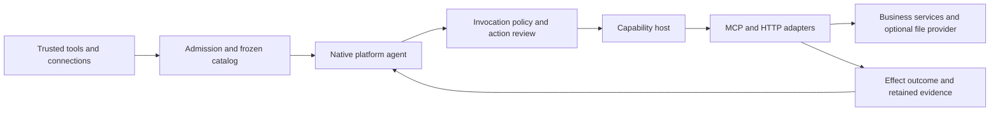

# Connected business-agent tools implementation plan

Status: implementation and compatibility audit committed; real-model trial finished; browser acceptance pending.
Created and reviewed 2026-10-08. Implementation continues under the active goal.

This standalone temporary plan lives outside `docs/`. It follows the implemented
[tools and skills milestone](real-agent-tools-and-skills.md) and supersedes its
choice of a native workspace as the default agent environment. It does not rewrite
earlier observations or claim that unchecked work already exists.

## Goal and scope

Give Mastra, LangGraph, Temporal and Restate baseline agents a complete, usable
connected-tool lifecycle for backend business work. Each platform owns its native
model decisions and orchestration. Common adapters connect tools, resolve identity
and permissions, execute actions, and retain evidence. Adding a compatible tool or
skill must not require editing an agent loop.

Native filesystem management is excluded. Agents may access documents or files
through an optional MCP/API provider. The Lab may still use files internally for
configuration, skills, state and evidence; that storage does not become an agent
filesystem capability. No shared VM or local shell is required.

This is a substantial implementation programme with coherent milestones, not one
large commit or a series of isolated configuration tweaks. Complete the connected
business workflow end to end before expanding the tool catalog further.

## Constraints

- Preserve unrelated Studio/Lina and context-research changes.
- Keep temporary execution planning here; publish enduring contracts and usage
  documentation only when the corresponding implementation exists.
- Focus on working functionality and a few meaningful checks. Defer exhaustive
  chaos testing, performance work, penetration testing and broad hardening.
- Use only currently verified free models for unattended trials, with no paid
  fallback. Retain model choices, actual decisions and unsuccessful outcomes.
- Do not replace native agents with Pi or introduce a universal shared agent loop.
- Do not silently claim compatibility for the other platform variants.
- Do not install executable plugins or launch arbitrary local MCP processes.
  HTTP MCP and HTTP APIs are the required transports for this milestone.
- No external messaging, production writes or account changes are needed for
  acceptance. Use fictional business records in real running development services.

## Baseline established by inspection

The table records the starting baseline, not the current completion status.
The progress table below distinguishes subsequent implementation from verified
end-to-end behavior. Uncommitted code is not an accepted milestone.

| Area | Present implementation | Gap this plan addresses |
| --- | --- | --- |
| Native agents | Four real model/tool/continuation loops | Extend lifecycle without replacing their platform mechanisms |
| Catalog | Versioned descriptors, schema validation, frozen admission | Connection-backed identity, availability and controlled refresh |
| Connected sources | HTTP MCP discovery/calls and fixed-path HTTP operations | Streaming correctness, general request bindings and live credentials |
| Permissions | Profile grants and upfront tool approvals | Approval of a particular call and its arguments, then continuation |
| Effects | Durable call receipts and unknown transport outcomes | HTTP errors and invalid response schemas can still yield misleading repeat feedback |
| Skills | Discovery, activation, resources and follow-up persistence | Preserve these behaviors in connected workflows; scripts remain optional connected execution |
| Files | Native workspace source and default workspace profile | External provider ownership, no core workspace management |
| Temporal | Tool Activity has a one-second heartbeat deadline | Tool Activity does not heartbeat while awaiting execution |
| Results | Rich MCP evidence retained, model continuation largely textual | Explicit result projection and honest unsupported-content reporting |
| Recovery | Platform-specific checkpoint, journal and runner behavior | Durable approval continuation and an accurate recovery matrix |

Source owners to inspect before edits: `server/src/capabilities/extensions/`,
`server/src/capabilities/integrations/`, `server/src/capabilities/context/`,
`server/src/control-plane/`, the four native baseline directories, and
`apps/web/src/features/platforms/`.

Previous free-model acceptance passed four of eight strict tasks. It established
basic capability use, not full connector interoperability or runtime approval.
Preserve that evidence independently of the new acceptance reports.

## Research basis and decisions

The [connected-agent research note](../../../../docs/research/connected-business-agent-foundation.md)
records primary sources and the repository audit. The earlier
[Waku study](../../../../docs/research/waku-filesystem-environment.md) explains why
filesystem delegation is optional rather than the definition of a backend agent.

| Decision | Rationale and alternative |
| --- | --- |
| Retain the shared capability host | Python and TypeScript workers share source adapters and policy checks. The host executes tools, not reasoning. Separate clients in every platform would duplicate these responsibilities. |
| Reuse connection and OAuth contracts | Existing ownership is extended rather than creating a competing credential catalog. Static environment credentials remain supported for service accounts. |
| Separate stable binding from token generation | Endpoint, account, resource, scopes and schemas define authority and source identity. Token rotation must not invalidate every admitted run; account or authority changes must. |
| Preserve frozen run catalogs | Refresh affects future admissions. An existing run may refresh credentials for the same permitted identity, but cannot silently receive new tools, scopes or schemas. |
| Separate business effects from result presentation | Transport status, business-effect certainty and output-schema validity answer different questions. Invalid output after a write must not encourage repeating that write. |
| Support invocation approval as a policy mode | Keep automatic and upfront-grant modes for authorized automation. A call-review mode suspends before effects and binds the decision to exact arguments. |
| Use existing suspended run state | Add suspension reason and pending-action metadata. Do not introduce a second contradictory status machine or mark a waiting turn complete. |
| Externalize agent file access | Optional document/file providers use the same MCP/API boundary as other tools. Internal skill and evidence storage remains unchanged. |
| Publish a bounded compatibility contract | A tools client is not a full MCP implementation. Unsupported protocol interactions must produce explicit errors, not simulated success. |

Protocol requirements and project choices must remain distinguishable. Consult
[MCP transports](https://modelcontextprotocol.io/specification/2026-07-28/basic/transports),
[MCP authorization](https://modelcontextprotocol.io/specification/2026-07-28/basic/authorization),
[HTTP semantics](https://www.rfc-editor.org/rfc/rfc9110.html#section-9.2.2), and
[Agent Skills integration](https://agentskills.io/client-implementation/adding-skills-support).
Check installed SDK versions before adopting examples from moving platform docs.

## Target flow and ownership

- Package configuration groups declarations and skills. A source adapter owns
  protocol-specific discovery, invocation and cleanup.
- The existing connection layer owns account/resource identity, credential
  resolution, scopes, availability and reconnect/revoke transitions.
- Admission binds a run to allowed connection references and selected tools.
  Invocation rechecks those bindings, current permission and action approvals.
- Native adapters own tool batches, waiting, resumption and model continuation.
  Tools within a batch retain their original IDs and deterministic result order.
- Context sessions retain skill state and the unfinished turn. Run evidence
  retains pending reviews, decisions, source attempts and actual effects.

An invocation approval record must bind run, turn, call ID, tool/source revision,
connection identity, canonical argument digest, review revision, decision and
expiry. Editing arguments creates a new proposal; it never reuses an old approval.
Raw sensitive arguments must stay protected. Review screens show the relevant
business values, with explicit redaction; redaction does not change what is approved.

## Milestones and implementation checklist

Each milestone includes implementation, its permanent documentation, narrow
verification and a coherent commit. A large milestone may use two commits when
each leaves a usable checkpoint. Do not make a commit for every checkbox.

### 1. Correct the boundary and freeze shared contracts

- [x] Record an ADR for connected tools, external file providers, stable identity,
  effect outcomes and invocation approval. Include alternatives and migration.
- [x] Define the supported baseline/transport/result/approval matrix.
- [x] Extend existing descriptors with connection reference, supported content,
  effect/retry contract and approval mode; avoid duplicated policy types.
- [x] Define versioned result and pending-action records, including compatibility
  handling for retained older run manifests and receipts.
- [x] Specify connection states, ownership and the distinction between credential
  rotation, revoked authority and changed source definitions.
- [x] Make startup default to a business-tool/skill profile, without a native
  workspace or dependency on an available external service.

Acceptance: contracts can express two concrete sources, HTTP and MCP, plus a
call requiring review. Existing retained evidence remains readable.

Minimum check: one admission test covering a valid connected binding, a denied
binding and an older supported manifest. Build the server once after this slice.

Commit: `feat: define connected agent lifecycle and capability contracts`.

### 2. Make effect outcomes and Temporal execution correct

- [x] Separate execution status from effect outcome: not dispatched, confirmed
  rejection/no effect, confirmed effect, or unknown. Record the evidence for certainty.
- [x] Treat dispatched write failures conservatively unless the provider contract
  establishes rejection. Do not assume every HTTP 4xx/5xx means no change occurred.
- [x] Treat successful HTTP status with invalid output as a response-contract
  failure with the provider acknowledgement retained. Do not infer business success
  solely from status or expose this as an ordinary request to repeat the write.
- [x] Stop model continuation on an unresolved effect and retain a reconciliation
  record. Provide read/inspect recovery separately from repeat execution.
- [x] Add optional provider-supported idempotency binding. Use a durable logical
  operation identity and reject changed arguments for an existing key.
- [x] Document that receipt replay deduplicates the same call ID, not independently
  generated business actions. Do not claim exactly-once effects.
- [x] Heartbeat Temporal tool Activities while awaiting source execution and clear
  timers on every exit. Propagate cancellation through the existing signal chain.

Acceptance: a slow tool works, cancellation settles, and an uncertain write never
becomes an invitation to submit the same business action again.

Minimum checks: a table-driven effect-classification test, one applied-write/lost-or-invalid
reply test asserting no redispatch, and one real Temporal worker fixture with two
invocations: a slow tool completes beyond the heartbeat deadline, then a separate
in-flight tool is cancelled and settles. Cancelling the only invocation would not
establish successful slow-tool execution.

Commit: `fix: preserve business effect certainty and heartbeat tool activities`.

### 3. Connect identity, credentials and availability

- [x] Bind generic packages to existing connection references rather than captured
  raw startup headers. Support anonymous, static service-account and OAuth credentials.
- [x] Resolve credentials immediately before discovery/invocation, with declared
  resource and scopes. Keep tokens out of snapshots, model context and safe summaries.
- [x] Integrate existing refresh/revoke and encrypted secret storage. Inspect and
  repair OAuth callback state binding, expiry and refresh-token rotation first.
- [x] Add server-owned account/owner identity. Since full product login is absent,
  explicitly limit administrative APIs to the existing trusted local deployment;
  do not accept a browser-supplied owner as authorization or claim multi-tenancy.
- [x] Add configured OAuth browser redirect/callback behavior with PKCE and exact
  redirect/resource checks. Follow the advertised MCP authorization capabilities.
- [x] Bind callback state to connection, owner, issuer, resource and redirect URI;
  expire and consume it once. Preserve the previous refresh token when a refresh
  reply omits a replacement. Reject issuer or connection mismatch before exchange.
- [x] Declare configured-provider OAuth separately from MCP authorization discovery.
  For the advertised MCP OAuth path, implement protected-resource metadata and
  authorization-server metadata discovery, client registration selection, resource
  indicators and challenged scopes. Do not label a static bearer header as this flow.
- [x] Preserve permitted identity across token refresh; revoke/changed scopes must
  immediately prevent new source dispatch and require a new authorization decision.
- [x] Expose unavailable, authorization-required, expired and revoked sources honestly.
  One unavailable optional source must not prevent the control plane from starting.
- [x] Add explicit connect/refresh/reconnect operations with bounded discovery and
  cleanup; update future catalogs atomically without rebinding running admissions.

Acceptance: a configured connection becomes usable, refreshes without catalog
drift, and becomes unavailable after revoke. An offline source does not kill startup.

Minimum checks: one connected invocation spanning expiry/refresh/revoke; one
wrong-identity rejection; one startup/reconnect check with an initially absent source.

Commit: `feat: integrate connected source identity and credential lifecycle`.

### 4. Complete useful HTTP and MCP tool bindings

- [x] Add declarative path, query, permitted header and body mappings to HTTP
  operations. Encode path segments and prevent configured-origin escape.
- [x] Support JSON and form requests plus bounded artifact-reference upload/download
  where the business/document scenario requires it. The current text-only document
  scenario needs no binary transfer; artifact upload/download remains unsupported
  in the compatibility matrix. Never accept host file paths
  from the model as upload authority.
- [x] Bind pagination, request IDs, provider idempotency headers and response mapping
  explicitly in configuration. Keep provider-specific details inside the adapter.
- [x] Parse MCP SSE incrementally, correlate request IDs, handle chunk boundaries,
  progress and bounded errors, and stop at the matching terminal response without
  waiting for an open stream to close.
- [x] Implement the verified current HTTP tools requirements and explicitly retained
  legacy compatibility, including relevant metadata/header binding and cleanup.
- [x] Verify `x-mcp-header` annotations and value encoding against the declared
  protocol revision. Retain bounded progress diagnostics with the source attempt.
- [x] Handle discovery pagination, alias collisions and catalog changes. Reject
  unsupported interactive/server requests explicitly for the selected protocol era.
- [x] Advertise supported MCP operations. Resources/prompts, sampling, elicitation,
  task extensions and local stdio are not implied by tool discovery.
- [x] Add a new connected business operation using configuration only, and verify
  no platform loop or tool-name switch was changed.

Acceptance: an ordinary parameterized business API and an open-stream MCP tool
work through the same admitted catalog across languages.

Minimum checks: one HTTP parameter/form contract fixture and one real local MCP
SSE fixture that emits a correlated result and deliberately leaves the stream open.
Reuse existing MCP JSON/legacy checks rather than duplicating them.

Commit: `feat: extend API bindings and MCP streaming interoperability`.

### 5. Persist action-specific human review

- [x] Add automatic, upfront tool-grant and invocation-review policy modes. Existing
  grants determine whether an action may be proposed; review cannot expand grants.
- [x] Persist a pending proposal before any side effect and before declaring the
  run suspended. Reuse `suspended` with a reason and pending-action reference.
- [x] Add APIs to inspect and approve/deny exact proposals with argument/source
  digests, decision expiry and duplicate-decision conflict handling.
- [x] Serialize the approve/cancel race. Recheck terminal state, decision and current
  connection authority immediately before source dispatch.
- [x] On denial, return an identified tool result to the native agent so it can
  explain or choose an allowed alternative. On expiry, retain the proposal and
  require a fresh review. On cancellation, invalidate pending dispatch permission.
- [x] Make fresh review reachable from a suspended run. A server-owned renewal
  operation revalidates the frozen call and authority, creates a new review revision,
  and updates the native waiting reference without dispatch or inference. Reject
  old decisions. If authority or arguments changed, require a new authorized action.
- [x] Keep an unfinished context turn occupied while awaiting review; do not append
  a synthetic completed answer or permit a conflicting follow-up turn.
- [x] Separate human-wait lifetime from model/tool deadlines and record both.
  No repeated inference, network retry loop or held tool Activity while waiting.

Acceptance: the exact proposed action is reviewable, no write occurs while waiting,
and approval or denial can be delivered once with inspectable evidence.

Minimum check: one lifecycle test covering approve, deny, expired/changed proposal
and a duplicate decision; one targeted approve-versus-cancel boundary check. Advance
an injected clock while paused, renew the review, reject the old decision and resume
the new revision. Exercise that shared renewal contract through each native adapter.

Commit: `feat: persist invocation review and approved action dispatch`.

### 6. Wire waiting and continuation into all four native agents

- [x] Verify the pinned SDK mechanisms before changing any loop. Prototype one
  invocation pause/resume per platform with scripted model decisions.
- [x] Mastra: use the installed SDK's `requireApproval`,
  `approveToolCallGenerate` and `declineToolCallGenerate`; bind native run/call IDs
  to the Lab proposal. Configure persistent LibSQL snapshot storage and reconstruct
  admitted agents for waiting-run recovery. Do not restart the original prompt.
- [x] LangGraph: use checkpointed interruption/resumption with the stable native
  thread and pending call. Put `interrupt` in a dedicated approval node before
  effects and use `Command(resume=...)`. The pinned 1.2.10 does not support newer
  typed interrupt examples requiring 1.2.12; do not upgrade merely to copy a snippet.
  Extend Python/TypeScript protocol enums, service-store projection and runner
  mapping with nonterminal `suspended`, so an interrupt is not reported as completed
  or unknown.
- [x] Temporal: wait on a validated workflow signal/update after persisting the
  proposal; execute approved I/O in an Activity with the same logical call ID.
- [x] Restate: use durable state and a call-specific `ctx.promise` resolved by a
  validated workflow shared handler. Journal approved execution under stable
  identity without waiting inside an external I/O action.
- [x] Retain completed batch results and pending calls in deterministic order. A
  mixed read/write batch must not run an unapproved write or lose previous results.
- [x] Extend existing runner resume and control-plane projection instead of creating
  an unrelated approval executor. Validate resume payloads and retained native refs.
- [x] Publish normal approval continuation separately from API restart, worker
  restart and unknown-effect recovery. Reconstruct pending review after restart
  on all four baselines using their verified snapshot/checkpoint/history/journal
  mechanisms; mark recovery limits outside this waiting boundary explicitly.

Acceptance: every baseline pauses and resumes the same run/turn and returns the
approved result to its native model loop, without repeating earlier actions.

Minimum check: one shared scripted native scenario per platform: read, propose a
write, suspend, approve, execute, verify and finish. Add denial on one shared
contract case; reconstruct pending review on each advertised recovery path.

Commit checkpoints: `feat: resume reviewed actions in native agent baselines`.
Split Python/Mastra and Temporal/Restate integration into separate commits if needed.

### 7. Finish results, skills and external document access

- [x] Keep structured content, content blocks, source identity and errors in the
  canonical result through every native adapter, including Python.
- [x] Define text/JSON/resource projections and record transformations or omitted
  content. Use model-native image input only for a supported model/platform pair;
  explicitly reject unsupported audio/image interactions instead of claiming support.
- [x] Preserve skill metadata, activation, resource loading, deduplication and
  compaction protection. Skills never supply credentials or expand tool grants.
- [x] Give every native model the permitted skill names and descriptions before
  its first decision, with concise activation instructions. Load full instructions
  only on activation; disabled skills must not appear in the presented catalog.
- [x] Let skill scripts request an authorized connected execution service when
  configured; do not introduce local shell execution as a skill-loader feature.
- [x] Move file operations into an optional separately running MCP/API provider
  with provider-owned storage/session scopes. Remove native workspace sources
  from the core package loader and business-agent defaults.
- [x] Port useful filesystem acceptance to that provider and preserve existing
  workspace reports as historical evidence. Give legacy configurations an explicit
  migration message; do not silently reinterpret their roots or write permissions.

Acceptance: a skill-guided business agent can read a document and save a report via
connected tools, while the native agent has no workspace-management implementation.

Minimum checks: one rich-result projection across TS/Python, reuse skill persistence
checks, and one optional file-provider round trip with actual saved content.

Commit: `refactor: externalize document tools and preserve native result projections`.

### 8. Make connections and pending actions usable in the frontend

- [x] Show selected connections, available tools and skills with concise states.
  Keep technical protocol/configuration details behind inspection views.
- [x] Provide connect/reconnect/revoke controls only for implemented lifecycle paths.
  Never place secret values in browser state or show fictional connection health.
- [x] Show an awaiting-review action with relevant arguments and approve/deny controls,
  expiry and changed-proposal feedback. Keep cancellation available while suspended.
- [x] Show native continuation, tool outcome and source receipt together. Distinguish
  business rejection, invalid output and uncertain effects.
- [x] Keep profile-level approvals and call-specific review visually distinct.
  Do not add a VM/filesystem environment selector to the default business flow.
- [x] Update Chat, Compare and Evals projections where the new nonterminal state
  changes polling or completion detection.

Acceptance: a contributor can connect a service, run an agent, inspect and decide
its proposed action, then see the verified result without reading implementation docs.

Minimum check: one actual browser path from connection selection to reviewed action
completion, plus a deny path. Capture a screenshot and retained run IDs.

Commit: `feat: review connected agent actions in the platform UI`.

### 9. Run business-agent acceptance and complete the handoff

- [x] Build a reusable fictional support/operations service with real persistent
  records and an MCP document service. Keep services separate from agent runtimes.
- [x] Implement scenario A requiring skill activation, customer/order and policy reads,
  propose a permitted adjustment, await review, apply it and verify the saved state.
- [x] Implement scenario B requiring document inspection through the external provider and a report,
  then incorporate a follow-up correction with traceable source evidence.
- [x] Run A and B once on each baseline with the same currently verified free model,
  prompts, source configuration, approval modes and recorded budgets. Do not let
  the driver select model tool calls or silently preload the required skill.
- [x] Use scripted native checks for deterministic fault boundaries; use actual
  model decisions for workflow acceptance. Label the evidence separately.
- [x] Verify final business state independently of the agent's answer. Record
  denied actions, tool ordering, loaded skill identity and source effects.
- [x] Reuse deterministic services for refresh, source outage, ambiguous write,
  denial and recovery checks. Do not multiply expensive model trials for those cases.
- [ ] Run one opt-in external read-only compatibility smoke if a suitable connected
  provider is available. No suitable third-party connection is configured in this
  deployment, so this conditional check was not run. Record credentials/network
  blockers honestly; local service
  acceptance must not be presented as universal third-party compatibility.
- [x] Preserve strict model failures and classify causes only from evidence. A failed
  model instruction is not automatically an adapter failure and must not be hidden.
- [x] Update architecture, usage guide, source-adapter and native platform READMEs,
  scenario/experiment docs and supported-capability matrix to match actual behavior.

Acceptance: the four platforms demonstrate actual connected business work and
reviewed actions with durable, independently inspectable evidence and stated limits.

Minimum validation: affected contract tests, the four native scenario reports,
eight free-model workflow reports, server build, affected Python checks, frontend
typecheck/bundle and one browser walkthrough. Existing unrelated failures are
reported with their baseline rather than repaired or hidden in this milestone.

Commits: `test: add connected business-agent acceptance workflows`, followed by
`docs: record connected agent behavior and verified platform limits`.

## Validation budget and execution order

Integration order is contracts and boundary, effect correctness, connections,
transport bindings, persisted review, native continuation, results/skills,
frontend, then acceptance. Independent implementation may overlap after the
contracts settle; acceptance cannot skip its dependencies.

The next substantial slice is end-to-end acceptance and closing the integration
issues it reveals. The committed connection, review and native continuation work
now provides the foundation. Use this execution checklist:

- [x] Audit each milestone implementation against code and retained evidence. Check an item only
  when its contract and its stated validation are both satisfied.
- [x] Correct model-budget plumbing, including the Mastra construction in
  `live.ts`. Record per-provider-request deadlines separately from whole active
  generation budgets. Mastra currently times an entire segment; LangGraph times
  individual provider requests. Equal numbers do not establish equal conditions.
  Human review time remains separate.
- [x] Finish the eight-workflow free-model trial. Preserve failures and classify
  timeout, admission, model-choice and adapter failures using retained evidence
  and independently inspected business state.
- [x] Fix demonstrated integration defects, then repeat only affected workflows
  with explicit budgets. If choosing another free model, verify current price and
  tool support and retain a separate comparison report.
- [x] Publish the baseline/transport/authentication/result/recovery matrix with
  explicit OAuth registration and multimedia limits.
- [x] Verify skill-script requests through an authorized connected execution
  fixture before advertising execution support. Readable scripts alone do not
  establish this capability. Local shell execution remains excluded.
- [ ] Complete the frontend approve/deny walkthrough with run IDs and a screenshot.
  Browser automation was rejected by the browser security policy in this session;
  this remains unverified until permitted or recorded manual verification.
- [x] Run the combined affected checks once and update permanent docs with observed
  implementation limits. Final trial observations and acceptance audit remain below.

Use coherent commits for budget correction, demonstrated integration defects,
and acceptance documentation. Keep this as one integrated delivery; avoid adding
unrelated features or broad hardening to fill an estimated hour.

Start real-model evals only after the four native scripted runs pass, connection
authority is rechecked at dispatch, uncertain effects stop continuation, and the
review path survives waiting-run restart. Verify the free model's current catalog
price immediately before trials and disable paid fallback. Real-model failures
remain valid evidence; they do not justify weakening the scenario grader.

Do not run all repository tests after every edit. Start with the named contract or
adapter check for that slice. Reuse existing tests and native acceptance services.
Run the combined relevant suite once after integration, and repeat only when a
change or unresolved failure justifies it. No tests for copy-only documentation.

Use `pnpm --filter @agent-harness-lab/lab-server build` before compiled test commands.
Existing relevant starting points include `server/tests/capabilities/`,
`server/integration-tests/capability-catalog-native.test.ts`, the platform capability/MCP
matrix tests, and the four baseline test directories. Select affected tests;
existing broad matrix scripts are opt-in and should not all be rerun automatically.

Native acceptance requires real configured workers/services. Record their versions
and health and restore only task-owned services. Never replace missing infrastructure
with in-memory success. Use the current free-only routing controls in the capability
experiment; keep paid fallback disabled and record exact provider requests.

Suggested independent work after contracts are fixed: connection/adapters, native
review continuation, and frontend projection. Keep architecture, effect policy,
shared contracts and integration with the primary agent. Use subagents for these
substantial independent workstreams, not trivial edits.

## Commit and compatibility discipline

- [x] Capture starting branch/HEAD and unrelated changes before implementation.
- [x] Stage only the completed milestone's owned paths; inspect staged diffs.
- [x] Include required contract docs and meaningful checks with each coherent change.
- [x] Record each commit and its evidence below. Never mark an item complete just
  because a commit exists.
- [x] Keep older evidence and experiments readable; migrate configuration explicitly.
- [x] Do not push, rewrite history or squash these checkpoints into one giant commit.

## Definition of done

- [x] All four baseline agents use the connected tools through native loops.
- [x] A compatible new tool/skill is added without modifying those loops.
- [x] Connections have usable auth/refresh/revoke and availability lifecycle.
- [x] Specific actions can pause for review and resume without repeated effects.
- [x] Pending-review runs survive restart and resume on all four baselines; this
  does not claim universal recovery of arbitrary in-flight inference or effects.
- [x] Unknown effects stop repetition; provider-supported idempotency is explicit.
- [x] Temporal slow tools and cancellation work with proper heartbeats.
- [x] HTTP bindings and the declared MCP HTTP subset have real compatibility evidence.
- [x] Core agents do not create or manage a native filesystem workspace.
- [x] Optional document/file tools use the same connected adapter boundary.
- [x] Skills, structured results, authority and native telemetry remain inspectable.
- [ ] Frontend state accurately shows connections, pending review and outcomes
  through an actual approve/deny walkthrough. Build and projection checks pass;
  interaction acceptance remains unverified.
- [x] Focused deterministic and free-model evidence covers the completed workflows.
- [x] Recovery limits, unsupported capabilities and failed trials are documented.
- [x] Required checks pass or unrelated/environment failures are explicitly reported.

## Deferred work

Full multi-tenant product authentication, enterprise secret-store deployment,
arbitrary executable plugins, local stdio process installation, general code/VM
execution, all MCP extensions, complete audio/video projections, automatic repair
of uncertain external effects, reliability benchmarking, load tests and exhaustive
crash matrices are separate work. Their absence must stay visible and does not
justify claiming this milestone makes the Lab production-ready in every environment.

## Current position and evidence ledger

The implementation has committed checkpoints across milestones 1 through 8.
Acceptance remains incomplete. Milestones 1–7 have a code/evidence audit, with conditional binary transfer
explicitly unsupported for these text-only scenarios. Milestone 8 implementation
is verified by build/projection checks; its browser acceptance is still pending. Starting branch was `main`, checkpoint `ab2cadd`;
unrelated Studio/Lina and context-research changes remain user-owned.

| Checkpoint | Implemented slice |
| --- | --- |
| `3674780` | Research-based standalone plan and review lifecycle requirements |
| `7a71069` | Exact review records, authority contracts, conflict/expiry checks and ADR |
| `ff72970` | External document provider, removed native workspace and explicit migration |
| `2d728b1` | HTTP parameter bindings, correlated MCP SSE and conservative effects |
| `b73d8a5` | Connection credentials, OAuth state/refresh, availability and authority generations |
| `5ed4244` | Mastra SDK review with persistent LibSQL snapshots |
| `842f3c9` | Temporal/Restate durable review and Temporal heartbeat/cancellation |
| `bea4029` | LangGraph checkpointed review and suspended control-plane projection |
| `c5a0f5c` | Generated package output-limit admission correction |
| `4c72025` | Frontend connections and exact action review |
| `6e68fee` | Persistent fictional business service and real-model workflow driver |
| `35598e0` | Permanent setup and architecture documentation |

### Native harness evidence

The all-platform report
[`native-review-65eff9d8/summary.json`](../../../../lab/runs/.review-proof/native-review-65eff9d8-679a-40b3-a57b-4fd88ba464f0/summary.json)
passed eight scripted native checks. Every baseline suspended with zero effects,
survived host/control-plane reconstruction and native runner or worker replacement,
renewed review twice without inference or dispatch, then approved the original
call and executed once. Additional cases cover denial, cancellation and unknown
effect stopping. Actual native runtimes used scripted model choices; this measures
harness behavior, not model decision quality.

The Mastra mixed-batch report
[`native-review-e70d9c2b/summary.json`](../../../../lab/runs/.review-proof/native-review-e70d9c2b-576c-4852-add9-e10dc15cd632/summary.json)
passed six selected checks. One model response proposed a read and two reviewed
writes. Approving the first and denying the second preserved original call IDs,
ran the read once and returned correlated feedback. Fixture and documentation
are committed in `313bbbc`.

### Real-model evidence and limits

The initial eight-workflow attempt failed admission before model dispatch:
[`capabilities-76e060f0/summary.json`](../../../../lab/runs/.evals/capabilities-76e060f0-3bb1-437e-84ed-79aaa6318c3c/summary.json).
The generated output-limit defect was corrected in `c5a0f5c`.

The subsequent free-only trial is retained at
[`capabilities-bbba1cf6/summary.json`](../../../../lab/runs/.evals/capabilities-bbba1cf6-9bd7-429d-a355-4e9616f06d99/summary.json).
It uses the verified `nvidia/nemotron-3.5-lightning:free` ID, no paid fallback,
recorded prompts and independent service-state checks. The driver settled with
one pass, two strict failures and five errors. Historical completion metadata is
absent, so Evals deliberately labels that retained invocation incomplete. Observed
failures include active-segment/provider timeouts and a LangGraph answer without
required tool use; none is converted to a passing task.

Frontend typecheck, production bundle and focused action-identity checks passed.
The browser walkthrough remains unverified following the browser security-policy
rejection. OAuth owner labels describe this trusted local deployment rather than
authenticated multi-tenant users. Automatic client registration, general MCP
extensions, model-native multimedia input and external third-party compatibility are not
established by the retained evidence. Connected procedure execution is established
only for the configured declarative executor, not arbitrary code or a local shell.

Before completion, re-read the user's filesystem restriction and the definition
of done. Inspect the implementation beyond the checklist, resolve or report gaps,
and distinguish implemented contracts from observed model competence.

### Integration audit checkpoints

- `313bbbc`: actual Mastra mixed-batch approval/denial fixture and documentation.
- `d818e7d`: native running state survives projection and temporary service outage.
- `31807b0`: timeout plumbing, recorded native settings and runtime versions.
- `6e33888`: HTTP cursor/response mapping and retained sanitized MCP progress.
- `fc0db9e`: structured-only tool feedback survives TS/Python projection.
- `3e3526f`: authorized connected procedure execution, with denial/revoke checks.
- `9d9815d`: meaningful Chat effect labels and read-only source receipt inspection.
- `9510697`: whole-suite provider preflight and future report completion metadata.

A combined affected suite ran 75 checks: 74 passed; one old HTTP expectation
omitted the now-required frozen server catalog. Its assertion now checks the
actual server-owned catalog, and the two affected HTTP checks passed. No runtime
behavior or grader was weakened. Python hosted-tool/review/protocol checks passed
21 tests. Frontend typecheck and production bundle passed. Native recovery proof
was not repeated because the native lifecycle implementation did not change.

The alternate Gemma trial returned HTTP 429 before successful decisions and is
retained at `lab/runs/.evals/capabilities-f49dbaec-0f07-468f-89df-fb3acb91c377/summary.json`.
The explicit-budget Nemotron trial settled at
`lab/runs/.evals/capabilities-e6f0ca23-8d2b-4d6a-8c33-04eefc5f8abd/summary.json`
with one pass, five strict failures and two errors. All four platforms performed
the exact reviewed adjustment and independent verification, but skipped required
skill activation. Restate passed the document/correction workflow; Temporal
completed it without the required verified correction. Mastra encountered an
uncertain patch result and LangGraph received an unusable empty model response.
The bad patch exposed a useful gap: provider-known pre-write document rejections
need a configured no-effect contract to allow corrective model feedback. Generic
MCP write errors must remain uncertain. That correction is committed in `906250c`, with ten source/provider checks passing.

- `8621784`: legacy schema-v1 projection and frozen-source rejection verified.
- `bf6a321`: common relevant-skill instructions for new sessions, with retained
  session instructions preserved and a direct compatibility check.
- `c779eae`: Evals displays business workflows, original assertions and outcomes.
- `906250c`: configured MCP pre-effect rejection codes, verified correction and
  retained uncertainty when no contract exists.
- Final affected integration checks after these changes: 57 passed; focused
  frontend identity/outcome/rendering checks: 4 passed. Earlier unaffected checks
  remain applicable. Browser walkthrough is still pending; no substitute browser
  automation was attempted after the security-policy rejection.

### Dispatch-authority audit correction

`800809b` closes a demonstrated admission-to-dispatch race. MCP now resolves live
credentials before every HTTP request, including the tool call after schema
discovery. HTTP rebinds credentials inside its actual send callback. Rotation
preserves authority and uses the new token; revoke during discovery prevents the
write. Pre-dispatch credential failures remain `not_dispatched`, and all resolved
credential generations are redacted. Server build and 22 focused source, connection
and integration checks passed. No full model trial was repeated for this isolated
authority correction. `a56120d` also sanitizes pre-dispatch failure feedback before
it reaches the model; the same authority fixture proves the redaction. The server
build and this focused regression passed.

### Latest controlled trial

`lab/runs/.evals/capabilities-7dfe1b7d-8d1c-4832-8939-95afae85c949/summary.json`
finished at 13:25:26 UTC with eight observations: **2 pass, 3 strict fail, 3 error**.
It is the separate trial after the shared skill-activation instruction and documented
MCP pre-effect rejection contract changed. It retains start/completion metadata,
versions, exact requests and native configurations. LangGraph passed both workflows.
All four support runs independently saved one exact reviewed 500-cent adjustment
and verified revision 2; the other three skipped required skill activation. The
instruction was present in retained requests; no skill was silently preloaded.

All document namespaces contain a saved report with the approved date and source
evidence. Mastra timed out after saving but before native verification at its
180-second segment allowance. Temporal verified its first report, then the correction
model Activity exceeded 90 seconds. Restate verified its first report, then correction
exceeded the 300-second observation deadline. Its report captured `running` when
cancellation was requested; a subsequent normal run read settled `cancelled`. No
correction write was observed after cancellation. The original outcomes remain
unchanged. These observations establish neither deterministic reproduction nor a
framework ranking, and saved artifacts do not convert failed tasks into passes.

### Remaining acceptance

- [x] Collect the current trial's terminal aggregate and inspect every new failure.
- [x] Record final trial observations in experiment documentation and this ledger.
- [ ] Perform or obtain the actual frontend approve/deny walkthrough, with run IDs
  and a screenshot. Automated browser access was rejected by the browser security
  policy. A manual verification request is pending; builds/API checks do not satisfy
  this condition.
- [ ] Complete the final audit against the original request. Do not declare the
  implementation fully accepted while browser interaction remains unverified.

Final read-only architecture review found no additional backend implementation gap.
Native orchestration, optional provider environments, frozen authority, explicit
effect certainty and bounded compatibility remain intact. It confirmed that build
and projection checks cannot stand in for the pending browser walkthrough, and
that preserved free-model failures cannot be described as successful all-platform
workflow acceptance. No broad rerun was required.

The task-owned API was restarted after the driver and its cancellation settled,
so the dispatch-authority/redaction fixes are live. Normal API inspection confirms
all four selected baselines reachable, the catalog available, and Evals exposing
the exact completed invocation with 2 pass / 3 fail / 3 error. `/ready` passes.
Aggregate `/health` remains degraded because unrelated optional Vercel/Inngest/DBOS
services are absent, Trigger credentials are unset, and the existing Hatchet
embedded Postgres lock prevents its sidecar from starting. Those baselines were
out of scope; no unrelated infrastructure or user changes were repaired.

Current milestone: 8 browser acceptance. Status: waiting for the already requested
manual verification after the browser security rejection. All independent
implementation and trial-analysis work is complete; the final acceptance audit
remains open. The optional external compatibility smoke is conditional and was
not run because no suitable third-party connection is configured.

A concrete manual approve/deny recipe is now in the
[business-agent guide](../../../../docs/guides/connected-business-agents.md#manually-verify-action-review).
It specifies valid fresh namespaces, exact UI labels, pending zero-effect state,
independent provider inspection, approval/denial outcomes, screenshots and run IDs.
The recipe was checked against configuration, routes and current component labels;
its browser execution remains unverified. No additional model trial was launched.
