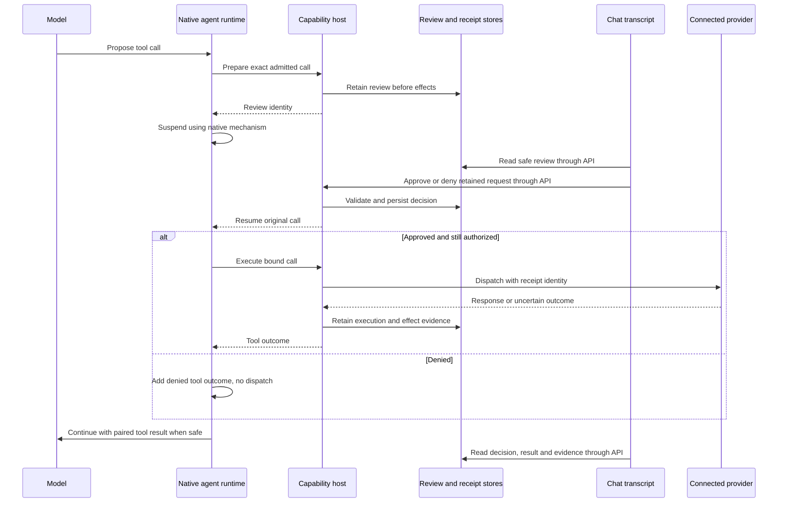

# Connected tool execution and approvals in chat

Status: implementing. Prepared 2026-10-10; execution authorized and goal started 2026-10-10.

## Goal

Open a platform, choose a model, and chat with its native agent using the shared connected tools and skills. When a tool needs permission, its approval card appears at the relevant place in the conversation. Approving resumes the original call; denying prevents it and lets the agent respond. Results must describe an observed provider response or independently verified state.

This is a substantial implementation phase, spanning startup, chat presentation, native execution and real-task acceptance. It is not a collection of cosmetic changes or another tool catalog rewrite. The deliverable includes working paths through Temporal, Restate, LangGraph, Mastra baseline and Vercel Workflows baseline.

Research: [connected tool approvals](../../../../docs/research/platform-connected-tool-approvals.md). Existing foundation: [extensible capabilities](../../../../docs/architecture/extensible-capabilities.md) and [local development](../../../../docs/guides/local-development.md).

## User requirements and boundaries

- Approvals belong in the chat transcript. No decision controls in the sidebar or Run details. The sidebar may retain model configuration and capability inspection.
- Use the shared connected-tool catalog automatically. Do not require profile selection, role templates or a separate agent configuration workflow. Internal profile records may remain for compatibility and reproducible admission.
- Agents are general agents running on backend platforms. Acceptance measures reusable agent behaviors; Linear is one optional example, not the target integration or the definition of the agent.
- Tools, MCP connections, plugins and skills remain extensible through existing adapters. New tools on a supported adapter require discovery and configuration, not edits to platform loops, approval components or model instructions. A genuinely new transport or provider protocol may require an adapter, with unsupported features reported honestly. No new connector marketplace in this phase.
- Filesystem access remains an optional connected capability. Internal checkpoints, skill packages, evidence and configuration files do not imply native agent filesystem permission.
- Use free real models for automated development acceptance. No paid fallback. Keep scripted native checks separate from model-driven observations.
- Keep tests focused on changed behavior. Reuse existing review, host and native recovery coverage. Broad stress testing, comprehensive failure permutations and production hardening remain later work.
- Commit coherent, verified chunks. Preserve unrelated Lina changes; do not commit local credentials, provider data, state directories or generated run artifacts.
- The user has authorized implementation and checkpoint commits. Account mutations remain limited to agreed disposable targets and their exact action approvals.

## Current implementation and evidence

| Area | Observed implementation | Remaining work |
| --- | --- | --- |
| Connected catalog | MCP discovery publishes namespaced schemas; new runs admit current shared capabilities and retain immutable snapshots. | Verify a second connector without native runtime changes; report discovery/connection failures honestly. |
| Hosted tool execution | `CapabilityHost` owns schema checks, credentials, reviews, receipts and permission checks. | Verify real provider reads and mutations, not only capability inventories or fixture tools. |
| Exact action review | Store retains run/turn/call identity, catalog/source/connection identity, argument digest, revision, expiry and decision. | Present the existing durable records in chat; preserve retry and renewal semantics. |
| Chat | `InvocationReviewPanel` is inside sidebar `ChatRunDetails`; top-level state primarily follows `latestRun`. An upfront grant prompt also lives in `ConnectedCapabilitiesSummary`. | All user decisions inline; historical cards associated with their own run/turn, not whichever run is latest. |
| Temporal | Workflow loop, Activities, signals and waiting conditions implement hosted calls and review. | Actual connected-tool acceptance and clear failure projection. |
| Restate | Journaled calls and durable promises implement native review continuation. | Actual connected-tool acceptance and restart visibility. |
| LangGraph | Approval node interrupts; a later node executes tools under checkpointed state. | Preserve node replay boundaries while verifying actual connected-tool work. |
| Mastra baseline | Native SDK tools and approve/decline continuation already exist. | Actual connected-tool acceptance and transcript integration. |
| Vercel Workflows | One durable model step; current contracts have no shared tool catalog, session projection or review resume. `RunService` does not admit its connected capability/context path. | Implement a full native model/tool loop and review delivery before claiming parity. |
| Startup | Launcher now derives proxy and capability-host endpoints from the API port. Bootstrap still awaits optional Hatchet startup before API listen. | Separate core readiness from optional runtime startup; propagate shared configuration to every service. |

Relevant recent fixes are `2502a8b` (expanded evidence budgets), `9a369e5` (Inngest launcher), `0ba72b9` (shared endpoints) and `d35cd27` (terminal tool badges). They are foundations to preserve, not work to repeat.

The actual Linear test-issue turn failed during `prepareInvocation` because the Temporal worker called port 4318 while the API used 4319. Corrected verification reached a pending review and was cancelled to release the session. No issue was created. Recognizing 86 tools in conversation is evidence of exposure, not successful execution.

## Research-informed decisions

| Decision | Evidence and consequence |
| --- | --- |
| Inline cards inside assistant turns | [AI SDK UI](https://ai-sdk.dev/docs/ai-sdk-ui/chatbot-tool-usage) demonstrates approval controls within tool message parts. Use this interaction pattern in our existing React chat, without migrating the frontend to AI SDK or claiming to reproduce a consumer product exactly. |
| Connection consent differs from call approval | [MCP authorization](https://modelcontextprotocol.io/specification/2025-11-25/basic/authorization) concerns protected-resource access. [OpenAI MCP approvals](https://developers.openai.com/api/docs/guides/tools-connectors-mcp) identify individual calls. Connecting an account does not approve all future actions. |
| Server records remain authoritative | [OpenAI Agents SDK guidance](https://openai.github.io/openai-agents-js/guides/human-in-the-loop/) motivates stored pending state, validated decisions and replay protection. Reuse the implemented `InvocationReviewStore` and decision contract rather than introducing a parallel approval database. |
| Denial is a tool outcome | [Anthropic tool lifecycle](https://platform.claude.com/docs/en/agents-and-tools/tool-use/handle-tool-calls) pairs results with call IDs. Preserve the native adapter's denied-tool result and continuation. Do not turn a user denial into a generic server error. |
| Native orchestration stays native | [LangGraph interrupts](https://docs.langchain.com/oss/javascript/langgraph/interrupts) resume by replaying the interrupted node. The other platform mechanisms have different semantics. A uniform UI does not justify a shared agent loop or a claim of identical durability. |
| Provider annotations do not grant permission | [MCP tools](https://modelcontextprotocol.io/specification/2025-11-25/server/tools) treats annotations as untrusted unless from trusted servers. Keep the configured policy authoritative. An unknown tool may require approval even for a seemingly read-only name. |
| Existing polling first | Reuse the current run/event/review APIs. Introduce a read-only session/run index only if the audit confirms it is needed to restore historical turns. SSE, WebSockets and a new event bus are unnecessary for this milestone. |
| Unknown effects stay explicit | Reuse receipts and provider reconciliation. Approval, dispatch, execution success and effect certainty are separate facts. A lost acknowledgement must not trigger another non-idempotent write. No exactly-once claim. |
| Workflow hook delivery requires its own durable contract | [Workflow hooks](https://useworkflow.dev/docs/foundations/hooks) provide native suspension. Latest documentation may differ from installed `workflow`/builders `5.0.0-beta.52` and local World `5.0.0-beta.45`; inspect those versions before choosing APIs. Hook registration must be ready before a decision becomes deliverable, and repeated resume delivery must not become another authorized call. |

The research note separates documented facts from proposed laboratory contracts. These sources inform design; they do not prove our implementation passes.

## Approval experience

An approval is a tool activity within the assistant turn that proposed it. It appears before the corresponding result, stays in the conversation after a decision, and survives refresh. Keep concise content visible; technical IDs, schema revisions and receipts belong behind Details.

Example, using server-owned display arguments:

```text
Linear · Create issue                         Needs approval
Team: Harness Lab
Title: Agent Lab test · Temporal · <trial-id>
Description: Disposable connected-tool verification.

[View details]                       [Deny] [Approve]
```

After approval, show `Approved`, then `Running`, then the actual result or `Outcome unknown`. After denial, show `Denied`; the assistant explains that it did not execute the action. Approved is never a synonym for completed. A failed run stops unfinished activity but does not establish whether an external write happened.

Required behaviors:

- Each card uses `(runId, requestId, revision)` as its identity and associates with the recorded turn and tool-call ID. Multiple calls render separately in recorded order.
- Render safe, bounded arguments with human-readable labels where metadata allows. Generic fallback works for any connector. Do not show access tokens, transport headers or raw private connection settings.
- Approve/Deny are clear, keyboard-accessible buttons. No automatic approval on card render, scroll or Enter in the composer. Focus and live announcements identify new requests without repeatedly stealing focus.
- Submit one stable decision ID per choice. Disable conflicting choices while a decision is pending; obtain persisted state after a timeout before allowing a different decision.
- If the server stored approval but native resume failed, show `Approved · waiting to resume` and a `Continue` action that retries the retained decision. Do not ask for fresh approval or regenerate arguments.
- Expired reviews have disabled approval and a `Request fresh review` action. Renewal uses the existing revision mechanism; old buttons cannot authorize a new revision.
- Cancellation stops pending decisions. Cancellation after dispatch does not imply rollback. Unknown effects show a recovery explanation and link to evidence, with no blind Retry mutation button.
- A refreshed tab restores pending and completed review cards. A second tab learns the first tab's persisted decision. Historical review cards remain visible after another turn begins.
- Keep ordinary assistant text separate from review records. The model cannot manufacture an actionable card by writing a tool name or approval-looking Markdown.
- Move legacy upfront tool-grant prompts inline too. Label them as broader tool access, not approval of exact arguments. Do not add new upfront grants or silently change existing policy to avoid implementing cards.
- Preserve the generic Mastra workflow pause as a distinct inline workflow control if that variant remains available. It must not impersonate an exact tool-call approval.
- Desktop and narrow-screen layouts share this behavior. Run details remain optional inspection with no duplicated decision controls.

## Architecture and data flow

### Dynamic capability contract

The runtime consumes admitted descriptors, not a fixed list of services or operation names. Discovery supplies namespaced tool IDs, descriptions, input/output schemas, source metadata and supported content. Configured policy supplies risk and approval requirements; remote annotations and name prefixes do not grant authority.

- A connection or plugin publishes tools through its adapter into the shared catalog. Skills are discovered and loaded through the existing skill interfaces; adding a skill must not require platform-specific prompt text.
- At each new turn, generate the model inventory and exact callable definitions from the admitted catalog. Do not advertise disabled, disconnected or unsupported tools. Preserve the recorded snapshot for an already admitted run and its pending actions.
- Resolve tool calls by recorded descriptor/binding, validate against their schema and dispatch through the host. No `if Linear`, fixed CRUD tool names, provider-specific agent roles or hardcoded capability lists in runtime code.
- Build approval cards from safe source metadata, tool descriptions and server-owned arguments. Generic schema-driven presentation must work for unfamiliar tools; optional display metadata improves labels without becoming a required per-connector UI component.
- Project structured/text/resource results according to the existing supported-content contract. Keep unsupported result types visible as limitations rather than silently treating them as successful text.
- Ordinary use requires no handwritten CRUD mapping. The model chooses tools from live admitted definitions. Test scenarios may supply provider-specific inputs and verification recipes outside native runtime code, because providers expose different operations and result shapes.
- Discovery and refresh can change later turns without a runtime restart. Revocation still blocks dispatch from older snapshots; refreshing a catalog cannot silently change an already reviewed action.

Acceptance does not assume every connector offers CRUD. A search service may only retrieve results; a calculator may be pure; notes may support records; another tool may launch a long-running operation. Select tasks that exercise the capabilities actually exposed and report missing operations as not applicable, not agent failures or invented tools.

Reuse these owners:

- `server/src/capabilities/reviews/{contracts,store}.ts`: durable review identity and state.
- `server/src/capabilities/extensions/{host,runtime}.ts`: authoritative preparation, dispatch and receipts.
- `server/src/control-plane/application/run-service.ts`: run admission, actions, decision and native resume.
- `apps/web/src/features/platforms/{PlatformChatPage,InvocationReviewPanel,ConnectedCapabilitiesSummary}.tsx`: current chat and controls.
- `chatState.ts`, `connectedToolState.ts`, `platformApi.ts`: projections, terminal activity state and transport.
- Native platform variants and runner adapters: model/tool ordering, suspension, recovery and cancellation.



The diagram combines HTTP route/service operations under their owning host boundary for readability. Browser reads and decisions always go through the control plane, never directly to stores or provider credentials.

### Native implementation choices

| Platform | Preserve or implement |
| --- | --- |
| Temporal | Activities for model/provider I/O, workflow-owned decisions, signal/condition waits. Approved continuation retains call and native workflow identity. |
| Restate | Journaled preparation/dispatch and revision-specific durable promise resolution. Respect replay and documented deadline limits. |
| LangGraph | Checkpointed approval node and later tool node. Replay must not repeat model selection or dispatch before approval. |
| Mastra baseline | SDK tool registration and native approve/decline APIs; retain its suspension state and LibSQL records. Audit existing Mastra workflow controls separately. |
| Vercel Workflows | Durable model/tool steps and a workflow-owned loop. Evaluate installed SDK durable hooks for approval delivery; verify duplicate/stale delivery and recovery before committing to the hook contract. Preserve the existing pending/accepted/unknown admission ledger and local World recovery ordering. |

Vercel work includes model tool-call parsing, exact schema exposure, shared context/inventory projection, tool limits, host calls, denial results, review renewal, resume routes and runner mapping. Mark the variant connected-tool capable in `RunService` only after those paths exist. AI SDK UI examples are a presentation reference, not a substitute for Workflow SDK durable execution. Hosted Vercel deployment remains a separate profile.

## Implementation milestones and commits

Each milestone is one coherent implementation unit, with small commits within it only when independently reviewable. Native runtime work may need one commit per platform. The whole phase is expected to span multiple substantial work sessions; no artificial one-hour deadline or giant final commit.

### 1. Reliable startup and capability-host reachability

Implementation checklist:

- [x] Audit API, frontend, worker and platform-service endpoint resolution for default and custom ports. Extend the recent launcher fix where required; do not duplicate it.
- [x] Start control-plane HTTP without awaiting optional Hatchet initialization. Represent initializing/unavailable runners explicitly and retain startup errors per platform. Choose a lazy runner boundary or lifecycle method only after inspecting two real startup paths.
- [x] Keep `/ready` about core API/catalog/host readiness; report individual native runtime readiness separately. A healthy Temporal server alone is insufficient if its worker cannot reach the capability host.
- [ ] Ensure startup failure of a selected required service stops only the launcher-owned process group and names its log. Optional services must not disable unrelated chat routes.
- [ ] Prevent duplicate owned workers and restore them with the correct endpoint. Leave unrelated processes and database files untouched.
- [x] Document process lifetime and restart behavior. Do not claim the dev launcher survives app shutdown or machine reboot. No new system daemon or process-manager dependency unless demonstrated necessary.

Acceptance and minimal checks:

- [ ] One custom-port launch drives a native worker through review preparation; it cannot silently use the default port.
- [ ] API and Temporal chat become usable while a fixture represents unavailable optional runtime startup.
- [ ] Restart the selected worker and verify the same pending-review identity can still be inspected. Do not redo a full fault matrix.

Commit checkpoint: `fix(platforms): isolate optional startup and align native tool endpoints` with setup documentation and focused regression coverage.

### 2. Chat transcript projection and inline decisions

Implementation checklist:

- [x] Extract review polling and decision state from sidebar presentation. Use existing review APIs and a run-keyed controller with cancellation on conversation changes.
- [x] Project assistant text, tool activities, approval cards and results in recorded turn order. Do not persist a second copy of authoritative approvals inside message text.
- [x] Audit persisted session history and run lookup. Restore the relevant run IDs on refresh; if missing, add a bounded read-only session/run listing using existing indexes and safe projections.
- [ ] Render the approval UX above, including multiple calls, retained decisions, expiry, renewal, cancellation and unknown outcomes.
- [x] Move exact reviews, legacy grant prompts and applicable workflow pause controls out of the sidebar. Keep sidebar inspection read-only.
- [x] Keep composer state legible while a run waits: show `Waiting for approval`, allow Stop, and preserve draft text. Do not launch another conflicting session turn.
- [x] Refetch persisted review state after uncertain submission and reuse existing decision IDs. Avoid independent polling loops for every card.
- [ ] Preserve stable scroll and focus when cards change, with responsive layout and safe argument rendering.

Acceptance and minimal checks:

- [x] One browser walkthrough approves and denies actions in the transcript, refreshes during a pending review, and confirms the historical decision survives the next turn.
- [x] Focused projection tests cover ordering across two runs, stale revisions, terminal outcomes and duplicate decision submission.
- [x] Existing chat state and connected-tool tests pass; web typecheck passes. No new UI framework or broad screenshot suite.

Commit checkpoint: `feat(chat): render durable action approvals in conversation` with focused tests and usage documentation.

### 3. Vercel Workflows connected agent implementation

Implementation checklist:

- [x] Inspect installed Workflow SDK contracts and local World hook persistence, then record the chosen review-delivery mechanism and replay semantics in platform docs.
- [x] Extend workflow/model contracts with admitted tool declarations, context projection and inventory using existing common capability types.
- [x] Implement bounded native model/tool rounds with paired results and the recorded model settings. Keep network, credentials, host calls and time-dependent work in durable steps.
- [x] Implement prepare/suspend/approve/deny/renew/execute continuation using a stable native waiter identity. Browser polling must not replace a native suspension mechanism.
- [x] Establish waiter registration before publishing a deliverable pending review, or retain early decisions for delivery after registration. A failed wake may already have persisted the resume payload; deduplicate by retained decision/revision rather than assuming retry is a new event.
- [x] Add service and runner resume delivery; reject mismatched or stale decisions. Preserve original native run/call IDs across delivery retries.
- [x] Add durable in-progress inspection of pending review identity, suspended status and incremental tool/review events. The current service and runner derive execution evidence from terminal results; a waiting hook alone will not make chat see the review. Reconstruct this projection after service restart and verify it in the pending-review restart scenario.
- [x] Preserve call receipts, cancellation and outcome-unknown behavior. Audit SDK step retry policy so it cannot blindly repeat a non-idempotent provider mutation.
- [x] Add normalized tool/review events alongside native Workflow telemetry and actual usage. Restore stored pending/accepted admission behavior after service restart.
- [x] Enable connected context/capability admission for this variant only when implemented. Preserve fake-model controls for deterministic checks without advertising them as real-model proof.

Acceptance and minimal checks:

- [x] One native scenario proves prepare-before-effect, deny-without-effect, approved original-call continuation and one pending-review restart.
- [x] One controlled lost-acknowledgement fixture proves no automatic repeated mutation. Reuse the existing effect fixture.
- [x] Existing Vercel admission, cancellation and unknown-submission checks pass if affected. Record skipped checks when dependencies are absent.

Commit checkpoints: native model/tool loop, then durable review/resume support. Both include relevant tests and platform documentation.

### 4. Shared connected-task parity in existing native baselines

Implementation checklist:

- [x] Verify every adapter exposes the exact admitted schema and generated capabilities, calls the same host and returns observed tool results to the next model step.
- [x] Audit approve/deny/renew paths in Temporal, Restate, LangGraph and Mastra. Change only demonstrated gaps; retain native mechanisms.
- [x] Distinguish a denied call from workflow failure. Preserve accurate connection, host, model and provider failure categories instead of surfacing only `Activity task failed`.
- [ ] Project a safe cause chain and actionable message without leaking tokens, private response bodies or local secret paths.
- [ ] Keep status, response validity and effect certainty independent. Existing adapters may use different terminal statuses for unknown effects; the transcript must explain them consistently without erasing native records.
- [x] Confirm new turns admit refreshed shared tools while existing run snapshots and pending calls remain frozen. Catalog changes must not silently substitute a schema or connection during approval.
- [ ] Add or refresh a second source with different tool names and schemas, then use its actual supported operations through the same host and chat UI without native runtime edits.
- [x] Verify generic argument presentation, model schema exposure, dispatch and result projection with an unfamiliar tool descriptor. No connector-specific conditionals or hardcoded tool lists may be needed.

Acceptance and minimal checks:

- [x] One native fixture approval path per changed adapter; reuse existing integration tests, selecting affected platforms only.
- [x] One safe error-mapping check for host-unreachable behavior and one denial continuation check where changed.
- [x] Existing review/host contract checks run once after shared changes. No repeated full suite after documentation-only changes.

Commit checkpoints: focused shared outcome projection, then platform-specific fixes only when needed.

### 5. Dynamic connected-tool acceptance through chat

Prerequisites: selected connections are healthy; discovery is complete; test targets and permitted effects are agreed; model pricing is verified free; native runtime and worker/host connectivity are ready; no unresolved write receipt from a prior attempt.

Use a behavior-based acceptance procedure with connector-specific data supplied by the scenario. The shared runtime and approval UI must not know which connector is being tested. At least two sources with different schemas demonstrate dynamic integration; one read-only source and one record-oriented source are sufficient, with a pure tool or skill operation checked through the same admission path.

Implementation checklist:

- [ ] Define reusable behaviors: discover and select a relevant tool, retrieve information, perform an approved action, verify its result, deny an action without effects, handle an error and load a relevant skill when available.
- [ ] Let the model select actual operations from admitted schemas and descriptions. Scenario inputs specify the goal, disposable target and expected observations; verification recipes remain outside native loops.
- [ ] Demonstrate two different connected sources without changing runtime code or approval components. Linear, notes, search or another configured source can supply examples; do not require a Linear account to complete the generic implementation.
- [ ] Add a new tool or refresh a changed schema and verify that a subsequent turn sees the new descriptor, while existing run/review snapshots remain unchanged. Use a controlled connector fixture for this check rather than installing many providers.
- [ ] Include skill discovery/loading in one suitable task, recording the skill version and showing that its instructions do not grant new tools or permissions.
- [ ] Record one exact free model ID, provider, parameters and current zero-price catalog observation. Use the same settings across comparable trials. If unavailable, mark the trial blocked/error; never silently substitute a paid or different model.
- [ ] Use disposable targets with a unique platform/trial marker and agreed workspace or destination. No incidental assignment, invitations, mentions, notifications or automatic cleanup unless separately requested.
- [ ] Use the actual frontend to approve proposed account mutations. Automated fixture approvals remain clearly labeled scripted checks.
- [ ] Retain real model decisions, review identities, tool arguments in protected evidence, provider IDs, receipts and independent verification results. Public summaries contain bounded metadata without personal provider content.
- [ ] Keep failed attempts, refusals, rate limits and runtime errors visible. Interpret model decision failures separately from harness faults.
- [ ] Stop the trial on unknown effects and reconcile by stable provider identity/marker before any fresh create. A new generated call ID does not make a repeated write safe.

Generic prompts, filled with a selected service and operations it actually supports:

1. **Retrieve:** “Use `<connected service>` to find `<test target>` and report `<requested information>`. Do not change anything.”
2. **Approved action:** “Use `<connected service>` to perform `<specific permitted action>` on `<disposable target>` with `<values>`. After approval, verify the result using an available retrieval operation.”
3. **Follow-up:** “Use the same target's recorded identifier to perform `<supported follow-up operation>`. Request approval if required and verify the resulting state.”
4. **Deny:** “Propose `<specific change>` on `<target>` and wait for my decision.” The reviewer denies. Follow with a supported retrieval request that confirms no effect.
5. **Skill:** “Use an available relevant skill to help complete `<bounded task>` with your connected tools. Report the observed result.” Choose a task for which a relevant installed skill exists; do not force skill use into every task.

For connectors without writes, run retrieval, tool selection and appropriate error handling. Exercise mutation approval/denial with the selected write-capable connector or controlled fixture. A read-only connector does not need artificial CRUD operations.

Optional concrete example: Linear issues. These prompts are scenario material only:

1. **Read:** “Use the connected Linear tools to inspect team `<team>`. Tell me its identifier and whether you can create an issue there. Do not change anything.”
2. **Create:** “Create one disposable issue in team `<team>` titled `Agent Lab test · <platform> · <trial-id>`, with description `Connected-tool verification only.` Do not assign it or add any other changes. After approval, read the created issue and give me its identifier and URL.”
3. **Update:** “Update only that issue's description to `Connected-tool verification passed · <trial-id>`. After approval, read the same issue by its identifier and verify the saved description.”
4. **Deny:** “Propose changing that issue's title to `Denied change · <trial-id>`. Wait for my decision.” The reviewer denies. Follow with “Read the issue and confirm whether its title changed. Do not modify it.”

If the model needs team clarification, ask instead of guessing. Approve only the card matching the agreed test issue. The same pattern can use a notes record or another supported resource. Do not run real lost-acknowledgement experiments against personal services; use a fixture for that boundary.

Acceptance matrix:

| Variant | Dynamic discovery and read | Approved action + verification | Supported follow-up + verification | Denial leaves provider unchanged | Inline review verified | Evidence |
| --- | --- | --- | --- | --- | --- | --- |
| Temporal baseline | [ ] | [ ] | [ ] | [ ] | [ ] | Pending |
| Restate baseline | [ ] | [ ] | [ ] | [ ] | [ ] | Pending |
| LangGraph baseline | [ ] | [ ] | [ ] | [ ] | [ ] | Pending |
| Mastra baseline | [ ] | [ ] | [ ] | [ ] | [ ] | Pending |
| Vercel Workflows baseline | [ ] | [ ] | [ ] | [ ] | [ ] | Pending |

Use one disposable target per platform where mutations apply and one successful pass through these behaviors. Run the cross-source discovery/schema check once per shared implementation; do not multiply every connector by every platform. Record the chosen sources and operations in each matrix row. A missing provider operation is not applicable; do not count it as a passing test. The selected write-capable source must still establish the approval/verification/denial behaviors across the five platforms.

Repeat a stage only after a relevant fix, provider failure or incomplete observation. Do not rerun successful stages to improve scores. Keep required read approvals visible rather than weakening connector policy for a demonstration. Linear is optional and replaceable without runtime changes.

Commit checkpoint: reusable acceptance procedure and bounded result summaries; local account evidence stays uncommitted.

### 6. Closeout and reproducible contributor path

- [ ] Update local setup, platform semantics and chat usage docs with actual behavior and limitations. Correct relevant legacy business-agent/profile instructions where they conflict with current UX; do not rewrite unrelated historical experiments.
- [ ] Publish a readiness table separating service reachable, tools exposed, tool execution observed, review continuation observed and recovery verified.
- [ ] Preserve tool catalog/source versions, model parameters, context strategy, timestamps, native identities and evidence links for each trial.
- [ ] Record nonpriority runtimes as not validated in this phase. Inngest, DBOS, Hatchet, Trigger.dev and hosted deployment have separate dependency/credential work; do not mark them tool-ready from a green health endpoint.
- [ ] Run final relevant typechecks/builds once after integration, regenerate docs, inspect staged changes for secrets/unrelated files, and commit the closeout.
- [ ] Complete the audit below before declaring implementation finished.

Commit checkpoint: `docs(platforms): document connected-task acceptance and remaining limits`.

## Minimal validation commands

Commands are existing entry points unless explicitly marked proposed. Run from repository root unless stated otherwise. Opt-in native tests may replace their own workers/services: use their documented isolated roots/ports so they do not disrupt an active user session.

```bash
bash -n scripts/run_local_stack.sh
pnpm --filter @agent-harness-lab/lab-server run build
pnpm --filter @agent-harness-lab/web run typecheck
```

From `server/`, after build:

```bash
node --test dist/tests/capabilities/capability-host.test.js \
  dist/tests/capabilities/invocation-review.test.js
node --test dist/tests/platforms/vercel-workflows/*.test.js
AGENTLAB_RUN_NATIVE_INVOCATION_REVIEW=1 \
  node --test dist/integration-tests/native-invocation-review.test.js
```

Select affected existing platforms with `AGENTLAB_REVIEW_PLATFORMS`; extend this test for Vercel when implemented. Local Temporal and Restate must be running for their selected native checks. Reuse `apps/web/tests/browser/platform-chat.browser.test.mjs` for inline-review coverage, with fixtures for refresh and duplicate-decision behavior and one real user walkthrough. Follow `apps/web/tests/browser/README.md` for browser prerequisites and report inaccessible browser verification honestly.

Add only focused tests for new startup behavior, transcript projection and the new Vercel loop. Do not make all catalog, MCP matrix, heartbeat, transport, native-restart and live-model suites blocking for every chunk. The existing unrelated eval-report wording failure is a recorded baseline limitation, not a reason to weaken assertions.

## Definition of done and implementation audit

- [ ] Each priority platform can perform the agreed real connected task through its native implementation and retain inspectable evidence.
- [ ] All approval controls appear in chat at the correct turn; none remain in the sidebar. Refresh, next-turn history, denial and retained-decision continuation work.
- [ ] No provider effect occurs before required approval. Approved cards do not claim success without result evidence. Unknown effects do not cause blind retries.
- [ ] Vercel Workflows has actual tool/session/review execution, not merely normalized capability labels.
- [ ] Optional startup failure does not prevent unrelated ready platforms from serving chat. Nondefault ports reach the correct capability host.
- [ ] Newly connected sources can join the shared catalog without changing native loops, while existing runs retain their snapshots.
- [ ] At least two sources with different schemas work through generic model exposure, host dispatch and approval/result presentation. The acceptance procedure and platform code contain no required Linear dependency or fixed CRUD tool names.
- [ ] Validation distinguishes scripted harness checks, real model behavior, observed provider state and unverified recovery guarantees.
- [ ] Relevant documentation, model controls, limitations and commits are complete. All unchecked acceptance items are reported explicitly.

## Current position

Milestones 1 and 2 have verified implementation checkpoints. Native end-to-end startup/recovery and real-model acceptance still require the checks left open above. Milestone 3 is committed and verified through actual native fixture execution. Milestones 4 and 5 are in progress. The five-platform real-model matrix is not yet established. The goal remains active.

### Evidence ledger

- `82774e3`: optional native initialization isolated from core HTTP startup. Server build and 16 focused lifecycle/bootstrap/Hatchet/launcher tests passed. Default/custom port and wildcard-host derivation covered. Initialization retries require a process restart; an unreturned SDK connection cannot be cancelled by the wrapper.
- `3765b87`: all three approval control types moved into assistant turns. Web typecheck, 20 focused state/projection tests and four browser fixture cases passed. Browser cases cover ordinary chat, upfront grant, exact approval/denial, pending refresh, next-turn retained history, stable decision retry and Mastra workflow resume. Existing browser harness flags were unchanged. Fixture browser evidence does not establish real-model/provider behavior. Pre-admission grants remain ephemeral until a run exists.
- `c88b7d1`: bounded read-only session/run history indexed by the session ledger. Two focused backend history checks passed; server build passed. Pages preserve chronological admission order and reject invalid limits/cursors. Vercel context admission is enabled for the implemented native path, whose acceptance remains pending its own checkpoint.

- `209a7ef`: native Vercel model/tool loop, frozen context/tool declarations, revision-specific durable review hooks, incremental inspection and retained delivery. Server build and 20 focused Vercel checks passed, including native service checks. Expanded actual World/host fixture passed five checks for pending restart/renewal, approval, denial feedback, stale revision rejection and stopped-host failure; lost acknowledgement retained one effect and one provider attempt. Native completed status remains recorded even when the returned agent result is failed. These are scripted model decisions, not real-model evidence. Hosted deployment is outside this phase.

- `ad4b100`: safe review presentation resolves only the retained manifest/catalog/source digest. Display name, short description, configured risk and schema labels are optional; technical identities and evidence live under Details. Server build, web typecheck, five backend checks and 22 frontend checks passed, including static React escaping/fallback/no-submit checks. Added metadata visual rendering remains unverified under the browser restriction.
- `400769f`: Temporal initial and renewed proposal failures report a safe actionable `ACTION_REVIEW_PREPARATION_FAILED` instead of arbitrary Activity cause text. Actual selected Temporal native integration passed six checks, including host-unreachable preparation with no dispatch or effect. Evidence: local `.review-proof/native-review-93fe27b8-e471-4a0b-96fe-c2d39a32e70a`. Test waits for a task-queue poller before admitting a run; a previous cold-start timeout remains in its original evidence directory.
- `ba73e6b`: Vercel propagates both existing free evaluation experiments, rejects unapproved IDs/routers/unknown experiments before transport, and enforces zero-price ceilings, fixed output allowance and disabled fallback. Five adapter checks and an actual native service transport check passed, along with the server build. Interactive configuration remains unchanged.
- Shared host/review contract checks passed once after integration: four checks cover frozen admission/authentication, call deduplication, unknown effects, catalog publication for old/new runs, decision renewal and cancelled dispatch.

- `cf5f36c` and `00a1726`: model inventory now includes bounded skill descriptions and explains the proposal/wait/dispatch/result distinction for admitted review-required tools. Nine catalog checks passed; builds passed. Changes followed actual model behavior: omitted skill loading and plain-text confirmation produced incomplete trials. No provider-specific prompt or forced tool choice was added.
- `329ffda`: package-backed profiles now admit Vercel after its native implementation proof. Connected skill/provider contract passed once and the server build passed.
- Existing native review acceptance passed 14 checks across Mastra, LangGraph and Restate, including approval, denial, cancellation, expiry renewal, retained waits/restart, unknown effects and mixed calls. Local evidence: `.review-proof/native-review-8d5e6b26-bcaf-47ad-bb70-e2234e3e337e`. These are scripted native checks, separate from the free-model task matrix.
- `93ce4a9`: reusable generic connected-task driver and scenario with independent MCP/HTTP sources, an imported skill, provider-state verification, strict local fixture decision scope, durable call/error/denial observations and fresh retained zero-price catalog metadata. A real MCP schema refresh check passed and proved prior descriptors remain frozen. The five-platform real-model trial is in progress; no pass is claimed yet. Manual Temporal trials demonstrated real tool reads and, on follow-up, actual skill loading, but the selected model claimed a review pause without submitting the mutation tool call. Their empty review lists and unchanged provider state establish that no actionable review or effect occurred. These remain model-behavior failures, not frontend acceptance. Earlier timeouts, omitted skill loads and a driver argument-projection defect remain recorded with a posthoc incomplete-observation audit.

The initial architecture table above records the baseline before implementation, not current readiness. Remaining checks and the final acceptance matrix are authoritative for completion.

Credentials and selected test-team identity are live-run prerequisites, not blockers to planning or fixture/native implementation. Obtain reviewer decisions through the chat cards during real trials. Keep the plan updated with the commit and observed evidence for each completed milestone.

### Open verification limitation

The computer-use tool currently rejects access to the local Lab tab under its URL
security policy, including a prohibition on alternate browser/CDP workarounds.
The earlier successful browser fixture evidence remains valid for its scope.
The actual free-model connected-task frontend walkthrough still requires a user
reviewer once the isolated acceptance services are ready. API/native verification
can continue independently and must not be called a human frontend walkthrough.
