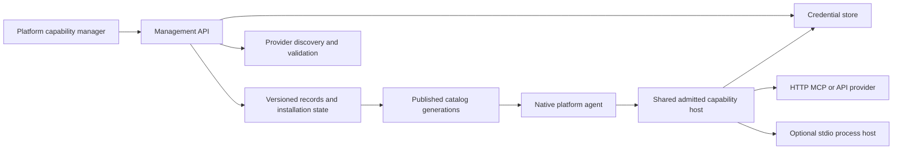

# Frontend capability management implementation plan

Status: researched and planned; implementation has not started.
Prepared: 2026-10-08, Africa/Johannesburg.

This standalone working plan belongs outside `docs/`. It covers a substantial
implementation programme with coherent commit checkpoints. It supersedes manual
connection setup as the next user-facing capability milestone; it does not claim
that installation or arbitrary-server compatibility already exists.

## Goal and scope

From a platform's frontend, connect external tools, save their credentials,
import skills, install versioned capability bundles and compose an agent profile.
Use the same management services across Mastra, LangGraph, Temporal and Restate
baseline agents. Adding a supported integration must require no edits to their
native agent loops and no control-plane restart.

Agents remain general backend agents. No native filesystem, shell or shared VM
capability is added. Backend storage of packages, secrets, state and evidence is
infrastructure. An optional external provider may expose filesystem tools through
normal connected-tool permissions.

Deliver HTTP MCP, configured HTTP API integrations, portable skills and
declarative plugin bundles first. Managed stdio follows as an explicit milestone
with its own process host. This plan includes that milestone; HTTP-only completion
must not be described as complete arbitrary-MCP support. Executable extension
hooks and general skill-script execution require a separately admitted execution
provider and are not part of the first bundle format.

## Constraints and research

- Preserve unrelated Studio/Lina and context work.
- Use minimal meaningful tests and actual user paths. Defer broad fuzzing,
  load testing, multi-region operation, marketplace infrastructure and exhaustive
  chaos testing. Credential confidentiality and authority checks are baseline
  functionality and cannot be deferred as optional hardening.
- Make sensible checkpoint commits after verified implementation units, not after
  every checkbox and not one giant commit. Do not push without authorization.
- Use only verified free models for unattended agent checks. No paid fallback.
- Keep framework orchestration and persistence native. Management lives in the
  common capability/control-plane layers.
- Distinguish observed upstream behavior from our design choices. Primary-source
  findings: [connections and credentials](../../../../docs/research/capability-management-connections.md)
  and [skills and plugins](../../../../docs/research/capability-management-packages.md).
- OAuth discovery/registration must follow the selected MCP protocol version,
  not assumptions that all servers use identical auth. The
  [MCP authorization specification](https://modelcontextprotocol.io/specification/2025-11-25/basic/authorization)
  describes discovery, PKCE, resource binding and client registration choices.
  [Agent Skills](https://agentskills.io/specification) defines the portable skill
  layout. Plugin formats differ between products; our bundle is a documented Lab
  format with explicit import compatibility, not a universal plugin standard.

## Inspected baseline

| Area | Present behavior | Required change |
| --- | --- | --- |
| Frontend | Profile selection and connect/refresh/revoke for predefined accounts | Create/edit/delete connections; discovery/permissions; skill and bundle installation; profile editing |
| Configuration | `customer-support.json` loaded at bootstrap | Persist user-managed records; import trusted development configuration explicitly |
| Credentials | Static headers reference environment variables; OAuth encrypted file store | Save PATs/custom headers/client secrets through a generic credential store |
| OAuth | PKCE, refresh, revocation, issuer checks and pre-registered client IDs | Broader discovery, registration choices and frontend account lifecycle |
| Catalog | Atomic replacement for future admission; frozen run descriptors | Retain the matching executable contribution for old source revisions |
| Host | Contributions keyed by tool name; replacement can invalidate old sources | Key/resolve by source identity and admitted catalog revision |
| Skills | Standard frontmatter, progressive loading, bounded digested resources | Install/import/inspect/remove immutable skill packages from UI |
| Plugins | Metadata validator accepts local builtins | Separate installed versioned bundle format and lifecycle |
| Transport | Streamable HTTP MCP and configured REST operations | Transport compatibility diagnostics, then managed stdio process host |
| Memos | Real app, saved local env token, five CRUD tools; direct checks passed | First real UI-managed token connection acceptance fixture |

Code owners inspected:
`server/src/capabilities/extensions/{packages,catalog,host,skills}.ts`,
`server/src/capabilities/integrations/connections.ts`,
`server/src/capabilities/integrations/oauth/`,
`server/src/control-plane/bootstrap/server.ts`,
`server/src/control-plane/http/connections.ts`,
`apps/web/src/features/platforms/{ConnectionPanel,CapabilityPicker}.tsx`.

## Architecture decisions

### 1. Manage records, not browser-supplied runtime configuration

Add a capability management service with a persisted repository. Administrative
input becomes validated connection/package/profile records; never pass arbitrary
browser objects or paths directly into `loadCapabilityPackages`, which currently
accepts trusted process configuration only. Refactor source construction to consume
validated domain records, and retain the file loader as a trusted import adapter.

The management API and native execution API remain separate. Extend the shared
host/catalog boundary rather than writing a new universal agent loop.

### 2. Separate configuration, account authority and secret values

| Record | Content | Excluded |
| --- | --- | --- |
| Connection | Stable ID, endpoint/transport, account owner, auth mode, credential reference, lifecycle/authority revision | Token/password/header values |
| Installed package | Origin, exact version, content digest, contributions and dependency constraints | Credentials and automatic grants |
| Profile revision | Selected tool identities, connection bindings, skill IDs, approval policy, supported variants | Secrets and mutable global defaults |
| Credential | Typed secret payload, owner, connection/resource binding, expiry metadata, key version | Profile membership and model instructions |
| Run snapshot | Admitted profile/package/tool versions, digests and connection authority identity | Secret bytes |

A connection account can be reused by several profiles, but this does not imply
resource isolation between those agents. Show the actual account/resource scope.
Start with one explicit local workspace owner, not invented per-user isolation.
Remote/multi-user deployment requires authenticated owners and authorization and
is outside this local administration release.

### 3. Persist credentials behind the existing secret boundary

Reuse the AES-256-GCM implementation and its private atomic-file behavior; extend
it with versioned typed envelopes for static headers/PATs, OAuth tokens and OAuth
client secrets. Retain a legacy reader for existing OAuth records and migrate
explicitly. Bind ciphertext to owner, connection/resource identity and record
version, opaque secret ID and purpose/type with authenticated additional data.
Use opaque secret IDs.

The deployment supplies a 32-byte master key separately from the ciphertext and
ordinary package records. Keep the existing OAuth key setting compatible while
introducing generic naming. No automatic plaintext fallback or key stored beside
the encrypted records. If no key is configured, disable saved-credential actions
with an actionable setup state. Existing environment-reference connections remain
supported and identified as externally managed.

Credential entry is write-only: accept once over the trusted admin API, immediately
clear the frontend form, return presence/expiry/status only. Do not use browser
localStorage, query parameters, logs, run artifacts, model context or exports.
Show a masked presence indicator, not a token prefix. Sanitize provider errors.

Support replace, delete, known expiry and reconnect. OAuth refresh is serialized;
persist rotated refresh tokens before acknowledging completion. PATs cannot be
refreshed unless the provider defines a refresh API. Do not invent expiry for an
opaque token; user-supplied expiry is labeled as such. Provide a documented master
key rotation operation using key IDs and staged re-encryption before retirement.
A missing/wrong key fails closed. Backups exclude secrets by default; encrypted
secret backup and separately protected key recovery are explicit administrator
operations. Encryption at rest does not protect against a compromised backend.

Local encrypted storage fits our backend and existing code. OS keychain support
is an optional desktop provisioning adapter, not a mandatory cross-platform
backend dependency. Hosted deployments can implement the same interface with a
managed vault; do not implement all vault vendors in this milestone.

### 4. Persist metadata with explicit single-writer semantics

Use bounded versioned JSON generation snapshots with staged writes and atomic
publication, matching existing file-backed Lab stores and avoiding a database
added solely for this feature. The repository serializes mutations and uses
expected revisions to reject stale edits. Start with one control-plane writer;
reject a second writer for the same state root. A future database implementation
can replace the repository if shared deployment becomes a concrete requirement.

Keep secret records separate. Installation/credential operations use recorded
stages because metadata and secret stores are not one transaction: validate and
stage, write secret/artifact, publish metadata/catalog, then retire obsolete data.
On restart, reconcile incomplete stages and unused staged material. Preserve the
last published valid catalog if discovery or compilation fails. Failed changes
must never leave partial tools or secret references active.

Default capability state belongs under an ignored private `lab/state` subdirectory
with configurable roots. Add precise ignore rules during implementation, not
machine-specific configuration to Git. User records and imported managed seed
records must have distinct ownership so a restart cannot overwrite UI edits.

### 5. Catalog revisions preserve evidence and usable admitted sources

Publish a new immutable catalog generation after validation. Future runs use it;
active and resumable runs retain their admitted tool definitions and matching
implementation bindings. Registry lookup must include source ID/version/digest,
not tool name alone. Persist install content and reconstruct eligible revisions
after restart. Do not retain open network sessions indefinitely.

Token refresh normally preserves authority when resource, account and scopes
remain equivalent. Credential replacement/reconnect, endpoint change, permission
change or revocation updates the authority revision and invalidates prior grants
as appropriate. Revocation is checked immediately before dispatch. Removing a
package disables new selection but retained artifacts support admitted runs;
explicit access revocation remains immediate. Explain these two operations in UI.

### 6. OAuth, HTTP and stdio are different setup paths

HTTP flow: endpoint validation → bounded connection probe → authentication
selection/discovery → account authorization → tool discovery → explicit
selection/approval policy → publish. Honor negotiated protocol capabilities and
report unsupported content or requests honestly. Resources, prompts and elicitation
must not be advertised as supported merely because tool discovery works.

OAuth: challenge plus protected-resource well-known fallback, OAuth/OIDC metadata,
PKCE/state/issuer/resource checks, pre-registered clients first, client metadata
where configured and supported, dynamic registration where advertised and allowed,
otherwise manual client setup. Do not auto-request broader scopes. Show scope
changes before reauthorization. Localhost cannot host the public HTTPS client
metadata some authorization servers require; this is a setup constraint, not a
reason to claim every URL is one-click compatible.

New metadata/token origins need validated trust policy. Never forward a provider
token across an unvalidated redirect or to another resource. Allow explicit
loopback development endpoints; remote endpoints require HTTPS. Backend-owned
URL checks include DNS/address validation and blocked metadata/link-local targets.
Provide explicit administrative allowance for intentional private-network providers.

Stdio is server-side process management: executable plus argument array, no shell
interpolation, exact package/image version, private per-provider environment, bounded
stdout/stderr, initialization, timeout/cancellation, restart and teardown. Never
inherit the entire backend environment or expose arbitrary working directories.
UI distinguishes remote URL connection from installation of backend software.
A subprocess alone is not a sandbox: initially admit only administrator-approved
providers and show their backend privileges. Arbitrary untrusted execution needs
a separately configured container/isolation policy before it is enabled.
A managed container/process workspace belongs to the integration host, not the
agent runtime. Stdio servers may expose powerful tools; selecting them remains an
explicit tool/permission decision.

### 7. Skills and plugins need install lifecycle and explicit trust

Skills import an uploaded package or an approved repository URL pinned to a commit.
Preview origin, metadata, content and resources before publishing. Enforce existing
size/path/symlink limits plus archive traversal/bomb limits. Install immutable
content addressed by digest and preserve progressive loading. Instructions grant
no credentials or execution authority. Scripts may be inspected as resources;
execution needs a separately connected tool provider.

A first Lab plugin bundle declares exact identity/version, skills, MCP/HTTP source
templates, exact dependency versions and required secret fields. Resolve dependencies
to an exact installation lock and record origins/digests. Installation does not
authenticate an account or enable a profile. Namespaced identities prevent tool
collisions. Preview the dependency changes and required connections. No arbitrary
npm hooks, install scripts or in-process code loading in this format. Other agent
plugin imports must declare their supported subset and report unsupported parts.

Updates are explicit and create new revisions; no silent auto-updates for admitted
runs. Require exact dependency versions initially; reject missing revisions and cycles.
Do not build a marketplace or a
large general package resolver. Support inspect, enable/disable, upgrade and remove,
including blocked removal of still-referenced dependencies.

## Implementation milestones and commit checkpoints

Unchecked items below are planned work, not completed behavior. These milestones
are coherent deliverables; their checklists are not individual commit boundaries.

### 1. Durable management records and publication

- [ ] Define connection, package, installation lock, profile revision and catalog-generation schemas.
- [ ] Implement the bounded repository, expected revisions, writer lock and staged operation journal.
- [ ] Add explicit trusted seed import with stable IDs and migration ownership; preserve existing profiles.
- [ ] Refactor validated source construction away from trusted-file-only bootstrap.
- [ ] Introduce hot publication and versioned contribution lookup; reconstruct retained revisions on restart.
- [ ] Preserve native workers and immutable run evidence; immediate revocation still blocks old grants.

Acceptance: add/edit a profile without restarting; restart reloads it; a source
upgrade cannot silently change an admitted run's tool implementation.
Focused checks: stale edit rejected, interrupted publication retains old generation,
restart round trip and admitted-old/new-source lookup. Commit:
`feat(capabilities): persist managed records and versioned catalogs`.

### 2. Saved credentials and connection administration

- [ ] Generalize encrypted credential envelopes; migrate legacy OAuth reads and retain environment references.
- [ ] Implement write-only secret submission, replacement/deletion, expiry metadata and key rotation command.
- [ ] Add local admin authorization and allowed-origin protection to mutation and credential routes; IP-locality alone is insufficient. Use a private bootstrap token exchanged for a bounded HttpOnly/SameSite admin session, server-side CSRF checks, and loopback binding; document its local provisioning path.
- [ ] Route management requests through a same-origin frontend/API proxy, including local Vite setup. Current localhost:5173 and 127.0.0.1:4322 are different sites; do not depend on cross-site SameSite cookies.
- [ ] Add connection create/edit/disable/delete and test/discover routes with bounded input and safe errors.
- [ ] Bind credentials to connection owner/resource; journal and reconcile interrupted secret/metadata changes.
- [ ] Support the existing Memos account with a frontend-entered token; remove its dependency on startup env for the managed record.

Acceptance: credential survives backend restart encrypted; browser can verify
presence but cannot retrieve it; Memos connection works without API restart.
Focused checks: encrypted round trip/wrong-key rejection, no secret in API/evidence,
credential replace/revoke denies stale authority, one failed staged mutation and
one key-rotation round trip.
Commit: `feat(connections): save credentials and manage connection lifecycle`.

### 3. HTTP MCP interoperability and OAuth setup

- [ ] Add supported-version negotiation and concise compatibility diagnostics for tool-only HTTP servers.
- [ ] Complete challenge/well-known protected-resource and OAuth/OIDC metadata discovery.
- [ ] Implement applicable pre-registration/CIMD/DCR selection with visible manual fallback.
- [ ] Store client secrets and rotated token sets through the generic store; serialize refresh and handle denied/expired grants.
- [ ] Validate endpoints/issuer/resource bindings and cross-origin redirects; define intentional local/private-provider policy.
- [ ] Preserve existing MCP content/progress evidence and unknown-write outcomes; never auto-retry an uncertain mutation.
- [ ] Provide configured HTTP-operation import/edit using explicit methods, paths, input schemas and effect contracts.

Acceptance: PAT Memos and a standards-based OAuth development server both connect;
unsupported registration yields useful setup instructions, not false availability.
Focused checks: successful OAuth including restart/refresh, one state/issuer failure,
revocation and one untrusted metadata/redirect case. Commit:
`feat(mcp): discover and authorize managed HTTP connections`.

### 4. Skill imports and declarative plugin installation

- [ ] Add bounded upload and pinned repository import, staging and immutable content storage.
- [ ] Reuse skill parsing/resource digests; preview origin/content and reject unsafe layouts.
- [ ] Enforce profile-selected skill IDs at the host for list/load/resource operations. Package-wide tools must not expose disabled sibling skills; scope their admitted schema/context accordingly.
- [ ] Define versioned Lab bundle manifest and minimal exact dependency lock with declared secret requirements.
- [ ] Implement staged install, inspection, explicit update, disable and remove; keep authentication and profile grants separate.
- [ ] Diagnose unsupported scripts/hooks or foreign plugin features explicitly.
- [ ] Retain content required by active/resumable admitted runs and document cleanup rules.

Acceptance: install a bundle containing a skill and Memos source template, supply
credentials separately and enable it in a profile; update does not rewrite a run.
Focused checks: one valid bundle/import, one bad path/dependency, failed install
leaves no active partial package, progressive skill activation preserved and
unselected sibling skill rejected by the host.
Commit: `feat(packages): install skills and versioned capability bundles`.

### 5. Platform frontend management and profile composition

- [ ] Add a shared manager opened from each baseline platform's configuration with Connections, Skills and Plugins views.
- [ ] Build add/edit connection flow, OAuth handoff/PAT form, discovery, status, reconnect and disconnect.
- [ ] Show tool lists with selection and read/write approval policy; provider annotations never grant permission automatically.
- [ ] Add skill/bundle import preview, install states, dependency/account requirements and lifecycle actions.
- [ ] Add named profile creation/edit/duplication, selected tools/skills/accounts and per-platform availability.
- [ ] Show account ownership, credential presence/expiry and errors through progressive disclosure.
- [ ] Clear sensitive form state; retain no credential in browser persistence or profile exports.
- [ ] Surface disabled, unavailable, unsupported and needs-setup honestly; expose no fake marketplace or health results.

Acceptance: a user completes add Memos → save token → discover/select tools → add
skill → save profile → select profile in Chat without editing a file/restarting.
Focused validation: web typecheck/build and one actual browser path including
refresh/reconnect, profile selection and reload. Save a redacted screenshot.
Commit: `feat(web): manage connections packages and agent profiles`.

### 6. Managed stdio integration host

- [ ] Implement provider process host and lifecycle, separate from native agents and management request handlers.
- [ ] Support executable/args or approved pinned package installation with explicit backend install preview.
- [ ] Add private credential injection, bounded protocol/logs, cancellation, restart and cleanup without shared shell access.
- [ ] Register its tools through the existing admitted host contract and the same permission UI.
- [ ] Display required backend runtime, installed version, status and diagnostic messages.

Acceptance: a pinned stdio MCP server can be installed/configured through the
frontend and used by a baseline agent; stopping it is reported as unavailable.
Focused checks: discovery/call plus one process restart and cancellation; verify
child environment excludes unrelated secrets. Commit:
`feat(mcp): host managed stdio providers`.

### 7. Real agent acceptance and documentation

- [ ] Publish setup/credential recovery, key backup/rotation, import formats and transport compatibility guides.
- [ ] Show the actual agent prompts before executing trials; use disposable resources only.
- [ ] Run one small real free-model Memos CRUD scenario on a primary platform, with independent app read-back and reviewed writes.
- [ ] Run a minimal connected tool + skill decision on each remaining baseline, preserving failures as evidence.
- [ ] Exercise exact-action denial and restart/reconnect once across the shared lifecycle, rather than repeating all permutations per platform.
- [ ] Use the stdio provider for one real-model tool decision and verify the result independently.
- [ ] Record model/settings, profile/catalog/package revisions, connection authority and tools, with no secrets.
- [ ] Confirm unrelated work is untouched, documentation catalog builds and scoped typechecks pass.

Acceptance: the UI-created configuration works with actual model decisions on the
four supported native baselines, with inspectable evidence. Direct connector calls
alone are not agent acceptance. Provider rate limits/model failures remain visible;
they do not justify claiming a full pass. Commit:
`docs(capabilities): document managed setup and acceptance evidence` plus focused
fix commits if acceptance exposes implementation defects.

## Minimal validation budget

Test behavior at its owning layer. Prefer one meaningful success and the failure
that could expose a secret, partial installation, stale authority or altered run.
Do not add mirrored unit tests for every label, CRUD wrapper or record field.
The small restart, denied-action and confidentiality checks above are required
because this implementation stores credentials and changes live authority.

Start with scoped server tests and `pnpm --filter @agent-harness-lab/lab-server run typecheck`.
For frontend work run `pnpm --filter @agent-harness-lab/web run typecheck` and its
build, including docs generation. Use actual browser verification for the final
setup flow. Broaden testing only when changed boundaries or failures warrant it.
No exhaustive eval rerun is required for a documentation-only plan.

## Definition of done

- [ ] All seven milestone acceptance conditions have recorded evidence and coherent commits.
- [ ] A connection and credential can be saved, used, refreshed/replaced and disconnected through the frontend.
- [ ] Skills and versioned bundles can be imported, inspected, attached and removed with explicit dependencies.
- [ ] HTTP and managed stdio compatibility are reported accurately.
- [ ] A saved profile survives restart; no API restart is needed for ordinary management changes.
- [ ] Active/resumable runs preserve admitted sources while revoked authority is denied.
- [ ] Actual model tool/skill use is retained separately from direct connector checks.
- [ ] No native filesystem capability, secrets in Git/evidence or unrelated Studio changes are introduced.

## Current position

Research and planning only. No capability-manager runtime or frontend code has
been implemented by this task. Start with milestone 1, then saved credentials and
HTTP connection setup before expanding package imports and stdio hosting.

## Open deployment choices and limits

The initial scope is the current trusted local deployment with one writer. No
user input is needed to proceed with that scope. Before a hosted release, choose
its authenticated ownership model, managed secret backend, reachable OAuth client
metadata/redirect URLs and process isolation infrastructure. Those are concrete
deployment decisions and should not block the local functional implementation.

A backend can support many compatible servers; it cannot make every foreign
transport, plugin hook, authentication scheme or provider permission model work
by accepting a URL alone. Report unsupported requirements and the precise next
setup step instead of hiding them.
