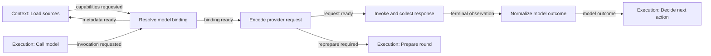

# Lina Model Interface implementation plan

Status: implemented and verified as graph design and deterministic fixture playback, 2026-10-08. Real provider clients remain deferred.

## Outcome and scope

Expand the empty Model Interface block into a technically explicit provider
boundary connected to Context, Turn Execution and shared credential readiness.
Extend the existing deterministic simulation through it in Automatic and Next
modes. Keep the current loop, parallel Tools and user-arranged architecture.

This first slice is graph design, contracts/examples and fixture simulation.
No live model calls, SDK dependency, API keys, production token counter, credential
backend or server-platform refactor is required. Planning remains required future
work; Computer Use is deferred; Subagents stays an empty reserved block. Model
records include agent scope so children can reuse this block later.

Research authority: [Model Interface synthesis](../../../../docs/research/lina/model-interface-research.md),
[provider protocols](../../../../docs/research/lina/model-provider-protocols.md),
[Hermes/OpenClaw](../../../../docs/research/lina/model-hermes-openclaw.md),
and [Pi/Waku](../../../../docs/research/lina/model-pi-waku.md).
This plan replaces the earlier Model sketch in the
[cross-block proposal](lina-cross-block-revisit.md), without changing other blocks.
The proposed [contract fixtures](lina-model-interface.contract-fixtures.json)
are review data, not schemas loaded by Studio or live provider wire contracts.

## Four nodes and their responsibilities

| ID / title | Responsibility | Inputs and outputs | Required branches |
| --- | --- | --- | --- |
| `lina-model-resolve` / Resolve model binding | Select configured route; identify protocol/codec; resolve versioned capabilities; consume credential readiness | Correlated metadata or invocation intent → capabilities or invocation-ready binding | unsupported/unknown capability, disabled/unavailable route, auth wait, changed binding, refusal/expiry |
| `lina-model-encode` / Encode provider request | Convert accepted Context snapshot; map tool names/IDs/schemas/results; retain supported media and opaque state; validate final request | Invocation intent + binding + snapshot → encoded request with fidelity manifest | unsupported required input/schema/setting, invalid history pairing, stale capability/codec, request too large, incompatible continuation |
| `lina-model-invoke` / Invoke and collect response | Launch one physical request; own deadlines, local cancellation and per-item stream buffers; collect raw finish/usage evidence | Encoded request + launch authority → progress and one terminal observation | prelaunch Stop, timeout, HTTP/in-stream failure, missing terminal marker, abort/late output, unknown remote status |
| `lina-model-normalize` / Normalize model outcome | Validate terminal structure and call arguments; map response IDs/content/tool calls; classify finish/failure; retain raw detail and scoped continuation | Terminal observation or prelaunch failure → correlated model outcome | answer, multiple calls, refusal/filter, truncation, malformed calls, failure, abort, unknown terminal state |

The eight studied responsibilities fit here: route/auth/capabilities in Resolve;
encoding/final request checks in Encode; invocation/stream assembly in Invoke;
outcome interpretation in Normalize. Explicit client continuation is a hint
consumed by Execution policy, not a Model-owned loop or provider-hosted pause. Credential storage/refresh remains in Tools'
shared credential lane. JSON argument syntax belongs to Normalize; registered tool
schema validation, permission checks and execution remain in Tools.



Auth waits and cancellation are additional correlated routes listed below; the
main diagram omits those to keep the ordinary path readable.

## Metadata before Context and invocation after Context

1. Execution starts the admitted turn and requests Context preparation.
2. Context load requests Model capabilities if its required binding revision is
   absent or stale. Resolve returns metadata without invoking a provider or
   incrementing model attempts. The return resumes the same preparation.
3. Context budget/validation/publication use that exact capability revision, output
   reservation, effective reasoning/budget settings and protocol profile. Unknown required capabilities fail explicitly;
   do not assume support from the model name or an OpenAI-shaped endpoint.
4. Call model delegates its invocation intent to Resolve. Credentials and route
   currentness are checked before Encode. The exact prepared snapshot is retained.
5. Encode records provider projections and checks final compatibility/size. A changed
   model, codec, required schema or capability returns to bounded Context reprepare.
6. Invoke rechecks launch authority and Stop before creating a physical attempt.
   Stream deltas are drafts. Only a terminal observation reaches Normalize.
7. Normalize returns evidence to Decide next action. Execution selects Tools,
   controls/settlement, bounded recovery, or failure. Model Interface never opens
   the next logical round or runs a hidden retry/fallback.

Avoid a dependency loop: capabilities requests carry preparation/dependency IDs;
load marks the dependency resolved and continues instead of requesting it again.
Do not initialize a complete request by requiring a context snapshot before the
metadata needed to construct that snapshot exists.

## Connections and existing updates

All new edge IDs below start with `lina-model-edge-`. Use the existing producer
output and `{event, context}` convention. Side notifications are not ordinary
cursor transitions. No connections target nonexistent Safety/State/Output nodes.

| Suffix | Source → target | Event and rule |
| --- | --- | --- |
| `context-resolve` | `lina-context-load` → `lina-model-resolve` | `model.capabilities-requested`; metadata-only dependency |
| `resolve-context` | resolve → `lina-context-load` | `model.capabilities-ready` or `model.capabilities-unavailable`; resume exact preparation or classify source failure |
| `execution-resolve` | `lina-execution-model` → resolve | `model.invocation-requested`; no attempt counted yet |
| `resolve-encode` | resolve → encode | `model.binding-ready`; current profile and account metadata |
| `resolve-normalize` | resolve → normalize | `model.prelaunch-failure`; invocation path only, no physical attempt |
| `cancel-resolve` | `lina-execution-cancel` → resolve | `model.intent-cancelled`; invalidate pending intent/readiness; metadata cancellation returns to the same Context preparation |
| `cancel-encode` | `lina-execution-cancel` → encode | `model.intent-cancelled`; emit prelaunch abort, no physical attempt |
| `cancel-readiness` | `lina-execution-cancel` → `lina-execution-wait` | `model.readiness-cancelled`; invalidate retained readiness token; no late resume |
| `resolve-reprepare` | resolve → `lina-execution-prepare` | `model.reprepare-required`; changed binding before launch |
| `encode-invoke` | encode → invoke | `model.request-ready`; exact snapshot, tool map and request digest |
| `encode-normalize` | encode → normalize | `model.prelaunch-failure`; unsupported/malformed request with attempts unchanged |
| `encode-reprepare` | encode → `lina-execution-prepare` | `model.reprepare-required`; codec overhead/capability changed or bounded context pressure |
| `invoke-progress` | invoke → invoke | `model.progress`; per-item draft update, no executable Tools payload |
| `invoke-normalize` | invoke → normalize | `model.attempt-observed`; exactly one terminal local observation per attempt |
| `normalize-decide` | normalize → `lina-execution-decide` | `model.outcome-ready`; raw provider reason and safe evidence retained |
| `cancel-invoke` | `lina-execution-model` → invoke | `model.abort-requested`; consumes existing cancel-model forwarding, exact attempt only |
| `invoke-wait` | invoke → `lina-execution-wait` | `model.local-settlement-pending`; retain active local request until accounted |
| `wait-invoke` | `lina-execution-wait` → invoke | `model.settlement-resume`; matching completion/abort evidence, no new launch |
| `resolve-wait` | resolve → `lina-execution-wait` | `model.readiness-wait`; original intent and preparation retained |
| `wait-auth` | `lina-execution-wait` → `lina-tools-auth` | `model.credential-readiness-requested`; protected owner consumes provider audience |
| `wait-resolve` | `lina-execution-wait` → resolve | `model.readiness-resume`; ready/denied/expired matched to original binding |

Shared credential completion already returns through Tools auth → Execution wait.
Extend that output/input union with a tagged Model continuation. Do not add an
uncorrelated direct auth → resolve shortcut. A Model metadata lookup normally
needs no credential material; if endpoint introspection does require it, use this
same readiness path while preserving metadata mode and zero model attempts.
After matched readiness, Resolve branches on the original purpose: metadata returns
to Context load with the same preparation; invocation proceeds to Encode. Stop
invalidates pending readiness and intent, so a late callback cannot revive either.
Metadata cancellation returns a cancelled dependency to Context load, which uses
the existing settlement owner; invocation cancellation returns a prelaunch aborted
outcome through Normalize. No fake attempt is allocated for either.

Retire `lina-execution-edge-model-decide` as a maintained direct-output bypass once
Normalize handles every prior fixture outcome. Keep `prepare-model`,
`decide-recover`, `recover-prepare`, `decide-terminal` and `cancel-model` IDs and
semantics; update their handoff payloads. Existing cancellation initially reaches
Call model, which forwards it to the exact active Invoke attempt.

No extra Input nodes are needed. Extend existing prompt/wait answer examples only
where they need the tagged Model owner; matching still uses wait/operation/account
identity and cannot be treated as a fresh request or trusted arbitrary token text.

## Contracts and reference examples

Use Draft 2020-12 JSON schemas and producer-derived consumer inputs. Each node
gets example input/output for success and every meaningful branch above. The
companion fixtures provide executable sample schemas for the core records below;
implementation expands branch-specific events and coordinator context.

| Record | Required fields / meaning |
| --- | --- |
| Identity | `agentId`, `turnId`, `roundId`, requester/scope refs; ownership revision; preparation ID or invocation intent ID; nullable attempt ID before launch |
| Resolution request | tagged `purpose: capabilities\|invocation`; configuration/profile revision, required input/feature refs; invocation mode adds snapshot and launch authority refs |
| Model binding | requested provider/model, protocol/profile/codec revisions, endpoint/account/credential-readiness refs, capabilities ref and evidence source, configured/effective parameters, route generation and budget-profile revision |
| Capabilities | modalities and limits, tool/schema dialect subset, structured output/reasoning/cache support, context/output limits, cancellation mode; feature facts `supported\|unsupported\|unknown`, not guessed booleans |
| Encoding manifest | snapshot/preparation/generation vector, input record→wire position map, original/projected schema digests and transformations, tool alias mapping, media fidelity/omission reasons, cache/opaque replay refs, estimator/size-check provenance |
| Encoded request | binding/profile/snapshot refs, request ID/digest, private fake payload ref plus inspectable safe fixture body, launch authority, requested settings, fidelity manifest, validation verdict |
| Attempt | physical attempt/request IDs allocated at dispatch; turn/round/agent, account/binding revision, start/terminal lifecycle, stream sequence, local status and remote status evidence |
| Progress | attempt + sequence + item/block identity; text/tool-argument draft, usage update or heartbeat; `executable:false`; unknown events retained as evidence |
| Observation | launched or prelaunch stage, transport status, provider response ID, raw finish/status/error refs, terminal marker, collected content/call buffers, final usage availability, local settlement, remote status/cancellation evidence |
| Outcome | `complete\|incomplete\|malformed\|failed\|aborted\|unknown`; raw finish reason; usable content; complete correlated tool calls only; `continuationHint: none|client-continuation|provider-hosted|unknown`; failure classification/hints; usage; configured and actual returned model/provider refs |
| Continuation | opaque provider state artifact refs scoped to agent/account/provider/protocol/session/history revision; portable/nonportable verdict and required replay ordering; never raw secrets or invented reasoning text |
| Usage | `reported\|partial\|unavailable`; nullable input/output/cache read/cache write/reasoning/total counts, accounting semantics, cumulative-vs-delta provenance and raw usage ref; unknown differs from zero |
| Wait | wait ID, Model owner, intent/attempt/preparation/binding refs, eligible responder/account, expiry, continuation ref and retained sibling work |
| Failure | stage, code/class, transport/body status, safe detail ref, retry hint/delay, context/auth hints, partial output/effective route, usage availability, launch/local settlement evidence |

Preserve useful native details in safe artifact/reference records rather than
forcing every protocol into Chat Completions. Provider conversation IDs are not
Lina checkpoints. Historical opaque blocks stay canonical but may be omitted only
under a recorded compatibility policy; required signatures cannot be silently
stripped to make a fallback request fit.

Structural argument parsing in Normalize must require complete JSON objects,
nonempty names and unambiguous call IDs. Known names resolve through the encoding
map; a syntactically valid unknown name retains its native value and an explicit
unmapped verdict rather than inventing a catalog binding. Unknown tool names can remain
complete model requests and be rejected by Tools resolution. Schema validity and
permission are not proven by syntactically valid JSON. Provider strict-mode
rewrites such as optional properties becoming required nullable properties need
a documented reversible semantic mapping. If it cannot preserve the canonical
contract, use an explicitly supported non-strict profile or reject that projection;
never claim equivalence because both schemas happen to validate a fixture. Duplicate/ambiguous provider
call IDs are malformed. If a provider has no call ID, mint a stable per-attempt
mapping and retain its wire index; never invent a successful tool result.

## Lifecycle and baseline policies

- **Attempts and budgets:** one Invoke dispatch increments one physical attempt.
  Metadata, encoding, waiting and reprepare increment none. Round identity is allocated by Execution before preparation, but its launched-round
  count increments only on the first Invoke dispatch for that round. A provider
  retry increments attempts only, remaining in the existing round with a new ID.
  Replace the simulator's current counter increment at Call model accordingly.
- **Terminal barrier:** preserve interleaved draft items by identity. End-of-socket
  without required protocol completion is incomplete/unknown, even if a JSON prefix
  parses. No draft, truncated or malformed calls reach Tools. Baseline waits for
  terminal response evidence, including when individual calls finish earlier.
- **Failure after output:** retain displayed preview and its failed attempt identity;
  mark it nonfinal. Do not append it as an accepted assistant answer or combine its
  call fragments with the next attempt. Retry makes a separately labeled attempt.
- **Auth:** resolution uses reference/readiness metadata. Provider auth does not
  imply MCP OAuth. A mismatch/revocation cannot silently switch accounts; new binding
  requires currentness checks and possibly Context reprepare. No replay follows
  auth refresh automatically.
- **Stop:** during Resolve, Encode or readiness waiting, cancel the pending intent,
  invalidate its continuation and report a prelaunch abort/dependency cancellation.
  Both physical-attempt and launched-round counters stay unchanged. Before dispatch,
  no request launches. During streaming, signal the exact
  attempt and drain/account the local work. Pause only pauses viewing. Late events
  from stopped/superseded attempts stay diagnostic and cannot launch Tools or resume
  ordinary reasoning. A local settled abort can finish cancelled with remote compute
  or billing unknown; the UI must not call it confirmed remote cancellation.
- **Unknown work:** a pending local request retains execution ownership until its
  local outcome is accounted. Unknown inference completion/usage is not an unknown
  tool write. No blanket rollback or exactly-once inference guarantee is claimed.
- **Retry/fallback:** disable hidden SDK retries in future adapters, or expose all
  physical sends to the same Execution budget. Honor retry hints/Retry-After as data.
  Fallback is initially disabled; a later explicit candidate change returns through
  capabilities/Context preparation. Gateway routing is recorded as upstream behavior,
  including when its internal attempt count is unobservable.
- **Budget currentness:** output reservation, effective reasoning/budget parameters
  and encoding overhead participate in the Context budget-profile revision. A
  change requires bounded reprepare even when model/capability IDs stay the same.
- **Reduction/repair:** overflow asks Context to reduce/reprepare within its budget;
  malformed/truncated terminal output initially fails with evidence. No silent JSON
  repair, partial-call dispatch or automatic truncation continuation is included.
- **Usage:** do not sum cumulative stream usage updates. Normalize counts using
  declared provider semantics and keep raw detail. Cost/reasoning/cache fields stay
  unavailable when absent. Requests that return no visible text may still consume
  tokens. Fixture values never become benchmark evidence.
- **Provider hosted tools:** detect server-tool/agent pause/continuation forms;
  represent them as unsupported in this slice. Do not relabel server execution as
  Lina Tools or interpret pause_turn as a local approval wait.

## Protocol fixture profiles

The Run modal adds **Model protocol** and **Model case** with progressive disclosure.
Keep Channel, Execution case, Context case, Tools batch, round limit, playback and
following. Protocol selects encoding/stream shape; it does not call a real provider.

Initial fake profiles: `openai-chat-fixture-v1`, `openai-responses-fixture-v1`,
`anthropic-messages-fixture-v1`, `gemini-generate-content-fixture-v1`.
Each has a pinned source set, capability facts and explicit supported event subset.
Common outcomes are equivalent where supported; wire events, call/result mappings,
usage semantics and opaque fields differ. Capability-specific cases show refusal
or unavailability instead of faking support.

Gemini Interactions, OpenRouter gateway routing/usage details and newer hosted APIs
remain research-backed extension profiles. In particular current Google docs contain
version/event-shape differences: do not mix those into a purported exact adapter.
This does not block the canonical graph or generateContent fixture. Real SDK/API
selection is a prerequisite of each future real adapter, not of this design slice.

## Simulation acceptance matrix

| Case | Required visible result |
| --- | --- |
| Answer | Context metadata → encode → invocation → normalize → existing completion path |
| Explicit client continuation | Preserve the existing no-tool continuation hint; Execution opens the next round within its budget; provider-hosted pause remains unsupported |
| Two interleaved calls | Independent preview buffers; zero dispatch before terminal; then existing parallel Tools path |
| Text plus calls | Retain both; response text is not automatically final delivery |
| Usage/heartbeat events | Progress without extra round/attempt; correct final reported or unavailable usage |
| Empty terminal content and no calls | Profile/policy classifies usable empty response versus malformed/unusable; usage may be nonzero; completion marker alone is insufficient |
| Unknown tool name | Preserve unmapped native name; complete syntax proceeds to Tools rejection, never an invented binding |
| Refusal/safety block | Raw reason retained; terminal refusal/blocked outcome; no accidental retry or Tools |
| Truncated tool arguments | Fragments visible as draft; no runnable calls; failed settlement with incomplete reason |
| Malformed/duplicate calls | Explicit malformed outcome and raw evidence; no JSON repair or Tools launch |
| Missing/unknown finish evidence | No success assumption; terminate with incomplete/unknown/malformed profile classification |
| Failure before any output | One failed physical attempt; eligible existing provider retry preserves round |
| Failure after partial output | Nonfinal preview retained by attempt; retry does not merge or duplicate it |
| Unsupported required media/schema/setting | Encode or capability rejection; zero physical attempts |
| Changed output/reasoning budget settings | Invalidate prior budget profile and reprepare before dispatch even with unchanged model ID |
| Changed binding/capabilities | Bounded reprepare; previous snapshot retained; counters not reset |
| Context overflow from provider | Count failed attempt; existing Recover requests Context refresh rather than automatic fallback |
| Missing/expired credential | Correlated wait, no launch; matched readiness resumes; wrong account denied |
| Stop before launch or during readiness/encoding | Cancel original intent/wait; zero new launched rounds/attempts; late readiness cannot resume it |
| Stop during stream | Exact attempt abort/accounting; unknown remote usage explicit; late chunks never resume work |
| Opaque continuation compatibility | Preserve required ordered refs on same route; refuse incompatible cross-route reuse |
| Unknown event/nonterminal error/HTTP200 error | Retain unknown event detail; transport success alone never proves semantic success |

All existing Input/Context/Tools scenarios must still complete or fail for the same
semantic reason in Auto and Next. New model settings default to the ordinary answer
profile, but existing explicit-continuation/loop-limit fixtures retain their
continuation hints and tool-round fixtures override response content to exercise the
same complete-call path. Terminal Model cases take precedence over a selected
later Tools case. Maximum rounds still caps logical rounds; model fixture retries
consume the existing attempt/retry allowance. Reset preserves selected settings.

## Implementation checklist

### 1. Shared records and precise contracts

- [x] Add `contracts/modelRecords.ts` for identity, binding, capabilities, request,
  progress/observation/outcome, usage and scoped continuation records.
- [x] Add `contracts/modelInterface.ts` with all four node input/output variants,
  branch examples, coordinator dependencies and failure/Stop rules.
- [x] Generate consumer events from exact producer variants; register Model contracts
  without circular module imports or a second independently reconstructed event shape.
- [x] Retain original schema/binding identity and typed media/provider refs; make
  structural checks separate from Tools admission.
- [x] Extend shared credential/Execution wait continuations with an explicit Model
  tag and native-provider audience; no dummy call/batch/MCP session.
- [x] Add metadata request/return and capability binding to Context load/preparation,
  snapshot, budget/validation and generation vector, including output/reasoning
  budget-profile currentness.
- [x] Extend Execution model/decide/recover/cancel examples for rich outcomes,
  failure classes, prelaunch and local/remote cancellation distinctions.

### 2. Graph and saved-design integration

- [x] Add `modelBlock.ts` with the four nodes and exact edges above.
- [x] Compose it into `architectureDocument.ts`; recognize Model in block membership,
  index, drag handling, routing and layout reset boundaries.
- [x] Replace the empty Model region only when maintained nodes exist; preserve
  existing block numbering and leave Subagents/Planning/Computer Use placeholders.
- [x] Place missing nodes beside/below existing blocks without collisions, preserving
  user positions, statuses, experiments, custom nodes and edges.
- [x] Remove the direct model-decide bypass after outcome parity is proven; retain
  documented cross-block IDs and ownership.
- [x] Verify a saved 87-node design gains four Model nodes once and refresh is
  idempotent; final inventory is 91 maintained nodes.

### 3. Event simulation and controls

- [x] Add versioned local fake protocol fixtures with provenance, capabilities,
  encoded payloads and typed per-item progress/terminal events.
- [x] Extend the existing reducer with active model attempt/buffer/outcome state;
  avoid a second playback engine or general workflow framework.
- [x] Move attempt counting to Invoke dispatch; separate planned intent and active
  request IDs; do not reset round/retry/context budgets.
- [x] Add metadata staging/readiness waits and reprepare routes without loops or
  fabricated tool calls.
- [x] Implement the acceptance matrix, including metadata versus invocation auth resumption, no dispatch from previews,
  superseded output, refusal/truncation and mixed text/calls.
- [x] Preserve existing parallel Tools operations, waits, uncertainty and Stop join.
- [x] Route cancellation and pending local settlement through Invoke/Execution wait;
  distinguish local settlement from unknown remote compute/usage.
- [x] Auto and Next apply the same events/answers; Auto pauses at required input;
  Pause differs from Stop; reset keeps model settings and manual following.

### 4. UI and documentation

- [x] Add Model protocol/case settings to the existing Run modal without credential
  inputs, actual message text or a second configuration flow.
- [x] Display active attempt, draft versus terminal output and usable versus
  unlaunchable calls through short labels/progressive disclosure.
- [x] Provide colored collapsible schemas and examples for every new node and
  affected branch; show the encoding manifest/raw detail refs in inspection.
- [x] Add safe fixture usage disclosure marked synthetic/unavailable; no fake
  operational metrics or confirmed remote cancellation.
- [x] Update Lina README, node-contract guide, research/plan indexes and cross-block
  manifest status once implemented; distinguish plans from completed design work.

### 5. Verification and completion gate

- [x] Validate every schema/example with a standard Draft 2020-12 validator,
  including existing 87-node examples.
- [x] Add semantic handoff tests for snapshot/binding/catalog identity, schema
  projection, opaque-state scope, call/result correlation and usage interpretation.
- [x] Test all progress/terminal/failure cases for zero early Tools launches, correct
  attempt counters, sibling preservation, and correct retry/reprepare owner.
- [x] Test duplicate progress/terminal events for stable buffers, one terminal
  outcome and no double-counted attempt or Tools batch.
- [x] Test abort races/late events, wrong-account readiness, missing usage,
  post-output failure and no terminal marker.
- [x] Prove Auto/Next parity and saved-layout migration; keep all current tests passing.
- [x] Run web type checking and production build; update generated docs through the
  existing generator and inspect the actual changed outputs.
- [x] Browser-check the Run modal, model paths, streaming draft/terminal state,
  parallel Tools handoff, waits/Stop and nested JSON in both playback modes.
- [x] Record executed validation and limits in a completed plan; do not mark this
  active plan complete merely because research/schema examples pass.

Use the existing workspace runner; no dependency was added:

```sh
pnpm --filter @agent-harness-lab/studio-api exec tsx --test \
  ../web/tests/linaArchitecture.test.ts ../web/tests/linaContracts.test.ts \
  ../web/tests/linaToolsContracts.test.ts ../web/tests/linaRevisitContracts.test.ts \
  ../web/tests/linaSimulation.test.ts ../web/tests/linaRevisitSimulation.test.ts \
  ../web/tests/linaModelContracts.test.ts ../web/tests/linaModelSimulation.test.ts
pnpm --filter @agent-harness-lab/web build
```

The complete executed command was `pnpm --filter @agent-harness-lab/studio-api exec tsx --test '../web/tests/lina*.test.ts'`. The Model contract and simulation suites are implemented; validation is recorded below.
Upstream source tests are evidence to inspect, not substitutes for Lina semantic
checks. No live-call accuracy/latency benchmark belongs in this first slice.

## Deferred extensions and experiment notes

Real adapters need pinned SDK/API contract tests, private credential injection,
actual request limits and a persistence/evidence owner. Keep platform-specific
harness model clients isolated. Full provider server tools, background sessions,
Realtime, embedding/reranking models, automatic fallback/repair and streamed early
call execution are later slices, with explicit experiment controls where appropriate.

Useful future comparisons are routing/fallback policies, reasoning/output
allocation, faithful cache placement, structured output modes and buffered versus
streaming delivery. Early tool execution needs verified provider call-completion
signals plus Tools admission and effect handling. It is not permission to execute
partial JSON. Baseline correctness and required parallel Tools are not optional
experiments.

Research is complete when supporting source notes and this plan are linked and
validated. Implementation is complete only when the checklist and observable
acceptance cases pass. There are no unresolved product choices required to begin
the graph slice; exact production provider/API/SDK selection remains deferred.

## Research and plan validation

- [x] Primary provider documentation and four agent source studies saved with
  citations, exact source pins and source-access/version limitations.
- [x] Existing Context/Execution/Tools boundary audit completed.
- [x] Independent provider and agent reviews incorporated prelaunch cancellation,
  mode-preserving readiness, dispatch counter and budget-profile corrections.
- [x] Twenty core-record examples validate with strict Draft 2020-12 validation;
  five intentionally invalid examples are rejected. These are proposal-record
  checks, not live wire interoperability or implemented graph tests.
- [x] Twenty-one proposed edge IDs are unique; every endpoint belongs to the
  existing 87-node graph or the four proposed Model nodes. The bypass marked for
  retirement exists in the current graph. Local links and whitespace checks pass.
- [x] Existing documentation generator runs successfully.

All implementation checkboxes above remain unchecked.

## Implementation and validation

The maintained design now has 91 nodes and 221 connections. Four Model nodes add
21 routes, and the direct Call model → Decide bypass is removed. Context resolves
metadata before budgeting, credential continuations retain metadata/invocation
purpose, and only physical Invoke dispatch increments attempts/rounds. Reprepare
creates a distinct immutable snapshot reference and retains effective revision 2.

The existing reducer drives four fake protocol profiles and 27 cases. Draft calls
never reach Tools; terminal results retain raw reasons, opaque scope and explicit
usage availability. Retried attempts remain separate. Subsequent requests retain
the actual successful/error/denied sibling results and original calls in requested
order. Stop joins the exact request, and delayed local settlement remains a wait
without claiming confirmed remote cancellation. Model and Tool answers are keyed
by wait identity so later approval decisions cannot change earlier readiness.

Run settings, active graph work and progressive JSON inspection are connected to
Auto and Next. Closed JSON branches now render their children on expansion; this
prevents the richer schemas from creating a large hidden DOM. Existing layouts,
custom content and user annotations survive refresh. Newly introduced groups are
placed below occupied content, while restored nodes follow the existing group.

Executed checks:

- 415 Lina tests passed, including 143 Model simulation tests covering every
  protocol/case, revision changes, histories, waits, Stop, counters and parity.
- Strict Draft 2020-12 validation passed for all 91 nodes and 1,156 examples.
- Web type checking and production build passed. The build reports the existing
  large-chunk advisory; no dependency was added.
- Browser verification passed for all four Contract tabs, manual interleaved stream
  previews and terminal barrier, parallel Tools and subsequent request, metadata
  readiness/mismatched account, denied invocation with zero attempts, Stop with
  pending local settlement and Auto text/tools. Nested JSON expands with a mouse
  and folds with Space; dragging Model moves all four nodes while preserving the
  other 87 positions. No page errors or database saves occurred.

These checks establish deterministic design/playback behavior and internal
contract consistency. They do not measure provider latency, cost, model quality,
SDK compatibility, durable recovery or real authentication. No provider request,
secret access, architecture database save, commit or push is part of this slice.
