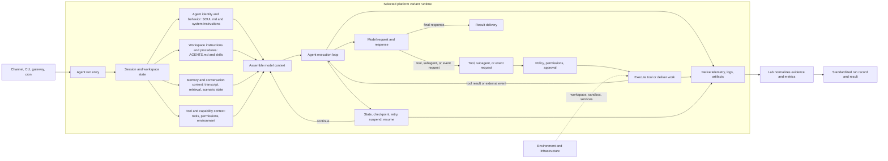
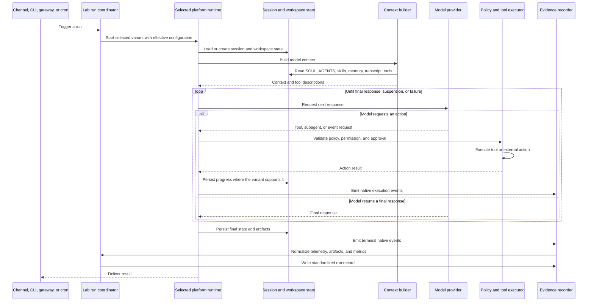

# Agent Harness Lab

## Canonical agent execution model

This is the model Agent Harness Lab will build against. It does not prescribe a
framework or claim every platform implements every box. It defines the work an
agent execution may need to do, the boundaries we must observe, and the places
where platform choices become experimentally meaningful.

<!-- agentlab:reference-code-map-steps -->

## Normal tool-using turn

## Platform mapping contract

Every platform variant will get its own diagram using this same shape. Its map
must answer these questions for every applicable stage:

| Question | Why it matters |
| --- | --- |
| Which module or service owns this stage? | Keeps framework-specific code out of shared layers. |
| What enters and leaves it? | Makes context, state, and side effects inspectable. |
| What is persisted here? | Defines restart and recovery behaviour. |
| What failures can occur here? | Defines meaningful experiments and chaos injection. |
| What telemetry is emitted here? | Lets the Lab compare evidence without erasing native detail. |
| Is the capability absent, partial, or intentionally delegated? | Prevents false equivalence between platforms. |

The platform page will not claim that its internal call graph matches this exact
diagram. It will map each responsibility to that platform's real design. A
Temporal variant may make durability central. Anesu owns its own execution
and recovery choices outside this repository. Its computer environment may affect
context and tool execution without being the execution loop itself.

## What is shared and what is replaceable

| Shared Lab responsibility | Replaceable platform implementation |
| --- | --- |
| Run manifest and standardized evidence | Temporal history, LangGraph trace, SDK trace, custom logs |
| Scenario contract and graders | Agent graph, SDK agent, direct loop, workflow activity |
| Experiment and failure specification | Platform-specific fault hook or infrastructure fault |
| Normalized telemetry adapter | Platform-native observability integration |
| Anesu environment contract | Local workspace process, container sandbox, VM / remote computer |
| Backend deployment profile | Service/worker topology, persistence, networking, secrets, and observability |

This is the boundary we should protect as implementation begins. Shared Lab code
defines experiments and evidence. Platform code owns the mechanics of running
an agent under those conditions.
