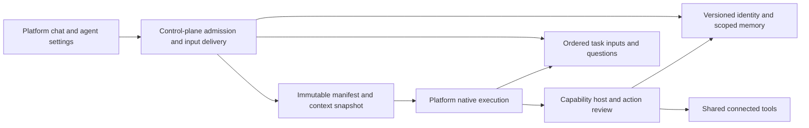

# Agent identity, memory and live interaction

This layer gives general backend agents shared identity and explicit memory while
preserving each platform's native execution. It does not implement an agent
filesystem, autonomous persona rewriting or automatic memory extraction.

## Context and storage ownership

`capabilities/agent-state` stores validated identity revisions, memory records and
mutation receipts in an atomic JSON snapshot. A known-process lock serializes
writers. Memory corrections require an expected revision. Retrying an operation
ID with identical content returns its recorded result; conflicting reuse fails.
Forget writes a tombstone, preventing resurrection through reuse of the old ID.
A malformed snapshot fails closed rather than silently resetting state.

Admission freezes identity into the session's system instruction. Later turns
retain it even after an editor change. Memory is separately projected at each
new turn and retained before dispatch, so admission retries use the same recall.
Its user-role context explicitly declares it untrusted data with no authority.
The projection defaults to 12 KiB and 12 records, including at most 4 KiB of
preferences, with lexical fact matching and stable ties. Context budgeting counts
that content, and compaction preserves the current projection.

Workspace chats use `workspace-local`. Comparison IDs, or experiment IDs when no
comparison is supplied, produce hashed isolated namespaces. Recorded session
namespaces cannot be changed by a subsequent request. Native memory tools resolve
the namespace and enabled state from the immutable run manifest, never model
arguments. Each write derives its operation ID from the native tool-call identity.
Memory does not grant connected tools, credentials or execution permission.

## Input lifecycle and side effects

`capabilities/interaction` stores ordered inputs and matched questions per run.
An input transitions from accepted to delivered to consumed, or to rejected if the
task ends first. Delivery can be retried; a wake-up is not proof of consumption.
Stable input IDs reject conflicting content. Consumption records an immutable
boundary receipt. Clarification replies address one exact pending question and
turn, rather than whichever question happens to be visible after a restart.

The control plane sends bounded native wake-ups and reconciles pending delivery.
The native execution reads inputs at safe boundaries through authenticated host
routes. It applies live instructions after completed tool results, preserving
provider message ordering. Consumed inputs are copied into canonical conversation
history before final settlement; request snapshots already sent to the model stay
unchanged. UI polling does not own task execution.

Steering serializes with hosted tool dispatch. Pending, approved-but-undispatched
and expired proposals are conservatively cancelled; an already dispatching call
is preserved. A queued steering input blocks a fresh hosted invocation until the
native execution processes it. The dispatch lock covers authorization and starting
the operation, and releases before external I/O completes. This prevents a new
instruction from retrospectively cancelling a confirmed external effect. Unknown
write outcomes keep the existing reconciliation rules and are not retried blindly.

`ask_user` is a catalog capability intercepted by each native runtime using its
source identity. It suspends execution rather than running a long HTTP request.
Identity, memory and instructions cannot bypass invocation approval.

## Native execution boundaries

| Platform | Clarification and live input boundary |
| --- | --- |
| Temporal | Signals wake the retained Workflow; conditions and recorded Activities preserve the question and consumption state. |
| Restate | Shared handlers resolve journaled promises; retained named actions preserve question and boundary receipts. |
| LangGraph | SQLite checkpoints retain interrupts, pending questions and input identity; resume continues the original graph. |
| Mastra | Installed durable-agent suspend/resume APIs retain the question and native run. Model transport boundaries apply steering before another model result is consumed. |
| Vercel Workflows | Retained Workflow steps and revision-specific native hooks resume the original execution. Local World durability has the existing local storage and process-host limits. |

Normal chat admits a bounded sustained task when native interaction is available.
Explicit execution settings remain recorded controls. Deadlines and cancellation
close pending questions and inputs. Confirmed tool results and mutation receipts
remain durable, and native replay reuses their recorded outcomes.

## Limits and verification

This is local single-workspace persistence, with one API delivery owner. It is not
multi-user authorization, a cross-host lease system or a guarantee of exactly-once
provider writes. Forgetting removes future recall, not historical run artifacts.
User instructions guide explicit memory saving; they are not a semantic proof that
every model will obey that policy. Hosted durability, embeddings, background
consolidation and agent-edited identity are deferred.

The [fictional acceptance scenario](../../lab/scenarios/agent-identity-memory-interaction/README.md)
records cross-platform recall, clarification, proposal supersession, fresh approval
and independently read final state. Deterministic lifecycle checks distinguish
runtime behavior from real-model choices. The exact free model's catalog and
observed request routing are retained; failed trials remain evidence.
