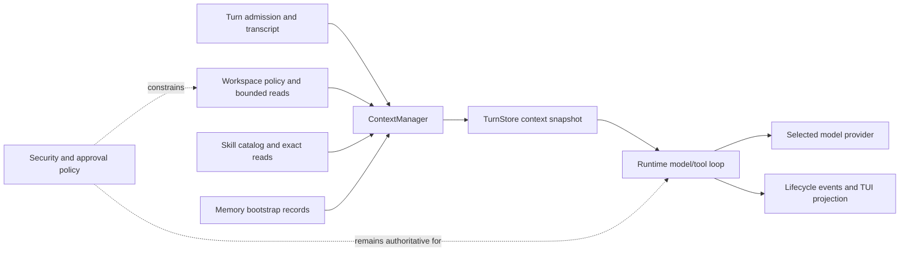

# Anesu context management

Context Management is the Anesu module that decides the bounded model input for one
turn. It owns source selection, ordering, labelling, budget accounting, compaction,
snapshot projection, and context-specific evidence. It does not own authority: security
policy, approvals, tools, providers, and side effects remain in their existing modules.

## Ownership and flow



The source order is deterministic: configured system instruction, root workspace
resources, compact skill summaries, bounded user/workspace memory, transcript history,
the current prompt, and runtime-owned tool definitions. Workspace, skill, memory, and
transcript content is model input, not policy. Tool definitions describe available
interfaces but do not authorize their use.

## Turn lifecycle

1. The runtime admits a turn and reads canonical transcript state.
2. `ContextManager.prepare` resolves approved sources, applies bounds and redaction,
   assembles messages, and creates an immutable snapshot projection.
3. `TurnStore.writeContextSnapshot` publishes bounded evidence before the first
   provider request. The request body remains in memory; evidence stores hashes,
   identities, ordering, sizes, and decisions.
4. The runtime records `ContextPrepared`, any preflight compaction, and pressure before
   `ModelRequested`.
5. Provider retries reuse the prepared prefix. Later tool rounds use request-local
   projections and may omit only complete older tool exchanges.
6. A provider context-window rejection before output permits one deterministic recovery
   revision that omits optional context groups without rereading them. The predecessor
   snapshot is archived and the replacement is published as a new revision. A second
   rejection is terminal; the original request is not retried unchanged.

## Persistence and recovery

Each turn stores:

```text
turns/<turn-id>/
  context.json
  context-revisions/<prior-snapshot-id>.json
  compaction.json
  events.jsonl
```

The active snapshot links to its immediate predecessor. Publication is an at-least-once
evidence boundary: an identical retry is a no-op, a staged archive is verified, and a
missing companion compaction record is completed. Canonical source and compaction
digests make the evidence independent of JSON object-key ordering. Restart validates the
snapshot and revision chain before classifying a non-terminal turn, and never replays a
provider request or side effect.

## Deliberate first-slice limits

The current slice uses a conservative UTF-8 estimate when no provider tokenizer is
available, reports an unknown provider context window, uses a deterministic bounded
transcript summary rather than a model-generated semantic summary, and permits one
provider-overflow recovery revision. Provider-specific tokenizers, semantic summaries,
retention policy, runtime-level compaction fault injection, broader crash/race testing,
and additional manual acceptance remain recorded in the [Anesu context-management plan](../../development/implementation-plans/anesu/completed/anesu-context-management.md).
