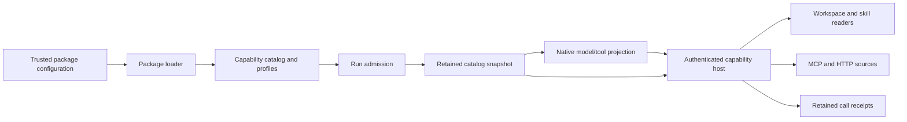

# Extensible agent capabilities

Capability packages supply tools and procedural skills to native agents. A
trusted profile selects package contributions; admission retains the exact
catalog. The agent chooses operations through its platform's model/tool mechanism.
The capability host executes configured sources and records each call.

This extends the existing [capability and approval boundary](platform-capabilities.md).
The design follows [source research on Waku, Pi, Hermes, MCP and Agent Skills](../research/extensible-agent-capabilities.md).
Those reference systems informed the boundaries; their permissions and execution
guarantees are not claims about this implementation.

## Decisions and supported platform boundary

The shared host is chosen because the Lab has both Python and TypeScript workers.
Separate clients in every language would duplicate source implementations and
connection behaviour. The host adds a service dependency and authenticated internal
transport, while each platform retains reasoning, tool selection and native execution.
Local built-ins can still execute directly.

Package provenance identifies declarative contributions separately from executable
plugins. Existing profile resolution owns grants and approvals. Source adapters
use the existing connection result/attempt contracts for transport evidence; they
do not introduce another permission system.

| Platform baseline | Model-facing declarations | Source invocation | Native evidence |
| --- | --- | --- | --- |
| Mastra | SDK tools generated from catalog schemas | Native SDK tool handler calls the host | SDK steps, correlated tools and retained model observations |
| LangGraph | Serialized schemas validated by Python | Graph tool node calls the host | Graph events, checkpoints and correlated tool results |
| Temporal | Pure projection from the admitted snapshot | Activity calls the host; no workflow network I/O | Workflow state and Activity lifecycle |
| Restate | Projection from the admitted snapshot | Durable action calls the host | Journal/action lifecycle and run state |

This table defines the four integration targets. Their acceptance evidence is
recorded separately; registration alone is not proof that a task succeeded.
Other platform variants are not declared compatible with hosted packages until
their adapters are implemented and verified.

## Ownership and flow

`server/src/capabilities/extensions/packages.ts` owns configuration loading.
`CapabilityCatalog` owns trusted profile resolution. `RunService` admits the run
and retains its manifest. Platform adapters project selected descriptors into
native declarations. Temporal executes I/O through Activities, Restate through
durable actions, Mastra through SDK tools and LangGraph through its Python tool
node. No shared implementation replaces their native agent loops.

The host is a source executor. It reads the run manifest, verifies the catalog
revision and turn identity, matches the source binding and schema, then repeats
argument validation and policy checks. The browser and model cannot submit new
endpoints, credentials, filesystem roots or executable handlers.

## Contributions and authority

A package has a safe ID, exact version and configured source. Workspace and skill
sources use trusted roots. MCP sources discover tools from a configured endpoint.
HTTP sources declare specific methods, paths and input schemas. A package can
contribute several operations. Profiles can explicitly compose package IDs;
there is no implicit all-packages grant.

The snapshot contains model-facing definitions, source ID/version/digest, routing
identity and failure policy. Private roots, endpoints and credential values stay
in server-owned configuration and closures. Provider-compatible aliases retain
the original source routing identity. Duplicate aliases are rejected.

Admission freezes the catalog used by a run. A package reload supplies new
admissions; an older run cannot silently dispatch against changed source/schema
identity. MCP tools are checked against current discovery before invocation.
Skill instructions and resources are checked against their admitted digests.
Changing a workspace root changes its opaque source digest.

Write and external tools require explicit approval through the existing policy
resolver. A skill's Markdown, frontmatter or resource cannot supply that approval.
Generic schema validation uses JSON Schema 2020-12 or declared draft-07 without
coercion, defaults or remote reference loading. Resource-specific checks enforce
additional path and edit invariants.

## Skill and workspace lifecycle

The example `workspace-agent` profile combines five workspace operations and
three skill operations. Skill metadata is available without adding every body
to model context. The model can list procedures, load one `SKILL.md`, then read
the particular resource it needs. Loaded results retain package identity and
digest. Skill scripts are returned as source text; no script executor is implied.
Binary assets use bounded base64, while text uses UTF-8.

Workspace tools list, read and search files, then create or patch scoped output
files. Existing-file replacement requires the previously observed digest. Patches
require an unambiguous match. Local mutations serialize within that package
instance, and file replacement uses a temporary file and rename. This is not a
distributed lock against unrelated processes changing the directory.

Session isolation is optional. The example freezes a template limited to 256
files, 256 directories and 10 MiB, rejects links and special files, then publishes
one clone per host-admitted session identity. Follow-ups keep that clone. Other
sessions use separate directories. An ownership marker records the template and
package revision. A revised template requires a new session instead of overwriting
an existing session's work. The default operates on the configured workspace.

Path and symlink checks provide application confinement. They do not substitute
for a container or operating-system sandbox.

## Calls, interruption and evidence

Workers authenticate to `/internal/capabilities/execute` using a private configured
key file. The local default is `lab/runs/.capability-host.key`; the host creates
it with private permissions. Credentials are not included in run manifests or
model declarations.

Before executing a source operation, the host reserves the run/tool-call identity
under `artifacts/capability-calls/`. The fingerprint includes the catalog revision,
turn and complete call. Concurrent duplicates share the in-flight result. A
completed retained receipt replays its result; a conflicting fingerprint is
rejected. A pending receipt after interruption returns unknown and does not
repeat the operation. Receipt persistence can therefore prevent redispatch while
still leaving an uncertain external outcome. It is not an exactly-once guarantee.

Known tool failures retain correlated corrective feedback where the admitted
policy allows it. Connected write calls with a lost response or post-dispatch
timeout/cancellation return unknown and do not retry automatically. HTTP success
with a malformed declared output is recorded as a failure. MCP execution errors
retain `isError`, content blocks and structured content rather than turning every
reply into successful text. Native events, trajectory and metrics remain alongside
the source receipts.

The implemented MCP boundary covers configured legacy initialization and modern
request metadata, paginated discovery and bounded request/result handling. It is
not a full implementation of every MCP extension. Sampling, interactive elicitation,
subscription-driven inventory refresh, arbitrary stdio servers and task execution
require separate support. HTTP operations use same-origin configured paths; GET
arguments become query values and other methods use JSON bodies.

## Operational limits

Native workers need access to the host URL and the configured private key. This
local shared-user setup does not establish a multi-tenant deployment boundary.
There is no arbitrary executable plugin loader, marketplace installation or
automatic OAuth onboarding in these package sources. Larger native capabilities
such as terminal or browser execution can be added through a new source adapter
without redefining profiles or tool-call semantics.

Use the [package guide](../guides/capability-packages.md) for runnable setup and
the [local module notes](../../server/src/capabilities/extensions/README.md) for
implementation ownership.
