# Repository map

This map explains the responsibility of each top-level directory. The repository tree
shown in the web application is generated from the files that exist on disk. The
short description for a directory comes from its nearby `README.md` when one exists.

```mermaid
flowchart TD
  Root[Agent Harness Lab]
  Root --> Apps[apps\nuser-facing applications]
  Root --> Docs[docs\narchitecture and contributor guidance]
  Root --> ComputerNative[computer-native\nextraction-ready agent harness]
  Root --> Integrations[integrations\nLab-side external adapters]
  Root --> Platforms[platforms\nbackend platform implementations]
  Root --> Scenarios[scenarios\nreusable workloads]
  Root --> Experiments[experiments\nfailure and comparison protocols]
  Root --> Server[apps/lab-server\nFastify control plane]
  Root --> Contracts[contracts\nversioned Lab seams]
  Root --> Deployments[deployments\nbackend topology]
  Root --> Runs[runs\ndurable experiment evidence]
  Root --> Tests[tests\nshared behavioural checks]
```

## Top-level responsibilities

| Directory | Responsibility |
| --- | --- |
| `apps/` | The React/Vite web application and Fastify Lab server. |
| `computer-native/` | Temporary standalone Computer Native project, structured for later repository extraction. |
| `integrations/` | Lab-side adapters for independently runnable systems. |
| `docs/` | Architecture, concepts, guides, research notes, and decision records. |
| `platforms/` | Backend platform integrations, compositions, variants, and platform-specific agent definitions. |
| `scenarios/` | Workloads that can be executed across compatible harnesses. |
| `experiments/` | Hypotheses, controls, fault injection, and analysis procedures. |
| `contracts/` | Versioned run, event, artifact, result, and runner-protocol contracts. |
| `deployments/` | Shared and platform-specific backend deployment profiles. |
| `runs/` | Generated run records and artifacts. Generated contents are ignored by Git. |
| `tests/` | Contract and integration tests that cross implementation areas. |

Scenarios and experiments describe work and tests. Computer Native operates within the
computer host selected for a run without carrying a separate environment-adapter tree.
Backend platform implementations declare a backend deployment profile and required
services. The Lab server coordinates a run and records evidence; it does not own a
platform's reasoning loop.
