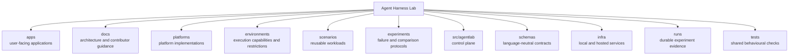

# Repository map

This map explains the responsibility of each top-level directory. The repository tree
shown in the web application is generated from the files that exist on disk. The
short description for a directory comes from its nearby `README.md` when one exists.

## Top-level responsibilities

| Directory | Responsibility |
| --- | --- |
| `apps/` | Applications that present or expose laboratory data. |
| `docs/` | Architecture, concepts, guides, research notes, and decision records. |
| `platforms/` | Platform integrations, compositions, harness variants, and their platform-specific agent definitions. |
| `environments/` | Capabilities and restrictions surrounding a running harness. |
| `scenarios/` | Workloads that can be executed across compatible harnesses. |
| `experiments/` | Hypotheses, controls, fault injection, and analysis procedures. |
| `src/agentlab/` | Generic control-plane code such as the runner, registry, telemetry, and storage interfaces. |
| `schemas/` | Canonical run, event, configuration, and result schemas. |
| `infra/` | Services and deployment support needed by selected experiments. |
| `runs/` | Generated run records and artifacts. Generated contents are ignored by Git. |
| `tests/` | Contract and integration tests that cross implementation areas. |

Scenarios and experiments describe work and tests. Platform integrations and harness
variants provide the runtime that performs the work. A harness variant declares its
compatible environment variants and required infrastructure without absorbing those
reusable implementations into its directory. The common control plane coordinates a
run and records evidence. It does not own a platform's reasoning loop.
