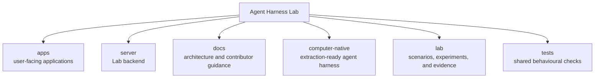

# Repository map

This map explains the responsibility of each top-level directory. The repository tree
shown in the web application is generated from the files that exist on disk. The
short description for a directory comes from its nearby `README.md` when one exists.

## Top-level responsibilities

| Directory | Responsibility |
| --- | --- |
| `apps/` | The React/Vite web application. |
| `server/` | Lab server: shared agent host, reusable capabilities, platform variants, contracts, and deployments. |
| `computer-native/` | Temporary standalone Computer Native project, structured for later repository extraction. |
| `docs/` | Architecture, concepts, guides, research notes, and decision records. |
| `lab/` | Scenarios, experiments, and generated run evidence. |
| `tests/` | Contract and integration tests that cross implementation areas. |

Scenarios and experiments describe work and tests under `lab/`. Computer Native operates
within the computer host selected for a run without carrying a separate
environment-adapter tree. Backend platform implementations under `server/src/platforms/`
declare a server deployment and required services. The Lab server coordinates a
run and records evidence; it does not own a platform's reasoning loop.
