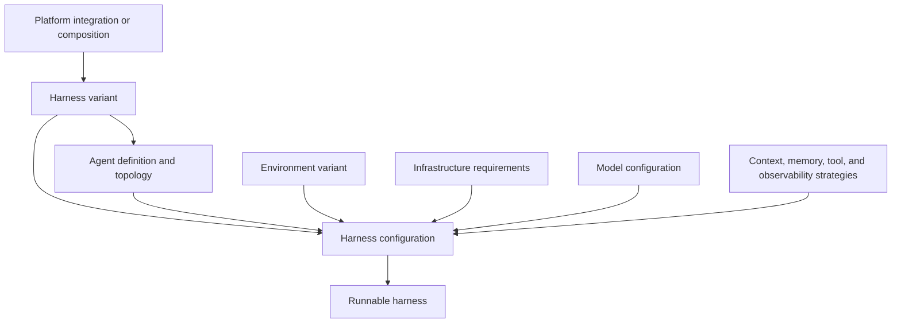
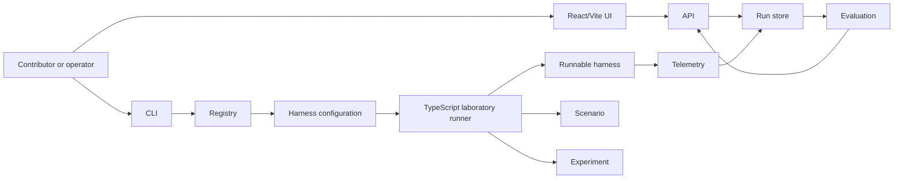

# System overview

The laboratory has one control plane and several replaceable implementation areas.

## What makes a runnable harness

A platform alone is not a harness. A harness configuration selects a harness variant,
one of its agent definitions, an environment variant, required infrastructure, a
model, and the context, memory, tool, and observability strategies needed for that
run. Some choices may use platform-native behaviour. Others may come from shared lab
code or another platform in a composition.

Agent definitions stay local to their harness variant because their construction uses
platform-specific concepts. Scenarios remain separate. A single-agent LangGraph
definition and a supervisor-with-subagents LangGraph definition could both run the
same research scenario.

The platform directory owns the platform integration and its harness variants. An
environment and an infrastructure service remain reusable even when the interface
shows them under a platform for easier inspection. The harness variant declares which
combinations it supports and which combinations have actually been tested.

## How the laboratory runs it

The command-line interface selects a harness configuration, scenario, and experiment.
The registry resolves and validates that combination. The runner creates the run
context, chooses the execution mode, supervises lifecycle events, and starts the
runnable harness. Telemetry and the run store record what happened. Evaluation reads
the recorded evidence and produces metrics. The API exposes recorded data to the web
application.

The main flow is:

CLI -> registry -> harness configuration -> runner -> harness
runner -> telemetry -> run store
run store -> evaluation -> API -> web application

The control plane must not implement a platform's reasoning loop. A harness must not
decide how the laboratory names or stores every run. The common interfaces are the
seams between those responsibilities.

The first vertical slice should use one platform-based harness variant, one agent
definition, one environment variant, its required infrastructure, one scenario, one
experiment, and a read-only run viewer. That slice will test the structure before the
repository grows.
