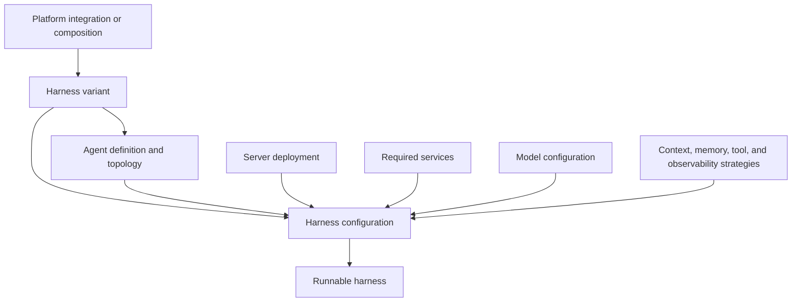
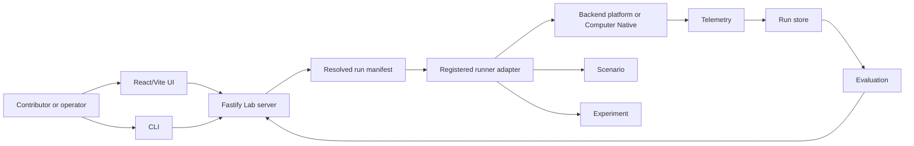

# System overview

The laboratory has one server and several replaceable implementation areas.

## What makes a runnable harness

A platform alone is not a runnable implementation. A backend-platform configuration
selects a variant, agent definition, backend deployment profile, required services,
model, and the context, memory, tool, and observability strategies needed for that run.
Computer Native receives a resolved Lab run through an integration seam and operates
within the selected computer host without a dedicated environment-adapter subtree.

Agent definitions stay local to their harness variant because their construction uses
platform-specific concepts. Scenarios remain separate. A single-agent LangGraph
definition and a supervisor-with-subagents LangGraph definition could both run the
same research scenario.

The platform directory owns backend-platform integrations and their variants.
`computer-native/` owns the computer-native runtime, while
`server/src/integrations/computer-native/` owns only the Lab-facing adapter. Backend variants
declare which deployment profiles and service combinations they support.

## How the laboratory runs it

The UI or command line selects an implementation, scenario, and experiment. The Lab
server resolves and validates that combination, creates an immutable run manifest,
dispatches to the selected runner, and records evidence. The runner may be a backend
platform service or Computer Native through its integration adapter. Evaluation reads
the recorded evidence and produces metrics.

The main flow is:

UI or CLI -> Lab server -> resolved run manifest -> runner adapter -> implementation
implementation -> telemetry -> run store
run store -> evaluation -> Lab server -> web application

The server must not implement a platform's reasoning loop. A harness must not
decide how the laboratory names or stores every run. The common interfaces are the
seams between those responsibilities.

The first vertical slice should use one platform-based harness variant, one agent
definition, one environment variant, its required infrastructure, one scenario, one
experiment, and a read-only run viewer. That slice will test the structure before the
repository grows.
