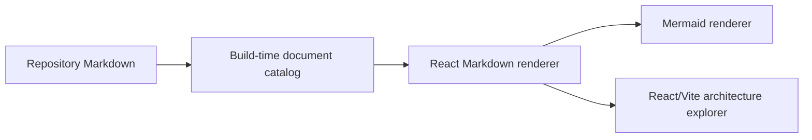

# UI and documentation

The planning UI uses the repository's Markdown files as its documentation source. It
does not maintain a second copy of the architecture in frontend source code.

The initial interface has a persistent application sidebar and a small set of core
application destinations:

- **Overview:** the application home. It reports what is available without inventing run data before the execution layer exists.
- **Coverage:** an expandable implementation map that traces platforms and layered compositions through harness variants, agent definitions, environments, infrastructure, strategies, core capabilities, scenarios, experiments, and evidence.
- **Runs:** the future home for concrete executions and their evidence.
- **Experiments:** the future home for hypotheses, variables, controls, and failure conditions.
- **Platforms:** the future home for the isolated platform implementations.
- **Scenarios:** the future home for canonical workloads.
- **Docs:** a conventional documentation view with its own document navigation on the left and a reading column on the right.

The application sidebar is the stable navigation layer. Docs is pinned at the bottom
as the reference destination, not used as the layout for the whole application.
Architecture and repository mapping remain available from the overview and the
documentation set while the primary sidebar stays focused on the platform's work.
The documentation view uses a second navigation column because document navigation
and application navigation answer different questions.

The coverage feature uses a typed catalog rather than Markdown because its statuses,
relationships, and checklist gates must be validated and filtered as structured data.
This does not replace the documentation source: coverage entries link to the Markdown
documents and run evidence that justify a claim. Missing assessment means not assessed,
and verified status requires every checklist gate plus linked evidence. The first
version is deliberately read-only so status changes remain inspectable in source control.

The frontend uses a browser-history route tree rather than a custom hash router. The
route composition is kept in `apps/web/src/routes/router.tsx`; layout modules render
shared chrome and nested outlets, while feature page modules own page-level behavior.
This keeps routing declarative without making `App.tsx` or an application shell a
large switch statement. The static host must provide an `index.html` fallback for
client-side paths.

The styling system uses the same split as the dashboard reference. Tailwind and
shadcn-compatible primitives provide reusable classes, while CSS variables in
`apps/web/src/app/theme/theme.css` define the values that pages consume. The theme
provider owns light, dark, and system mode. The preference store owns accent, density,
and interface settings. Pages should consume tokens rather than hard-code theme
colours.

Markdown stays useful outside the application. Contributors can read it on GitHub,
edit it with ordinary tools, and review changes without learning a documentation
platform. Mermaid diagrams remain text in the Markdown source, so diagram changes are
reviewable as code.

The catalog is generated before the Vite development server or production build. It is
temporary build output and must not become the source of truth. The UI must not execute
harnesses, rewrite run records, or calculate benchmark metrics.
