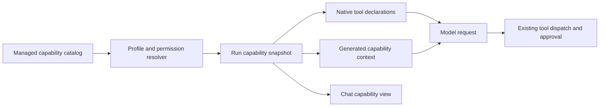

# Agent capability awareness and discovery

Research date: 2026-10-09. This note separates inspected source behaviour from a proposed laboratory design. It concerns general backend agents. Filesystem access remains an optional adapter, with no requirement for an agent to read the host filesystem.

## Recommendation

Generate each agent's capability context from its resolved configuration, and use the same records to build its callable tool declarations and the UI's capability summary. Keep selected-profile authority separate from workspace installation. For a small authorized catalog, supply all usable tool schemas directly. Add search and deferred activation when measured catalog size warrants them, with a real change to subsequent model requests rather than a description-only search result.

An earlier chat correctly described the selected Local safe fixture tools, but could not answer approval policy reliably. A later attempt used Notes acceptance while its Memos connection was unavailable; the request failed before the model ran. These observations distinguish model awareness from run admission: a visible connection or stale UI label does not establish that the run actually received that tool schema.

## What the primary sources establish

### MCP discovers tools for the host

The supported `2025-11-25` specification defines paginated `tools/list` responses with names, descriptions and input schemas. Invocation uses `tools/call`. Servers that advertise `tools.listChanged` can send `notifications/tools/list_changed`; the client must fetch the changed inventory. Tool annotations are untrusted unless the server is trusted. MCP explicitly permits different interaction designs. Its discovery protocol does not itself define how this lab must choose a model's tool set. [MCP tools specification, 2025-11-25](https://modelcontextprotocol.io/specification/2025-11-25/server/tools).

Therefore, connecting a server should populate the host catalog. A separate resolver decides which discovered definitions the agent may use. The `2026-07-28` specification is a different protocol era; its inventory behaviour must be checked separately before implementing compatibility. This recommendation pins legacy notification semantics and does not claim support for every current MCP mechanism.

### Waku supplies executable schemas on every model request

At source revision `24b4cbb6d065e2cf31ca1ec0832918a1d1c08b01`, Waku's registry stores each tool's name, description, input schema and callable implementation. `schemas()` projects those definitions; `execute()` dispatches by registered name. [Waku tool registry](https://github.com/ShenSeanChen/waku-agent/blob/24b4cbb6d065e2cf31ca1ec0832918a1d1c08b01/waku/tools/registry.py).

Its agent loop passes `tools.schemas()` to both streaming and ordinary model requests. It then executes model-selected calls and appends their results before requesting another response. That demonstrates the critical connection between what the model sees and what the runtime executes. [Waku agent loop](https://github.com/ShenSeanChen/waku-agent/blob/24b4cbb6d065e2cf31ca1ec0832918a1d1c08b01/waku/loop/agent.py).

### Pi distinguishes registration from model exposure

At revision `a276dabe57911253350bffb93cb7d7aff6a73261`, Pi separates tool registration, active declarations and exposure modes. Direct tools are declared while active; deferred tools can be found and activated through tool search. A loader can call `setActiveTools()` for tools already registered. Pi records tool and prompt changes before the next model request. It also exposes namespace descriptions and longer namespace instructions separately. These are useful design examples, not portable MCP requirements. [Pi extension contracts](https://github.com/earendil-works/pi/blob/a276dabe57911253350bffb93cb7d7aff6a73261/packages/coding-agent/docs/extensions.md).

Pi advertises skill names, descriptions and locations at startup, then loads full instructions when relevant. It supports explicit skill activation when model selection fails. This is a useful behavioural model even though Pi's file-read activation mechanism differs from this lab's backend environment. [Pi skills documentation](https://github.com/earendil-works/pi/blob/a276dabe57911253350bffb93cb7d7aff6a73261/packages/coding-agent/docs/skills.md).

Pi's current documentation describes the same separation in user-facing terms: the runtime advertises skill names/descriptions, then loads full instructions on demand, while an extension registers executable tools with a model-facing name, description, schema and implementation. This supports keeping skills as progressive instructions and tools as registered callable operations. [Pi skills](https://pi.dev/docs/latest/skills), [Pi extensions](https://pi.dev/docs/latest/extensions).

### Agent SDKs attach tools to the configured agent

The OpenAI Agents SDK models an agent as instructions plus an explicit tools collection. Its MCP adapter exposes remote server tools alongside ordinary function tools and keeps original server/name bindings when projecting safe model-facing names. Responses-backed tools can opt into deferred loading, but that mechanism is provider-specific. This is further evidence that a connection catalog does not become agent capability merely by existing: the runtime resolves and attaches the permitted tool definitions to the model request. [Agents SDK concepts](https://openai.github.io/openai-agents-python/), [MCP integration](https://openai.github.io/openai-agents-python/mcp/), [tool search](https://openai.github.io/openai-agents-python/tools/).

### Anthropic offers deferred tool declarations

Anthropic's tool search design marks definitions with `defer_loading`; search returns references that expand into actual definitions in model context. The search step adds latency, so the vendor recommends it especially for larger catalogs and substantial schema token cost. Its published performance results are vendor-specific benchmarks, not evidence for our models or platforms. The API mechanism is provider-specific, although separating discovery from active declarations is a reusable idea. [Anthropic advanced tool use](https://www.anthropic.com/engineering/advanced-tool-use).

### Agent Skills use progressive disclosure

The format specifies metadata first, full `SKILL.md` instructions on activation, and supporting resources when needed. Scripts and references are package content; their presence does not supply an execution environment. `allowed-tools` is experimental and varies by implementation. [Agent Skills specification](https://agentskills.io/specification).

The integration guide supports a dedicated activation tool when agents cannot read files. It recommends filtering the disclosed catalog by availability, bounding valid activation names, tracking activations and retaining active instructions through context compaction. An API or bundled registry can provide discovery for cloud agents. These recommendations fit our backend agents without introducing native filesystem access. [Agent Skills integration guide](https://agentskills.io/client-implementation/adding-skills-support).

## Proposed provider-neutral design

The following is a laboratory recommendation inferred from the sources, not a claim that these mechanisms are already implemented.

### Model awareness has several distinct states

| State | Meaning | Model-facing treatment |
| --- | --- | --- |
| Installed in workspace | The host knows this connection or package. | Do not imply this agent can use it. |
| Authorized and active | The run may invoke it and its schema is in the current model request. | Declare its real name, description and parameters. |
| Authorized and deferred | The run may discover and load it, but its schema is not active yet. | Advertise the namespace and search/activation mechanism. |
| Requires connection or account recovery | Configuration exists but live execution is unavailable. | Report status honestly through capability inspection. |
| Outside selected profile | Current authority does not grant access. | Do not expose it as callable or let search enable it. |

Generate a compact context section containing the selected profile, enabled namespaces, skill metadata, discovery instructions and runtime limitations. Derive service descriptions and operation summaries from trusted package metadata and resolved tool descriptions. Do not maintain a second hand-written list such as “this agent has calculator and lookup.” Tool schemas remain the source for names and parameters.

Keep generated capability context separate from persisted user instructions. Store its snapshot or version with the run. This avoids changing the user's instruction identity whenever a connection or capability presentation changes.

### Small catalogs should work without a search round trip

Begin with eager declarations for all tools authorized by the chosen profile, plus generated skill metadata. This supports tool-capable free models through existing native adapters. Decide the eager/deferred boundary using schema token estimates and actual selection behaviour, rather than an arbitrary universal tool count.

Provide a capability-inspection operation when a user or model needs current connection status or an exact enabled-tool list. Its result must distinguish usable operations from connection failures. A connected-account list alone would repeat the original ambiguity.

### Deferred tools require loop integration

For a larger catalog, add a search operation over the run's authorized catalog. Return stable capability identifiers, descriptions and provenance. Loading a result must activate the exact recorded schema and dispatch binding before the next model request. A native adapter can support this through provider-native deferred references or by rebuilding its tool declarations after the loader completes.

Returning an unfamiliar tool name or JSON schema as ordinary prose is insufficient for models that require declared function tools. Conversely, a generic invocation tool with an unconstrained argument object weakens schema guidance. Treat that alternative as a separate experiment, rather than silently replacing typed declarations across all platforms.

Search does not grant access. New grants require a profile/configuration change outside model-controlled search. Existing approval policy still applies after activation. Discovering a write operation must not approve it.

### Skills need a catalog and a callable loader

Include enabled skill names and descriptions in generated context, with stable package references rather than host paths. Retain dedicated skill loading and package-resource reading through the adapter boundary. Return instructions with package provenance and resource identifiers, then read specific references on demand. Loading script content does not execute it. A script that requires a shell or filesystem adapter remains unavailable unless that environment was explicitly configured.

Record activated skills and preserve their instructions through compaction or reconstruct them from pinned content. Deduplicate repeated activations. Skill instruction text cannot expand the run's tool authority.

### Preserve reproducibility while reporting live failures

Freeze package versions, schema hashes, profile grants, advertised skills and initial tool exposure in run evidence. Record later search and activation events and the resulting active set. New workspace catalog revisions should affect new sessions unless an explicit, recorded adoption path is designed.

Connection health is a separate live observation. Credentials can expire, services can stop and access can be revoked during a run. Dispatch must check current authority and return useful failure information without quietly replacing the frozen tool contract. Refreshing MCP inventory should create a new catalog revision; it must not silently substitute changed parameters into an existing run.

## Alternatives and limits

| Approach | Useful property | Cost or limitation |
| --- | --- | --- |
| Eager authorized schemas | Direct typed tool use, fewest additional steps. | Larger catalogs consume context and can confuse selection. |
| Search plus real schema activation | Smaller initial context and inspectable discovery. | Requires native loop integration, persistence and extra model steps. |
| Provider-native tool search | Uses a provider's reference/loading protocol. | Availability depends on provider and model; cannot be the only implementation. |
| Prompt lists of all workspace services | Makes connections visible in prose. | Conflates installation with callable authority and does not register tools. |
| Generic call-by-name gateway | Can avoid changing declarations after search. | Loses per-operation schema guidance unless additional machinery restores it. |

No source guarantees that a model will accurately describe every capability or select every relevant skill. Measure those behaviours with real model traces, alongside deterministic checks that generated context, model declarations, UI and dispatch agree. Capability awareness should improve model decisions while keeping platform-specific behaviour observable.

## Repository audit

These observations concern the inspected code on 2026-10-09, not a new live evaluation.

| Existing boundary | Observed behaviour | Remaining work |
| --- | --- | --- |
| `server/src/capabilities/catalog.ts` | Resolves grants and builds an immutable inventory from the admitted profile, exact tool catalog, approval modes and skill metadata. | Validate the prompt with real models; deferred search remains conditional on measured need. |
| `server/src/control-plane/application/run-service.ts` | Records the profile, resolution, callable catalog and inventory in each new run. | Retain live-model evidence and report stale/unavailable profiles clearly. |
| Native Temporal, Restate, Mastra and LangGraph baseline adapters | Carry the same inventory snapshot into prepared context and project the authorized schemas through native tool declaration paths. | Complete a comparable real-model awareness check per available baseline. |
| `server/src/capabilities/extensions/skills.ts` | Provides skill listing, instruction loading and bounded resource reading; the run inventory adds scoped skill metadata. | Verify that the model actually loads a relevant skill before using it. |
| `server/src/capabilities/context/session-store.ts` | Keeps generated inventory messages in a retained context snapshot, separate from the stored user/system instruction. | Confirm continuation and compaction preserve the admitted inventory in real traces. |
| `server/src/capabilities/context/context-service.ts` | Budgets the generated inventory message and records its revision with the snapshot. | Measure only if context pressure or catalog scale shows eager exposure is costly. |
| `apps/web/src/features/platforms/CapabilityPicker.tsx` | Disables profiles the API marks unavailable; chat details render the admitted run snapshot. | Refresh stale browser state and make unavailable-profile responses visible during live admission. |

The generic baseline instructions already ask agents to use admitted tools and load relevant skills. They do not hardcode a calculator/lookup inventory. Replacing that prompt with another hand-written service list would leave the underlying problem intact.

The Local safe default is a limited fixture configuration. An installed Memos connection does not imply that a chat using that profile receives its CRUD tools. The Notes acceptance profile is currently unavailable because the existing connection summary reports stored credentials unavailable. The page can retain an old selection, so the server must reject admission instead of launching a model with a stale or empty tool set. A typed `CapabilityResolutionError` now returns a `409` response for unavailable or stale profiles; focused HTTP tests cover this path. This does not restore the missing credential or constitute a real-model acceptance run.

## Implementation follow-through

The first implementation slice now derives an inventory from the admitted profile,
selected tool schemas and skill catalog. Its revision includes the exact callable
tool-catalog revision. A generated, budgeted context message carries that summary
through Temporal, Restate, Mastra and LangGraph without changing stored session
instructions. The chat run details display the same retained inventory. The model
still receives each executable tool's actual schema through the platform's existing
tool declaration path.

The remaining work is a real-model capability-awareness acceptance run and review of
its retained evidence. Earlier CRUD and approval runs prove the connected tool path,
but their manifests predate the inventory field and do not validate this feature.
The current Notes profile cannot run until its stored connection credential becomes
available. Deferred search is intentionally conditional: implement it only after
measuring schema-token cost or observing tool-selection failures that eager
declarations do not address. See the standalone
[implementation checklist](../../development/implementation-plans/platforms/active/agent-capability-awareness.md)
for progress and validation evidence.
