# Hermes context lifecycle

A code reading for Context Lab. Start with diagram 1, then follow one branch at a time.

| Snapshot | Value |
| --- | --- |
| Repository | [NousResearch/hermes-agent](https://github.com/NousResearch/hermes-agent) |
| Commit | `ddc0e65958b326a89f6c440c76c812d31ac27e2a` |
| Reviewed | 2026-10-04 |
| Source paths | Relative to a checkout of the pinned repository commit |
| Evidence | Static source inspection; no model calls or live execution |

**Scope:** the Hermes-owned lifecycle, from session history and instructions to model requests, tool feedback, compaction and resumption. Provider runtimes are shown at their boundaries. This is an implementation study, not a claim about summary quality or measured reliability.

## 1. The complete path at a glance

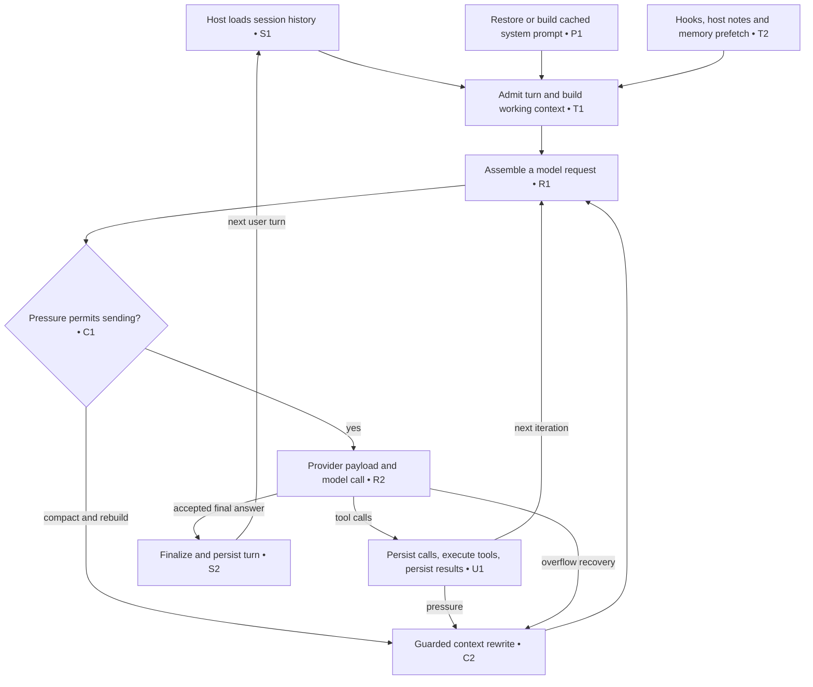

Owners: [S1], [T1], [P1], [T2], [R1], [C1], [R2], [C2], [U1], [S2]. Overflow can also adjust output limits or stop; see diagram 6. A text response can require another iteration through stop gates. The dedicated `codex_app_server` branch replaces the generic model/tool loop; see diagram 9.

## 2. Which object holds the context?

| Representation | What it contains | When it changes |
| --- | --- | --- |
| Durable session | Active message rows, archived rows, system prompt, tool pin and usage/compaction state | Append flushes, prompt writes, guarded compaction |
| Cached system prompt | Instructions, workspace context, skills index, memory snapshot and runtime hints | Initial build, restore, authorized rebuild boundaries |
| Working `messages` | User, assistant, tool and summary rows | Turn setup, repairs, tool feedback, finalization, compaction |
| API messages | Structural copy, replay sidecars, effective system, prefill and selected context | Each request assembly |
| Provider payload | Provider-specific roles, content blocks, tools, reasoning/cache fields | Each transport attempt |

A turn is one incoming user message plus the ensuing model/tool iterations. A request is one model invocation within it. Tool schemas also consume request capacity; they are not ordinary transcript rows. [T1] [R1] [R2]

**Copy boundary:** turn setup copies the history list, but initially shares its message dictionaries. Iteration repairs can modify those dictionaries. Request construction then recursively clones message containers. It is inaccurate to describe the whole caller history as immutable. [T1] [R1]

## 3. System prompt: sources, order and refresh

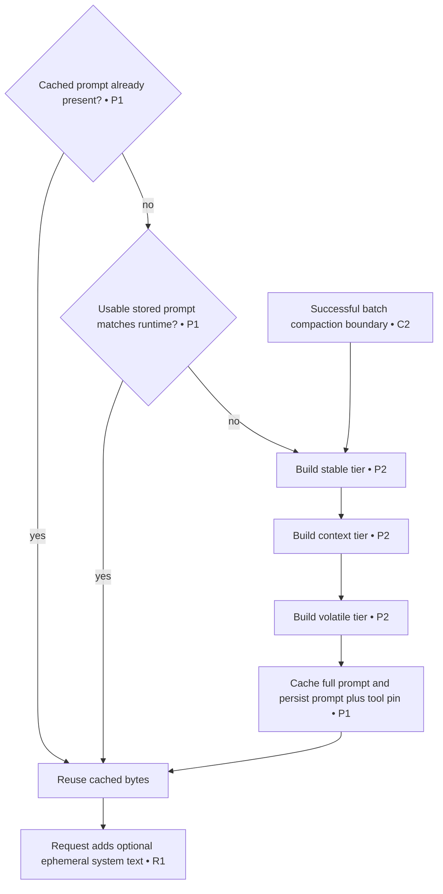

| Ordered tier | Included sources |
| --- | --- |
| Stable | `SOUL.md` identity or default identity; tool/model guidance; gated auto-loaded skills; coding brief |
| Context | Caller `system_message`; selected project instructions; pinned workspace snapshot; workspace-related guidance |
| Volatile | Skills index; built-in memory and user profile; external provider prompt; frozen plugin sections; active profile; date/model/provider/platform; environment hints |

“Volatile” describes likelihood of changing **on rebuild**. It is not re-rendered on every model call. With no workspace block, some trailing coding/platform guidance stays in the stable tier. Auto-loaded skills resolve once per agent lifecycle; the workspace snapshot is pinned by working directory. [P2]

Project instruction discovery uses the first nonempty **type**, in this order: [P3]

Within each AGENTS directory, `AGENTS.override.md`, `AGENTS.md`, then `agents.md` are tried; first nonempty wins. Chain content is deduplicated. Read content is scanned and capped; oversized content retains head and tail with an omission marker. `SOUL.md` is independent. Install-tree fallback instructions are suppressed on surfaces where the launch directory is not a deliberate workspace. `skip_context_files` gates project loading. [P3]

Prompt reuse has exceptions: stale runtime identity triggers rebuilding; Bot Chat capability changes can refresh tools and prompt; ordinary surface switches can preserve prompt bytes and add a tail note. Persisted tools are restored to preserve their order. During normal batch compaction memory is reloaded and prompt/tool definitions refresh; detached hygiene/manual agents may preserve seeded prompt bytes. Plugin rebuild failures can retain the previous section. [P1] [P2] [C2]

### Before the turn: host input preparation

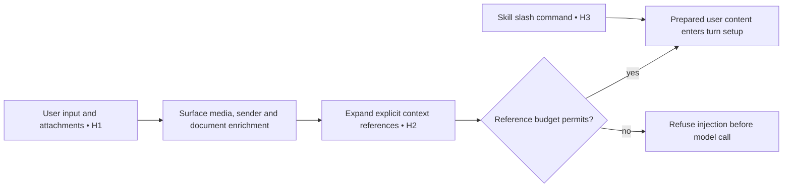

Owners: CLI/gateway preparation [H1], reference expansion [H2], skill rewriting [H3]. This occurs before the core loop. References support files, folders, git/diff, URLs and registered plugin prefixes. Expansion preserves input order, appends attached context and warnings, and checks aggregate estimated tokens: warning above 25% of window, refusal above 50%. Path/read limits can instead produce file metadata or recovery guidance. Gateway quoted reply text is added after expansion so quoted references stay literal. Skill commands inject skill content as user input. [H1] [H2] [H3]

## 4. Once per turn, then once per assembled request

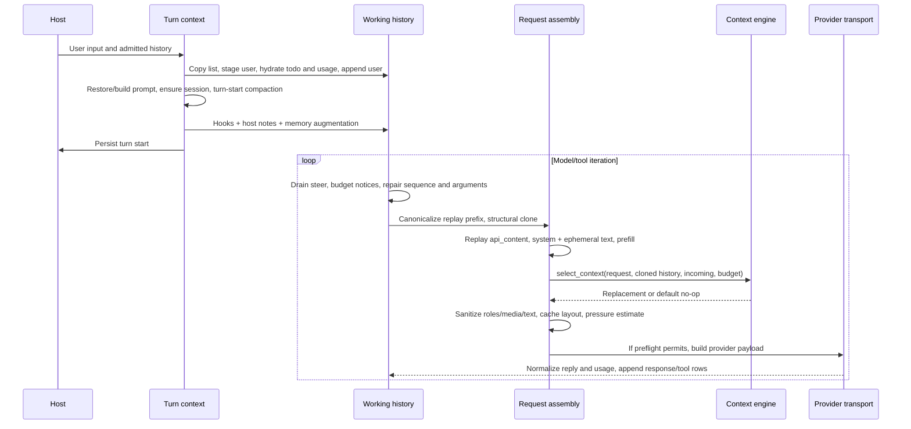

Owners: once-per-turn [T1] [T2]; live repairs [R3]; request assembly [R1]; selection [E1]; wire [R2]; response intake [U2].

For string input, Hermes stamps augmented user text into an `api_content` sidecar, allowing later requests to replay the same injected bytes. Multimodal input gets a durable text part. Inline MoA and app-server paths have different string-sidecar handling. `pre_llm_call` runs once per turn; request middleware and API observation run around transport attempts. [T2] [R2]

Selection is a request-only seam; the default engine leaves it unchanged. The engine receives the actual request list and cloned reference history/input. Invalid replacement or exceptions fail open, but arbitrary in-place writes to that request list are not rolled back. The implementation invokes selection during assembly; transport retries can reuse an already assembled request. [E1] [R1]

Request cleanup includes rejected-thinking suppression, message sanitization, stale tool-image eviction, thinking-only message removal/user merging, whitespace/JSON normalization and surrogate stripping. Pressure includes route-specific payload cost and real-usage anchors where available. [R1]

Normal finalization removes scaffolding, closes the transcript tail, optionally micro-compacts, persists, stores the live snapshot and calls the engine's best-effort `on_turn_complete`. Usage updates occur after responses; engine end/reset/start hooks occur at actual session boundaries. Some abnormal early returns skip completion observation. Engine plugins may add gated tools and own indexes, but the core interface does not guarantee plugin storage durability. [S2] [E2]

## 5. Tool feedback becomes the next context

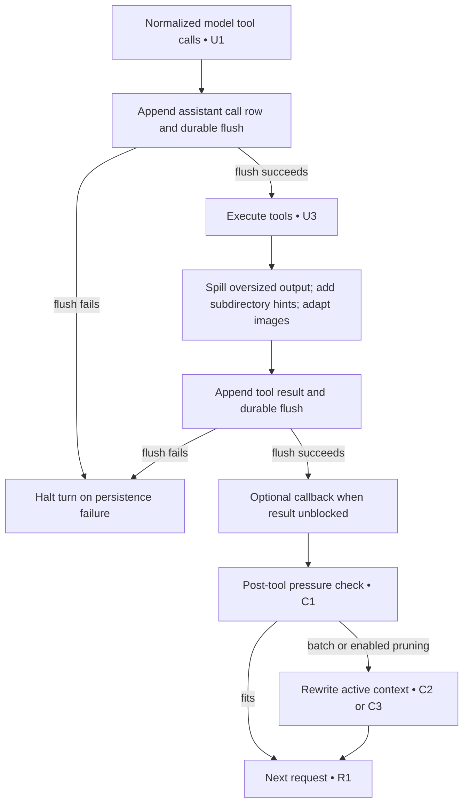

Owners: call admission [U1], result shaping/persistence [U3], pressure [C1], batch [C2], deterministic pruning [C3].

Subdirectory instruction hints enter through tool results, so a file encountered later can add instructions without rebuilding the system prompt. Large output can be represented by bounded text plus a spilled file. Image compatibility can affect stored results; request cleanup can additionally remove stale images. These are different boundaries. [U3] [R1]

Flushing calls before execution establishes an ordering constraint. It does not establish exactly-once execution of external tool side effects after a crash. A stored call and a missing result need recovery policy, not an assumption that the operation never ran. [U1] [S3]

## 6. Pressure and overflow recovery

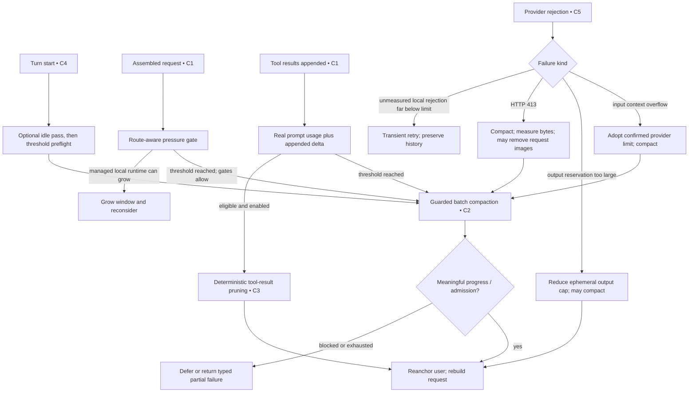

Owners: [C4], [C1], [C2], [C3], [C5]. Gates can skip or refuse compaction: cooldown, insufficient compressible history, ineffective prior passes, lease contention, checkpoint requirements, cancellation and attempt limits. Provider-proven overflow can fail closed before another send. Overflow bypasses the summary failure cooldown, not every breaker. [C2] [C5]

**Threshold accuracy:** raw built-in `threshold=0.50` is not the effective trigger in all cases. Windows below 512,000 raise the ratio to at least 0.75; output reservation, a 64K floor capped at 85% of usable input, absolute/auxiliary caps and model overrides also affect it. Defaults include compression enabled, `max_attempts=3`, in-place storage, lean tail, protected first 3 non-system rows, and configured last 20. Lean tail selection uses a token budget with boundary alignment rather than blindly retaining that row count. [C6]

Idle compaction, proactive pruning and micro-compaction are disabled by default. Gateway hygiene adds a pre-agent safety pass, normally at 85% pressure, with a hard message-count trigger and durable cooldown/in-flight checks. It is a separate host layer. [C4] [C3] [C7] [S4]

## 7. Batch compaction: information and commit path

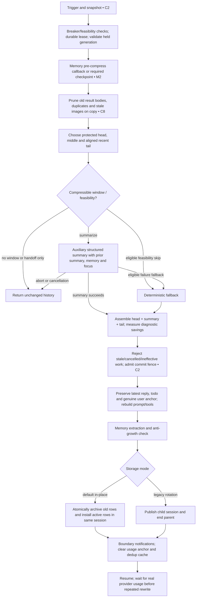

Ownership: host pipeline and durable commit [C2], memory [M2], built-in algorithm [C8]. A plugin engine can replace the built-in prune/partition/summary algorithm; the host still owns admission and storage integration. [E2]

The structured summary records the unresolved user input, goal, constraints, completed actions, active state, blockers, decisions, errors/fixes, resolved questions, files and critical context. Earlier summaries are incorporated; lean mode adds a session log. Sensitive values are redacted. The summary is synthetic checkpoint content, not a new user instruction. [C9]

Summary failure behavior is classified. Some failures abort with original history; eligible nonterminal paths use fallback. There can be a main-model retry, escalating cooldown, alternate auxiliary route and deterministic fallback after repeated stalls. `abort_on_summary_failure` alters fallback policy. Cancellation does not initiate fallback. [C8] [C2]

Small-middle feasibility fallback requires a prior ineffectiveness strike; manual force bypasses that skip. Rough savings are diagnostic: later real provider prompt usage determines effectiveness. [C8]

Before-commit storage failure restores a deep live snapshot and records split-failure cooldown; completed atomic commits are not undone. Timeout handling uses isolated input and a cooperative commit fence. These are source mechanisms, not measured crash guarantees. [C2] [C10]

### The other two local rewrites

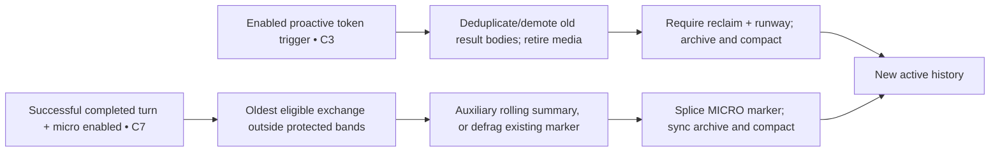

Proactive pruning uses no summary model and has its own regrowth/minimum-reclaim controls. It rewrites durable active history after successful commit. It is distinct from request-only image cleanup. [C3]

Micro-compaction runs at finalization, defaults off, and is disabled by required-checkpoint mode. Stale held history rolls back its candidate. **Generic DB sync failures can leave live and durable context divergent:** the code logs that resume may double-load originals and compacted rows until a later batch pass. It does not have the batch path's full rollback behavior. [C7]

### Manual compression

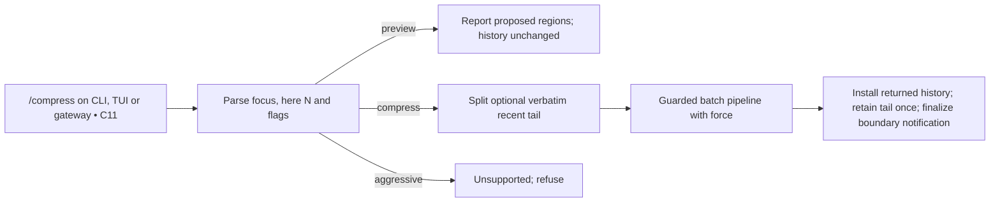

Owner: [C11]. `here N` keeps recent exchanges verbatim while compressing the earlier portion. `force` bypasses selected engine cooldown/feasibility behavior; it does not remove lease, commit, cancellation or checkpoint guards. Surface code owns installing the returned history and completing any deferred notification after its transaction.

## 8. Memory enters context through several paths

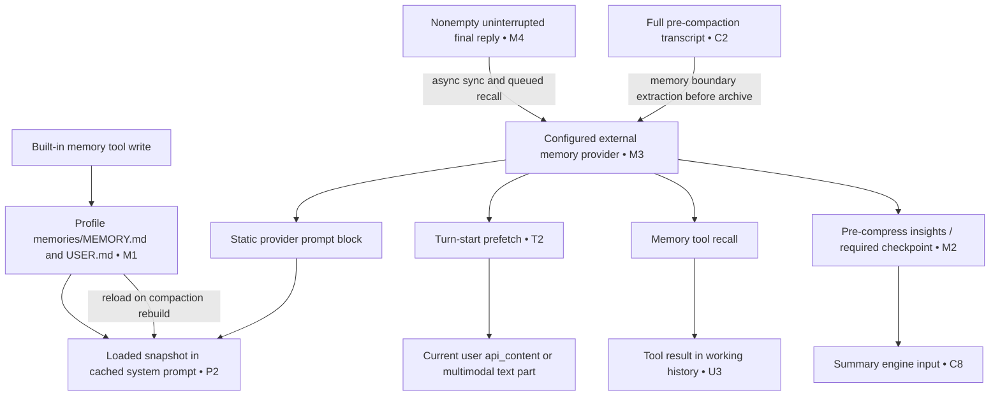

Owners: files and writes [M1], prompt [P2], provider registration/recall [M3], turn augmentation [T2], compression checkpoint [M2], completed-turn sync [M4].

Built-in memory and user profile default enabled. External provider defaults unset and is additive when configured. A built-in write changes disk and returns feedback; it does not immediately rewrite the frozen prompt snapshot. Providers can additionally expose tools, so memory can be fetched during the loop. [M1] [M3]

Completed-turn sync and queued next prefetch use a serialized background worker. Turn-start recall waits synchronously with a bound; pre-compress callbacks and compression memory extraction run inline. Mirroring checks interruption and nonempty input/output, rather than a general success flag. Providers have end/switch (with reset flag)/shutdown hooks; CLI `/new` queues end-before-switch, and shutdown makes a bounded drain attempt. Asynchronous mirroring is not proof that every reply reached the provider. Storage and retrieval remain plugin-owned. [M3] [M4]

Compression memory extraction runs in both storage modes, before the anti-growth check and archive. A later refusal can therefore leave the transcript unchanged after a provider callback already ran. Background memory/skill review can also change profile state after delivery; frozen prompt content only adopts those changes at a later rebuild or session. [C2] [S2]

Required pre-compression checkpoint mode is stronger: no compatible successful checkpoint means the host refuses the destructive compression. Provider insights are sanitized and bounded before the summary engine sees them. [M2]

## 9. Provider projection and native context ownership

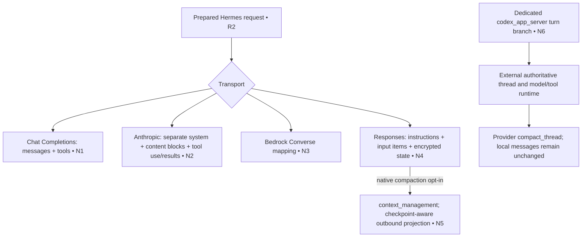

Owners: transport routing [R2], individual mappings [N1] [N2] [N3] [N4], native Responses policy/projection [N5], app-server runtime boundary [N6].

These payloads are not interchangeable transcripts. Conversion handles roles, tool schemas, images, reasoning and cache policy. The provider's internal attention/context mechanics cannot be inferred from Hermes source. [R2]

Responses native compaction defaults off. Eligibility is checked against route/model/capability and checkpoint settings. When enabled, outbound projection uses the newest contiguous checkpoint run, retained plaintext user context/local summaries and later items. That projection differs from Hermes batch history rewriting. [N5]

App-server automatic compaction defaults to provider-native ownership; `native`, `hermes` and `off` modes exist. Hermes can request `compact_thread()` and record the outcome without summarizing local message rows. Required truthful pre-compression checkpoint is incompatible with this native path and is explicitly blocked. This study covers Hermes's call boundary, not the external runtime's implementation. [N6]

## 10. Persistence, resume and reset

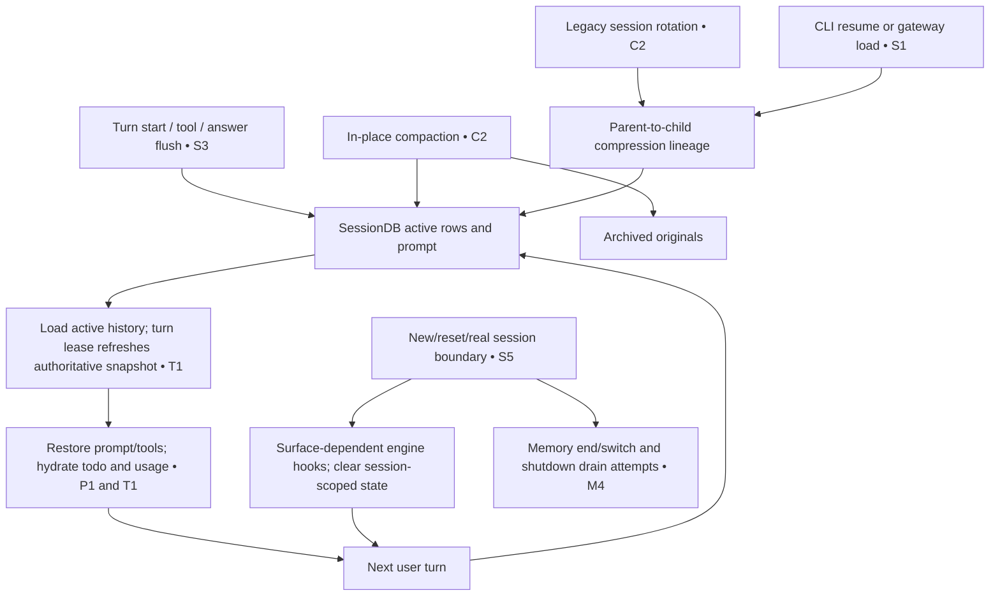

Owners: append filtering/dedupe/flush [S3], compaction/archive/lineage [C2], host loading [S1], admitted refresh [T1], prompt/tools [P1], lifecycle reset [S5], provider boundary [M4].

Engine lifecycle hooks are conditional. A full transition can call end → reset → start; CLI `/new` issues end separately, then resets/rebinds state without necessarily calling start again. Agent initialization calls start. Memory providers use end/switch, not the engine's reset callback. [S5] [E2] [M4]

Append persistence filters temporary scaffolding and uses persisted-row markers/dedupe. It carries replay sidecars and media metadata. Archive-and-compact replaces the active view; archival retention does not mean every old message is still sent to the model. Resume follows the compression tip rather than blindly reopening the original parent. [S3] [C2] [S1]

| Surface | Context continuity |
| --- | --- |
| CLI/TUI | Profile SessionDB; resume follows lineage and restores history plus session metadata |
| Messaging gateway | Routing key resolves session; durable history is reloaded/repaired; unreadable history fails instead of becoming an empty conversation |
| Gateway agent cache | Reuse is keyed by runtime/config/tool/user identity; eviction drops live history because DB can reconstruct it |
| Gateway API server | Fresh agent per request; exclusive session/profile MemoryManager checkout can preserve queued recall within that process |

Owners: [S1] [S6]. An in-process MemoryManager cache does not survive restart by itself. A resumed conversation does not imply a suspended model call or external tool side effect resumes exactly where it stopped. This audit establishes stored context reconstruction and ordering mechanisms. [S3] [S6]

## 11. Delegation creates a separate context

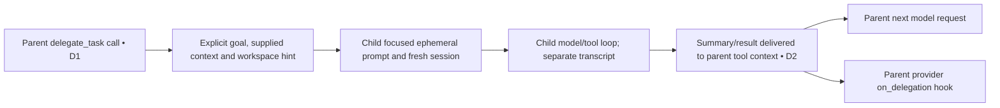

Owners: child construction [D1], result/memory handoff [D2], ordinary parent result path [U3].

The child is configured with `skip_context_files=True` and `skip_memory=True`; its toolset blocks the built-in memory tool. It receives a focused goal/context prompt rather than automatic parent-transcript inheritance. Its DB handle points to the parent's DB file but its session has a separate identity and parent link. Shared storage location and shared model context are different properties. [D1]

## 12. What this gives Context Lab

These are **candidate experimental seams inferred from the implementation**, not a fixed taxonomy or benchmark result:

| Mechanism to vary | Hold separate |
| --- | --- |
| Instruction discovery, caps and prompt ordering | Conversation retention policy |
| Once-per-turn recall and injection | Memory storage/formation algorithm |
| Per-request selection | Durable active history rewrite |
| Tool output admission, spilling and media retirement | Tool execution semantics |
| Trigger/budget estimation | Compression representation and summary model |
| Pruning, batch summary and rolling summary | Their different commit/recovery semantics |
| Prompt refresh and cache boundaries | Provider transport representation |
| Child context handoff | Parent memory and child persistence |

Hermes composes many of these mechanisms. Comparing only whole “context systems” would hide which mechanism caused a difference.

## Coverage and review limits

- Traced the core prompt, generic turn/request/tool loop, built-in compaction, memory hooks, session persistence and CLI/gateway resume seams at the pinned commit.
- Included optional context-engine selection, proactive pruning, micro-compaction, native Responses and app-server ownership boundaries.
- Did not inspect every memory/context plugin, every tool's output budget, MoA advisor internals, every host endpoint, or the external app-server runtime. Those paths can change the detailed payload.
- Diagrams describe source control flow. They do not demonstrate retrieval relevance, summary fidelity, cache hit rate, race freedom or crash recovery outcomes. Those require recorded experiments.
- The [older Hermes code map](../harness-code-maps/hermes.md) studies another commit. Its line numbers and policy summaries should not be mixed with this snapshot.

## Document checks

All 14 Mermaid blocks parsed with Mermaid 12.0.0. All 128 pinned link occurrences were checked against existing files and line bounds in the local snapshot; relative document links resolve. The documentation catalog generator and whitespace diff check passed. Diagram rendering in the Studio UI was not visually checked. Hermes itself was not executed.

## Source owners

All links below pin the inspected commit. Diagram IDs resolve to these owners; arrows show the call order or data transfer implemented there.

| ID | Code owner |
| --- | --- |
| P1 | [Restore/build prompt and tool pin: `agent/conversation_loop.py:745`](https://github.com/NousResearch/hermes-agent/blob/ddc0e65958b326a89f6c440c76c812d31ac27e2a/agent/conversation_loop.py#L745) |
| P2 | [Tier assembly: `agent/system_prompt.py:734`](https://github.com/NousResearch/hermes-agent/blob/ddc0e65958b326a89f6c440c76c812d31ac27e2a/agent/system_prompt.py#L734); [Invalidate/reload: `agent/system_prompt.py:812`](https://github.com/NousResearch/hermes-agent/blob/ddc0e65958b326a89f6c440c76c812d31ac27e2a/agent/system_prompt.py#L812); [Frozen plugin sections: `agent/system_prompt.py:113`](https://github.com/NousResearch/hermes-agent/blob/ddc0e65958b326a89f6c440c76c812d31ac27e2a/agent/system_prompt.py#L113) |
| P3 | [Caps and instruction discovery: `agent/prompt_builder.py:1594`](https://github.com/NousResearch/hermes-agent/blob/ddc0e65958b326a89f6c440c76c812d31ac27e2a/agent/prompt_builder.py#L1594) |
| T1 | [Turn admission: `agent/turn_facade.py:82`](https://github.com/NousResearch/hermes-agent/blob/ddc0e65958b326a89f6c440c76c812d31ac27e2a/agent/turn_facade.py#L82); [Turn context: `agent/turn_context.py:1016`](https://github.com/NousResearch/hermes-agent/blob/ddc0e65958b326a89f6c440c76c812d31ac27e2a/agent/turn_context.py#L1016) |
| T2 | [Hooks, notes, memory and replay sidecars: `agent/turn_context.py:781`](https://github.com/NousResearch/hermes-agent/blob/ddc0e65958b326a89f6c440c76c812d31ac27e2a/agent/turn_context.py#L781) |
| R1 | [API message copy: `agent/turn_context.py:1220`](https://github.com/NousResearch/hermes-agent/blob/ddc0e65958b326a89f6c440c76c812d31ac27e2a/agent/turn_context.py#L1220); [Assembly and pressure: `agent/turn_request_assembly.py:106`](https://github.com/NousResearch/hermes-agent/blob/ddc0e65958b326a89f6c440c76c812d31ac27e2a/agent/turn_request_assembly.py#L106) |
| R2 | [Per-attempt preparation: `agent/turn_api_request.py:93`](https://github.com/NousResearch/hermes-agent/blob/ddc0e65958b326a89f6c440c76c812d31ac27e2a/agent/turn_api_request.py#L93); [Transport routing: `agent/chat_completion_helpers.py:1555`](https://github.com/NousResearch/hermes-agent/blob/ddc0e65958b326a89f6c440c76c812d31ac27e2a/agent/chat_completion_helpers.py#L1555) |
| R3 | [Live transcript repairs: `agent/turn_iteration_prep.py:149`](https://github.com/NousResearch/hermes-agent/blob/ddc0e65958b326a89f6c440c76c812d31ac27e2a/agent/turn_iteration_prep.py#L149) |
| E1 | [Request selection implementation: `agent/conversation_loop.py:1281`](https://github.com/NousResearch/hermes-agent/blob/ddc0e65958b326a89f6c440c76c812d31ac27e2a/agent/conversation_loop.py#L1281) |
| E2 | [Engine contract: `agent/context_engine.py:48`](https://github.com/NousResearch/hermes-agent/blob/ddc0e65958b326a89f6c440c76c812d31ac27e2a/agent/context_engine.py#L48); [Engine activation: `agent/agent_init.py:1989`](https://github.com/NousResearch/hermes-agent/blob/ddc0e65958b326a89f6c440c76c812d31ac27e2a/agent/agent_init.py#L1989) |
| U1 | [Persist calls before tools: `agent/turn_tool_round.py:107`](https://github.com/NousResearch/hermes-agent/blob/ddc0e65958b326a89f6c440c76c812d31ac27e2a/agent/turn_tool_round.py#L107) |
| U2 | [Response normalization: `agent/turn_response_intake.py:120`](https://github.com/NousResearch/hermes-agent/blob/ddc0e65958b326a89f6c440c76c812d31ac27e2a/agent/turn_response_intake.py#L120); [Final answer/continuation: `agent/turn_final_response.py:323`](https://github.com/NousResearch/hermes-agent/blob/ddc0e65958b326a89f6c440c76c812d31ac27e2a/agent/turn_final_response.py#L323) |
| U3 | [Tool result shaping and flush: `agent/tool_executor.py:1107`](https://github.com/NousResearch/hermes-agent/blob/ddc0e65958b326a89f6c440c76c812d31ac27e2a/agent/tool_executor.py#L1107) |
| C1 | [Request pressure gate: `agent/turn_preflight.py:60`](https://github.com/NousResearch/hermes-agent/blob/ddc0e65958b326a89f6c440c76c812d31ac27e2a/agent/turn_preflight.py#L60); [Post-tool pressure: `agent/turn_preflight.py:270`](https://github.com/NousResearch/hermes-agent/blob/ddc0e65958b326a89f6c440c76c812d31ac27e2a/agent/turn_preflight.py#L270) |
| C2 | [Guarded batch orchestration: `agent/conversation_compression.py:4072`](https://github.com/NousResearch/hermes-agent/blob/ddc0e65958b326a89f6c440c76c812d31ac27e2a/agent/conversation_compression.py#L4072); [Memory preparation: `agent/conversation_compression.py:2972`](https://github.com/NousResearch/hermes-agent/blob/ddc0e65958b326a89f6c440c76c812d31ac27e2a/agent/conversation_compression.py#L2972); [Prompt refresh: `agent/conversation_compression.py:3166`](https://github.com/NousResearch/hermes-agent/blob/ddc0e65958b326a89f6c440c76c812d31ac27e2a/agent/conversation_compression.py#L3166); [Durable commit: `agent/conversation_compression.py:3713`](https://github.com/NousResearch/hermes-agent/blob/ddc0e65958b326a89f6c440c76c812d31ac27e2a/agent/conversation_compression.py#L3713); [Stall recovery: `agent/conversation_compression.py:761`](https://github.com/NousResearch/hermes-agent/blob/ddc0e65958b326a89f6c440c76c812d31ac27e2a/agent/conversation_compression.py#L761) |
| C3 | [Deterministic proactive pruning: `agent/context_compressor.py:3446`](https://github.com/NousResearch/hermes-agent/blob/ddc0e65958b326a89f6c440c76c812d31ac27e2a/agent/context_compressor.py#L3446) |
| C4 | [Turn-start idle and threshold passes: `agent/turn_context_compaction.py:129`](https://github.com/NousResearch/hermes-agent/blob/ddc0e65958b326a89f6c440c76c812d31ac27e2a/agent/turn_context_compaction.py#L129) |
| C5 | [Overflow classification: `agent/turn_overflow.py:461`](https://github.com/NousResearch/hermes-agent/blob/ddc0e65958b326a89f6c440c76c812d31ac27e2a/agent/turn_overflow.py#L461); [413 and budget recovery: `agent/turn_overflow.py:226`](https://github.com/NousResearch/hermes-agent/blob/ddc0e65958b326a89f6c440c76c812d31ac27e2a/agent/turn_overflow.py#L226) |
| C6 | [Parsed compression defaults: `agent/agent_init.py:1543`](https://github.com/NousResearch/hermes-agent/blob/ddc0e65958b326a89f6c440c76c812d31ac27e2a/agent/agent_init.py#L1543); [Effective threshold: `agent/context_compressor.py:2810`](https://github.com/NousResearch/hermes-agent/blob/ddc0e65958b326a89f6c440c76c812d31ac27e2a/agent/context_compressor.py#L2810) |
| C7 | [Rolling summary: `agent/micro_compaction.py:204`](https://github.com/NousResearch/hermes-agent/blob/ddc0e65958b326a89f6c440c76c812d31ac27e2a/agent/micro_compaction.py#L204); [DB sync failure behavior: `agent/micro_compaction.py:402`](https://github.com/NousResearch/hermes-agent/blob/ddc0e65958b326a89f6c440c76c812d31ac27e2a/agent/micro_compaction.py#L402); [Required checkpoint gate: `agent/agent_init.py:2038`](https://github.com/NousResearch/hermes-agent/blob/ddc0e65958b326a89f6c440c76c812d31ac27e2a/agent/agent_init.py#L2038) |
| C8 | [Built-in compression algorithm: `agent/context_compressor.py:5563`](https://github.com/NousResearch/hermes-agent/blob/ddc0e65958b326a89f6c440c76c812d31ac27e2a/agent/context_compressor.py#L5563); [Partition and feasibility: `agent/context_compressor.py:5294`](https://github.com/NousResearch/hermes-agent/blob/ddc0e65958b326a89f6c440c76c812d31ac27e2a/agent/context_compressor.py#L5294); [Summary retry/failure: `agent/context_compressor.py:4241`](https://github.com/NousResearch/hermes-agent/blob/ddc0e65958b326a89f6c440c76c812d31ac27e2a/agent/context_compressor.py#L4241); [Finalize and diagnostic savings: `agent/context_compressor.py:5504`](https://github.com/NousResearch/hermes-agent/blob/ddc0e65958b326a89f6c440c76c812d31ac27e2a/agent/context_compressor.py#L5504) |
| C9 | [Summary prompt and template: `agent/context_compressor.py:4108`](https://github.com/NousResearch/hermes-agent/blob/ddc0e65958b326a89f6c440c76c812d31ac27e2a/agent/context_compressor.py#L4108) |
| C10 | [Timeout/commit fencing: `agent/compression_facade.py:123`](https://github.com/NousResearch/hermes-agent/blob/ddc0e65958b326a89f6c440c76c812d31ac27e2a/agent/compression_facade.py#L123) |
| H1 | [CLI input preparation](https://github.com/NousResearch/hermes-agent/blob/ddc0e65958b326a89f6c440c76c812d31ac27e2a/hermes_cli/cli_chat_turn_mixin.py#L58); [Gateway inbound](https://github.com/NousResearch/hermes-agent/blob/ddc0e65958b326a89f6c440c76c812d31ac27e2a/gateway/run_inbound.py#L1744) |
| H2 | [Reference expansion](https://github.com/NousResearch/hermes-agent/blob/ddc0e65958b326a89f6c440c76c812d31ac27e2a/agent/context_references.py#L199) |
| H3 | [Skill command rewrite](https://github.com/NousResearch/hermes-agent/blob/ddc0e65958b326a89f6c440c76c812d31ac27e2a/gateway/run_inbound.py#L1199) |
| C11 | [Manual compress command: `agent/conversation_compression_manual.py:69`](https://github.com/NousResearch/hermes-agent/blob/ddc0e65958b326a89f6c440c76c812d31ac27e2a/agent/conversation_compression_manual.py#L69) |
| M1 | [Built-in snapshot semantics: `tools/memory_tool.py:1`](https://github.com/NousResearch/hermes-agent/blob/ddc0e65958b326a89f6c440c76c812d31ac27e2a/tools/memory_tool.py#L1); [Profile memory files: `tools/memory_tool_store.py:133`](https://github.com/NousResearch/hermes-agent/blob/ddc0e65958b326a89f6c440c76c812d31ac27e2a/tools/memory_tool_store.py#L133); [Memory initialization: `agent/agent_init.py:1323`](https://github.com/NousResearch/hermes-agent/blob/ddc0e65958b326a89f6c440c76c812d31ac27e2a/agent/agent_init.py#L1323) |
| M2 | [Pre-compress provider checkpoint: `agent/memory_manager.py:731`](https://github.com/NousResearch/hermes-agent/blob/ddc0e65958b326a89f6c440c76c812d31ac27e2a/agent/memory_manager.py#L731); [Host checkpoint admission: `agent/conversation_compression.py:2972`](https://github.com/NousResearch/hermes-agent/blob/ddc0e65958b326a89f6c440c76c812d31ac27e2a/agent/conversation_compression.py#L2972) |
| M3 | [Registration: `agent/memory_manager.py:336`](https://github.com/NousResearch/hermes-agent/blob/ddc0e65958b326a89f6c440c76c812d31ac27e2a/agent/memory_manager.py#L336); [Prompt and recall: `agent/memory_manager.py:437`](https://github.com/NousResearch/hermes-agent/blob/ddc0e65958b326a89f6c440c76c812d31ac27e2a/agent/memory_manager.py#L437); [Provider contract: `agent/memory_provider.py:84`](https://github.com/NousResearch/hermes-agent/blob/ddc0e65958b326a89f6c440c76c812d31ac27e2a/agent/memory_provider.py#L84); [Default engine/memory configuration: `hermes_cli/config_defaults.py:1300`](https://github.com/NousResearch/hermes-agent/blob/ddc0e65958b326a89f6c440c76c812d31ac27e2a/hermes_cli/config_defaults.py#L1300) |
| M4 | [Memory boundary and completed-turn sync: `run_agent.py:902`](https://github.com/NousResearch/hermes-agent/blob/ddc0e65958b326a89f6c440c76c812d31ac27e2a/run_agent.py#L902); [Background writes: `agent/memory_manager.py:533`](https://github.com/NousResearch/hermes-agent/blob/ddc0e65958b326a89f6c440c76c812d31ac27e2a/agent/memory_manager.py#L533); [Shutdown drain: `agent/memory_manager.py:852`](https://github.com/NousResearch/hermes-agent/blob/ddc0e65958b326a89f6c440c76c812d31ac27e2a/agent/memory_manager.py#L852); [Ordered async end/switch](https://github.com/NousResearch/hermes-agent/blob/ddc0e65958b326a89f6c440c76c812d31ac27e2a/agent/memory_manager.py#L671); [Inline memory end](https://github.com/NousResearch/hermes-agent/blob/ddc0e65958b326a89f6c440c76c812d31ac27e2a/run_agent.py#L916) |
| N1 | [Chat message projection: `agent/transports/chat_completions.py:454`](https://github.com/NousResearch/hermes-agent/blob/ddc0e65958b326a89f6c440c76c812d31ac27e2a/agent/transports/chat_completions.py#L454) |
| N2 | [Anthropic projection: `agent/anthropic_adapter.py:628`](https://github.com/NousResearch/hermes-agent/blob/ddc0e65958b326a89f6c440c76c812d31ac27e2a/agent/anthropic_adapter.py#L628) |
| N3 | [Bedrock projection: `agent/transports/bedrock.py:26`](https://github.com/NousResearch/hermes-agent/blob/ddc0e65958b326a89f6c440c76c812d31ac27e2a/agent/transports/bedrock.py#L26) |
| N4 | [Responses input projection: `agent/transports/codex.py:633`](https://github.com/NousResearch/hermes-agent/blob/ddc0e65958b326a89f6c440c76c812d31ac27e2a/agent/transports/codex.py#L633) |
| N5 | [Native eligibility: `agent/native_compaction.py:109`](https://github.com/NousResearch/hermes-agent/blob/ddc0e65958b326a89f6c440c76c812d31ac27e2a/agent/native_compaction.py#L109); [Checkpoint projection: `agent/native_compaction.py:197`](https://github.com/NousResearch/hermes-agent/blob/ddc0e65958b326a89f6c440c76c812d31ac27e2a/agent/native_compaction.py#L197) |
| N6 | [Dedicated runtime branch: `agent/conversation_loop.py:1622`](https://github.com/NousResearch/hermes-agent/blob/ddc0e65958b326a89f6c440c76c812d31ac27e2a/agent/conversation_loop.py#L1622); [Provider compact_thread: `agent/conversation_compression.py:4339`](https://github.com/NousResearch/hermes-agent/blob/ddc0e65958b326a89f6c440c76c812d31ac27e2a/agent/conversation_compression.py#L4339) |
| S1 | [CLI resume: `hermes_cli/cli_agent_setup_mixin.py:774`](https://github.com/NousResearch/hermes-agent/blob/ddc0e65958b326a89f6c440c76c812d31ac27e2a/hermes_cli/cli_agent_setup_mixin.py#L774); [Gateway transcript load: `gateway/session_transcript.py:539`](https://github.com/NousResearch/hermes-agent/blob/ddc0e65958b326a89f6c440c76c812d31ac27e2a/gateway/session_transcript.py#L539); [Gateway recovery: `gateway/session_recovery.py:237`](https://github.com/NousResearch/hermes-agent/blob/ddc0e65958b326a89f6c440c76c812d31ac27e2a/gateway/session_recovery.py#L237) |
| S2 | [Turn finalization: `agent/turn_finalizer.py:604`](https://github.com/NousResearch/hermes-agent/blob/ddc0e65958b326a89f6c440c76c812d31ac27e2a/agent/turn_finalizer.py#L604) |
| S3 | [Session persistence/flush: `agent/session_persistence.py:435`](https://github.com/NousResearch/hermes-agent/blob/ddc0e65958b326a89f6c440c76c812d31ac27e2a/agent/session_persistence.py#L435) |
| S4 | [Gateway hygiene settings: `gateway/run_turn.py:680`](https://github.com/NousResearch/hermes-agent/blob/ddc0e65958b326a89f6c440c76c812d31ac27e2a/gateway/run_turn.py#L680) |
| S5 | [Engine transition/reset: `run_agent.py:384`](https://github.com/NousResearch/hermes-agent/blob/ddc0e65958b326a89f6c440c76c812d31ac27e2a/run_agent.py#L384); [CLI new-session lifecycle: `hermes_cli/cli_session_mixin.py:467`](https://github.com/NousResearch/hermes-agent/blob/ddc0e65958b326a89f6c440c76c812d31ac27e2a/hermes_cli/cli_session_mixin.py#L467) |
| S6 | [Agent reuse: `gateway/run_turn_runner.py:1139`](https://github.com/NousResearch/hermes-agent/blob/ddc0e65958b326a89f6c440c76c812d31ac27e2a/gateway/run_turn_runner.py#L1139); [Cache eviction: `gateway/run_agent_cache.py:850`](https://github.com/NousResearch/hermes-agent/blob/ddc0e65958b326a89f6c440c76c812d31ac27e2a/gateway/run_agent_cache.py#L850); [API memory-manager cache: `gateway/platforms/api_server_memory_sessions.py:31`](https://github.com/NousResearch/hermes-agent/blob/ddc0e65958b326a89f6c440c76c812d31ac27e2a/gateway/platforms/api_server_memory_sessions.py#L31) |
| D1 | [Child context construction: `tools/delegate_tool.py:190`](https://github.com/NousResearch/hermes-agent/blob/ddc0e65958b326a89f6c440c76c812d31ac27e2a/tools/delegate_tool.py#L190); [Blocked child memory tool: `tools/delegate_tool_toolsets.py:13`](https://github.com/NousResearch/hermes-agent/blob/ddc0e65958b326a89f6c440c76c812d31ac27e2a/tools/delegate_tool_toolsets.py#L13) |
| D2 | [Delegation memory notification: `tools/delegate_tool_results.py:330`](https://github.com/NousResearch/hermes-agent/blob/ddc0e65958b326a89f6c440c76c812d31ac27e2a/tools/delegate_tool_results.py#L330) |

<!-- Shortcut links used beside diagrams and claims. -->
[P1]: https://github.com/NousResearch/hermes-agent/blob/ddc0e65958b326a89f6c440c76c812d31ac27e2a/agent/conversation_loop.py#L745
[P2]: https://github.com/NousResearch/hermes-agent/blob/ddc0e65958b326a89f6c440c76c812d31ac27e2a/agent/system_prompt.py#L734
[P3]: https://github.com/NousResearch/hermes-agent/blob/ddc0e65958b326a89f6c440c76c812d31ac27e2a/agent/prompt_builder.py#L1594
[T1]: https://github.com/NousResearch/hermes-agent/blob/ddc0e65958b326a89f6c440c76c812d31ac27e2a/agent/turn_facade.py#L82
[T2]: https://github.com/NousResearch/hermes-agent/blob/ddc0e65958b326a89f6c440c76c812d31ac27e2a/agent/turn_context.py#L781
[R1]: https://github.com/NousResearch/hermes-agent/blob/ddc0e65958b326a89f6c440c76c812d31ac27e2a/agent/turn_context.py#L1220
[R2]: https://github.com/NousResearch/hermes-agent/blob/ddc0e65958b326a89f6c440c76c812d31ac27e2a/agent/turn_api_request.py#L93
[R3]: https://github.com/NousResearch/hermes-agent/blob/ddc0e65958b326a89f6c440c76c812d31ac27e2a/agent/turn_iteration_prep.py#L149
[E1]: https://github.com/NousResearch/hermes-agent/blob/ddc0e65958b326a89f6c440c76c812d31ac27e2a/agent/conversation_loop.py#L1281
[E2]: https://github.com/NousResearch/hermes-agent/blob/ddc0e65958b326a89f6c440c76c812d31ac27e2a/agent/context_engine.py#L48
[U1]: https://github.com/NousResearch/hermes-agent/blob/ddc0e65958b326a89f6c440c76c812d31ac27e2a/agent/turn_tool_round.py#L107
[U2]: https://github.com/NousResearch/hermes-agent/blob/ddc0e65958b326a89f6c440c76c812d31ac27e2a/agent/turn_response_intake.py#L120
[U3]: https://github.com/NousResearch/hermes-agent/blob/ddc0e65958b326a89f6c440c76c812d31ac27e2a/agent/tool_executor.py#L1107
[C1]: https://github.com/NousResearch/hermes-agent/blob/ddc0e65958b326a89f6c440c76c812d31ac27e2a/agent/turn_preflight.py#L60
[C2]: https://github.com/NousResearch/hermes-agent/blob/ddc0e65958b326a89f6c440c76c812d31ac27e2a/agent/conversation_compression.py#L4072
[C3]: https://github.com/NousResearch/hermes-agent/blob/ddc0e65958b326a89f6c440c76c812d31ac27e2a/agent/context_compressor.py#L3446
[C4]: https://github.com/NousResearch/hermes-agent/blob/ddc0e65958b326a89f6c440c76c812d31ac27e2a/agent/turn_context_compaction.py#L129
[C5]: https://github.com/NousResearch/hermes-agent/blob/ddc0e65958b326a89f6c440c76c812d31ac27e2a/agent/turn_overflow.py#L461
[C6]: https://github.com/NousResearch/hermes-agent/blob/ddc0e65958b326a89f6c440c76c812d31ac27e2a/agent/agent_init.py#L1543
[C7]: https://github.com/NousResearch/hermes-agent/blob/ddc0e65958b326a89f6c440c76c812d31ac27e2a/agent/micro_compaction.py#L204
[C8]: https://github.com/NousResearch/hermes-agent/blob/ddc0e65958b326a89f6c440c76c812d31ac27e2a/agent/context_compressor.py#L5563
[C9]: https://github.com/NousResearch/hermes-agent/blob/ddc0e65958b326a89f6c440c76c812d31ac27e2a/agent/context_compressor.py#L4108
[C10]: https://github.com/NousResearch/hermes-agent/blob/ddc0e65958b326a89f6c440c76c812d31ac27e2a/agent/compression_facade.py#L123
[C11]: https://github.com/NousResearch/hermes-agent/blob/ddc0e65958b326a89f6c440c76c812d31ac27e2a/agent/conversation_compression_manual.py#L69
[M1]: https://github.com/NousResearch/hermes-agent/blob/ddc0e65958b326a89f6c440c76c812d31ac27e2a/tools/memory_tool.py#L1
[M2]: https://github.com/NousResearch/hermes-agent/blob/ddc0e65958b326a89f6c440c76c812d31ac27e2a/agent/memory_manager.py#L731
[M3]: https://github.com/NousResearch/hermes-agent/blob/ddc0e65958b326a89f6c440c76c812d31ac27e2a/agent/memory_manager.py#L336
[M4]: https://github.com/NousResearch/hermes-agent/blob/ddc0e65958b326a89f6c440c76c812d31ac27e2a/run_agent.py#L902
[N1]: https://github.com/NousResearch/hermes-agent/blob/ddc0e65958b326a89f6c440c76c812d31ac27e2a/agent/transports/chat_completions.py#L454
[N2]: https://github.com/NousResearch/hermes-agent/blob/ddc0e65958b326a89f6c440c76c812d31ac27e2a/agent/anthropic_adapter.py#L628
[N3]: https://github.com/NousResearch/hermes-agent/blob/ddc0e65958b326a89f6c440c76c812d31ac27e2a/agent/transports/bedrock.py#L26
[N4]: https://github.com/NousResearch/hermes-agent/blob/ddc0e65958b326a89f6c440c76c812d31ac27e2a/agent/transports/codex.py#L633
[N5]: https://github.com/NousResearch/hermes-agent/blob/ddc0e65958b326a89f6c440c76c812d31ac27e2a/agent/native_compaction.py#L109
[N6]: https://github.com/NousResearch/hermes-agent/blob/ddc0e65958b326a89f6c440c76c812d31ac27e2a/agent/conversation_loop.py#L1622
[S1]: https://github.com/NousResearch/hermes-agent/blob/ddc0e65958b326a89f6c440c76c812d31ac27e2a/hermes_cli/cli_agent_setup_mixin.py#L774
[S2]: https://github.com/NousResearch/hermes-agent/blob/ddc0e65958b326a89f6c440c76c812d31ac27e2a/agent/turn_finalizer.py#L604
[S3]: https://github.com/NousResearch/hermes-agent/blob/ddc0e65958b326a89f6c440c76c812d31ac27e2a/agent/session_persistence.py#L435
[S4]: https://github.com/NousResearch/hermes-agent/blob/ddc0e65958b326a89f6c440c76c812d31ac27e2a/gateway/run_turn.py#L680
[S5]: https://github.com/NousResearch/hermes-agent/blob/ddc0e65958b326a89f6c440c76c812d31ac27e2a/run_agent.py#L384
[S6]: https://github.com/NousResearch/hermes-agent/blob/ddc0e65958b326a89f6c440c76c812d31ac27e2a/gateway/run_turn_runner.py#L1139
[D1]: https://github.com/NousResearch/hermes-agent/blob/ddc0e65958b326a89f6c440c76c812d31ac27e2a/tools/delegate_tool.py#L190
[D2]: https://github.com/NousResearch/hermes-agent/blob/ddc0e65958b326a89f6c440c76c812d31ac27e2a/tools/delegate_tool_results.py#L330

[H1]: https://github.com/NousResearch/hermes-agent/blob/ddc0e65958b326a89f6c440c76c812d31ac27e2a/hermes_cli/cli_chat_turn_mixin.py#L58
[H2]: https://github.com/NousResearch/hermes-agent/blob/ddc0e65958b326a89f6c440c76c812d31ac27e2a/agent/context_references.py#L199
[H3]: https://github.com/NousResearch/hermes-agent/blob/ddc0e65958b326a89f6c440c76c812d31ac27e2a/gateway/run_inbound.py#L1199
