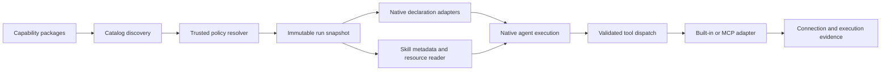

# Extensible tools and skills for native agents

Research date: 2026-10-08. This note records source findings and design recommendations. It is not an implementation claim or a temporary execution plan. The comparison concerns ShenSeanChen's Waku Agent, not the unrelated Waku messaging network.

## Recommendation

Build a capability package and adapter boundary that native agents consume as data. A package contributes tool definitions, dispatch bindings, skill directories and provenance. A trusted resolver selects what a run may use. Each platform projects that resolved snapshot into its own model declarations and executes calls through its existing native I/O boundary.

Adding another MCP tool or skill should require a package/configuration change, not another branch in the agent loop. A new kind of execution backend can require an adapter implementation. This distinction prevents the promise of extensibility from becoming a claim that arbitrary code or transports work automatically.

Real systems provide useful examples of registration, connection ownership and skill loading, but their policies are not interchangeable. This lab should retain its separation of capabilities, authority, native execution and evidence.

## What real agents do

### Waku Agent

Reviewed source revision: `24b4cbb6d065e2cf31ca1ec0832918a1d1c08b01`.

Waku's `Tool` combines a description, input schema and callable. Its registry projects tool schemas and dispatches by name. Execution failures become text the model can observe. Optional progress callbacks stay outside model arguments. Registration assigns by name, so duplicate registration can replace an earlier tool. This is an implementation example, not a collision policy to copy into the laboratory. [Waku registry source](https://github.com/ShenSeanChen/waku-agent/blob/24b4cbb6d065e2cf31ca1ec0832918a1d1c08b01/waku/tools/registry.py).

The MCP bridge opens configured stdio or Streamable HTTP servers, initializes sessions, lists their tools and wraps each discovered tool in a registry callable. It retains original server tool names for invocation while exposing provider-compatible names to the model. Credentials come through environment references or OAuth. The bridge owns asynchronous connection cleanup. Its result conversion joins text blocks and substitutes a marker for non-text content; it does not preserve the whole MCP result. This demonstrates extensible discovery and real execution, but also a lossy result boundary worth avoiding. [Waku MCP bridge source](https://github.com/ShenSeanChen/waku-agent/blob/24b4cbb6d065e2cf31ca1ec0832918a1d1c08b01/waku/tools/mcp_client.py).

Waku scans repository and user skill directories and rescans after file modification signatures change. It parses bodies during inventory refresh, selects at most two skills by keyword overlap by default and inserts matching bodies into context. This is selective prompt inclusion, rather than a model requesting each skill body. Referenced-resource loading is not implemented by this loader itself. [Waku skill loader source](https://github.com/ShenSeanChen/waku-agent/blob/24b4cbb6d065e2cf31ca1ec0832918a1d1c08b01/waku/memory/procedural/loader.py).

### Pi

Reviewed source revision: `a276dabe57911253350bffb93cb7d7aff6a73261`.

Pi extensions register executable tools, commands, hooks, providers and MCP servers through an extension API. Long-lived resources start at session lifecycle boundaries and close through shutdown handlers. Extensions run with the host process's operating-system permissions, so installation is a code trust decision. [Pi extension documentation](https://github.com/earendil-works/pi/blob/a276dabe57911253350bffb93cb7d7aff6a73261/packages/coding-agent/docs/extensions.md).

Packages distribute extensions, skills, prompts and themes from npm, Git or local directories. Distribution and executable registration are separate concepts. [Pi package documentation](https://github.com/earendil-works/pi/blob/a276dabe57911253350bffb93cb7d7aff6a73261/packages/coding-agent/docs/packages.md).

Skills advertise metadata and locations. The model reads a relevant `SKILL.md`, or the user explicitly activates it. References and scripts resolve against the skill directory; scripts still require an execution tool. This is a better comparison for an agent choosing instructions than a fixed skill automatically appended to every run. [Pi skill documentation](https://github.com/earendil-works/pi/blob/a276dabe57911253350bffb93cb7d7aff6a73261/packages/coding-agent/docs/skills.md).

### Hermes

The official documentation was inspected on the research date; these links are moving documentation, unlike the pinned Waku/Pi source above.

Hermes offers a custom plugin path that adds tools and integrations without changing core code. A plugin directory contains a manifest and registration function. Registration can contribute tools, hooks and namespaced skills. Project plugins require explicit enablement for trusted repositories. The useful pattern is a contribution API with lifecycle ownership, rather than a runtime importing one specific tool in several places. [Hermes plugin documentation](https://hermes-agent.nousresearch.com/docs/user-guide/features/plugins/).

Its skill interface separates listing metadata, loading the full skill and reading a specific reference through `skills_list` and `skill_view`. Conditional availability and precedence are explicit. Those are Hermes conventions, not requirements of the Agent Skills format. [Hermes skills documentation](https://hermes-agent.nousresearch.com/docs/user-guide/features/skills/).

## Protocol requirements and framework choices

### MCP

The current inspected tools specification is revision `2026-07-28`. Tools have input schemas and optional output schemas. Discovery uses paginated `tools/list`; invocation uses `tools/call`. Inventory can vary by request authorization and supports caching and change subscriptions. Tool annotations are untrusted unless the server is trusted. Results retain content blocks and structured JSON values. Execution errors use `isError` and should reach the model as corrective feedback; protocol errors remain distinct. The current revision also has `complete` and `input_required` result types. [MCP tools specification](https://modelcontextprotocol.io/specification/2026-07-28/server/tools).

Modern MCP carries version, client identity and capabilities on each request. Legacy revisions use initialization. Supporting both eras requires explicit compatibility handling; attempting a handshake alone does not establish modern compatibility. [MCP versioning specification](https://modelcontextprotocol.io/specification/2026-07-28/basic/versioning).

HTTP authorization is a separate protocol concern. Tokens belong in authorization headers, must target the correct resource, and require appropriate storage and audience validation. A tool declaration or model-selected name is not a credential grant. [MCP authorization specification](https://modelcontextprotocol.io/specification/2026-07-28/basic/authorization).

Legacy cancellation requests express cancellation intent. A receiver can ignore a notification when the original request has already completed. Cancellation therefore cannot prove that a remote side effect was undone. [MCP legacy cancellation specification](https://modelcontextprotocol.io/specification/2025-11-25/basic/utilities/cancellation).

These are protocol facts. Freezing a run's discovered catalog, rejecting changed definitions and recording unknown dispatch outcomes are laboratory design choices described below.

### Agent Skills

The portable package format uses `SKILL.md` with YAML frontmatter containing required `name` and `description`, followed by Markdown instructions. Optional scripts, references and assets support the procedure. `allowed-tools` is experimental and implementation-dependent. It must not silently override this lab's trusted capability policy. [Agent Skills specification](https://agentskills.io/specification).

The official integration guide describes metadata first, instructions on activation, then resources when needed. Activation can use a file-read tool or a dedicated tool for agents without filesystem access. Explicit user activation can coexist with model-driven activation. The guide also discusses deduplication and preserving active instructions through context compaction. These are integration recommendations, rather than all being mandatory file-format rules. [Agent Skills integration guide](https://agentskills.io/integrate-skills).

### Native framework adapters

Mastra distinguishes static tools from runtime toolsets supplied to generation calls. The latter supports per-request connection configuration. Its documentation also exposes tool approval separately from discovery. We can consume resolved definitions through native tools without copying tool-specific registration into each agent. [Mastra MCP documentation](https://mastra.ai/docs/connections/mcp).

LangChain's current MCP adapter loads tools through an adapter and manages connection configuration separately. Its published documentation is newer than this lab's pinned Python stack, so implementation must check installed APIs before adopting examples. [LangChain MCP documentation](https://docs.langchain.com/oss/python/langchain/mcp).

The OpenAI Agents SDK documents MCP filtering, schema conversion, connection lifetime and name mapping. Conversion is best-effort, and generated model names still dispatch to original server identities. This is corroborating architecture evidence; adopting the SDK would be a separate framework experiment. [OpenAI Agents SDK MCP documentation](https://openai.github.io/openai-agents-python/mcp/).

Anthropic documents deferred tool definitions and model-driven tool search to reduce initial context cost. This is provider-specific functionality. It supports evaluating eager versus discovered declarations, but does not justify requiring Anthropic tool search for every free model. [Anthropic advanced tool use](https://www.anthropic.com/engineering/advanced-tool-use).

## Existing laboratory boundary

The repository already separates capability manifests/profiles, policy resolution, tool registration, connections and skills under `server/src/capabilities/`. `CapabilityCatalog` resolves server-owned grants and exact versions. `ToolRegistry` validates calls and applies enabled/approved names. The skill context explicitly carries no authority. MCP discovery alone does not grant access.

The remaining extension problem is concrete. The baseline Mastra agent explicitly imports calculator/fixture tools and builds a tool object with individual branches. Temporal activities explicitly register those implementations. Existing `ToolImplementation.execute` and `ToolExecutionResult.content` project results as strings. `SkillCatalog` includes one built-in in-memory skill selected before admission. Plugin validation only accepts trusted `local_builtin` metadata and intentionally does not execute plugins. These are source observations, not evidence of a finished package runtime.

Local sources: [capability catalog](../../server/src/capabilities/catalog.ts), [tool contracts](../../server/src/capabilities/tools/contracts.ts), [registry](../../server/src/capabilities/tools/registry.ts), [skills catalog](../../server/src/capabilities/skills/catalog.ts), [plugin validator](../../server/src/capabilities/plugins/manifest.ts), [MCP notes](../../server/src/capabilities/integrations/mcp/README.md), [Mastra agent](../../server/src/platforms/mastra/variants/baseline/agent.ts), [Temporal activities](../../server/src/platforms/temporal/variants/baseline/activities.ts).

## Proposed adapter architecture

The following is a design recommendation inferred from the sources and repository inspection.

Map discovery and snapshot ownership to the existing capability catalog. Keep native declaration adapters in platform directories. Extend the existing connection and tool layers instead of creating another agent loop.

### Package contributions

A package should declare its identity/version, provenance/digest, tool contributions, skill roots and connection references. A tool contribution combines a provider-neutral descriptor with a binding such as a registered built-in handler or an MCP server/tool identity. The model never supplies executable paths, package entry points or connection endpoints.

Use at least two concrete contribution paths immediately: existing calculator/fixture handlers through registration, and discovered MCP tools through configured connections. Skills use actual directories. External service connectors can expose MCP tools or a purpose-built connection adapter; they are not a third permission system.

For a first implementation, trusted local registration plus configuration-driven MCP and skill packages is enough to demonstrate extension without loop edits. Arbitrary npm/Python plugin code needs a separate execution/trust design. Describe unsupported package types honestly.

### Catalog, snapshot and dispatch

Keep discovery, selection and authorization separate. Discovery returns what an adapter found. Policy selects which tools and skills a run may access. Admission stores the resolved descriptors, exact bindings, schema digests, package versions and policy revision.

Map a stable catalog ID to a provider-compatible model name and retain its original remote identity. Reject collisions rather than silently replacing registrations. A platform adapter must report unsupported schemas/content types explicitly instead of changing tool semantics invisibly.

Refresh catalogs for future admissions after explicit reload or invalidation. Do not replace an admitted run's meaning mid-flight. If a remote definition disappears or changes, reject dispatch against that snapshot and record the mismatch. Discovery caching keys need connection identity and authorization context; a public inventory cache cannot leak another user's authorized tools.

Dispatch validates arguments, checks trusted policy and resolves the immutable binding. Result records should preserve structured values, content blocks, resource links and raw protocol details through bounded evidence. The model projection may be smaller, but must record what was omitted. Do not turn a failed business operation into successful text only because a callable returned a string.

Known correctable tool errors can return correlated feedback and let the model choose a new call. A dispatch with a lost acknowledgement remains unknown. Generic automatic retry is unsafe for arbitrary writes; only retry when the adapter establishes pre-dispatch failure or the operation has an explicit idempotency contract.

### Skills as actual procedures

Index permitted skill metadata from directories before model execution. Give the model a general skill reader or native read mechanism, then let it choose relevant instructions. Record every activation and referenced-resource read with digest and source identity.

Resolve resource paths against the package root with bounds and traversal checks. Loading a script is reading content; running it requires an independently authorized execution tool. A script should not receive secrets merely because its directory contains `SKILL.md`.

Retain active skill identities and loaded digests through session persistence and context compaction. A follow-up turn should know which procedure was loaded, while a new package revision should create new recorded context rather than pretending the previous instructions changed retroactively.

### Native execution stays native

Mastra generates registered SDK tools from resolved descriptors. Temporal performs external I/O in Activities, with snapshot identity carried into the activity. Restate invokes adapters inside its durable execution boundary. LangGraph's Python tool node consumes the same serialized descriptors and bindings.

Do not share TypeScript closures with Python or put network requests inside Temporal workflow code. A JSON manifest is portable; an executable function is not. An adapter may need platform-specific implementation while preserving the shared semantic contract and its original native telemetry.

## What would establish that this works

Use one complete model-driven task combining discovery, a real read operation, an explicitly loaded skill reference and a produced artifact or controlled state change. Follow it with a user correction. Retain free-model identity, exact package revisions, chosen tool declarations, model calls, skill activations, results and artifacts.

The key extension demonstration is adding one independent tool/skill package and running it on every platform without changing any native agent loop. A narrow contract check should catch schema mismatch and denied dispatch. One cancellation/unknown-outcome check should establish the new adapter's actual semantics. Existing broad evals provide regression coverage; repeating large suites without a relevant change adds little evidence.

Compare tools alone against the same tools with model-activated skills. If testing eager versus deferred discovery, hold the actual available operations, model and task constant. Report task outcome and model behaviour separately from adapter correctness. A successful fixture call establishes the connection path, not general competence with arbitrary connectors.

## Limits and open choices

- Pinned Waku/Pi observations describe inspected revisions; they do not establish their latest release behaviour.
- Current MCP and framework documentation can change. Pin the implemented protocol era and SDK versions in run metadata.
- This note does not recommend copying executable extension permissions from a desktop agent into a server environment.
- Package installation UX, arbitrary extension code, browser/terminal execution, provider-native tool search and external OAuth onboarding need explicit scope decisions. They must not be represented as available until implemented.
- The first real task environment still needs selection. Workspace, browser, research and service workflows can all use this boundary. The architecture should not depend on the selected workload.
