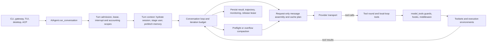

# Hermes code map

## Source snapshot

| Field | Value |
| --- | --- |
| Repository | `https://github.com/NousResearch/hermes-agent` |
| Commit reviewed | `b6b53c69a6ed49cb099cf1bfe76b5e6edd718e5a` |
| Local checkout | `/home/enoch/aworkspace/agents/hermes-agent` |
| Reviewed | 2026-09-13 |
| Main languages | Python runtime, TypeScript user interfaces |

Hermes is a broad personal-agent system. The core loop is Python, while the
product also includes a CLI, messaging gateway, TUI, desktop application,
dashboard, plugins, skills, terminal environments, cron, and an ACP adapter.
Its root and `agent/AGENTS.md` files are unusually valuable maps because they
name the runtime invariants and the production entry points.

## Mental model



<!-- agentlab:reference-code-map-steps -->

## What this map establishes

Hermes has three layers that matter when reasoning about behaviour. The facade
admits a cross-process lease and owns cleanup. `turn_context.py` prepares one
logical turn by hydrating history, staging the user message, refreshing tools,
starting memory work, and recording turn-start state. `conversation_loop.py`
runs bounded model/tool iterations.

Each model request is assembled from a request-local copy of the transcript.
That copy can be context-selected, sanitized, image-evicted, cache-marked, and
compacted without rewriting the canonical history. This is the key Hermes
distinction: what the model saw and what the session stored may be different
representations of the same turn. A useful telemetry model needs both.

## Identity and instruction files

Hermes distinguishes identity from workspace instructions. Its runtime
`SOUL.md`, normally `$HERMES_HOME/SOUL.md`, is the first system-prompt slot and
replaces the built-in identity when present. `AGENTS.md` is separate: Hermes
uses it for repository- or workspace-specific operating instructions, including
commands and coding conventions. This separation is intentional, not just a
file naming preference.

For the code trail, start with `agent/system_prompt.py`, `agent/prompt_builder.py`,
`agent/runtime_cwd.py`, and `agent/subdirectory_hints.py`. They establish how
the agent locates, reads, filters, and incorporates identity and project context.
Skills form a third instruction source. They provide reusable procedures and
must obey prompt-cache constraints during a live conversation.

## Evidence trail

| Question | Direct source path | What to verify there |
| --- | --- | --- |
| Who owns a logical turn? | `agent/turn_facade.py::TurnFacadeMixin.run_conversation` | Lease admission, relay coordination, scopes, interrupt handling, and cleanup. |
| What creates turn-local state? | `agent/turn_context.py::build_turn_context` | Session hydration, user staging, memory prefetch, tool refresh, persistence, and context identity. |
| What repeats? | `agent/conversation_loop.py::_run_conversation_turn` | API-call budget, response classification, recovery, tool rounds, and terminal exits. |
| What goes to a model? | `agent/turn_request_assembly.py::assemble_api_request` | Request-only copy, context-engine selection, sanitization, cache planning, MoA, and pressure measurement. |
| What happens to a tool call? | `agent/turn_tool_round.py::run_tool_round`, `model_tools.py::handle_function_call` | Loop-owned tools, guards, hook/middleware chain, dispatch, result transformation. |
| Where does recovery happen? | `agent/turn_recovery.py`, `agent/turn_retry_state.py` | Error classification, retry state, interruptible backoff, failure envelopes. |
| What is durable? | `agent/turn_facade_lease.py`, `agent/session_persistence.py`, `hermes_state.py` | Lease and session persistence. These are not evidence of workflow replay by themselves. |

## Follow one normal turn

1. A surface constructs or calls `AIAgent` from `run_agent.py`.
2. `AIAgent.run_conversation()` in `agent/turn_facade.py` admits a durable
   cross-process turn lease, establishes accounting and subagent scopes, then
   forwards to `agent/conversation_loop.py::run_conversation`.
3. The loop runs named turn phases. `turn_request_assembly.py` creates the
   provider request from transcript, tool set, context-engine output, prompt
   cache plan, and model-specific request details.
4. Provider and transport modules make the model call. The response intake and
   validation phases decide whether there is a final answer, an error, or a
   tool round.
5. `turn_tool_round.py` and `agent/tool_executor.py` intercept agent-local
   tools or pass requests to `model_tools.py::handle_function_call`, which
   dispatches into the selected toolset.
6. The loop appends tool results and repeats. Preflight and overflow phases may
   invoke context compression before another request.
7. Finalizer, session persistence, trajectory, logging, and monitoring paths
   retain the turn's result and release the turn lease.

## Directory map

| Path | Owns |
| --- | --- |
| `run_agent.py` | Public `AIAgent` facade and assembly interface |
| `agent/turn_*.py` | Individual phases of a conversation turn |
| `agent/conversation_loop.py` | Loop control, iteration budget, stop and recovery paths |
| `agent/prompt_builder.py`, `system_prompt.py` | Initial project context and system prompt construction |
| `agent/context_compressor.py`, `conversation_compression.py` | Context pressure, pruning, summaries, and compression recovery |
| `agent/memory_manager.py`, `memory_provider.py` | Memory-provider interface and orchestration |
| `agent/context_engine.py` | Context-engine extension interface |
| `agent/provider_*.py`, `transports/` | Provider selection and model-protocol adapters |
| `model_tools.py`, `toolsets.py`, `tools/` | Tool discovery, policy, schemas, and implementations |
| `tools/environments/` | Local, container, SSH, and remote terminal environments |
| `gateway/` | Messaging sessions, channels, delivery, and gateway lifecycle |
| `plugins/` | Optional providers, memory, context, and other extensions |
| `skills/`, `optional-skills/` | Packaged procedural instructions |
| `cron/` | Scheduled jobs and scheduler |
| `hermes_state.py`, `agent/session_persistence.py` | Session database facade and persistence path |
| `agent/monitoring/`, `trajectory.py` | Events, redaction, OTLP export, and recorded trajectories |
| `evals/`, `tests/` | Evaluation workloads and test suites |

## Capability-to-code map

| Responsibility | Status | Start here | What the reviewed code does |
| --- | --- | --- | --- |
| Harness identity and configuration | Present | `run_agent.py`, `agent/agent_init.py`, `config.yaml` handling | `AIAgent` accepts runtime identity, provider, model, session, toolset, and budget configuration; initialization resolves the effective runtime. |
| Instructions and precedence | Present | `agent/system_prompt.py`, `prompt_builder.py`, `subdirectory_hints.py` | Builds initial instructions and project context. The documented invariant keeps the system prompt byte-stable during a conversation. |
| Model interaction and streaming | Present | `agent/provider_registry.py`, `agent/transports/`, `turn_api_call.py` | Resolves providers and supports multiple request protocols, streaming, and provider-specific formats. |
| Reasoning and execution loop | Present | `agent/conversation_loop.py`, `agent/turn_*.py` | Runs a bounded synchronous loop split into explicit phases for request construction, response intake, tools, recovery, and finalization. |
| Context construction | Present | `agent/turn_context.py::build_api_messages`, `turn_request_assembly.py` | Produces request-local messages after context-engine selection, sanitization, cache planning, and token-pressure measurement. |
| Context growth and compaction | Present | `context_compressor.py`, `conversation_compression.py`, `turn_context_compaction.py` | Prunes old tool results, summarizes selected history, manages locks/timeouts, and handles provider-specific compaction paths. |
| Tool discovery | Present | `model_tools.py::discover_builtin_tools`, `toolsets.py`, `tools/registry.py` | Builds available tool sets from core tools, toolsets, plugins, capability checks, and session context. |
| Tool execution | Present | `model_tools.py::handle_function_call`, `agent/tool_executor.py`, `turn_tool_round.py` | Validates and dispatches calls, with agent-local tools intercepted before general dispatch. |
| Skills and dynamic capabilities | Present | `skills/`, `agent/skill_*.py`, `agent/skill_bundles.py` | Loads and manages skills. The project documents cache-aware skill changes to avoid changing the current prompt prefix. |
| State management | Present | `hermes_state.py`, `hermes_state_*.py` | Provides the session-database facade and related state operations. |
| Short-term memory | Present | `conversation_loop.py`, `agent/session_persistence.py` | Maintains the active transcript and restores persisted session state. |
| Long-term memory | Present | `agent/memory_provider.py`, `memory_manager.py`, `plugins/memory/` | Defines a provider interface and orchestrator for memory implementations. |
| Persistence and checkpoints | Present | `agent/session_persistence.py`, `hermes_state.py` | Persists sessions and turn-related state. Compression paths also persist and recover compression guards. |
| Durable execution | Partial | `agent/turn_facade.py`, `turn_facade_lease.py` | Uses a durable cross-process turn lease and session persistence. The reviewed code does not establish workflow-style durable replay of every model and tool step. |
| Retries, backoff, and timeouts | Present | `turn_retry_state.py`, `turn_api_error.py`, `retry_utils.py`, `deadline.py` | Classifies failures, tracks retry state, handles time limits, and participates in fallback and recovery paths. |
| Side effects and idempotency | Partial | `model_tools.py`, `tools/`, `agent/turn_recovery.py` | Many tools have side effects and the loop has recovery machinery. A single repository-wide idempotency contract was not identified in this pass. |
| Events, scheduling, and timers | Present | `cron/jobs.py`, `cron/scheduler.py`, `gateway/` | Supports scheduled work and event-driven channel delivery. |
| Suspension and resumption | Partial | `turn_facade_lease.py`, session persistence, gateway session code | Sessions and leases support continued use across process boundaries. A general suspended-agent continuation contract needs a narrower future reading pass. |
| Human input and approvals | Partial | `agent/tool_guardrails.py`, interactive surfaces, tool implementations | The code has guardrails and interactive interfaces. A single generic approval workflow was not confirmed in this pass. |
| Subagents and concurrency | Present | `tools/delegate_tool.py`, `agent/subagent_lifecycle.py`, `delegation_context.py` | Creates and tracks child agents, binds parent context, and restores process-global tool-resolution state around child runs. |
| Filesystem and workspace access | Present | `agent/runtime_cwd.py`, `tools/`, `tools/environments/` | Exposes file, terminal, browser, and environment-backed capabilities with working-directory rules. |
| Permissions and secrets | Present | `agent/secret_scope.py`, `secret_sources/`, `file_safety.py`, `tool_guardrails.py` | Resolves credentials through scoped sources and applies file/tool safety and guardrail paths. |
| Sandboxing and resource limits | Present | `tools/environments/`, `agent/iteration_budget.py`, `deadline.py` | Supports multiple execution environments and constrains loop iterations and time. Isolation guarantees vary by selected environment. |
| Lifecycle and cancellation | Present | `turn_facade.py`, `interrupt_*.py`, `client_lifecycle.py` | Admits, tracks, interrupts, finalizes, and releases each turn and its resources. |
| Common telemetry | Partial | `agent/monitoring/events.py`, `emitter.py`, `trajectory.py` | Emits internal events and trajectories. It is not Agent Harness Lab's normalized event schema. |
| Platform-specific telemetry | Present | `agent/monitoring/`, `trace_upload.py`, gateway observability | Records Hermes-specific monitoring, redaction, and optional export data. |
| Failure injection and recovery | Partial | `turn_recovery.py`, compression tests, `tests/agent/` | Contains recovery and extensive phase tests. A unified chaos-injection controller was not identified. |
| Run records, logs, and artifacts | Present | `trajectory.py`, `hermes_logging.py`, session persistence | Retains trajectories, profile-aware logs, session data, and tool-generated artifacts. |
| Evaluation and metrics | Present | `evals/`, `agent/monitoring/`, usage modules | Includes offline evaluations plus usage, cost, and health-oriented measurements. |
| Reproducibility | Partial | `config.yaml`, profile-aware state paths, `evals/` | Configuration and state are explicit, but no single lab-style run manifest was identified. |
| Local development and debugging | Present | `README.md`, `AGENTS.md`, `hermes logs`, TUI/dashboard | Documents local setup and provides several inspection surfaces. |
| Documentation and contributor experience | Present | root `AGENTS.md`, `website/docs/developer-guide/`, `tests/` | Maintains detailed area guidance, architectural invariants, and narrowly scoped test locations. |

## First files to read

```text
run_agent.py
agent/AGENTS.md
agent/turn_facade.py
agent/conversation_loop.py
agent/turn_request_assembly.py
agent/turn_tool_round.py
model_tools.py
toolsets.py
agent/context_compressor.py
agent/memory_manager.py
```

The root facade is useful for orientation. For real behaviour, move quickly to
the `agent/turn_*.py` phases. Hermes deliberately uses facade-plus-sibling files,
so the public facade is not where most detailed behaviour lives.

## What Agent Harness Lab should learn from Hermes

Hermes shows how a large harness can preserve locality without pretending that a
large loop is simple. Its explicit turn phases, cache invariants, toolset policy,
and environment adapters are worth studying. It also warns us against importing a
large system's surface wholesale: durability, side effects, approvals, and
cross-runtime recovery must be described by precise guarantees, not inferred from
the existence of sessions, retries, or many modules.

## Read next in Hermes's documentation

- [Architecture](https://github.com/NousResearch/hermes-agent/blob/b6b53c69a6ed49cb099cf1bfe76b5e6edd718e5a/website/docs/developer-guide/architecture.md) gives the project-wide view before individual turn phases.
- [Agent loop](https://github.com/NousResearch/hermes-agent/blob/b6b53c69a6ed49cb099cf1bfe76b5e6edd718e5a/website/docs/developer-guide/agent-loop.md) is the companion to `conversation_loop.py` and `turn_*.py`.
- [Prompt assembly](https://github.com/NousResearch/hermes-agent/blob/b6b53c69a6ed49cb099cf1bfe76b5e6edd718e5a/website/docs/developer-guide/prompt-assembly.md) explains the request-copy and prompt-prefix decisions.
- [Use SOUL.md with Hermes](https://github.com/NousResearch/hermes-agent/blob/b6b53c69a6ed49cb099cf1bfe76b5e6edd718e5a/website/docs/guides/use-soul-with-hermes.md) explains the identity file and why it differs from `AGENTS.md`.
- [Context compression and caching](https://github.com/NousResearch/hermes-agent/blob/b6b53c69a6ed49cb099cf1bfe76b5e6edd718e5a/website/docs/developer-guide/context-compression-and-caching.md) explains why compaction and cache boundaries affect turn correctness.
- [Tools runtime](https://github.com/NousResearch/hermes-agent/blob/b6b53c69a6ed49cb099cf1bfe76b5e6edd718e5a/website/docs/developer-guide/tools-runtime.md), [session storage](https://github.com/NousResearch/hermes-agent/blob/b6b53c69a6ed49cb099cf1bfe76b5e6edd718e5a/website/docs/developer-guide/session-storage.md), and [trajectory format](https://github.com/NousResearch/hermes-agent/blob/b6b53c69a6ed49cb099cf1bfe76b5e6edd718e5a/website/docs/developer-guide/trajectory-format.md) cover tools, state, and evidence.
