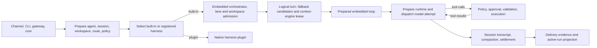

# OpenClaw code map

## Source snapshot

| Field | Value |
| --- | --- |
| Repository | `https://github.com/openclaw/openclaw` |
| Commit reviewed | `912685f442286233fbbd40762482d98598299497` |
| Local checkout | `/home/enoch/aworkspace/agents/openclaw` |
| Reviewed | 2026-09-13 |
| Main language | TypeScript |

OpenClaw is a full agent product and gateway with an embedded agent runtime. It
also supports replaceable native harness plugins. One terminology warning is
important: OpenClaw's plugin documentation uses **agent harness** for the
low-level executor of one already-prepared turn. Agent Harness Lab uses
**harness** for the broader assembled agent system. The two are related, but not
identical.

## Mental model



<!-- agentlab:reference-code-map-steps -->

The lower path is built-in only. A registered native harness receives a
prepared turn but may use another loop, transport, and tool-execution strategy.
It would be inaccurate to draw it as passing through the embedded loop.

## What this map establishes

OpenClaw separates preparation, executor selection, and execution more sharply
than the other two projects. The selection decision checks policy and support
facts for registered plugins. It chooses either the built-in runtime or one
plugin. The built-in runtime is intentionally not a plugin candidate.

Within the built-in route, `run-orchestrator.ts` handles orchestration around
execution. `run-entry.ts` treats a logical turn as a sequence of model
candidates and commits context-engine state only for the accepted winner.
`run-loop.ts` prepares runtime state and manages retries, compaction recovery,
tool-loop detection, abort state, permissions, settlement, and terminal
resolution. Calling all of that "the agent loop" loses the important structure.

## Identity and instruction files

OpenClaw has the richest file-based instruction model of the three. On a new
workspace it seeds `AGENTS.md`, `SOUL.md`, `IDENTITY.md`, `USER.md`, and
`BOOTSTRAP.md`. `SOUL.md` carries voice and stance. `AGENTS.md` carries
workspace operating rules. `IDENTITY.md` records the agent identity, `USER.md`
holds durable user directives, and `BOOTSTRAP.md` drives the one-time setup
conversation before it is removed.

The runtime injects bootstrap files according to explicit configuration and
character budgets. This is an actual context-management mechanism, not a loose
convention. It also means these files must be considered part of the effective
prompt and captured in a reproducible run record. Skills and memory files add
further conditional context, but they do not replace the distinct roles of the
five bootstrap files.

## Evidence trail

| Question | Direct source path | What to verify there |
| --- | --- | --- |
| Who selects the executor? | `src/agents/harness/selection-decision.ts` | Built-in versus registered-plugin policy, support checks, and fail-closed plugin selection. |
| What begins a built-in run? | `src/agents/embedded-agent-runner/run-orchestrator.ts::runEmbeddedAgent` | Workspace/lane work, CLI eligibility, run preparation, and prepared-loop dispatch. |
| How are model fallbacks scoped? | `src/agents/embedded-agent-runner/run-entry.ts::runEmbeddedAgentEntry` | Logical-turn lease, model candidates, delivery evidence, selected-harness preparation, accepted-result commit. |
| What owns attempt behaviour? | `src/agents/embedded-agent-runner/run-loop.ts::runPreparedEmbeddedLoop` | Runtime preparation, retry budget, context recovery, permissions, cancellation, compaction and settlement. |
| Where are tool protections applied? | `src/agents/agent-tools.before-tool-call.approval.ts`, `agent-tools.execution-*.ts` | Approval, policy, validation, and execution preparation. |
| What is session and compaction state? | `src/agents/sessions/`, `embedded-agent-runner/history.ts`, `compact*.ts` | Transcript/resource loading and compaction/checkpoint paths. |

## Follow one normal embedded turn

1. A channel, CLI command, scheduled task, or gateway event resolves an agent,
   session, workspace, model configuration, credentials, and tool policy.
2. `src/agents/harness/selection-decision.ts` decides whether the built-in
   OpenClaw runtime or a registered native harness owns the prepared turn.
3. For the built-in path, `src/agents/embedded-agent-runner/run.ts` delegates to
   the run orchestrator. Its entry, state, resource-loading, history, and loop
   modules prepare and execute the attempt loop.
4. `packages/agent-core/` supplies reusable loop, message, compaction, prompt,
   skill, and session-storage contracts; `src/agents/runtime/` adapts those
   contracts to OpenClaw's LLM runtime and plugin SDK.
5. Tool calls pass through tool schemas, policy, execution preparation, and
   before/after hooks. Protected calls can use the explicit before-tool-call
   approval path.
6. The runner appends results to the session transcript, compacts history when
   required, records active-run/delivery evidence, and returns control to the
   originating surface.

The exact setup varies significantly by channel, configuration, sandbox mode,
and whether a native harness plugin replaces the embedded loop.

## Directory map

| Path | Owns |
| --- | --- |
| `src/agents/embedded-agent-runner/` | Built-in turn runner: orchestration, loop, history, compaction, run state, resources, and recovery tests |
| `packages/agent-core/` | Reusable loop primitives, harness types, messages, prompts, skills, compaction helpers, and session-storage contracts |
| `src/agents/runtime/` | OpenClaw adapters between agent core and the plugin-SDK LLM runtime |
| `src/agents/sessions/` | Session persistence, resource discovery, extension loading, prompt templates, skills, themes, and renderers |
| `src/agents/harness/` | Built-in versus plugin harness selection, lifecycle hooks, context engine, and compaction recovery |
| `src/agents/agent-tools*.ts` | Tool definitions, schemas, policy, validation, approval adapters, and execution preparation |
| `src/agents/agent-hooks/` | Context pruning, instruction, and compaction safeguards around an agent turn |
| `src/llm/` | Provider registry, request transport, streaming, and model normalization |
| `src/memory/`, `src/memory-host-sdk/` | Memory files, provenance, storage, and host integration |
| `src/agents/subagents/` | Child-agent lifecycle, terminal outcome, requester linkage, and service state |
| `src/cron/` | Declarative scheduled jobs, persistence, delivery plans, wake-ups, and task-run events |
| `src/agents/sandbox/` | Sandbox configuration and execution integration; workspace rules also live in documentation and agent configuration |
| `src/gateway/`, channel modules | Inbound events, routing, delivery, session targeting, and process lifecycle |
| `docs/agent-runtime-architecture.md` | The project's own high-level explanation of the runtime boundary |

## Capability-to-code map

| Responsibility | Status | Start here | What the reviewed code does |
| --- | --- | --- | --- |
| Harness identity and configuration | Present | `src/agents/harness/selection-decision.ts`, `src/agents/harness/registry.ts` | Resolves the built-in runtime or a registered native harness after OpenClaw has prepared the turn. |
| Instructions and precedence | Present | `src/agents/sessions/`, `src/agents/agent-hooks/`, `packages/agent-core/` | Loads session resources, prompt templates, skills, and instruction-oriented hooks before the executor runs. |
| Model interaction and streaming | Present | `src/llm/`, `src/agents/runtime/` | Normalizes model/provider selection and adapts streamed LLM interaction to the agent core. |
| Reasoning and execution loop | Present | `src/agents/embedded-agent-runner/run-orchestrator.ts`, `run-loop.ts`, `packages/agent-core/` | The embedded runtime owns the built-in attempt loop; a native harness can replace this low-level executor. |
| Context construction | Present | `resource-loader.ts`, `history.ts`, `src/agents/sessions/`, `agent-hooks/` | Combines session history, workspace resources, prompts, skills, and turn-level pruning/safeguards. |
| Context growth and compaction | Present | `embedded-agent-runner/compact.ts`, `compaction-*.ts`, `src/agents/harness/compaction-recovery.ts` | Contains compaction, overflow handling, and recovery paths rather than treating history as unbounded. |
| Tool discovery | Present | `src/agents/agent-tools*.ts`, `src/agents/harness/tool-surface-bridge.ts` | Defines the exposed tool surface through schemas, authority, policy, and harness bridging. |
| Tool execution | Present | `agent-tools.execution-preparer.ts`, `agent-tools.execution-validation.ts` | Prepares and validates calls, then applies before/after adapters and policy around execution. |
| Skills and dynamic capabilities | Present | `src/agents/sessions/`, `packages/agent-core/` | Supports session-scoped resource discovery and in-session extension/skill loading. |
| State management | Present | `src/agents/sessions/`, `embedded-agent-runner/run-state.ts` | Maintains session and active-run state separately from a single transient model call. |
| Short-term memory | Present | `embedded-agent-runner/history.ts`, `src/agents/sessions/` | Manages the current transcript/history for a session and runner attempt. |
| Long-term memory | Present | `src/memory/`, `src/memory-host-sdk/` | Provides memory-file, provenance, storage, and host-SDK paths. The retrieval policy should be read separately before comparing quality. |
| Persistence and checkpoints | Present | `src/agents/sessions/`, `run-state.ts`, `src/cron/service.*` | Persists sessions, scheduled work, and run-oriented state. |
| Durable execution | Partial | Session persistence, `src/cron/`, `src/agents/harness/compaction-recovery.ts` | Persists important state and has recovery machinery. This review did not establish generalized workflow replay or a durable-step guarantee for every model/tool action. |
| Retries, backoff, and timeouts | Present | `embedded-agent-runner/retry-*.ts`, `failure-*.ts`, `run-timeout-override` tests | Contains explicit retry, failure classification, and timeout paths around embedded runs. |
| Side effects and idempotency | Partial | Tool policy/execution modules, `src/cron/service.persists-delivered-status.test.ts` | Controls and records side-effecting delivery/tool paths. A repository-wide idempotency ledger or exactly-once contract was not established in this pass. |
| Events, scheduling, and timers | Present | `src/cron/`, gateway modules | Runs declarative scheduled jobs and routes external gateway/channel events. |
| Suspension and resumption | Partial | `embedded-agent-runner/run-orchestrator.suspension.test.ts`, session state | The runner has suspension-oriented coverage and durable session state. The public, cross-surface continuation contract needs a dedicated reading pass. |
| Human input and approvals | Present | `agent-tools.before-tool-call.approval.ts`, `src/agents/harness/gateway-question-dispatch.ts` | Provides tool-call approval and gateway-question dispatch rather than relying only on prompt wording. |
| Subagents and concurrency | Present | `src/agents/subagents/` | Tracks child-agent lifecycle, terminal outcomes, requester attachment, and service state. |
| Filesystem and workspace access | Present | `src/agents/sessions/`, workspace documentation, tool modules | Uses per-agent workspaces and resource loading. The workspace is not automatically a hard sandbox. |
| Permissions and secrets | Present | `agent-tools.policy.ts`, session permission modules, runtime configuration | Centralizes tool authority and policy before execution; credentials are resolved before the low-level harness is invoked. |
| Sandboxing and resource limits | Present | `src/agents/sandbox/`, `docs/concepts/agent-workspace.md` | Supports sandboxed workspace modes. Isolation depends on selected sandbox configuration, not simply on having a workspace. |
| Lifecycle and cancellation | Present | `run-orchestrator.ts`, `src/agents/harness/lifecycle-*.ts`, gateway lifecycle | Separates selection, attempt lifecycle, settlement/finalization, and delivery. |
| Common telemetry | Partial | `embedded-agent-runner/active-run-projections.ts`, `delivery-evidence.ts` | Retains runtime evidence, but it is not Agent Harness Lab's normalized event model. |
| Platform-specific telemetry | Present | Active-run projections, delivery evidence, gateway logs | Records OpenClaw-specific execution and delivery information for its own operational surfaces. |
| Failure injection and recovery | Partial | Embedded-runner failure, overflow, retry, compaction, and suspension tests | Has substantial failure/recovery coverage. A single user-configurable chaos controller was not identified. |
| Run records, logs, and artifacts | Present | Sessions, history, active-run projections, delivery evidence | Retains session transcripts and runtime/delivery evidence; artifact ownership varies by tool and channel. |
| Evaluation and metrics | Partial | Runtime and integration tests across `src/agents/` and `src/cron/` | The project has broad behaviour tests. A neutral cross-harness benchmark/result format is outside its product runtime. |
| Reproducibility | Partial | Configuration, session storage, cron persistence, test fixtures | Operational inputs are explicit, but there is no Agent Harness Lab-style immutable run manifest in the reviewed path. |
| Local development and debugging | Present | `README.md`, `docs/`, runtime architecture document, focused tests | Documents development and exposes distinct runtime, session, gateway, and plugin boundaries for diagnosis. |
| Documentation and contributor experience | Present | `AGENTS.md`, `docs/agent-runtime-architecture.md`, `docs/plugins/sdk-agent-harness.md` | Clearly documents the embedded/native-harness split and important runtime ownership boundaries. |

## First files to read

```text
docs/agent-runtime-architecture.md
src/agents/harness/selection-decision.ts
src/agents/embedded-agent-runner/run.ts
src/agents/embedded-agent-runner/run-orchestrator.ts
src/agents/embedded-agent-runner/run-loop.ts
src/agents/embedded-agent-runner/history.ts
src/agents/embedded-agent-runner/compact.ts
src/agents/agent-tools.before-tool-call.approval.ts
src/agents/sessions/
packages/agent-core/
```

Read the architecture document first, then the selection decision. That prevents
the easy mistake of assuming the embedded runner owns model choice, credentials,
instructions, tools, channels, and policy by itself. It does not: much of that
work is deliberately completed before the low-level executor receives a turn.

## What Agent Harness Lab should learn from OpenClaw

OpenClaw demonstrates a boundary worth preserving in this laboratory: a system
can prepare an agent turn and separately choose the code that executes that
turn. Its embedded/native split, session resources, approval interception,
compaction recovery, and scheduled-job persistence are useful reference points.
For fair comparison, Agent Harness Lab should record which layer is being
evaluated: a turn executor alone, the broader prepared runtime, or the complete
product environment. Treating those as one interchangeable "harness" would hide
the most interesting architectural differences.

## Read next in OpenClaw's documentation

- [Agent runtime architecture](https://github.com/openclaw/openclaw/blob/912685f442286233fbbd40762482d98598299497/docs/agent-runtime-architecture.md) is the required starting point for the embedded-runtime boundary.
- [SOUL.md personality guide](https://github.com/openclaw/openclaw/blob/912685f442286233fbbd40762482d98598299497/docs/concepts/soul.md), [bootstrapping](https://github.com/openclaw/openclaw/blob/912685f442286233fbbd40762482d98598299497/docs/start/bootstrapping.md), and [workspace/bootstrap configuration](https://github.com/openclaw/openclaw/blob/912685f442286233fbbd40762482d98598299497/docs/gateway/config-agents/workspace-and-bootstrap.md) explain the instruction-file lifecycle and injection controls.
- [Core ownership](https://github.com/openclaw/openclaw/blob/912685f442286233fbbd40762482d98598299497/docs/plugins/sdk-agent-harness/core-ownership.md) explains what OpenClaw resolves before invoking a native harness.
- [Harness selection policy](https://github.com/openclaw/openclaw/blob/912685f442286233fbbd40762482d98598299497/docs/plugins/sdk-agent-harness/selection-policy.md) and [attempt runtime](https://github.com/openclaw/openclaw/blob/912685f442286233fbbd40762482d98598299497/docs/plugins/sdk-agent-harness/attempt-runtime.md) pair with the selection and run-entry code.
- [Sessions and results](https://github.com/openclaw/openclaw/blob/912685f442286233fbbd40762482d98598299497/docs/plugins/sdk-agent-harness/sessions-and-results.md) explains the prepared-turn contract and result ownership.
- [Workspace and bootstrap](https://github.com/openclaw/openclaw/blob/912685f442286233fbbd40762482d98598299497/docs/gateway/config-agents/workspace-and-bootstrap.md) and [sandboxing](https://github.com/openclaw/openclaw/blob/912685f442286233fbbd40762482d98598299497/docs/gateway/sandboxing.md) explain why a workspace is not automatically isolation.
- [Tool policy](https://github.com/openclaw/openclaw/blob/912685f442286233fbbd40762482d98598299497/docs/gateway/config-tools/tool-policy.md), [exec approvals](https://github.com/openclaw/openclaw/blob/912685f442286233fbbd40762482d98598299497/docs/tools/exec-approvals.md), and [sessions, compaction, and streaming](https://github.com/openclaw/openclaw/blob/912685f442286233fbbd40762482d98598299497/docs/gateway/config-agents/heartbeat-compaction-and-streaming.md) cover tool controls and long-lived session behavior.
