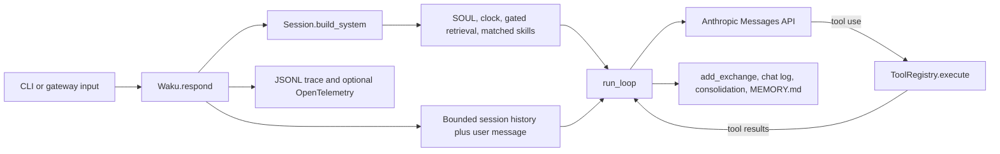

# Waku code map

## Source snapshot

| Field | Value |
| --- | --- |
| Repository | `https://github.com/ShenSeanChen/waku-agent` |
| Commit reviewed | `4a615acd9dff66015c74b96a9a11e92963fbeb35` |
| Local checkout | `/home/enoch/aworkspace/agents/waku-agent` |
| Reviewed | 2026-09-13 |
| Main language | Python |

Waku is deliberately a readable, local-first harness. It is the closest of the
three projects to a control implementation because its normal turn path is small
enough to follow without a framework. It does have optional graph routing, MCP,
gateway integrations, and a `pi`-backed delegation tool, but those sit around a
plain model-tool loop.

## Mental model



<!-- agentlab:reference-code-map-steps -->

This shows the default full-turn path. When `graph_workflows` is enabled,
`Waku.respond()` first tries a triage graph. The graph can return a quick answer
or call the same `_run_full_turn()` method shown above. If it fails, `respond()`
falls back to the full path.

## What this map establishes

Waku keeps the durable conversation record and the model's working prompt
separate. `Session.history` is an in-process tail. SQLite `chat_log` is the
durable record. At the start of a turn, `build_system()` conditionally retrieves
semantic and episodic memory and loads matching procedural skills. It sends only
the configured recent history window to `run_loop()`.

The loop does not persist. It mutates its `messages` list while the model
requests tools, then returns a `LoopResult`. `Waku.respond()` owns the commit
after that result: it records the exchange, runs periodic memory consolidation,
updates the human-readable `MEMORY.md` mirror, and closes the trace.

## Identity and instruction files

Waku has a real `SOUL.md` and it is a first-class part of prompt construction.
`waku/runtime/session.py::load_soul()` reads `$WAKU_HOME/SOUL.md`, creating it
from `DEFAULT_SOUL` on first use. `Session.build_system()` places that content
first, then adds time, model facts, retrieved memory, and matched skills.

Waku does not use an `AGENTS.md`-style workspace instruction file in the
reviewed runtime. Its closest equivalent for repeatable operating procedures is
the skill loader: `SKILL.md` files are selected by `Memory.matching_skills()`
and injected only when they match the user message. That makes identity global,
while procedural instructions are conditional.

## Evidence trail

| Question | Direct source path | What to verify there |
| --- | --- | --- |
| What builds the running system? | `waku/app.py::Waku.__init__` | Configuration, database, model client, memory, tools, session, and tracing are composed in one place. |
| What happens on a full turn? | `waku/app.py::Waku.respond`, `_run_full_turn` | Optional graph entry, fallback, bounded history, post-loop persistence. |
| What repeats during a turn? | `waku/loop/agent.py::run_loop` | Model request, assistant message, tool execution, tool-result message, iteration limit. |
| What enters the prompt? | `waku/runtime/session.py::Session.build_system` | Soul, local clock, gated recall, and matched skills. |
| What survives restart? | `waku/memory/__init__.py`, `waku/db.py` | SQLite chat log, facts, episodes, and generated memory mirror. |
| What evidence survives a run? | `waku/ops/tracing.py::Tracer` | JSONL events always, optional OpenTelemetry spans and usage ledger. |

## Follow one normal turn

1. A CLI, dashboard, Telegram, Discord, voice, or WhatsApp gateway calls
   `Waku.respond()` in `waku/app.py`.
2. `Waku` is assembled in `Waku.__init__`: settings, SQLite connection, model
   client, `Memory`, `ToolRegistry`, `Session`, and `Tracer`.
3. `Session.build_system()` in `waku/runtime/session.py` loads `SOUL.md`, adds
   local time and model details, asks the retrieval gate whether to fetch memory,
   and appends matching skills.
4. `_run_full_turn()` windows recent chat history and calls `run_loop()`.
5. `run_loop()` in `waku/loop/agent.py` calls the model, executes every requested
   tool through `ToolRegistry.execute()`, appends tool results, and repeats until
   the model produces no tool calls or the iteration limit is reached.
6. `Session.add_exchange()` records the completed exchange. `Memory` may
   consolidate chats into facts and episodes, then refreshes `MEMORY.md`.
7. `Tracer` writes ordered JSONL events and can export OpenTelemetry spans.

## Directory map

| Path | Owns |
| --- | --- |
| `waku/app.py` | Composition root and one-turn lifecycle |
| `waku/loop/` | Model providers and the model-tool loop |
| `waku/runtime/` | Session history and prompt assembly |
| `waku/memory/` | Semantic, episodic, and procedural memory; retrieval and consolidation |
| `waku/tools/` | Core tools, MCP bridge, optional Apple/GitHub tools, and experimental delegation |
| `waku/graph/` | Optional graph workflows around the normal loop |
| `waku/gateway/` | CLI and messaging-channel adapters plus worker ownership |
| `waku/ops/` | Tracing, dashboard, evaluations, release gate, and operations views |
| `evals/` | Deterministic and model-judged evaluation suites |
| `skills/` | Bundled and community `SKILL.md` procedural memory |

## Capability-to-code map

| Responsibility | Status | Start here | What the reviewed code does |
| --- | --- | --- | --- |
| Harness identity and configuration | Present | `waku/config.py`, `waku/app.py` | `Settings` selects provider, model, limits, paths, and optional features; `Waku` assembles the runtime. |
| Instructions and precedence | Present | `waku/runtime/session.py::load_soul`, `Session.build_system` | Creates or reads `SOUL.md`, then appends clock, model facts, retrieved memory, and matched skills. |
| Model interaction and streaming | Present | `waku/loop/agent.py`, `waku/loop/models.py` | Uses an Anthropic-shaped client, with an OpenAI-compatible adapter and streaming fallback. |
| Reasoning and execution loop | Present | `waku/loop/agent.py::run_loop` | Plain bounded loop: request, inspect tool uses, execute tools, append results, repeat. |
| Context construction | Present | `waku/app.py::_run_full_turn`, `waku/runtime/session.py` | Combines system text, a bounded history window, the new user message, gated memory, and skills. |
| Context growth and compaction | Partial | `waku/app.py::_run_full_turn`, `Settings.history_turns` | Bounds in-memory history by a fixed turn window. It does not summarize or compact the live transcript. |
| Tool discovery | Present | `waku/tools/__init__.py::build_registry` | Registers core tools, then conditionally adds memory, experimental, Apple, GitHub, and MCP tools. |
| Tool execution | Present | `waku/tools/registry.py::ToolRegistry.execute` | Executes named functions and converts exceptions into model-visible error text. |
| Skills and dynamic capabilities | Present | `waku/memory/procedural/`, `waku/memory/__init__.py`, `skills/` | Matches `SKILL.md` content against the user message and injects matching instructions. |
| State management | Present | `waku/db.py`, `waku/memory/__init__.py` | SQLite holds chat logs, facts, episodes, and related state. |
| Short-term memory | Present | `waku/runtime/session.py::Session.history` | Keeps per-session conversation history in memory and reloads a bounded tail on session switch. |
| Long-term memory | Present | `waku/memory/semantic/`, `episodic/`, `procedural/` | Stores facts and episodes, with skills as procedural memory; `MEMORY.md` is a generated view. |
| Persistence and checkpoints | Partial | `waku/db.py`, `Session.add_exchange` | Persists completed exchanges and memory state, but no per-step model/tool checkpoint protocol was found. |
| Durable execution | Not found | `waku/app.py`, `waku/loop/agent.py` | No workflow runtime or durable replay mechanism was found in the reviewed normal loop. |
| Retries, backoff, and timeouts | Partial | `waku/loop/models.py`, `waku/tools/experimental.py` | Provider adapter handles a narrow compatibility retry; delegated work has a timeout. The main loop has no general retry policy. |
| Side effects and idempotency | Partial | `waku/tools/calendar.py`, `messages.py`, `notes.py` | Tools cause external or persistent changes, but no shared idempotency-key boundary was found. |
| Events, scheduling, and timers | Partial | `waku/ops/`, `waku/tools/experimental.py` | Experimental cron is described as a stub; gateway input is event-driven but not a durable event scheduler. |
| Suspension and resumption | Not found | `waku/gateway/runner.py` | Gateway workers serialize turns, but the reviewed code has no deliberate suspended-turn continuation model. |
| Human input and approvals | Not found | `waku/tools/` | No general approval gate was found in the reviewed core. |
| Subagents and concurrency | Partial | `waku/tools/experimental.py::make_delegate_tool`, `waku/tools/_env.py` | Optional `delegate_task` launches `pi` with a reduced environment and captures a transcript. |
| Filesystem and workspace access | Partial | `waku/tools/workspace.py`, `waku/tools/experimental.py` | Delegation can use an explicit directory or create a scratch workspace; direct core file tools are not the main design. |
| Permissions and secrets | Partial | `waku/config.py`, `waku/tools/_env.py`, `waku/gateway/runner.py` | Reads credentials from local configuration and strips selected variables from delegate environments. |
| Sandboxing and resource limits | Partial | `waku/tools/workspace.py`, `waku/tools/experimental.py` | Delegation uses scratch directories and subprocess timeouts. It is not a general isolation boundary. |
| Lifecycle and cancellation | Partial | `waku/gateway/runner.py`, `Waku.close` | Gateway runners own one worker thread and close agent/MCP resources; no run-wide cancellation protocol was found. |
| Common telemetry | Present | `waku/ops/tracing.py::Tracer` | Emits ordered turn, model, tool, gate, consolidation, graph, and end events as JSONL. |
| Platform-specific telemetry | Present | `waku/ops/tracing.py`, `waku/ops/dashboard.py` | Adds model/provider token usage and dashboard-focused event metadata. |
| Failure injection and recovery | Partial | `evals/`, `waku/graph/` | Graph routing fails open to the normal loop. Deterministic tests cover failures, but a general fault-injection engine was not found. |
| Run records, logs, and artifacts | Present | `.waku/traces/`, `.waku/usage.jsonl`, `.waku/outbox/` | Stores traces, usage, memory, chat state, and delegated-task logs locally. |
| Evaluation and metrics | Present | `evals/deterministic/`, `evals/judge/`, `waku/ops/release_gate.py` | Keeps deterministic tests, model-judged evaluations, scoring, and a release gate. |
| Reproducibility | Partial | `waku/config.py`, `evals/`, `.waku/` state | Settings and local artifacts are visible, but a standardized full run manifest was not found. |
| Local development and debugging | Present | `README.md`, `waku/ops/dashboard.py`, `waku/ops/show_trace.py` | Documents local startup and provides a dashboard, trace viewer, and database inspection. |
| Documentation and contributor experience | Present | `README.md`, `docs/architecture.md`, `evals/` | The project intentionally connects diagrams and walkthroughs to code paths. |

## First files to read

```text
waku/app.py
waku/loop/agent.py
waku/runtime/session.py
waku/tools/__init__.py
waku/memory/__init__.py
waku/memory/retrieval_gate.py
waku/memory/consolidation.py
waku/ops/tracing.py
```

Read those eight files before exploring provider adapters, gateway integrations, or the
dashboard. They explain most of the system without forcing you through the optional paths.

## What Agent Harness Lab should learn from Waku

Waku makes a strong case for a small composition root, a visible loop, and a trace
format that a person can read without a backend. Its deliberate limits are equally
useful: process-local state and tool-error-as-text are understandable, but they do
not establish durable recovery or idempotent side effects. Those are experiments for
our standalone harness, not properties to assume.

## Read next in Waku's documentation

- [Architecture overview](https://github.com/ShenSeanChen/waku-agent/blob/4a615acd9dff66015c74b96a9a11e92963fbeb35/docs/architecture.md) explains the composition root and normal turn.
- [Interactive architecture board](https://github.com/ShenSeanChen/waku-agent/blob/4a615acd9dff66015c74b96a9a11e92963fbeb35/docs/architecture.html) draws the product-level system after you read `waku/app.py`.
- [Memory backends playbook](https://github.com/ShenSeanChen/waku-agent/blob/4a615acd9dff66015c74b96a9a11e92963fbeb35/docs/memory-backends-playbook.md) explains the supported semantic and episodic store choices.
- [Memory-native examples](https://github.com/ShenSeanChen/waku-agent/blob/4a615acd9dff66015c74b96a9a11e92963fbeb35/examples/memory-native/README.md) shows those alternatives outside the main turn loop.
- [Tiny memory agent](https://github.com/ShenSeanChen/waku-agent/blob/4a615acd9dff66015c74b96a9a11e92963fbeb35/examples/tiny_memory_agent.py) is the best small comparison implementation.
