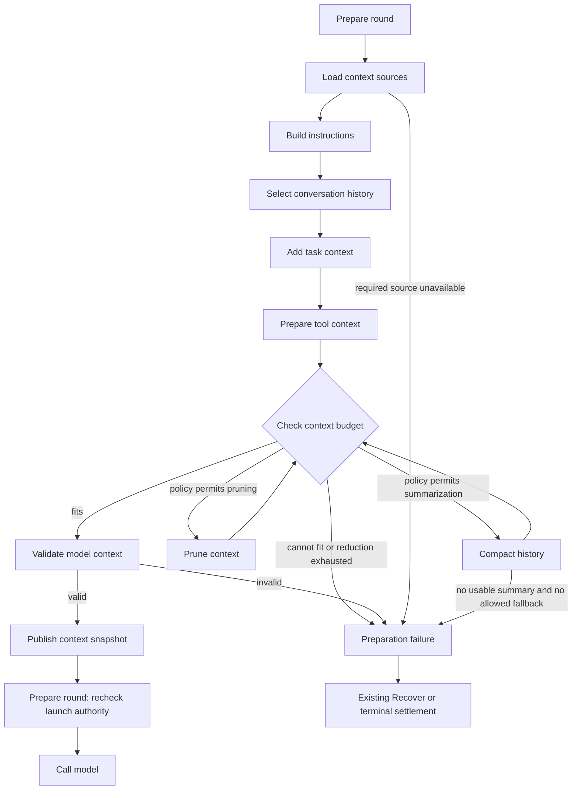

# Lina Context: source research and proposed architecture

## Scope and recommendation

Reviewed 2026-10-07. This report proposes Lina's next design block, **Context**.
It does not add nodes, schemas or simulation behavior to Studio, and it does not
establish measured performance improvements. The local baseline is
`5ecf8eb29c3e578f94fa4dfde92fbe624ba240fc`.

Context should construct the information supplied to a model invocation from
versioned instructions, conversation history, the current task, selected outside
information, tool definitions and tool results. It should expose small choices
inside that process, rather than require replacement of the entire block.

Recommended starting design: a recent-history projection, explicit instruction
ordering, task material with source references, the permitted tool catalog, a
budget check, and visible pruning/compaction branches. Preserve the original
records alongside derived views. Start with synthetic examples and scripted
branches in Studio; model-backed comparisons come later.

Supporting source studies:

- [Hermes and OpenClaw](context-hermes-openclaw.md).
- [Pi and Waku](context-pi-waku.md).
- Earlier detailed [Hermes context lifecycle](../context-lifecycles/hermes.md).

Source implementations are evidence for mechanisms and boundaries. They are
not proof that one default is universally best or that all four agents offer
identical guarantees. The pair studies pin code and label mutable documentation
separately. No agent/provider runs or benchmark replications were performed.

## What context means here

Three records must remain distinguishable:

| Record | Meaning | Owner |
| --- | --- | --- |
| Execution/conversation record | Inputs, assistant messages, tool calls/results, controls, artifacts and identities retained under a stated persistence policy | Turn Execution and State/persistence |
| Model-visible context | A selected, ordered representation of instructions and evidence for one model invocation | Context |
| Provider request | Model-visible context encoded into the provider's roles, content blocks, tool definitions and supported cache controls | Model Interface |

Memory is a source of retained information. Context decides which permitted
memory results appear in a particular request. A summary of old conversation
history is a derived context artifact; it is not automatically a long-term
memory write. Prompt caching reuses provider computation; it is not recall of
facts absent from the request.

The current inspector's node input field `context` means locally supplied
coordinator dependencies, such as authority and counters. That field is broader
than model-visible context. Keep that existing contract; name the latter
`modelContext` or `contextSnapshot` in future handoffs to avoid ambiguity.
See [node contracts](node-contracts.md#event-context-and-outcomes).

## What the four agents actually do

| Agent | Context construction | History reduction and refresh | Child context |
| --- | --- | --- | --- |
| Hermes | Ordered instruction tiers, frozen prompt snapshots and a request-selection hook | Request-only selection is distinct from archived active-history compaction; prompt/memory refresh at declared boundaries | Task/context and fresh history; project instructions added separately; built-in memory suppressed in the pinned constructor |
| OpenClaw | System/bootstrap instructions, repaired history and context-engine assembly | Batched history limiting, tool-result projections, budget preflight and compaction | Isolated task context or an explicit eligible transcript fork |
| Pi | Ordered resources/instructions and active-branch transcript projection, followed by transformation/conversion | Token-triggered summary with retained boundaries; original entries and context edits remain inspectable | Official extension starts fresh processes with task, specialist instructions and project resources |
| Waku | Per-turn system prompt with gated memory/skills and recent completed exchanges; live tool feedback within a turn | Exchange-count window; no general token-triggered history compactor found in the reviewed loop | Delegates to external Pi; parent memory/history is not automatically transferred |

Evidence for each row is in the pinned
[Hermes/OpenClaw study](context-hermes-openclaw.md) and
[Pi/Waku study](context-pi-waku.md). This comparison describes observed source
behavior, without ranking implementations. In particular, Waku memory
consolidation is not the same thing as model-history compaction.

## Primary evidence beyond the four implementations

Anthropic describes combining upfront context with on-demand tools, and presents
compaction, structured notes and subagents as distinct ways of supporting long
work. This supports evaluating when information enters the request rather than
assuming every available file belongs in the initial prompt.
[Effective context engineering](https://www.anthropic.com/engineering/effective-context-engineering-for-ai-agents).

The *Lost in the Middle* study changes relevant-information position and input
length in multi-document QA and key-value retrieval. Its results motivate
position-sensitive tests; they do not directly establish agent task success or
performance on today's Lina model choices.
[Paper](https://arxiv.org/abs/2307.03172).

*The Complexity Trap* compares observation masking and model-generated
summaries in SWE-agent on SWE-bench Verified, with an additional OpenHands probe.
The reported results make masking a credible simple baseline, not a universal
winner. Its experiments concern coding agents with verbose observations. Test
our own task mix, and count summarizer calls and total trajectory cost.
[Paper, v3](https://arxiv.org/html/2508.21433v3),
[authors' code and configurations](https://github.com/JetBrains-Research/the-complexity-trap).

Provider features belong at a separate boundary. Claude's documentation describes
prefix caching and cache usage fields, and server-side clearing of old tool
results using placeholders. Those features provide additional implementations
of context policies; they are not portable assumptions or something Lina's
current simulator measures.
[Prompt caching](https://platform.claude.com/docs/en/build-with-claude/prompt-caching),
[Context editing](https://platform.claude.com/docs/en/build-with-claude/context-editing).

## Existing Lina handoff and gaps

`Prepare round` already requests assembled context and retains turn state,
round identity and execution authority. It currently hands a provisional
`modelRequest` to `Call model`, and its failure variants include context pressure.
The Context block is an empty reserved region. The simulation uses fixed request
fixtures, not a real context builder.
Sources: [execution nodes](../../../apps/web/src/features/lina/executionBlock.ts),
[execution contracts](../../../apps/web/src/features/lina/contracts/turnExecution.ts),
[planned regions](../../../apps/web/src/features/lina/plannedBlocks.ts).

The next design should expand that preparation handoff, rather than create
another Input path or another agent loop:

```text
Input → admitted turn → Start turn → Check execution limits → Prepare round
                                                               │
                                                         Context block
                                                               │
                                         Prepare round rechecks launch authority
                                                               │
                                                           Call model
                                                               │
                   tool outcomes / accepted guidance → next Prepare round
```

Context must run again when a new logical round needs updated evidence. This
does not mean every source must be reread or every instruction rebuilt each
round. Cache versioned source snapshots and rebuild only according to an
explicit refresh policy. A normal transport retry can reuse its original
snapshot; a context-overflow recovery needs a new projection revision of the
same logical round. Context work does not reset counters or grant ownership.

A concrete fixture gap should be repaired when implementing this block:
`continuedRequest` currently illustrates user text followed by generic tool
results without an explicit corresponding assistant tool-call message. Those
fixtures prove retained outcomes, not a valid provider transcript. Add linked
call/result records and tool schema definitions or resolvable catalog references.
Do not fabricate arbitrary calls to repair history. Preserve canonical call/result
records and derive next-turn views; a completed-exchange text record such as
Waku's is not interchangeable with live provider tool-call/result blocks. The calculator examples
must remain examples, not assumptions about every tool.

## Proposed nodes

These are proposed design responsibilities, not existing runtime modules. The
names are intentionally plain. The supporting studies identify corresponding
mechanisms in the source agents; splitting them into ten visible Lina nodes is
our presentation choice, not a claimed industry-standard node count.

| Node | Receives | Produces and possible branches | Source grounding |
| --- | --- | --- | --- |
| **Load context sources** | Agent/conversation/turn/round IDs, history revision, configured policies and allowed source references | Versioned source bundle or explicit missing/denied-source outcome; references can stay unloaded | All four restore or construct a session view; Pi branches its transcript |
| **Build instructions** | Harness, agent and applicable project instructions plus instruction policy | Ordered instruction sections with origin/version; required-source failure is explicit | Hermes prompt tiers; OpenClaw bootstrap/system prompt; Pi resource loader; Waku system prompt |
| **Select conversation history** | Active branch or session view, summaries, current input and round evidence | Selected message groups plus included/excluded IDs and reasons | Pi branch projection; OpenClaw history limiter; Waku recent exchanges; Hermes selection seam |
| **Add task context** | Explicit attachments/references, permitted retrieval results, task-local notes and future child task packet | Bounded evidence sections with source refs and omission/error information | Hermes explicit references; Waku memory/skill selection; Pi file/skill resources |
| **Prepare tool context** | Allowed tool catalog and selected call/result groups | Versioned tool definitions and shaped observations with call IDs and artifact refs | All four loop tool feedback; Hermes spill/shaping; OpenClaw tool-result pruning |
| **Check context budget** | Full candidate context, provider capability estimate, output reservation and policy limits | Fits, reduction required, or cannot fit protected content | Hermes pressure checks; Pi compaction threshold; OpenClaw budget/compaction paths |
| **Prune context** | Candidate and chosen reduction policy | Reduced projection plus omission manifest, or no useful reduction | Observation masking, OpenClaw pruning and bounded Waku history |
| **Compact history** | Selected old history, preserved recent groups, previous summary, compaction policy | Derived summary and provenance; failure/cancellation retains prior valid view | Hermes and Pi guarded summaries; OpenClaw compaction. No general compactor found in the reviewed Waku loop |
| **Validate model context** | Candidate instructions/messages/tools, provenance and encoding constraints | Structurally valid context or classified preparation failure | Pi message conversion; Hermes sanitization; OpenClaw history/repair boundaries |
| **Publish context snapshot** | Valid candidate, selection/reduction manifest, IDs and source revisions | Immutable prepared context reference for this round, plus inspection evidence | Derived Lina boundary based on source agents' separate records/projections |

Pruning means deterministic selection, removal, truncation or masking according
to the selected policy. Compaction means producing a summary that stands in for
older content. Keep them distinct because their information loss, latency and
failure behavior differ. Neither authorizes deletion of canonical evidence.

Instruction order and precedence need explicit rules. Retrieved pages and tool
output stay evidence with recorded origins; they do not become higher-priority
instructions simply because they contain imperative text. Project instruction
handling remains a declared policy rather than an implicit merge of all files.

`Add task context` is the integration node for Memory and other sources. It does
not own vector indexing, durable memory writes or retrieval implementation.
`Prepare tool context` consumes catalog decisions from Tools and permissions;
it does not execute operations or grant access. `Validate model context` uses
Model Interface's codec rules; provider conversion stays in Model Interface.

## Proposed paths and failure behavior



This diagram describes proposed Lina owners listed above. It is not a trace of
implemented behavior. Prune and compact need not both run: the policy chooses
whether and in which order to use them. Bound reduction attempts, require a
changed revision or measurable reduction, and stop when protected content alone
exceeds capacity. Do not create an infinite compact/check loop.

Optional-source absence can produce a documented degraded view if the policy
allows it. Missing required instructions, malformed call/result references or
an unavailable required attachment produce a preparation failure. They must
not quietly become an empty successful context.

Budget accounting must include instruction text, messages, tool schemas,
multimodal inputs and provider overhead, with an explicit output reservation.
The estimate has a tokenizer/provider version and uncertainty margin. Model
Interface supplies capability information and an encoding/counting preview
where available. Validation should be non-mutating in the initial design.
If a future normalization/repair policy changes content, send the candidate
back through budget checking before publishing. Actual provider overflow remains possible and returns through the
existing recovery path, with bounded attempts and no tool reexecution.

Summarization may itself call a model through Model Interface. Record that call
as context-management work with its own cost, usage and cancellation. It does
not start another main-agent reasoning round or reset that round's limits.

Persist derived summaries through State/persistence only after validating the
result and confirming the source revision still applies. A cancellation or
failed summary must not replace the last valid snapshot. The implementation
plan must choose whether summaries are request-local or committed to an active
conversation view; this is not silently implied by the word compaction.

## Handoff records to design next

The next implementation should turn these into per-node JSON Schemas and paired
examples, including failures and multiple source forms. This JSON is an
illustrative record shape, not the final schema or a provider payload:

```json
{
  "kind": "context.prepare",
  "payload": {
    "agentId": "lina-main",
    "conversationId": "conversation-001",
    "turnId": "turn-001",
    "roundId": "round-002",
    "historyRef": "history:conversation-001:r7",
    "inputRefs": ["input-001"],
    "toolResultRefs": ["call-001:result"],
    "instructionSetRef": "instructions:lina:v1",
    "toolCatalogRef": "tools:lina:v1",
    "contextPolicyRef": "context:recent-tail:v1",
    "modelCapabilitiesRef": "model-capabilities:demo:v1"
  }
}
```

The returned `context.ready` should include a `contextSnapshotRef`, agent/turn/
round IDs, source revisions, ordered instructions/messages/tool definitions or
resolvable references, retained call/result relationships, the budget estimate,
selection manifest, reduction history and artifact references. The manifest
records why an item was included, summarized, masked, omitted or unavailable.
Store exact snapshot content in the chosen evidence store; a hash alone cannot
reconstruct it. A snapshot must not imply a database write has occurred unless
that write was acknowledged under the selected storage contract.

Ready is distinct from permission to launch. Prepare round checks stop intent
and current authority after context work. A snapshot for round-002 cannot
accidentally launch round-003 or restore stale permissions.

## Subagent reuse

Use these same Context responsibilities for each agent instance. A child has
its own `agentId`, history reference, tool catalog and context policy, plus a
parent/task reference. It receives a selected task packet instead of silently
reading the entire parent transcript. Shared files do not imply shared
conversation history or permission to read every memory namespace.

Parent context receives the child's result record and selected artifacts. Child
transcripts remain separately inspectable. Explicit task-only context, selected
history and full-history inheritance are future policies to compare, not all
required for the first Context implementation. Instruction-file behavior varies
by agent and version; follow the pair studies rather than assume children load
the same files everywhere. Do not turn this research task into a Subagents
implementation.

## Mechanisms worth experimenting with

These are hypotheses and procedures, not measured Lina results. Keep each
mechanism selectable within its responsibility node.

| Mechanism | Compared approaches | Hypothesis / task family | Measures and trade-offs |
| --- | --- | --- | --- |
| History selection | Full history while it fits; recent complete groups; selected older evidence plus recent groups | Older facts may matter even when most history is irrelevant; test delayed constraints and follow-up tasks | Success, retained required facts, input tokens, selection time and re-read operations |
| Tool observation retention | Raw outputs; head/tail truncation with artifact refs; mask older outputs while retaining call/result identities | Verbose outputs can dominate context; test coding/search trajectories | Success, errors missed, total tokens/cost, repeated tool calls, artifact recovery |
| Compression | No summary; summary plus recent groups; masking then summary | Summaries may preserve old decisions but lose details and add model cost | Fact/constraint retention, success, compaction calls/latency, trajectory length, total cost |
| Information acquisition | Eager insertion; deterministic pre-retrieval; on-demand tool loading; hybrid | Less upfront context may reduce waste but require more round trips | Retrieval recall/precision against scenario truth, fetch/tool count, end-to-end latency and cost |
| Refresh timing | Turn-start snapshot; per-round refresh of selected sources; explicit invalidation | Cached snapshots save preparation work but may miss changed files or permissions | Stale facts used, source reads, consistency errors and preparation time |
| Content ordering | Stable instruction prefix and evidence sections; alternative evidence positions within allowed roles | Relevant-information placement may affect use; test beginning/middle/end positions | Task correctness and constraint retention, cache usage recorded separately |
| Tool definitions | Full permitted catalog; curated subset; deferred discovery where provider supports it | Smaller catalogs reduce overhead but can hide a needed capability | Valid tool choice, discovery calls, omitted required tools, tokens and task success |
| Budget allocation | Fixed source quotas; priority allocation with minimum protected groups | One large source can crowd out critical task instructions | Overflow, lost constraints, context utilization and success |
| Future child packet | Task-only; selected parent evidence; full parent history | Child independence and duplication depend on transferred information | Child success, repeated investigation, cross-agent token/cost totals and leakage between scopes |

Source anchors for these comparisons: source-agent mechanisms in the pair
studies; [context engineering](https://www.anthropic.com/engineering/effective-context-engineering-for-ai-agents)
for acquisition/notes; [masking and summary comparison](https://arxiv.org/html/2508.21433v3);
[position-sensitive evaluation](https://arxiv.org/abs/2307.03172);
[provider caching](https://platform.claude.com/docs/en/build-with-claude/prompt-caching).
Tool catalog selection belongs partly to Tools and provider discovery to Model
Interface. Run those as explicitly layered experiments, not as proof of Context
quality alone.

### Controls, procedure and evidence

First use fixed histories with known fact locations, call IDs and expected
retention. Check projection correctness without model calls. Then use repeated
end-to-end tasks with fixed harness revision, scenario, model/version/settings,
instruction content, tool catalog and behavior, environment and memory corpus.
Change one policy at a time. Fix source snapshots and seeds where meaningful,
record nondeterminism and use paired tasks across policies.

For retention experiments, use fixtures with an old constraint, a relevant tool
error, a misleading stale result, an image/attachment reference and a partially
completed tool group. Add overflow, failed compaction, cancellation and resumed
history cases. A summary-quality check should ask whether required facts and
unresolved work survive, not only whether the summary looks readable.

Measure actual provider usage and wall-clock time in real runs. Count summary,
retrieval and child-agent overhead along with main-model usage. Record cache
read/write usage; compare cold and warm conditions rather than crediting one
strategy for accidentally warm caches. Use both matched hard budgets and a
separate matched-context-size test where that answers a different question.
Report failure rates, task success and uncertainty alongside cost savings.

Preserve the lab's run structure (`config.json`, `events.jsonl`, `trajectory.json`,
`metrics.json`, `result.json`, `artifacts/`). Add policy versions, context snapshot
IDs, source revisions, selection manifests, summaries and raw-output artifacts
without erasing framework-specific telemetry. If snapshot bytes cannot be
stored, record that reproducibility limitation explicitly.

The Studio simulation can demonstrate selected, pruned, compacted, invalid and
failed paths using labeled synthetic data. It cannot establish model quality,
real token usage, cache hits, latency or cost savings. Estimated budget numbers
must be labeled estimates; a scripted summary must be labeled a fixture.

## Direction for the next implementation plan

Propose the ten responsibilities above, with eight on the ordinary path and two
conditional reduction nodes. Finalize handoff schemas before adding playback.
Start with ready-context, tool-feedback continuation, pruning, compaction,
compaction failure and protected-content-too-large paths. Automatic and manual
playback should traverse the same steps, and node inspectors should show JSON
schemas and paired input/output examples as the current blocks do.

The initial policy should be explicit and conservative: stable instructions,
current task, recent complete conversation/tool groups, permitted tool schemas,
a measured or declared estimated budget, and bounded reduction. The precise
window size, summary model, trigger and memory retrieval algorithm remain open.
Research does not justify copying an agent's numeric defaults as universal best
practice. This document is architectural direction; a full checklist-based
implementation plan should follow agreement on this proposal.

## Research validation

The two source comparisons were reviewed against the synthesis. Review removed
an incorrect implication that Waku has a general rolling history compactor and
clarified non-mutating validation before publication. Following Hermes's child
prompt builder corrected the earlier lifecycle note about project instructions.

Documentation catalog generation passed. Local links in all six touched research
and index documents were checked, and the illustrative JSON parsed successfully.
`git diff --check` passed. No UI/runtime code changed; runtime tests and benchmark
execution are outside this research-only validation.
