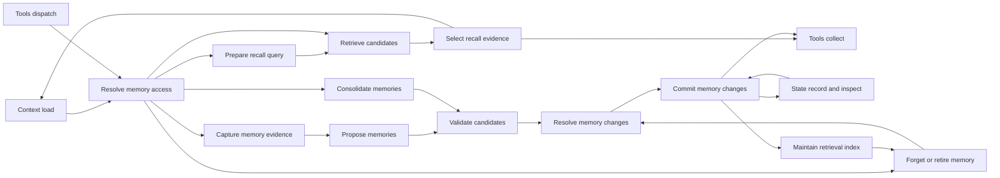

# Lina memory architecture and experiment direction

Research date: 2026-10-08. Research and design proposal only. Memory remains an
empty region in Lina's graph. No runtime, node contracts or simulation behavior
is implemented by this study.

## Recommendation

Memory deserves a separate block with several paths: recall, controlled mutation,
maintenance and forgetting. The earlier four nodes describe broad responsibilities
but hide decisions that Studio should expose. Start by specifying ownership,
provenance, revisions and operation outcomes. Leave representation, retrieval,
write timing and consolidation policy configurable.

A vector database is one possible index, not the memory architecture. Likewise,
semantic, episodic and procedural describe kinds of retained knowledge. They do
not require three separate stores or three parallel pipelines. The proposed
nodes below are Lina design decisions inferred from the evidence, not a claim
that every agent implements the same pipeline.

## Evidence and reading map

- [Hermes and OpenClaw source study](memory-hermes-openclaw.md): actual reads,
  writes, prompt exposure, search, background work and default/optional behavior.
- [Pi and Waku source study](memory-pi-waku.md): minimal core versus extensions,
  consolidation, remote adapters and scope limitations.
- [Mechanisms and evaluation](memory-mechanisms-and-evaluation.md): primary
  papers, official framework mechanisms, controlled comparisons and benchmark limits.
- [Existing Lina/Studio audit](memory-existing-design-audit.md): reusable local
  contracts, current Context/State handoffs, verified tests and reuse gaps.

Source studies pin the inspected upstream commits. Current documentation is
identified separately and may describe another revision. Earlier Context/State
reports remain historical observations at their own pins. No benchmark is run
here, and upstream implementation choices do not establish a universal winner.

## What the inspected agents actually do

| Agent and source pin | Memory mechanism | What Lina should take from it |
| --- | --- | --- |
| Hermes `38880bd2f1e90dbc9a1aeec03af62539ee64719a` | Bounded curated agent/user files, frozen prompt snapshot, explicit mutation tools, separate history search, optional external provider hooks | Expose small-profile access separately from search, commit versus provider sync, reviewed destructive changes and stable prompt refresh boundaries |
| OpenClaw `a07a06ec94d2eda4ba1a7cab869395d5222092bf` | Default Memory Core has curated/episodic/prospective tiers, hybrid recall, provenance-gated consolidation, private flush and lineage-aware forgetting | Expose evidence origin, promotion eligibility, maintenance, index visibility and honest deletion coverage; project ranking is not authorization |
| Pi `6fb2e7815167e6b19006fc526d1a5d0f5f998787` | Session trees, compaction and instruction files; cross-session knowledge belongs to extensions/external storage in inspected core | Memory can be optional; do not equate persisted history or instruction loading with a learned fact store |
| Waku `763d3e79f34a2deca805e815b3b230188579e16b` | Facts/episodes, lexical search, retrieval/query gate, explicit save/correction, automatic batch consolidation and optional remote backends | Read and write selection are separate policies; local save and remote search readiness differ; strengthen scope, batch recovery and replica deletion before reuse |

Sources and exact implementation links are in the
[Hermes/OpenClaw study](memory-hermes-openclaw.md) and
[Pi/Waku study](memory-pi-waku.md). These newer pins reveal more behavior than the
previous Context/State studies. For example, OpenClaw's newer source has explicit
promotion and forgetting mechanisms; a description limited to Markdown plus
embeddings would miss them. Neither this table nor the source studies rank agents
by memory quality.

The mechanisms study also distinguishes current Letta's repository-backed memory
and background learning from its legacy core-block/archive APIs. MemGPT,
Generative Agents, Voyager, A-MEM and LightMem supply different mechanisms and
different evaluation settings. They are evidence for variation points, not
mandatory subsystems to reproduce in Lina.
[Mechanisms and evaluation](memory-mechanisms-and-evaluation.md).

## What memory means for Lina

| Concept | Owner and purpose | Boundary |
| --- | --- | --- |
| Canonical conversation history | State stores records; Context reads permitted history | A transcript is source evidence, not automatically extracted knowledge |
| Model-visible working context | Context selects, transforms and budgets one request | Compaction can preserve a task view without committing a memory |
| Task progress, pending work and checkpoints | Execution/Planning/State | A remembered statement that work finished is not an execution receipt |
| Semantic memory | Memory retains claims, facts and preferences with provenance | Corrections, uncertainty and temporal validity must remain representable |
| Episodic memory | Memory retains relevant experiences, actions, outcomes and lessons | A successful-looking answer is not verification that its procedure worked |
| Procedural memory | Memory retains candidate reusable procedures or lessons | Publication as a trusted skill or instruction requires a separate admission boundary |
| Documents/resources | Tools acquires external evidence; Context selects it | Search over documents and search over prior experience can share retrieval technology while keeping different ownership |
| Prospective memory | Memory can retain a future intention or reminder | Scheduling, triggering and delivering it belong to automation/execution owners |

The taxonomy is descriptive. A record can reference an episode and support a
fact or procedure. Use explicit links and independent fields rather than forcing
exclusive labels. Separate three dimensions: knowledge kind, ownership namespace,
and storage/exposure tier. For example, a user preference can belong to a private
user namespace, live in a versioned record store, and appear in a small profile.
An index is a derived view of that record, not a second authoritative fact.

Anthropic's official memory tool uses application-owned storage and model-requested
file operations, including read, create, edit and delete. This is concrete evidence
for an inspectable file-based strategy that does not require embedding search.
Its memory handler remains responsible for path restrictions and storage behavior.
[Official memory tool](https://platform.claude.com/docs/en/agents-and-tools/tool-use/memory-tool).

Anthropic's context engineering account describes persisted notes that can be
read after context resets, alongside compaction and subagents. For Lina, notes
can preserve knowledge or task reminders while State retains authoritative
execution evidence. Those responsibilities can compose without being merged.
[Context engineering](https://www.anthropic.com/engineering/effective-context-engineering-for-ai-agents).

## Decisions needed before node implementation

| Decision | Recommended provisional boundary | What remains configurable |
| --- | --- | --- |
| Ownership | Explicit user, workspace/project, agent-private and task namespaces; denied by default outside granted scope | Which namespaces a configured agent shares |
| Child access | Selected task packet plus admitted shared namespaces; child-private state stays private | Parent-only publication review versus permitted direct shared writes |
| Source authority | Keep author/source, observed time, fact-validity time, original evidence, extraction version and trust | Confidence scoring and corroboration policy |
| Recall trigger | Support Context preparation and explicit memory tools as separate request modes | Automatic prefetch, model-directed search or both |
| Write trigger | Explicit remember/correct/forget requests and policy-selected observations; extracted suggestions remain candidates | End-of-turn, during-turn or background extraction; no forced write for every reply |
| Mutation | Stable identity, expected revisions, no-op and conflict outcomes; preserve provenance across supersession | Keyed profile, individual facts, episodes or linked records |
| Visibility | Acknowledged record commit differs from index readiness; selections identify record/index versions | Synchronous indexing versus delayed indexing with known fallback |
| Retrieval result | Return a bounded evidence selection and omission reasons; Context owns final request budget | Query rewrite, lexical/vector/hybrid search, reranking and expansion |
| Deletion | Stop recalling revoked records; define removal of derived/indexed/cached copies and retention exceptions | Retention periods and backend purge procedure |
| Procedures | Remembered procedures are evidence until admitted as instructions/skills | Verified experience promotion and human/agent review policy |
| Model work | Extraction/reflection may invoke Model under a distinct purpose and budget | Same model versus cheaper specialist model, batching or rules |
| Disabled/unavailable | No-memory is a real control; empty results differ from storage failure and denied access | Optional degraded recall versus required-memory failure |

These are boundary decisions to review, not claims that a runtime implementation
exists. Store technology, embedding model, exact top-k, background cadence and
learned policy are not required to finalize the graph's ownership model.

Automatic extraction needs both user/source evidence and observed outcomes. It
must not simply treat the final assistant answer as truth. The current Studio
policies deliberately use constrained output formats or whole-output records;
that is useful as a repeatable baseline, not the intended general Lina extractor.
[Local audit](memory-existing-design-audit.md#studio-comparison-policies-are-useful-controls).

## A modest baseline to review

For the first Lina design slice I recommend a bounded profile plus versioned
source-backed knowledge records. Support both Context-requested recall and
explicit read/write tools. Keep exact/lexical retrieval available as an
inspectable control; embedding/hybrid retrieval can use the same candidate
contract. The first store need not be a knowledge graph.

Explicit remember/correct/forget requests should work from the outset. Automatic
extraction should be a separately visible policy with conservative source
eligibility, rather than a silent write of every assistant output. Keep
consolidation optional and separately budgeted. Child contributions should be
private or parent-reviewed by default; sharing requires explicit access rules.

This baseline is a recommendation for review, not a measured winner. It keeps
all meaningful paths representable while allowing us to vary one mechanism at a
time. Changing the retrieval strategy should not require rebuilding write
admission, Context packaging or State acknowledgment.

## Candidate nodes for the graph

Twelve responsibilities are justified for review. They form branches, not an
obligatory twelve-step chain. An exact read can bypass query generation and
ranking while retaining visibility, trust and revision validation. Explicit structured writes can bypass model extraction. Disabled
maintenance performs no background model work.

| Proposed node | Responsibility and important outcomes | Reason to expose separately |
| --- | --- | --- |
| `lina-memory-scope` / Resolve memory access | Bind caller, namespace, permitted operations, policy and visibility generations. Admitted, denied, unavailable | Ownership is enforced before data retrieval, including shared child access |
| `lina-memory-query` / Prepare recall query | Bind task/search request, filters, time intent and query provenance. Query ready, no recall needed, invalid | Original query, rewriting and multi-query approaches are experiment seams |
| `lina-memory-retrieve` / Retrieve candidates | Read a bounded profile, exact record, lexical/vector/hybrid candidates and declared index watermark. Candidates, no matches, stale, unavailable | Backend retrieval and exact lookup differ from semantic selection |
| `lina-memory-select` / Select recall evidence | Deduplicate, rank, expand bounded source evidence, filter retired/invalid records and produce a selection with score components and omissions | Retrieval candidate quality and model-bound evidence are independently inspectable |
| `lina-memory-capture` / Capture memory evidence | Bind source events and observed outcomes; classify origin, allowed egress and retention eligibility before model extraction. Evidence ready, rejected, no-op | Untrusted source content and recalled feedback must not acquire authority merely by passing through an extractor |
| `lina-memory-extract` / Propose memories | Turn permitted observations, explicit requests or observed episodes into candidate facts/experiences/procedures. Candidates, no-op, cancelled, failed | Candidate formation varies independently of commit policy |
| `lina-memory-validate` / Validate candidates | Check scope, source/trust, sensitive data policy, structure and evidence binding. Eligible, rejected, needs review | Plausible model output is not authority to persist or share |
| `lina-memory-resolve` / Resolve memory changes | Compare current records and temporal claims; propose add/update/no-op/supersede/retract or preserve unresolved conflict | Contradiction, correction and deduplication affect future answers directly |
| `lina-memory-commit` / Commit memory changes | Apply a reviewed mutation set with stable ID and expected revisions. Applied, already-applied, conflict, failed, unknown | Memory owns semantic changes; State acknowledges supported persistence boundaries |
| `lina-memory-index` / Maintain retrieval index | Apply committed additions/updates/retirements to derived indexes with record and index generations. Ready, pending, failed | A committed fact may not yet be searchable; deletion must reach its derived copies |
| `lina-memory-consolidate` / Consolidate memories | Select bounded eligible records and propose linked summaries, lessons or merges. Candidates, no-op, cancelled, failed | Consolidation must re-enter validation/change review, not mutate facts freely |
| `lina-memory-forget` / Forget or retire memory | Resolve authorized targets and descendants, revoke recall, coordinate purge/retention receipts. Planned, logically removed, purge pending, erased within declared coverage, denied | Forgetting differs from relevance decay, TTL and historical supersession |

Selected evidence can require bounded source expansion; keep that read and its
revision/access recheck inside Retrieve/Select initially. A separate Read evidence
node is justified later if interactive expansion becomes an independently
configured step.

Query preparation and selection can be implemented as identity/filter functions
in a simple baseline. Index maintenance can report `not-required` for a direct
file/record lookup adapter. Separate nodes here expose distinct contracts and
conditions; they do not require twelve services, databases or model calls.

Do not add one graph node per embedding algorithm or per memory kind. Alternatives
belong behind these same contracts. A universal knowledge graph, automatic skill
rewriting, learned memory manager and recurring maintenance scheduler are
alternative or later mechanisms, not baseline requirements.

## Proposed paths and existing-block connections

These are proposed future edges only. Keep requester, purpose, operation and
agent/turn identities on every response. Denial/no-match/unavailable must return
to the original requester; no branch can grant broader access by returning data.

The diagram omits failure returns and background job control to keep ownership
legible. Implementation must include them in contracts and reachable paths.

- Context load requests optional or required recall for a particular preparation.
  Memory returns scoped, revisioned evidence. Context task assembly decides how
  much of it is model-visible. Changed or deleted evidence must invalidate stale
  selections before a new invocation; a historical snapshot is historical evidence.
- Registered memory tools enter through Tools validation/permission/dispatch.
  They return normal call outcomes to Tools collect, including no-match, conflict
  and unknown write acknowledgment. They participate in existing batch joins.
- Changes requiring permission or review use the existing Safety owner before
  commit. Memory semantic validation and Safety authorization are distinct; an
  extractor cannot authorize its own write.
- Semantic write commit requests supported State persistence and transaction
  inspection. State does not rerun extraction or decide which claim supersedes
  another. Record-store atomicity and independent-writer revision checks need
  real backend support before being advertised.
- Capture checks source/retention and allowed external egress before extraction.
  Model outputs still undergo candidate validation afterwards. Already-structured
  explicit mutations can bypass extraction. Consolidation generates candidates
  and re-enters validation; it does not need to extract its own output again.
- Optional extraction/consolidation invokes Model with memory-purpose request
  identity and bounded work. It must not count as another main agent reasoning
  round or silently inherit all tools. Stop/cancellation retains applied writes
  and distinguishes unstarted work from uncertain commit acknowledgments.
- Background maintenance needs its own retained job/cursor and authority. State
  persists that progress; an eventual scheduler owns when it runs. Until such an
  owner exists, Studio can simulate a requested maintenance pass without claiming
  a live daemon or drawing a made-up scheduler node.
- Subagents receive permitted namespaces, not all parent history or memory.
  Child proposals can return to parent review; direct shared mutations require
  separately granted authority and conflict handling.
- A learned procedure can point to a candidate skill artifact. Tools/skill
  activation and trusted instruction policy remain separate. Recalling a
  procedure must not automatically grant tool permissions or change system rules.

## Contract content to preserve

The later inspector schemas should expose multiple request modes and outcomes,
not only a successful text payload. Recommended shared fields:

- Caller/request binding: request/operation ID, requester node and phase, purpose,
  workspace/user/agent/turn, namespace and access-policy revision.
- Provenance: source references, original speaker/source kind, digest, observed
  time, event/fact validity range, extractor/policy revision, derivation parents,
  and verified versus asserted outcome. Model confidence is not verification.
- Record identity: stable logical entity/key where available, record/version,
  knowledge kind, lifecycle state, supersession/conflict links and expiry.
- Recall: original and derived queries, filters, candidate ranks and score meanings,
  source/index watermarks, selected and omitted IDs, evidence/content references,
  declared staleness and requester budget.
- Mutation: candidate and transaction IDs, operation/fingerprint, expected record
  revisions, exact targets, no-op reason, authorization/review reference, commit
  outcome and index readiness. Inspect unknown acknowledgments before retry.
- Maintenance: job/record-range cursor, input revision, derived output references,
  cancellation, budgets and resumable progress; repeated work is deduplicated.
- Forgetting: authorized selectors, visibility revocation generation, derivatives,
  declared storage/index/cache coverage, exclusions and purge receipt.

This is a contract inventory, not a final schema. It intentionally keeps
`assertedAt`, `validFrom` and revision independent: a newer observation can
report an older fact. "Latest write wins" is not a general temporal correction rule.

## Baseline contracts versus experiments

Access isolation, stable identities, provenance, correction/deletion behavior,
known versus unknown persistence, bounded work and honest unavailable states are
requirements. Do not weaken them to make one retrieval strategy look faster.
A trust label or content filter alone is not a guarantee against poisoned memory.
MINJA demonstrates memory injection through ordinary agent interaction in its
studied systems; it is evidence to test write admission and later recall, not a
measured attack rate for Lina.
[Primary MINJA paper](https://arxiv.org/abs/2503.03704).

The following are useful controlled comparisons. Every row needs a no-memory
control where applicable and a full-history or exact-oracle control where useful.

| Mechanism | Alternatives | Measure and hold fixed |
| --- | --- | --- |
| Representation/granularity | Small profile, individual claims, source chunks, episodes, linked notes | Same source corpus, model and context budget; recall coverage, update fidelity, answer/task success, bytes/tokens |
| Retrieval | Lexical, vector, hybrid; filter and reranker combinations | Same record formation and corpus; precision/recall at budget, latency, distractors and missing-answer abstention |
| Query preparation | Original task, rewrite, multiple targeted queries | Same retrieval/index and downstream reader; retrieval quality plus extra model cost |
| Recall timing | Prefetch, explicit model tool search, mixed | Same permitted corpus and tools; useful recall, missed calls, end-to-end cost and latency |
| Write formation | Explicit only, rule extraction, model extraction with different evidence windows | Same subsequent questions/tasks; factual fidelity, omission, false additions, provenance and write cost |
| Write timing | During-turn, end-of-turn, delayed batch | Same formation policy and arrival sequence; answer latency, knowledge-availability lag, repeated writes and cancellation behavior |
| Change resolution | Keyed correction, versioned claims, linked conflicting claims | Same authority/temporal semantics; corrections, historical questions, conflicts and uncertainty |
| Consolidation | None, bounded summaries, reflection/lessons, linked-note evolution | Same observations and comparable model/budget accounting; coverage, drift, provenance, multi-step transfer |
| Decay/retention | Explicit TTL, access/recency policies, importance-based retention | Same retention permissions and source workload; missed useful memories, stale recall and size |
| Index visibility | Synchronous, asynchronous with direct-read fallback | Same correctness/read-your-write contract; ingest throughput, search latency, visibility lag and failure recovery |

Index variants and memory representations can compose. A linked-note store can
use hybrid search; a profile can use exact reads alongside episodic retrieval.
Do not frame these layered choices as mutually exclusive agent frameworks.

## Evaluation before claiming improvements

Follow the [primary-source evaluation study](memory-mechanisms-and-evaluation.md).
Conversational QA benchmarks exercise extraction, cross-session recall, temporal
reasoning, updates and abstention. Agentic experience benchmarks add dependent
actions across tasks. Neither category alone establishes a production memory
architecture or universal gains.

For Lina, create separate evidence at four stages: source retained, candidate
retrieved, evidence selected into Context, and answer/action outcome. A record
can exist without being found; it can be found but omitted by Context; it can be
shown but interpreted incorrectly. Those failures need different fixes.

A reproducible run records source sequence, namespace policy, starting corpus,
record/index revisions, memory configuration, prompts and extraction/query models,
embedding/index versions, budget, timestamps/seed, failure positions and all
candidate/selection/mutation decisions. Reset isolated trials; never let a tested
strategy learn from later evaluation answers. Freeze the source cutoff and
control corpus when comparing retrieval alone. Count maintenance and extraction
costs, not only the final response's tokens.

Prioritize these scenarios before performance claims:

1. Empty/disabled memory, explicit remember, later paraphrased recall and no-match.
2. New preference corrects an old one; a historical question asks about the old date.
3. A vague claim conflicts with stronger evidence; uncertain memory stays uncertain.
4. A child can read permitted project memory but cannot retrieve parent-private facts.
5. Completed experience produces a candidate lesson; an unverified failure does not become a verified procedure.
6. Duplicate write, changed payload under a reused ID, concurrent correction and lost commit acknowledgment.
7. Committed record has a lagging index; exact/direct lookup and search report their actual versions.
8. Forget a source and its derived memories; cached/indexed old content cannot be newly recalled.
9. Malicious retrieved text requests a permanent instruction or broader access; it remains untrusted evidence.
10. Stop during extraction, after commit and during maintenance; no fictional rollback or repeated writes.
11. Consolidation misses a source or hallucinates a fact; evidence links expose the error.
12. Many irrelevant memories, budget pressure, expired records, unavailable storage and repeated reopen.

Studio playback can model these paths deterministically. Retrieval quality and
end-task improvements require actual algorithms, real model calls where used,
and inspectable runs. Synthetic path animation cannot establish those results.

## Review outcome and next step

The study expands the earlier four-responsibility sketch into twelve candidate
nodes and explicit contracts. Review node boundaries and the upfront decisions
before writing an implementation checklist. The most consequential unresolved
choices are default namespaces, automatic write admission, child publication,
profile versus episodic baseline, indexing visibility and forgetting coverage.
Exact search/model/backend choices can stay experimental.

This research makes no graph changes and does not claim a single best memory
paradigm. Its purpose is a grounded, reviewable design that can support multiple
mechanisms without rewriting Lina's Context, State, Tools or agent loop.

## Accepted baseline and implemented design slice

Following the research review, the user accepted the recommended baseline:
source-backed facts/preferences and episodes; private-by-default user, workspace,
agent and task namespaces; bounded profile recall plus explicit search; explicit
writes and policy-admitted automatic candidates; parent review for shared child
contributions; versioned correction with supersession rather than silent
latest-write-wins; optional bounded consolidation; immediate recall exclusion
followed by tracked deletion of declared copies; authoritative versioned records
and replaceable exact/lexical retrieval indexes.

The original research above remains a dated proposal. The maintained graph now
implements its twelve responsibilities as design nodes: Scope, Query, Retrieve,
Select, Capture, Extract, Validate, Resolve, Commit, Index, Consolidate and Forget.
Their 87 connections include requester-correlated Context/Tools returns, State
reads/commits/transaction inspection, separately budgeted Model extraction and
consolidation, Safety review and final authority checks, parent publication
review, cancellation, and visibility revocation/index cleanup receipts.

The full architecture contains 112 nodes and 400 edges, with JSON contracts for
all 112 nodes. Auto and Next operate on deterministic fixture transitions. The
[implementation checklist](../../../development/implementation-plans/studio/completed/lina-memory-block.md)
is the authority for current cases and final validation. This does not implement
a live knowledge backend, production deletion, actual extraction/consolidation
models, a maintenance daemon or measured retrieval quality. Backend, ranking,
query rewriting and consolidation mechanisms remain controlled variation points.
