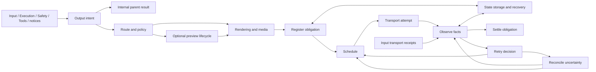

# Lina output and delivery research

Reviewed 2026-10-08. The accepted proposal now has a graph and deterministic Studio implementation dated 2026-10-09. This source study does not establish a live adapter, runtime outbox or platform reliability guarantee. See the [implementation checklist](../../../development/implementation-plans/studio/completed/lina-output-delivery.md).

## Finding

Final replies, streaming, formatting, artifacts and retry are insufficient for the whole block. It must represent every outward communication and what is still owed independently of agent execution. Include prompts, progress, errors, tool-requested messages and proactive notices. Internal child results have a distinct audience; publishing them is a separate authorized decision.

Recommend a shared Output core with channel adapters. The core owns identity, policy handoffs, prepared obligations, ordering, attempts and evidence. Adapters own native targets, constraints, authenticated sends/edits and capabilities. OpenClaw documents this split in its [outbound SDK](https://docs.openclaw.ai/plugins/sdk-channel-outbound). This does not create another agent loop.

## Evidence

- [Hermes and OpenClaw](output-hermes-openclaw.md), pinned implementation observations separated from moving official documentation.
- [Channels, Pi and Waku](output-channels-and-protocols.md), native contracts and verification gaps.
- [Existing Lina audit](output-existing-design-audit.md), current responsibilities and integration changes.

Hermes permits warned duplicate recovery after ambiguous sends through a bounded best-effort ledger. Inspected OpenClaw requires adapter reconciliation and refuses blind replay. Pi distinguishes command acceptance, event streams and settled execution. Inspected Waku WhatsApp sends return a boolean without retaining provider receipt identity. These are different design choices, not universal guarantees. The supporting studies contain immutable source references; no upstream tests or live sends were run.

## Completeness audit

| Area | Required representation |
| --- | --- |
| Reply content | Final text, media-only answer, typed result, refusal, failure/cancellation status and quiet completion |
| Other producers | Input receipts/commands, approval/clarification prompts, progress, tool messages, admitted scheduled/process notices and child announcements |
| Audience/route | Internal parent versus external recipient, exact account/chat/thread/reply binding, authorized changes, independent fanout recipients |
| Exposure | Public content policy applies before previews as well as finals; reasoning/tool details require explicit permission |
| Rendering | Native limits/escaping, ordered parts/code fences, original structured results, interactive controls and honest fallback |
| Mutable messages | Preview IDs/revisions, edits, final promotion, stale updates and optional deletion |
| Artifacts | Retained bytes/digest/access policy, upload identity, native handle expiry, retry custody and cleanup |
| Ownership | Required versus best-effort obligation, custody transfer, queue admission, claim fencing, deadlines and ordering |
| Recovery | Proven unsent, rejection, partial success, uncertain acceptance, restart, lost owner, late acknowledgement and cancellation |
| Evidence | Admission, provider acceptance, optional delivery/read facts, raw receipts and exact part correlation |
| Completion | Owed final settles independently of previews and turn release; duplicate-final suppression uses target-specific confirmed evidence |

This covers reply/delivery semantics for the current CLI, Telegram and WhatsApp design. Reactions, polls, pinning and deletion remain optional adapter operations with their own constraints. Notification scheduling belongs to its producer; Output handles admitted notification eligibility and delivery. Computer Use stays deferred.

## Proposed thirteen nodes

The count follows responsibilities and branches. Detailed records belong in the inspector.

| Proposed ID | Label | Responsibility and branches |
| --- | --- | --- |
| `lina-output-intent` | Capture output intent | Canonical producer identity, audience/finality; external intent, internal return, quiet suppression or invalid intent |
| `lina-output-route` | Resolve delivery route | Authorized destination and adapter capabilities; bound plans, fanout, missing/ambiguous/stale route |
| `lina-output-policy` | Check output policy | Consult Safety and native eligibility before exposure; allow, permission wait, defer, reject or suppress |
| `lina-output-render` | Render delivery parts | Validate typed content; ordered native payloads, structured-result preservation, prompt controls, fallback or unsupported content |
| `lina-output-media` | Prepare outbound media | Resolve retained authorized artifacts, upload/reuse scoped handles; ready, expired, denied, unavailable or unknown upload |
| `lina-output-stream` | Manage reply stream | Serialize previews/edits, coalesce progress, flush/seal final boundary; completed block, promotion candidate, stale or aborted revision |
| `lina-output-register` | Register delivery obligation | Store stable recipient intent, prepared parts/custody through State; stored owner, existing intent, explicit best-effort or storage failure |
| `lina-output-schedule` | Schedule outbound work | Account/target lanes, due time, budgets/priorities; ready part, deferred, cancelled/superseded or deadline exhausted |
| `lina-output-send` | Execute transport attempt | Recheck exact part/revision/claim, policy/readiness; record send-start before external effect; accepted, proven unsent/rejected, partial or unknown |
| `lina-output-observe` | Record delivery observations | Preserve native results/receipts through State; accepted/delivered/read facts, partial, stale/duplicate/unmatched observations |
| `lina-output-retry` | Decide delivery retry | Failure classification, provider wait/budget/custody; safe retry, defer, permanent/exhausted failure or reconciliation |
| `lina-output-reconcile` | Reconcile uncertain delivery | Restore original intent and adapter/operator evidence; confirmed sent, proven unsent eligible for retry, unresolved or contradictory facts |
| `lina-output-settle` | Settle output obligation | Per-part/per-recipient threshold and retention handoff; accepted, failed, suppressed, cancelled/stale or unresolved |

Ordinary final-only output bypasses streaming. Stream previews still use the shared scheduling, attempt and observation path under best-effort policy; completed blocks and final promotions acquire required obligations when policy says they fulfill owed output. The stream node never bypasses transport admission. Rendering/media preparation join when required parts are ready. Internal results return to Subagents without external routing. Receipts and retries enter distinct branches. Making every message visit all thirteen nodes serially would misrepresent the design.

## Existing block connections

Keep `lina-input-delivery` as Reply delivery handoff to intent capture; its correlated status branch goes to observations. Execution declares owed output and transfers required custody before owner release. It does not wait for read receipts. Safety supplies an already registered prompt with four choices, responders and expiry; Input owns answers. Model supplies admitted visible events and authoritative final output. Tools supplies admitted message intent and target-specific evidence for duplicate-final suppression, preserving distinct new content.

Environment supplies retained artifact custody/access, not arbitrary public workspace paths. State owns persistence, claim fencing and recovery. Output owns delivery scheduling, not another database. Existing connection owners supply credential/readiness references; a native channel adapter need not be an MCP tool. Subagents retain internal results and separately authorize publication. Observability records evidence without determining transport success.

## Records and lifecycle

Implement JSON Schema with branch examples per node. Avoid generic untyped payloads.

- Canonical output: schema version, output ID, producer/run/turn/task identity, nullable input ID, audience, finality, typed content/artifact references, validation and suppression policy.
- Recipient plan: delivery ID, immutable destination/authority/session incarnation, operation, adapter/account/capability version, rendered revision/digest, ordered parts, required/best-effort policy.
- Part attempt: part/index/revision, claim owner/fence, attempt ID, operation, send-start fact, provider ID/error, retry deadline and custody references.
- Observation: event/provider/account/recipient identity, source/local timestamps, raw evidence and interpreted fact. Preserve duplicates; derive status without regression on late receipts.
- Prompt: existing wait identity, decisions/responders, expiry and scoped action token. Delivery is independent of approval.
- Settlement: per-part/per-recipient outcome, policy threshold, unresolved reason and retention owner. Fanout is not atomic.

Admission, platform acceptance, provider delivery and read are separate facts. Default send completion can mean all required parts were accepted. Label it precisely. Scenarios measuring delivery/read may choose later thresholds; missing receipts remain unknown.

Persist required obligations before dispatch, preserve prepared bytes across restart and record effect boundaries. Storage failure cannot silently downgrade required output. Best-effort progress may coalesce/drop under declared limits. Finals/prompts require explicit outcomes. Sensitive non-durable output needs a stated policy and recovery limitation.

## Recommended defaults

Final-only messaging is a valid default; supported previews/progress are configurable. CLI distinguishes TTY, batch text, JSONL and RPC, keeping machine stdout free of diagnostics. Preserve canonical structured results when rendering as text. Required finals and active prompts get retained obligations. Progress can use bounded coalescing. Order each configured account/recipient/thread lane; independent recipients can run concurrently.

Use conservative unknown-send handling. Reconcile where supported; otherwise retain the original obligation visibly unresolved. Proven pre-send failure may retry within budget. Never rerun the agent to repair delivery, resend confirmed parts or silently switch targets. Hermes warned-resend remains a selectable experiment with duplicate risk. Local idempotency does not prove remote deduplication. [OpenClaw retry guidance](https://docs.openclaw.ai/concepts/retry) distinguishes safe retry from ambiguous non-idempotent sends.

Stop prevents future actions and invalidates prompts/streams under owner policy; it cannot retract accepted messages. Late receipts still update the original evidence, but do not revive approval or authorize new sends. Draft success is not final success. [OpenClaw streaming](https://docs.openclaw.ai/concepts/streaming) documents separate preview/block layers.

Telegram and WhatsApp require versioned native constraints. WhatsApp proactive/free-form eligibility depends on service windows, approved templates and opt-in policy. Some current numerical Meta references were inaccessible; the channel study records exact verification gaps. Do not treat older SDK/setup prose as current platform guarantees.

## Implemented design checklist

These research acceptance criteria are implemented and verified through the linked implementation checklist. The original list remains below as a trace of the proposed scope; its status is finalized with that checklist.

- [x] Populate thirteen nodes and meaningful branch connections, replacing the empty region.
- [x] Add JSON schemas and examples for every node/branch and update existing producer contracts.
- [x] Connect Input, Execution, Safety, Tools, Model, State, Environment and Subagents with exact ownership/correlation.
- [x] Preserve four approval choices on transports with fewer buttons through documented fallback.
- [x] Simulate final/error/refusal/media-only/quiet outcomes for CLI, Telegram and WhatsApp.
- [x] Cover long formatted output, code fences, typed result validation, ordering and artifact access/expiry/upload.
- [x] Cover preview promotion, final/edit failure, stale deltas, supersession and Stop.
- [x] Cover tool-send duplicate-final suppression, internal child results and admitted external announcements.
- [x] Cover proactive eligibility and independent fanout outcomes without inventing live scheduling.
- [x] Cover safe retry, provider wait, permanent rejection, partial success and exhausted budgets.
- [x] Inject crashes before admission, after admission, after send-start, after remote acceptance and before receipt persistence.
- [x] Cover lost claims, late acknowledgements, duplicate/out-of-order/unmatched receipts and unresolved recovery.
- [x] Verify artifact retention through delayed delivery/cleanup; cancellation retains unknown external effects.
- [x] Verify Auto, Next, follow/manual-follow and Stop use identical deterministic reducers and inspector evidence.
- [x] Update completed-block docs only after behavior/schema checks pass; label fixture sends as simulation.

The implementation covers the graph, precise contracts and controlled simulation, consistent with existing blocks. Live adapters, credential exchange, production outbox storage and measured platform reliability are later harness work.

## Experiments

Compare final-only, coalesced edits and native drafts; chunked full text versus summary plus retained artifact; progress coalescing/queue priority under preserved ordering; conservative unknown hold versus authorized warned resend; native prompt controls versus typed answers. Control model/prompt/tool behavior, output bytes, API/capability versions, budgets, retention and seeded failures. Measure first visibility, final acceptance latency, send count, omissions, duplicate parts, unresolved age and artifact accessibility.

Receipt correlation, native limits, route authority, permissions and required output custody are baseline correctness. They are not optional competing strategies. This study establishes no performance improvement or exhaustive agent-path coverage.
