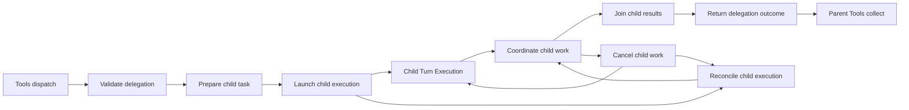

# Lina subagent architecture proposal

Research date: 2026-10-08. Accepted full-scope specification; Studio design and simulation completed. The original
research-only proposal has been revised following user review. Baseline Lina
graph: 112 nodes and 400 connections before this implementation.

## Recommended direction

Add **Subagents / multi-agent orchestration** as eight lifecycle nodes. Use
model-led, tool-mediated delegation as the default: Lina's main model requests a
worker, the harness checks the request, and the worker runs the same agent harness
under its own identity. Results return to the parent, which decides their use.

Reuse Context, Memory, Tools, Model Interface, Safety, State and Turn Execution.
Subagents owns the relationship between executions, not a second implementation
of those blocks. Planning can later produce delegation requests through this
interface; its absence does not prevent ordinary tool-led delegation.

The earlier five-node sketch captured the main responsibilities. It folded
result joining, cancellation and uncertain-start recovery into one coordinator.
Those operations have different inputs and execution paths, so exposing them
separately makes this Studio design more useful. Eight is a Lina presentation and
ownership choice, not an industry-standard node count.

## Evidence

- [Hermes and OpenClaw](subagents-hermes-openclaw.md): current tool dispatch,
  task preparation, execution lifetimes, result delivery, limits and recovery.
- [Pi and Waku](subagents-pi-waku.md): distinguish core facilities, installed
  subprocess examples, experimental durable delegation and opt-in specialization.
- [Patterns and evaluation](subagents-patterns-and-evaluation.md): primary
  framework documentation and first-party engineering reports.
- [Current Lina audit](subagents-existing-design-audit.md): exact existing graph
  endpoints, contract reuse and missing internal-child execution semantics.

Source reports pin inspected upstream commits and distinguish code from current
documentation. Reports describe observed mechanisms; recommendations below are
our design inferences. No benchmarks were performed.

## What the comparison changes

| System | Grounded mechanism | Consequence for Lina |
| --- | --- | --- |
| Hermes | Model-callable delegation, independently running children, grouped or individual completion delivery, enforced configured depth/tool restrictions; actual capacity behavior can differ from comments | Record effective mode and limits; separate worker execution from parent result waiting and group completion |
| OpenClaw | Spawned sessions, isolated/fork context, bounded child execution, child management and completion announcement, retained run records | A child has a handle, history and ownership; requested context mode and effective mode must be visible |
| Pi | Installed subprocess example plus experimental durable foreground and persistent background examples; stable requests/reporting and explicit ownership in durable examples | Support stable identities, restart inspection and explicit background lifetime without claiming every example is a built-in manager |
| Waku | Opt-in synchronous delegation to Pi through a normal tool; restricted management/recovery surface | Tool-led delegation can start simply; do not treat one synchronous adapter as a complete orchestration layer |

Each row's detailed claims and source links are in the comparison reports above.
Defaults differ and change with versions. Lina should record its own limits rather
than claim one upstream concurrency or nesting number is standard.

LangChain documents a supervisor invoking subagents as tools and distinguishes
blocking result calls from background job APIs. Handoffs instead transfer control
of the conversation. Microsoft's orchestration guide also separates fixed
sequences, parallel work, handoffs, group chat and manager-led coordination.
[LangChain subagents](https://docs.langchain.com/oss/python/langchain/multi-agent/subagents),
[Microsoft orchestration](https://learn.microsoft.com/en-us/agent-framework/workflows/orchestrations/).

**Recommendation:** supervisor delegation first. Keep the same lifecycle usable
by a fixed workflow later. Handoffs, peer teams and group chat need their own
explicit control policies; they should not silently become the baseline.

## Eight proposed nodes

| Exact node ID / title | Responsibility | Main output variants |
| --- | --- | --- |
| `lina-subagents-validate` — Validate delegation | Check parent/call ownership, task/profile, current delegation authority, permitted context/access, depth and aggregate capacity. Reserve admitted work under a stable operation ID. | admitted, capacity-wait, refused, failed, unknown |
| `lina-subagents-prepare` — Prepare child task | Freeze task, output expectations, selected source revisions and effective policy references into an immutable packet. Allocate fresh child history or an explicitly admitted fork, and identity. | packet-ready, source-unavailable, scope-refused, cancelled |
| `lina-subagents-launch` — Launch child execution | Record launch intent, recheck exact authority and start the same harness with a child-owned turn. Repeated requests reuse or inspect the original launch. | started, known-unstarted, failed, unknown |
| `lina-subagents-coordinate` — Coordinate child work | Track accepted handles, instance-tagged progress, waiting, messages and terminal/release events. Route authorized steering at safe boundaries and expose status. | running, waiting, terminal-observed, released, control-accepted, rejected, unknown |
| `lina-subagents-join` — Join child results | Resolve an explicit required child set and retained completion policy. Distinguish handle acknowledgment, pending work, terminal results and a timed-out wait. | pending, result-ready, partial-terminal, wait-expired, unresolved |
| `lina-subagents-cancel` — Cancel child work | Apply exact-child cancellation or parent Stop under declared ownership. Cancel queued/unstarted work, signal active child execution and await accounting. | prevented-beforelaunch, cancel-requested, settled, unresolved |
| `lina-subagents-reconcile` — Reconcile child execution | Inspect an uncertain launch, missing result, owner/restart record or cancellation settlement using original IDs. Supply evidence to the existing execution reconciliation owner. | running, known-unstarted, known-terminal, still-unknown, incompatible |
| `lina-subagents-return` — Return delegation outcome | Validate any declared result format and return an acknowledged handle or bounded terminal result to the original parent operation. Preserve raw artifact/trace references and recorded failure/effect certainty. | accepted-handle, success, invalid-result, failed, exhausted, cancelled, unresolved |

Capacity waiting is admission state, not a new model-chosen retry. A queued request
needs a deadline, Stop handling and revalidation before it starts. A task result
can be failed while containing useful artifacts. A terminal result with unresolved
effects cannot be collapsed into ordinary clean completion.

Join handles child-task dependencies. Existing Tools Collect/Publish still handles
the parent's tool batch. These have different identities and remain separate.
Return formats an observation; it does not perform the parent's model synthesis.
Structured result validation is optional but explicit: record the declared schema,
whether validation ran and its outcome. Invalid structure preserves raw evidence
and returns an error; it does not fabricate compliant content. Any correction
request re-enters the existing child loop with an explicit budgeted request.
Schema compliance does not prove factual correctness. Output capture, State
recording, parent delivery and parent consumption remain separate observations;
delivery retry reuses the retained result rather than rerunning the child.

## Connections and execution paths



This is the main lifecycle sketch. Safety and State requester-specific paths,
refusal, cancellation and unresolved outcomes supplement it; not every request
visits every node. Exact endpoints and contract-owner changes are in the audit.

1. The main model emits a registered delegation tool call. Tools resolves its
   schema, permissions and scheduling before dispatch enters Validate.
2. Validate asks existing Safety when review is required. Prepare supplies an
   admitted packet. Launch asks State to record the original intent and checks
   current exact authority before starting `lina-execution-start` as the child.
3. Child Execution uses the existing Context/Model/Tools loop under child IDs.
   Context loads only admitted sources and Memory namespaces. Each child has its
   own attempts, rounds, operations, waits, snapshots and provider continuation.
4. Child settlement and owner release reach Coordinate. They bypass external user
   delivery and the parent's input queue. Join retains required work until known
   results and release evidence satisfy the selected policy.
5. Return reaches `lina-tools-collect` for the owning parent call. Tools publishes
   feedback; parent Context budgets the result and the normal parent loop decides
   what to do next. No child transcript is automatically merged into parent history.

Other routes:

- Wait/status/cancel capabilities enter Join/Coordinate/Cancel through normal
  Tools dispatch after ownership and permission checks.
- Join registers child-specific waits at `lina-execution-wait`. Only matching
  completion or authorized control resumes the retained continuation.
- Parent `lina-execution-cancel` enters Cancel; active child cancellation goes to
  the child's existing execution owner, which signals its own Model/Tools.
- Reconcile uses phase-specific State reads and returns evidence to the existing
  execution reconciliation node (`lina-input-reconcile`, a historical ID).
- Every State response returns to its requesting Subagents phase. Memory review
  stays in Memory; existing child Context recall stays in Context/Memory.

## Proposed baseline decisions

| Decision | Recommended initial behavior | Reason / consequence |
| --- | --- | --- |
| Who asks for delegation? | Main model through a registered `delegate_task` capability; trusted workflows can later submit the same request | Uses the existing decision/tool loop; no mandatory extra planner |
| Worker profile | One general-purpose profile; allow explicitly configured specialist profiles | Profile selection is bounded configuration, not arbitrary model-written authority |
| Context | Task-only, selected evidence or an explicitly permitted transcript fork; selected evidence default | Record effective mode, source revisions, complete tool groups and new provider binding |
| Model | Inherit effective parent model/settings unless an allowed profile overrides them | Simple baseline; record per-child binding and usage separately |
| Tools and accounts | Effective child exposure constrained by parent and host policy; no automatic delegation of operation grants | Tool visibility, account identity and permission remain distinct |
| Memory | Child/task-private writes; explicitly permitted shared reads; existing parent review for shared publication | Reuses accepted Memory policy |
| Parallel work | Independent children can overlap under a configured admission limit; dependent/shared effects use existing scheduling rules | Parallelism is supported from the start; correctness governs shared writes |
| Depth | Recursive children supported; configurable maximum depth with root at zero | Depth, per-parent concurrency and total task-tree budget are separate limits |
| Completion | Await required results by default; explicit handle-return mode allows independent parent work before a later join | Worker scheduling and parent waiting are separate contracts |
| Failure | Preserve each sibling outcome; parent decides retry/redelegation after seeing known failure | No hidden rerun or loss of successful work |
| Stop | Cancel attached descendants; explicitly detached sessions follow their independent owner lifetime | No automatic rollback, parent resurrection or implicit detachment |
| Persistence | State owns persistent child sessions and distinct tasks/launches/results/joins; resume and follow-up retain explicit identities | Follow-up is a new task/turn, not replay of a completed result |
| Workspace | Explicit shared or isolated environment reference, with enforcement status visible | A separate transcript does not guarantee isolated filesystem or secrets |

Initial Studio examples can use a declared cap of two active children and a third
queued child to make capacity behavior observable. This is a fixture setting, not
a recommended universal production cap. Child and task-tree budgets must be
explicitly configured, including rounds/attempts, deadlines and total work.
Deadline expiry, parent wait expiry and confirmed child termination are different
events. Unknown provider usage cannot be used to claim exact cost-cap enforcement.

In handle-return mode, the original spawn tool result stays an accepted handle.
A later wait operation receives the terminal result; do not rewrite the old tool
result or append an unmatched result. Children remain attached to the task and its
Stop policy. Required children must be joined before final task settlement.
Detached work has explicit session/background ownership before parent release.
Parent turn Stop does not cross that boundary. Explicit child/session-owner Stop or
close does cancel its owned work; reset fences stale continuations. A detached
result is retained under its session and cannot wake a stopped or reset parent
without an admitted subscription/current parent continuation.

## Contract records to add or extend

Keep distinct fields for parent operation, child task, agent, turn and launch
attempt. Existing placeholder `child-task` records are too narrow for this slice.
The implementation should introduce these record families with tagged input/output
variants and valid JSON examples:

- `DelegationRequest`: original parent call/batch/round, requested task/profile,
  selected evidence and completion mode.
- `DelegationAdmission`: effective access, allowed configuration, capacity
  reservation, policy revisions and admission/refusal reason.
- `ChildTaskPacket`: immutable task/output expectations, source revisions,
  child history identity, policy references and declared budgets.
- `ChildLaunchIntent` / `ChildHandle`: original operation fingerprint, launch
  attempt and acknowledgment certainty; only a handle denotes actual accepted work.
- `ChildEvent` / `ChildControl`: child/parent identities, sequence/revision,
  observed status, safe-boundary message or cancellation request.
- `ChildJoin`: required child set, owning wait operation, join revision, retained
  known results and outstanding obligations.
- `ChildResult`: terminal reason, bounded summary or structured artifact reference,
  trace/usage references and unresolved effect obligations.
- `ChildReconciliation`: original identity, observed runner/State evidence and
  safe continuation classification.

Illustrative packet shape (proposed, not a validated runtime schema):

```json
{
  "kind": "subagent.task-packet",
  "childTaskId": "task:child-01",
  "childAgentId": "lina-child-01",
  "parent": {
    "agentId": "lina-main",
    "turnId": "turn:main-01",
    "operationId": "operation:delegate-01",
    "callId": "call:delegate-01",
    "batchId": "batch:main-01"
  },
  "task": {
    "objective": "Inspect the documented test commands",
    "outputRequirement": "Return findings with source references",
    "scope": "Read documentation; report findings to the parent"
  },
  "context": {
    "historyMode": "selected-task-packet",
    "historyBranchRef": "history:child-01",
    "sourceRefs": [{"ref": "project:README", "revision": "fixture:r1"}],
    "parentTranscriptIncluded": false
  },
  "effectiveProfile": {
    "profileRef": "child-profile:general-readonly:v1",
    "toolPolicyRef": "child-tools:readonly:v1",
    "memoryPolicyRef": "child-memory:private-plus-shared-read:v1",
    "modelConfigRef": "model:inherited:v1",
    "environmentRef": "environment:shared-project-readonly",
    "environmentEnforcement": "not-implemented-in-studio",
    "operationGrantsDelegated": false
  },
  "limits": {"maxRounds": 4, "maxModelAttempts": 6, "maxChildren": 0},
  "completion": {"mode": "await-result", "required": true}
}
```

Credential material never belongs in this packet. Existing protected connector
owners resolve scoped references. Returned child text is evidence, not new system
instructions. Reviewed shared Memory publication uses the existing Memory path.
Allowed skills and plugin instructions use the existing capability/instruction
owners under the effective profile. They cannot grant extra access. Private Memory
records belong to their child namespace, while shared reads use a common admitted
store reference; per-agent simulation views must not accidentally turn shared
memory into disconnected copies.

## Studio simulation and inspection

Reuse graph definitions with an **agent instance selector**: Main, Child 1, Child 2.
Selecting an instance shows its own path/state on the same nodes. The currently
global simulation projection must become per-instance; adding colored child dots
without independent execution state would misrepresent the design.

Run settings should configure delegation case, child count, permitted profile,
completion mode and relevant failure/limit condition. Keep advanced choices in a
disclosure. Auto and Next advance the same deterministic interleaved events;
manual graph exploration remains available. No real model work or speed claims.

Required cases:

- One child completes and parent consumes its result; no-delegation control.
- Two independent children overlap; third queues at the configured capacity cap.
- Successful sibling plus failed/exhausted child; known sibling is not rerun.
- Child receives selected Context, uses its own Memory scope and requests a
  reviewed shared publication through the existing Memory nodes.
- Child operation needs approval; review remains owned by the exact child wait.
- Handle-return mode: parent performs independent work, then explicitly joins.
- Status/steering to an admitted active child; stale or wrong-parent control refused.
- Parent Stop before launch, during child work and after a child result is recorded.
- Wait timeout while child still runs; late result is retained without reviving
  stopped or settled parent work.
- Lost launch acknowledgment, duplicate start/result, out-of-order or wrong-owner
  event, restored join wait and restart with one completed sibling.
- Invalid structured child result and lost parent-result delivery acknowledgment;
  preserve artifacts and retry delivery without relaunching the child.
- Child-local settlement with unknown external effect; parent required-work
  accounting remains unresolved until evidence supports a safe decision.

Cancellation, timeout and restart cases should reuse existing Model/Tools/State
semantics under child identity. A cancellation signal alone is not a successful
termination. A restored State receipt is not proof of an external effect.

## Experiments and boundaries

The [patterns report](subagents-patterns-and-evaluation.md) separates engineering
invariants from meaningful experiment variables. Strong candidates are model-led
versus fixed workflow delegation, task-only versus selected/forked context,
general-purpose versus specialized workers, parallel decomposition, result
representation, model allocation and bounded feedback/review.

Stable IDs, access enforcement, matched results, known sibling preservation and
Stop accounting are required engineering behavior. They should not become optional
quality experiments. More workers are not inherently better; runtime comparisons
need task quality, end-to-end latency, aggregate usage and coordination overhead.

Full capability scope includes recursive delegation, attached and detached
background work, persistent child sessions with resume/follow-up/steer, task-only/
selected/fork context, configured general/specialist worker profiles and model
routes. Peer teams, group chat, direct user-facing handoff, remote agent protocols
and actual Environment sandbox enforcement are distinct later architectures.
Their absence does not restrict the subagent lifecycle specified here.

## Persistent and detached ownership

A session ID identifies retained child history/profile/Memory policy. Task IDs
identify assignments; each accepted follow-up gets a new child turn and launch
identity within that session. Steering targets the current task at a safe boundary;
follow-up queues behind it. Resume uses the saved session with current authority
revalidation, while interrupted effects retain reconciliation obligations.

Attached work belongs to its parent task/owner incarnation and follows cascade
Stop. Detached work requires explicit host admission and a named independent
owner/lifetime before acknowledgment. Parent completion, Stop or reset does not
implicitly destroy that independently owned work; explicit detached-owner close
cancels it and fences pending delivery. Required attached work cannot be abandoned
by labeling it detached. Selected joins identify tasks/result revisions; any/all/
selected completion policies retain siblings and their outstanding obligations.

Effective worker policy covers tool/skill/catalog revisions, account binding
references, Memory namespaces, model binding and Environment profile. Requested
configuration cannot widen host/parent delegation authority. Forked input preserves
roles/source trust and complete call/result groups but creates fresh child model
invocations; it cannot transplant an opaque parent provider continuation.

## Implementation acceptance checklist

- [x] Review the eight-node responsibilities and accepted full capability scope.
- [x] Add graph routes, including refusal, pending capacity, cancellation and
  uncertainty; preserve saved design notes and positions.
- [x] Introduce internal child-origin turns and instance-tagged events.
- [x] Extend exact producer/consumer JSON contracts and examples for each node.
- [x] Extend State child/launch/join/result records and original-ID inspection.
- [x] Route child settlement/release to coordination rather than external delivery.
- [x] Scope Context/Memory/Model/Tools/Safety to each agent instance.
- [x] Implement Auto/Next interleaving, instance selection and the listed fixtures.
- [x] Verify no parent-counter pollution, duplicate child launch, accidental grant
  inheritance, orphan tool result, transcript merge or late parent resurrection.
- [x] Verify representative browser paths, documentation links and relevant tests.

The user authorized implementation of this full scope on 2026-10-08. Completion
requires the graph, contracts, instance-aware simulation and validation evidence.


## Implementation status

The maintained design contains the eight nodes and 77 child lifecycle relationships.
Its contracts cover the full accepted scope rather than the earlier restricted
first slice. State storage handoffs and external-only parent delivery are explicit.
Graph restoration preserves saved notes, coordinates and custom relationships.
The [completed implementation checklist](../../../development/implementation-plans/studio/completed/lina-subagents-block.md)
records simulation/UI integration and final validation: 729 Lina tests, web
typecheck/build and representative browser paths pass. No live child
process scheduler or multi-agent quality comparison is claimed by these fixtures.
