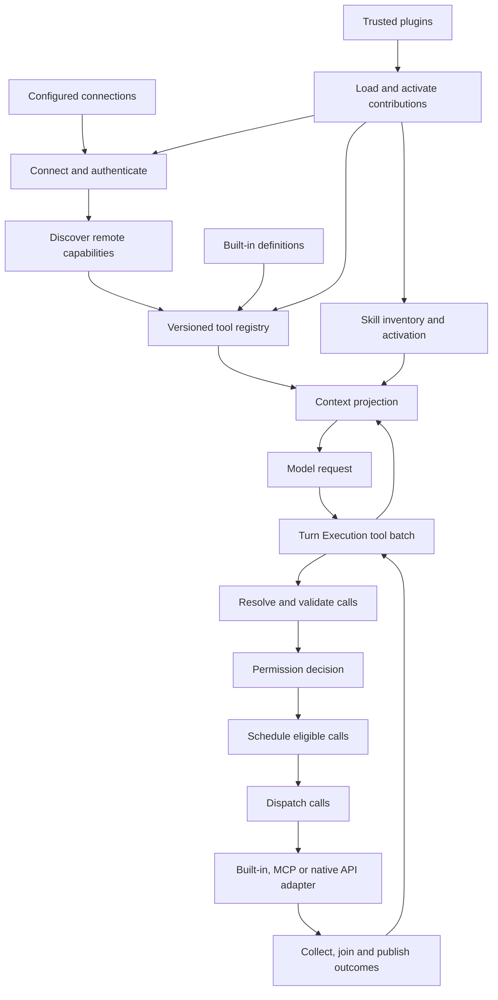

# Lina Tools, connections and extensions: architecture research

Reviewed 2026-10-07. Research proposal for a future real implementation and the
Studio design simulation. No new graph nodes, executable adapters, sign-in flows
or tool scheduling have been implemented by this study.

## Scope and evidence

The question is larger than how to execute a model's tool calls. Lina needs a
traceable path from installed/configured capabilities through account connection,
authentication, discovery, registration, model exposure and invocation. Skills,
plugins and MCP servers have different lifecycles; the architecture must preserve
them while providing one reliable tool execution path.

| Evidence | What it establishes | Limits |
| --- | --- | --- |
| [Hermes and OpenClaw](tools-hermes-openclaw.md) | Source-level MCP, credentials, native integrations, plugins, skills and scheduling | Exact inspected revisions; static inspection, no upstream runtime tests |
| [Pi and Waku](tools-pi-waku.md) | Source-level extension/skill loading, MCP integration and dispatch | Exact inspected revisions; capabilities differ between products |
| [MCP and connector standards](tools-connections-standards.md) | Protocol era, OAuth, transport, discovery and skill-format requirements | Official pages accessed on research date; no interoperability testing |
| [Existing repository runtime](tools-existing-runtime-audit.md) | Reusable local modules and concrete gaps | HEAD `95ff83fc537111b18c68d74bbcf2f337f3f8c630` plus existing working-tree design edits |

Observed upstream behavior, Lina decisions and proposed contracts are separated
below. No benchmark was run and this report makes no measured performance claim.

## What the agent comparison establishes

| System | Connection and extension evidence | Actual scheduling evidence |
| --- | --- | --- |
| Hermes, newer inspected revision | Native MCP OAuth plus managed connector broker; profile-scoped plugins, skills and connections | Segmented parallel work with barriers; MCP requires opt-in and inspected same-server RPC handler is locked |
| OpenClaw, newer inspected revision | Native MCP OAuth with shared/requester identities, plugin connection resolvers and channel adapters | Parallel supported; one sequential tool serializes the whole batch; MCP server opt-in |
| Pi, pinned revision | Built-in MCP extension/client package, separate connector OAuth, packages/extensions and progressive skills | Parallel default, but one sequential-marked tool serializes the batch |
| Waku, pinned revision | Optional MCP bridge and provider-specific native authentication; keyword-selected skills | Ordinary model tool loop is sequential despite async MCP transport |

Evidence: [Hermes/OpenClaw study](tools-hermes-openclaw.md) and
[Pi/Waku study](tools-pi-waku.md). Pi's built-in MCP support corrects older
assumptions about extension-only support. Async connections and multiple model
calls do not alone prove simultaneous external operations. The observed patterns
support parallel capability with explicit admission, not unrestricted concurrency.

## Recommended responsibility boundaries

The current seven-node execution proposal is useful, but incomplete without
capability setup. Add connection and registration responsibilities alongside it.
They should not all execute again on every model round.

| Owner | Responsibility | What it supplies to other owners |
| --- | --- | --- |
| Connections and integrations | Configuration, accounts, credentials, provider/transport lifecycle, discovery availability | Connection handles, adapter bindings and discovered definitions |
| Extensions | Discover trusted plugin packages, load contributions, activate hooks/services, dispose them | Tool/connector adapters, skill packages and lifecycle contributions |
| Skills | Inventory instruction packages, activate selected content, resolve requested resources | Versioned metadata and instruction/resource references to Context |
| Tool registry | Merge contributions, reject collisions, retain provenance/schema revisions and availability | The executable catalog plus model-facing projections |
| Tools execution | Resolve, validate, authorize, schedule, dispatch and account for each call | Correlated outcomes to Turn Execution |
| Context | Select permitted tool definitions, skills and observation views within the request budget | Model-ready context tied to catalog revisions |
| Safety and permissions | Decide operation approval under the current account, arguments and policy | Allow, deny or correlated approval wait |
| Execution Environment | Process, filesystem, browser, container and network execution boundaries | Scoped environments and operation execution |
| State and observability | Persist configuration/references and inspect lifecycle/call evidence | Replay/recovery evidence without exposing secrets |

These are ownership boundaries, not a requirement to create one top-level block
for every row. Studio can show setup lanes within a Tools view, with explicit
cross-block handoffs. Final grouping should follow the maintained architecture.
Incoming connector events go to Input; output delivery belongs to its existing
owner. A connector may support both incoming events and tool actions.



This is a proposed ownership diagram. The connection, extension and skill setup
nodes are not present in Lina's current graph.

## Connection lifecycle and authentication

Use a stable connection ID for one configured service/account binding. It is not
a token, URL supplied by the model, MCP transport session, or conversation ID.
Separate configured state from current readiness. A practical proposed lifecycle
is `disabled`, `disconnected`, `connecting`, `authorization-required`, `ready`,
`degraded`, `reauthorization-required` and `closing`. Keep safe reason codes and
last capability revision; do not label a configured endpoint healthy without a
successful observation.

### Connection nodes to represent

| Proposed node | Input and output boundary |
| --- | --- |
| Resolve connection configuration | Configured ID and owner scope to validated endpoint/process/provider configuration |
| Resolve authentication | Account/resource/scopes and credential reference to ready credentials, authorization wait or failure |
| Open transport / provider binding | Valid configuration and auth to an adapter handle; stdio also has process lifecycle |
| Establish protocol compatibility | Supported versions to negotiated era/capabilities; native APIs use their documented version instead |
| Discover capabilities | Ready handle to paginated tools, resource/prompt metadata and original upstream annotations |
| Monitor and refresh availability | Observed changes, expiry or failure to revised readiness/catalog; close/dispose on removal |

Authorization is a branch that can require human consent, not something the model
can complete by inventing a token. Its details should expose metadata discovery,
client registration choice, PKCE authorization, callback validation, exchange,
protected persistence, refresh and scope step-up. They need inspectable substages;
they need not each become a large top-level node.

Use the current and legacy MCP bindings from [the standards study](tools-connections-standards.md).
A stdio child receives selected environment credentials and process supervision.
A remote MCP HTTP client authenticates to its MCP resource. Native APIs use their
provider's token/API-key/service identity. A working model-provider credential is
unrelated to these connections.

### Credential ownership

A proposed credential key includes workspace/tenant owner, user/account, connection,
issuer and resource audience. Resolve tokens server-side at invocation. Store
refresh tokens and client secrets behind a credential-store interface; export
only safe references. The local encrypted store is an implementation candidate,
not proof of a deployable credential vault.

Bind callback state to the full original authorization attempt, its owner and
expiry. Serialize refresh per credential generation and atomically commit rotations.
Concurrent tool workers share readiness results, not raw token copies in their
records. An expired/invalid grant produces a connection state requiring sign-in.
After exchange, verify the actual provider subject/account before making the
connection ready. The intended account selected before login is not proof of the
account that granted consent.

OAuth scope expansion and approval of a write are separate waits with different
correlation IDs. Disconnect prevents fresh calls while preserving accounting for
started work. Provider revocation is provider-specific.

The current local OAuth code has PKCE and shared refresh, but missing callback
owner/connection/expiry binding and no MCP authorization discovery. The HTTP MCP
fixture has no bearer-auth wiring. Those are implementation gaps documented in
[the local audit](tools-existing-runtime-audit.md), not optional experiments.

## Adapter boundaries for real code

Use shared interfaces only where semantics are actually shared. Preserve upstream
payloads and provider-specific metadata next to normalized records.

| Proposed boundary | Operations and retained specifics |
| --- | --- |
| Credential store | Get/update/delete scoped opaque records; atomic generation updates; secret redaction |
| Auth strategy | Begin/complete/refresh/revoke when supported; MCP discovery or native provider configuration; issuer/resource/scopes |
| Connection manager | Resolve ready handle, connect, status, invalidate and close; account scope and readiness generation |
| MCP adapter | Stdio or HTTP transport, protocol era, discovery pages, invoke, progress, supported input-required continuation and cancellation |
| Native API adapter | Translate registered arguments, authenticate, invoke and classify provider errors, effects, rate limits and idempotency support |
| Built-in adapter | Invoke the local implementation under its permission and environment contract |
| Tool registry | Publish immutable catalog revisions; resolve stable tool ID and model alias; invalidate/reject stale binding |
| Plugin host | Discover, validate compatibility/trust, load, register, activate and dispose contributions |
| Skill loader | List metadata, load selected instructions and resolve permitted package resources |

The two existing tool registries have different status and evidence formats.
Choose an adopted contract or explicit adapters; do not silently conflate them.
The [runtime audit](tools-existing-runtime-audit.md) identifies exact reusable files.
Prefer an official MCP SDK for protocol mechanics, after selecting a release that
supports the required eras. The host still owns account identity, secret storage,
permissions and effect accounting. An SDK does not supply the whole harness. Host network policy must constrain
discovered metadata endpoints, URL schemes and redirects. Do not forward secrets
to a changed authority merely because a discovery document or redirect requested it.

## Registry, plugins and skills

A plugin is a package of contributions, potentially executable code. An MCP server
is a protocol endpoint. A skill is an instruction/resource package. A plugin may
provide both, but installing one does not establish a remote account connection.

Represent these plugin stages: **Discover packages → Validate trust and compatibility
→ Load contributions → Activate / dispose**. The manifest declares contribution
kinds, versions and required configuration. Loading executable hooks is a trust
boundary. Plugin hooks that modify arguments/context must run at explicit points;
revalidate affected calls and permission decisions. Unload stops fresh resolution,
then disposes workers/subscriptions according to the in-flight policy. Do not
promise sandbox isolation for in-process executable plugins.

Registry stages are **Register capabilities → Publish catalog revision**. Preserve
built-in/plugin/MCP/native-API origin, upstream name, model alias, adapter identity,
connection/account binding, schema digest and availability. Reject ambiguous
aliases. A changed schema or account can invalidate pending calls and approvals.
Do not silently execute against a different connection after reauthorization.
Capture the catalog revision exposed in the model request. Validate against that
immutable definition and acquire the matching live binding generation at launch.
A mismatched generation must fail or reprepare explicitly; never validate an old
schema and then invoke a newly rebound adapter. Synchronize binding invalidation
and launch admission so concurrent refresh cannot silently switch the operation.

Skill stages are **Discover skill metadata → Activate instructions → Load requested
resources**. Context owns inclusion; skill activation records source/revision.
Scripts use an existing execution tool and Environment, not a hidden bypass.
A skill's `allowed-tools` metadata must be interpreted under host policy rather
than treated as a new grant. Standards and observed source patterns are linked
in the supporting studies.

MCP resources and prompts need distinct handlers. Resource reads can supply task
evidence to Context; prompts can supply explicitly selected instruction/task
content. They should not be misregistered as tools with fabricated schemas. Explicit
resource-read or prompt-selection utility tools are valid adapters when their
schemas describe that real wrapper operation and retain source provenance.
Roots, sampling, elicitation and long-running task extensions are capabilities to
support explicitly or decline. Sampling is model work with its own budget and
permission boundary; it is not automatically a spawned Lina subagent.

## Tool execution path

Retain the seven proposed execution nodes, but specify their operational contract:

| Node | Required behavior |
| --- | --- |
| Resolve tool calls | Resolve against the exposed catalog revision; verify connection/account binding and availability |
| Validate arguments | Evaluate the registered schema before effects; retain original and any explicitly permitted normalization |
| Check permissions | Assess tool, account, arguments and effect policy; return allow, deny or correlated approval wait |
| Schedule calls | Bound concurrency globally and per adapter/connection; serialize conflicts and explicitly ordered operations |
| Dispatch calls | Recheck authority, readiness and cancellation before launch; record intent according to the persistence contract |
| Collect outcomes | Validate declared structured output, account for progress/terminal results and preserve uncertainty separately from known failure |
| Publish tool results | Join required started work; expose call-ID-matched results in stable call order to Turn Execution |

Parallel independent calls are a required Lina capability. The model returning
several calls in one response is separate from actual concurrent execution.
Connection capacity, transport locks and tool effect conflicts can prevent overlap.
[Anthropic's execution guidance](https://platform.claude.com/docs/en/agents-and-tools/tool-use/parallel-tool-use)
explicitly leaves scheduling to the host and requires a matching result for every
call. Browser/computer operations can have mandatory sequence rules.

Use registered local effect/conflict metadata. For unknown tools, require explicit
parallel eligibility or conservatively serialize a shared connection. MCP hints
alone do not establish safety. Avoid inferring arbitrary dependencies from model
arguments. Calls needing another result usually arrive in a subsequent model round.
Independent known-safe calls should overlap up to configured capacity. A scheduler
that launches parallel workers behind one exclusive transport lock has not achieved
parallel remote execution; evidence should distinguish both stages.

Validate/preflight calls individually. An invalid or denied call gets its own
terminal outcome without dispatch. Other independent authorized calls may proceed
under the declared batch policy. Never represent a single failed call as erasing
successful siblings. The baseline joins required work before the next model round;
progress can be shown sooner, but incremental model continuation is a different
contract requiring separate design.

The registry must declare supported JSON Schema dialects and provider projection
rules. Reject unsupported schemas explicitly, rather than claiming general schema
validation from a bounded fixture validator. Validate advertised structured output
when present. Malformed output after dispatch is an observation/contract failure,
not proof that the external operation had no effect.

Bind approvals to the final normalized argument digest, tool/schema/catalog
revision, account and policy version. Argument-changing plugin hooks run before
that decision or invalidate it. Authorization waits and connection refresh must
not reuse approval for a changed operation.

### Failures, retries and waits

- Unknown tool, invalid arguments, denied permission or unavailable connection are
  pre-dispatch outcomes. A model can receive a useful error without an external effect.
- Authentication challenge can enter a correlated connection authorization wait.
  Scope or credential changes require fresh readiness and permission checks.
- Rate limits and transient read failures may allow bounded backoff under an adapter
  contract. Reconnecting a transport does not authorize replaying tool effects.
- A write timeout, lost response or cancellation after dispatch can be uncertain.
  Reconcile using provider status/idempotency evidence when supported; never invent
  a universal exactly-once guarantee.
- MCP input-required continuation retains the logical call and server continuation
  data; it is distinct from retrying an unknown dispatched operation.
- Stop prevents new launches. Cooperative cancellation requests do not prove rollback.
  Classify each started call as known settled or requiring reconciliation.

Model Interface owns provider-specific tool-result encoding. Context owns optional
summaries/excerpts. Store complete permitted outcome evidence separately from its
model-visible projection, retaining structured/multimodal blocks and artifact refs.
Secret-bearing provider responses need explicit redaction before normal evidence
or model exposure; a generic raw-response dump is not a safe default.

## Illustrative records for later node schemas

These are proposed JSON examples, not MCP wire payloads, executable configuration
or completed schemas. Credential references are opaque. Each record needs a
versioned JSON Schema before implementation, with optional provider-specific
metadata rather than one flattened universal provider format.

Connection configuration and observed readiness:

```json
{
  "connectionId": "conn-docs-demo",
  "owner": { "workspaceId": "workspace-demo", "userId": "user-demo" },
  "kind": "mcp",
  "transport": "streamable-http",
  "endpoint": "https://mcp.example.com/mcp",
  "auth": {
    "strategy": "oauth-authorization-code-pkce",
    "credentialRef": "credential:docs-demo",
    "resource": "https://mcp.example.com/mcp",
    "accountId": "account-demo"
  },
  "protocol": { "supportedVersions": ["2026-07-28", "2025-11-25"] },
  "execution": { "maxConcurrentCalls": 4, "parallelEligibility": "registered-policy" },
  "observed": {
    "status": "ready",
    "protocolVersion": "2026-07-28",
    "readinessGeneration": 3,
    "catalogRevision": "catalog:demo:7"
  }
}
```

Private authorization transaction, whose state/verifier values are not exposed
in node inspectors or ordinary run evidence:

```json
{
  "authorizationId": "auth-demo-1",
  "connectionId": "conn-docs-demo",
  "ownerId": "user-demo",
  "issuer": "https://auth.example.com",
  "resource": "https://mcp.example.com/mcp",
  "clientRegistrationRef": "client:docs-demo",
  "redirectUri": "http://127.0.0.1:4500/oauth/callback",
  "requestedScopes": ["documents:read"],
  "privateStateRef": "private:oauth-state-demo",
  "privatePkceVerifierRef": "private:pkce-demo",
  "expiresAt": "2026-10-07T12:05:00Z",
  "status": "awaiting-callback"
}
```

Tool descriptor, distinguishing upstream hints from trusted local scheduling policy:

```json
{
  "toolId": "tool:docs-demo:search",
  "modelName": "docs_search",
  "upstreamName": "search",
  "origin": { "kind": "mcp", "connectionId": "conn-docs-demo" },
  "binding": { "adapterRef": "adapter:mcp-http", "accountId": "account-demo" },
  "catalogRevision": "catalog:demo:7",
  "schemaDigest": "sha256:illustrative-search-schema-digest",
  "inputSchema": {
    "type": "object",
    "properties": { "query": { "type": "string", "minLength": 1 } },
    "required": ["query"],
    "additionalProperties": false
  },
  "upstreamAnnotations": { "readOnlyHint": true },
  "localExecutionPolicy": {
    "effectClass": "read",
    "parallelEligible": true,
    "conflictScope": null,
    "policyRef": "policy:docs-search:1"
  },
  "availability": "ready"
}
```

Call intent retains the model call and the actual binding through later attempts:

```json
{
  "agentId": "lina-main",
  "turnId": "turn-demo-1",
  "roundId": "round-demo-2",
  "batchId": "batch-demo-1",
  "callId": "call-demo-1",
  "toolId": "tool:docs-demo:search",
  "catalogRevision": "catalog:demo:7",
  "schemaDigest": "sha256:illustrative-search-schema-digest",
  "arguments": { "query": "connection lifecycle" },
  "connectionId": "conn-docs-demo",
  "accountId": "account-demo",
  "readinessGeneration": 3,
  "argumentDigest": "sha256:illustrative-argument-digest",
  "permissionDecisionRef": "permission:demo-1",
  "permissionPolicyRevision": "permission-policy:demo:1",
  "schedulingGroupId": "parallel-group-demo-1",
  "attemptId": "attempt-demo-1",
  "status": "authorized-not-started"
}
```

Outcome preserves execution status separately from certainty about effects:

```json
{
  "callId": "call-demo-1",
  "attemptId": "attempt-demo-1",
  "status": "succeeded",
  "effectCertainty": "known",
  "connectionId": "conn-docs-demo",
  "protocolRequestId": "rpc-demo-10",
  "content": [{ "type": "text", "text": "Found one matching document." }],
  "structuredContent": { "matches": [{ "documentId": "document-demo" }] },
  "artifactRefs": ["artifact:tool-result-demo-1"],
  "retry": { "eligible": false, "reason": "already-settled" },
  "error": null
}
```

A wait adds a distinct `waitId`, kind, owning call/authorization IDs and safe
continuation reference. Preserve protocol-specific input request IDs privately
where needed. A batch record retains ordered call IDs, active calls, settled calls
and unresolved effects. The main loop cannot interpret progress as a terminal
result or replace missing results with invented successes.

## Required changes to existing Lina boundaries

This research proposes changes; it does not apply them to the graph:

- **Execute tool batch** delegates to detailed Tools nodes and returns through the
  existing outcome gate. Controller failure, cancellation and uncertain effects
  keep their distinct routes.
- **Prepare tool context** consumes a revision of the executable registry and skill
  metadata. Activated instructions enter Context with provenance and budgeting.
- **Load context sources** includes selected MCP resource/prompt references when
  supported, without silently fetching every resource at startup.
- **Input / Output** retain channel event and delivery ownership. Shared connector
  handles do not move webhook verification or outbound delivery into Tools by default.
- **Safety** owns permission/approval rules. Authentication is a connection lifecycle;
  the two can produce different waits and must not share an untyped approval flag.
- **State** distinguishes connection configuration/credential lifecycle from transient
  calls and canonical turn evidence. Transport session IDs are not durable tool receipts.
- **Observability** records queue, launch, completion and join separately so a future
  experiment can distinguish scheduler overlap from actual remote concurrency.

The empty Tools region should gain setup and execution lanes together. Creating
seven execution nodes alone would hide how real definitions and authenticated
bindings reach those nodes. Existing proposed nodes can stay coarse where their
inspectors expose accurate technical substages.

## Baseline requirements versus experiments

| Area | Baseline or use-case requirement | Credible later comparison |
| --- | --- | --- |
| Scheduling | Parallel support, known-safe eligibility, conflict ordering, bounded capacity and correlated results | Concurrency limits and conservative grouping policies |
| Discovery | Correct account-scoped, revisioned catalog and refresh/invalidation | Full exposure, selected subsets, deferred discovery |
| Tool definitions | Correct schemas, names, descriptions and provenance | Small operations versus task-level operations for the same task |
| Results | Preserve structured/multimodal evidence and call identity | Full observations, extracts, masking or artifact references |
| Skills | Metadata inventory, explicit activation and resource loading under permission policy | Model selection, deterministic matching or hybrid activation |
| Credentials | Correct issuer/resource/owner binding, private storage, refresh and callback validation | No comparison that removes those requirements |
| Plugins | Trusted loading, compatibility, lifecycle and authority constraints | Contribution packaging or isolation choices only under matched requirements |
| Retry/cache | Known effect semantics and freshness rules before use | Eligible read retry/backoff and cache policies under declared constraints |

Meaningful experiments state a task, hypothesis, one changed mechanism and shared
correctness constraints. Keep model/prompt, tool schemas, data, account scope,
provider quotas, injected latency/errors and environment fixed. Record catalog
revision, adapter/protocol versions, concurrency policy, timestamps and seed.
Measure task correctness, wall time, queued versus executing duration, actual peak
concurrency, failures, waits, provider usage and model tokens as applicable. A
scripted graph can validate routes and scheduling semantics; it cannot establish
real provider latency or answer-quality improvements.

Example experiment hypotheses for later real runs:

| Hypothesis | Changed variable | Shared controls and observations |
| --- | --- | --- |
| Bounded overlap reduces independent-read wall time without reducing correctness | Concurrency limit 1 versus 4 | Identical calls, injected server latency, model and quotas; verify actual overlap, completion time and errors |
| Deferred discovery reduces tool-definition context cost for a large catalog | Full versus on-demand exposure | Same available tools and tasks; measure tokens, extra model rounds, selection errors and completion |
| Structured extracts reduce context use while preserving task evidence | Full versus extracted observations | Same raw outcomes and recovery access; measure tokens, answer correctness and extra retrieval |

These are proposed hypotheses, not observed advantages. Registry availability and
permission constraints remain fixed in every comparison.

## Suggested simulation coverage before real execution

Start with deterministic cases that expose architecture behavior, without fake
account login or claims of real tool performance:

1. Built-in direct answer/tool path and native/MCP binding variants.
2. Two independent read calls overlap and join, with distinct per-call progress.
3. Conflicting operations serialize; eligible unrelated work can still progress.
4. Invalid arguments or denial alongside a successful independent sibling.
5. Missing/expired connection credential produces an authorization wait; matching
   simulated completion resumes owning work after fresh checks.
6. Changed schema or account invalidates a pending call instead of rebinding silently.
7. Connection loss before launch versus lost reply after a write, with reconciliation.
8. Cancellation before and after launch, partial completion and capacity limits.
9. Skill metadata selection, instruction activation and optional resource/script path.
10. Plugin contribution load/unload and catalog revision changes.

Auto and manual playback should use one event progression model. Concurrent state
needs multiple active call IDs. Next should advance a declared event or scheduling
boundary, not imply that only one branch exists. Configuration/connection lifecycles
can be separate scenarios rather than repeated fake startup before every turn.

## Implementation direction and unresolved decisions

Recommended foundation: one versioned tool registry, server-owned scoped
connections and credentials, adapters for built-in/MCP/native API calls, skill
progressive loading and explicit plugin contribution registration. Keep the
existing main loop and Context projection boundaries.

Before writing runtime code, settle:

- Which runtime language/package owns Lina, and whether to adopt the server tool
  contract or bridge the Studio modules. This study does not select a framework.
- Which MCP protocol eras, client capabilities and official SDK release are supported
  initially; unsupported features must fail clearly rather than be advertised.
- Local-user versus hosted/multi-user account ownership and credential-store choice.
  That determines callback endpoints, registration hosting and refresh coordination.
- Trusted local plugins initially versus executable third-party packages; hook API
  and in-flight unloading policy.
- Default concurrency limits and explicit metadata for unknown remote tool safety.
- Persistence guarantees and reconciliation support for each effecting adapter.
- Which actual native connector is needed first. A generic connector interface does
  not supply Google, GitHub, Slack or channel-specific API behavior.

These choices constrain implementation and are not reasons to delay the design
simulation. Begin with named supported behaviors and extend them with evidence.
The user has authorized research here, not those new runtime implementations.

## Validation and limits

Reports use primary specifications, official source and local code. Supporting
source revisions and citations are recorded in each study. Local links and JSON
examples are checked and the documentation catalog is regenerated. No upstream
unit suites, external OAuth provider flows, real MCP servers, load tests or model
benchmarks are executed by this research. Existing tests identified in the local
audit were inspected, not re-run as evidence of remote interoperability.


## Initial graph setup, 2026-10-08

The [node setup checklist](../../../development/implementation-plans/studio/completed/lina-tools-nodes.md)
records the first design implementation: 29 Tools nodes, including seven credential
lifecycle nodes, and provisional JSON contracts/examples. The researched setup and
execution paths are inspectable in Studio. This does not implement the researched
runtime, external authentication, adapters or parallel playback.
