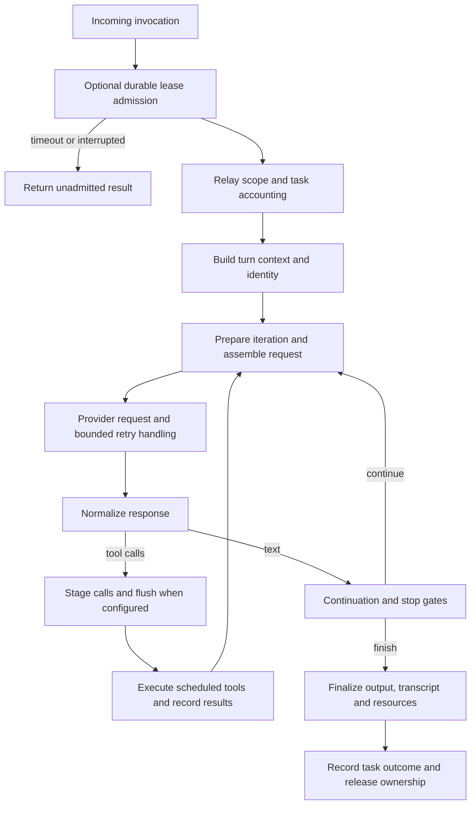

# Hermes turn execution: ownership around a repeated loop

Reviewed 2026-10-07. Supporting research for Lina, not an agreed design.

## Evidence and scope

This study uses `NousResearch/hermes-agent` commit
`ddc0e65958b326a89f6c440c76c812d31ac27e2a`, the Studio explorer pin. Its Git
object was available locally and inspected with `git show`. The checkout remained
at `0e21933114c911075782d5744cee5403996d38ae`. All source links below use the
pin. The official [developer guide](https://github.com/NousResearch/hermes-agent/blob/main/website/docs/developer-guide/agent-loop.md)
was checked as current explanatory material. Where its simplified description
of parallel tools differs from the source, the pinned implementation governs.

Scope covers the ordinary built-in conversation loop, its facade, lease,
control mechanisms, tool rounds and finalization. Hermes can instead delegate
execution to a native runtime; that runtime's complete lifecycle was not audited.
Source and selected tests were inspected, not executed. No timing, benchmark,
crash test or real external tool invocation is claimed.

## Lifecycle and ownership

The public turn facade owns admission and release around the loop. It creates
task/relay identity, requests an optional durable conversation lease, acquires
relay conversation scope, starts task accounting, invokes the conversation loop,
then records the terminal outcome and releases its scopes in nested `finally`
blocks. The model's answer is therefore an intermediate boundary in the larger
lifecycle. Process death can bypass these cleanup blocks.
[Facade](https://github.com/NousResearch/hermes-agent/blob/ddc0e65958b326a89f6c440c76c812d31ac27e2a/agent/turn_facade.py#L65-L201).

This is the ordinary route. Preflight failures and some alternate routes return
early, so it is not a claim that every exit crosses the same finalizer. The
outer wrapper still exports the current user boundary and closes durable failed
turns. [Loop and outward wrapper](https://github.com/NousResearch/hermes-agent/blob/ddc0e65958b326a89f6c440c76c812d31ac27e2a/agent/conversation_loop.py#L1534-L1755).

| Unit | Observed responsibility |
| --- | --- |
| Conversation/session | History and serialization across invocations |
| Logical turn/task | Current input, ownership and task outcome |
| Iteration | Prepare context, request, interpret response and decide continuation |
| Provider attempt | Retry a model request within the iteration |
| Tool call/batch | External operation, observed result, skip/interruption and ordered publication |
| Finalization | Transcript/output preparation, cleanup and explicit result assembly |

The implementation assigns turn identity in turn context and API identity from
turn ID plus API call count. It reanchors the exact current user row after
history transformations. Stable identity and mutable transcript position are
different concepts. [Turn identity](https://github.com/NousResearch/hermes-agent/blob/ddc0e65958b326a89f6c440c76c812d31ac27e2a/agent/turn_context.py#L565-L600),
[user boundary export](https://github.com/NousResearch/hermes-agent/blob/ddc0e65958b326a89f6c440c76c812d31ac27e2a/agent/turn_context.py#L313-L347),
[API attempt loop](https://github.com/NousResearch/hermes-agent/blob/ddc0e65958b326a89f6c440c76c812d31ac27e2a/agent/conversation_loop.py#L1501-L1531).

## Admission and persistence are conditional

Durable lease admission is conditional on a session database, identity and
capabilities. Without them, execution can proceed without that lease. With the
lease, contention causes history to reload after ownership is acquired, avoiding
execution against the transcript that existed before the wait. The refresher
can request interruption if renewal fails. The facade stops and joins the
refresher before clearing its interrupt and releasing its lease.
[Admission](https://github.com/NousResearch/hermes-agent/blob/ddc0e65958b326a89f6c440c76c812d31ac27e2a/agent/turn_facade_lease.py#L237-L327),
[lease loss](https://github.com/NousResearch/hermes-agent/blob/ddc0e65958b326a89f6c440c76c812d31ac27e2a/agent/turn_facade_lease.py#L184-L209).

A tool round validates and stages assistant calls before execution. If a
configured incremental flush fails, it stops before launching the tool batch.
Results are also flushed during tool progress. This is a useful intent-before-
effect boundary, but the persistence helper returns without a write when there
is no session database or persistence is disabled. It cannot be described as
unconditionally durable, crash-resumable or exactly-once execution.
[Tool-round ordering](https://github.com/NousResearch/hermes-agent/blob/ddc0e65958b326a89f6c440c76c812d31ac27e2a/agent/turn_tool_round.py#L44-L180),
[conditional flush](https://github.com/NousResearch/hermes-agent/blob/ddc0e65958b326a89f6c440c76c812d31ac27e2a/agent/session_persistence.py#L469-L507).

## Tool scheduling is a mechanism worth comparing

Hermes plans a batch as ordered sequential and parallel segments. Unknown or
unsafe calls form barriers. Path-scoped readers can overlap; overlapping paths
involving a writer end the parallel segment. A later call does not cross an
earlier barrier. Segment executors preserve per-call result order, and batch
finalization runs once for the entire batch. Interrupted later segments produce
skipped outcomes rather than pretending those tools ran.
[Planner](https://github.com/NousResearch/hermes-agent/blob/ddc0e65958b326a89f6c440c76c812d31ac27e2a/agent/tool_dispatch_helpers.py#L198-L247),
[segmented executor](https://github.com/NousResearch/hermes-agent/blob/ddc0e65958b326a89f6c440c76c812d31ac27e2a/agent/tool_executor.py#L1898-L1923).

This is more specific than a single parallel-tools toggle. It gives Lina a
possible future experiment comparing sequential execution, whole-batch parallel
execution, and dependency-aware segments. Declared independence must be an
experiment control, and reduced latency remains an unmeasured hypothesis.

## Steering, redirecting and stopping

`steer()` buffers guidance without interrupting, for delivery after the current
tool batch. `redirect()` can cancel only the active model request and continue
the same logical turn using a correction. During tools it degrades to steering
and may ask supported workers to yield. A native runtime uses its own steering
API. Hard interruption has a separate operation and signal propagation.
[Control contracts](https://github.com/NousResearch/hermes-agent/blob/ddc0e65958b326a89f6c440c76c812d31ac27e2a/agent/interrupt_control.py#L217-L315).

Redirect is therefore not equivalent to Lina's proposed Interrupt, which stops
one owner and admits a replacement turn. During a redirected model request,
completed messages stay and partial assistant context can be retained. A
simulator must not infer that interruption erases everything generated so far.
[Model interrupt handling](https://github.com/NousResearch/hermes-agent/blob/ddc0e65958b326a89f6c440c76c812d31ac27e2a/agent/turn_api_call.py#L171-L224).

Tool-result publication distinguishes observed results from abandoned work.
Stopping future launches and recording a skipped call does not prove an
already-started external effect was undone.
[Tool-result contract](https://github.com/NousResearch/hermes-agent/blob/ddc0e65958b326a89f6c440c76c812d31ac27e2a/agent/tool_executor.py#L1054-L1094).

## Completion has policy and cleanup

A response containing text and no tools can still continue because of truncation,
stall handling or stop gates. The request retry loop and iteration budget are
separate controls. They should remain separate counters in Lina's eventual
model. [Text response policy](https://github.com/NousResearch/hermes-agent/blob/ddc0e65958b326a89f6c440c76c812d31ac27e2a/agent/turn_final_response.py#L55-L95),
[stop gates and text append](https://github.com/NousResearch/hermes-agent/blob/ddc0e65958b326a89f6c440c76c812d31ac27e2a/agent/turn_final_response.py#L313-L365).

Finalization prepares/persists history, records cleanup errors without always
throwing away a usable answer, assembles completed/failed/interrupted fields and
an exit reason, and returns leftover steering instead of silently dropping it.
Some memory and review work also occurs here. A hook called `on_session_end`
runs at the turn boundary; the name does not establish that the conversation
has ended or its memory provider has shut down. Transport delivery is owned
outside this function.
[Finalization](https://github.com/NousResearch/hermes-agent/blob/ddc0e65958b326a89f6c440c76c812d31ac27e2a/agent/turn_finalizer.py#L509-L619),
[result and pending steering](https://github.com/NousResearch/hermes-agent/blob/ddc0e65958b326a89f6c440c76c812d31ac27e2a/agent/turn_finalizer.py#L670-L786).

## Test evidence and limits

Inspected test bodies include:

- [Cross-process lease tests](https://github.com/NousResearch/hermes-agent/blob/ddc0e65958b326a89f6c440c76c812d31ac27e2a/tests/agent/test_cross_process_turn_lease.py#L73-L125), covering reload after contention and release ordering, with later cases for timeout, interruption and refresher behavior.
- [Current user boundary tests](https://github.com/NousResearch/hermes-agent/blob/ddc0e65958b326a89f6c440c76c812d31ac27e2a/tests/agent/test_export_current_turn_boundary.py#L42-L115), distinguishing admitted user rows from preflight exits.
- [Completed-text persistence tests](https://github.com/NousResearch/hermes-agent/blob/ddc0e65958b326a89f6c440c76c812d31ac27e2a/tests/agent/test_text_turn_incremental_persistence.py#L108-L175), covering flush before finalization and a handled flush failure.

These are inspected contracts, not passing test results from this research.
Per-tool effect guarantees, database crash windows, all gateway queues and native
runtime behavior require separate study before stronger reliability claims.

## Implications for Lina, proposed

Keep the next block's ownership around the entire admitted request, with
repeated model/tool rounds inside it. Define completion and release separately.
Let it choose continuation, retries and control boundaries while Context,
Model, Tools, Storage and Output perform their own work. Conditional persistence
and native-runtime delegation should be explicit, rather than hidden behind a
single generic execution box.
