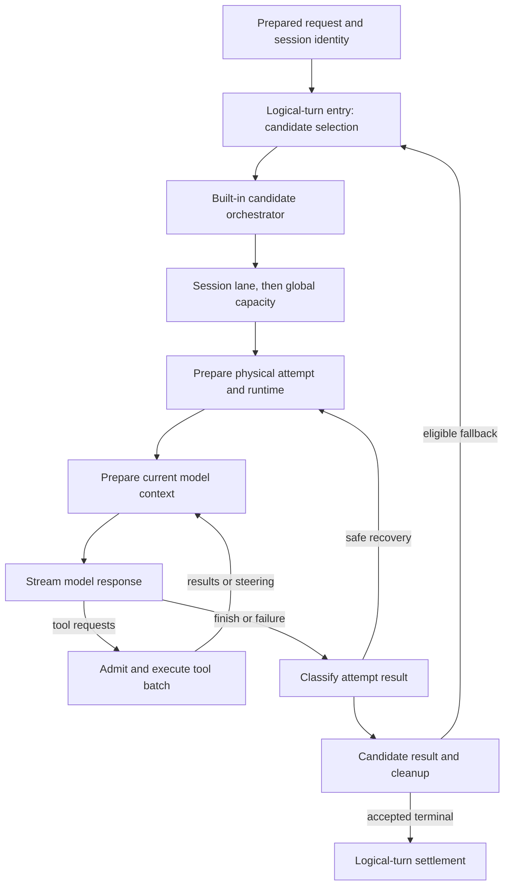

# OpenClaw turn execution: source study for Lina

Reviewed 2026-10-07. This is supporting research, not an agreed Lina design.

## Scope and source identity

The principal evidence is official OpenClaw source at `e40ed06f23cb8bd939c9a6ff537eba7136074686`, the revision used by the Studio OpenClaw explorer. The local checkout reports HEAD `912685f442286233fbbd40762482d98598299497`, but its Git object database cannot read either revision. To avoid treating newer working files as the older snapshot, the files cited here were downloaded directly from official `raw.githubusercontent.com` URLs at the principal revision. The local checkout and its code map helped locate files; they are not the evidence for pinned claims. A browser check of the official newer architecture document confirmed the runtime/module ownership vocabulary; no newer behavior is silently substituted into this study.

Scope: prepared-turn orchestration, built-in agent execution, attempts, tool batches, queue injection, streaming, termination, and selected recovery/settlement behavior. Native harness implementations and every channel caller were not independently audited. Source and tests were read; the upstream test suite was not executed.

## The most important architectural finding

OpenClaw has several nested lifecycles. A prepared user task, a model fallback candidate, a physical attempt, a core assistant cycle, and an individual tool invocation are different units. In particular, core `turn_start` / `turn_end` events surround repeated assistant/tool cycles; they must not be interpreted as the admission and release of the user's whole request. The logical-turn entry spans fallback candidates, while the core loop can emit many turn events before `agent_end`. [logical-turn owner](https://github.com/openclaw/openclaw/blob/e40ed06f23cb8bd939c9a6ff537eba7136074686/src/agents/embedded-agent-runner/run-entry.ts#L154-L173); [core cycle events](https://github.com/openclaw/openclaw/blob/e40ed06f23cb8bd939c9a6ff537eba7136074686/packages/agent-core/src/agent-loop.ts#L211-L224), [cycle and run termination](https://github.com/openclaw/openclaw/blob/e40ed06f23cb8bd939c9a6ff537eba7136074686/packages/agent-core/src/agent-loop.ts#L332-L450).

This diagram describes the built-in route and deliberately omits transport/plugin details. The entry exposes `runCandidate`; it does not require every plugin executor to traverse the built-in attempt loop. [candidate execution and classification](https://github.com/openclaw/openclaw/blob/e40ed06f23cb8bd939c9a6ff537eba7136074686/src/agents/embedded-agent-runner/run-entry.ts#L363-L403).

## Ownership and identity

| Unit | Observed owner and identity | Consequence for Lina |
| --- | --- | --- |
| Session/conversation | `sessionId`, routing `sessionKey`, agent identity; session lane derives from key or ID | A conversation is longer lived than one run. |
| Logical request/run | `runId`, prepared admission and lifecycle generation; logical entry accepts a terminal result | Keep the request identity across retries and model candidates. |
| Candidate/physical attempt | Prepared runtime, model route, attempt terminal evidence and retry bookkeeping | Do not mark the whole request failed whenever one model attempt fails. |
| Assistant cycle | Core loop `turn_start` / `turn_end`; refreshed context/model/tool catalog can apply to the next cycle | Give repeated cycles a separate simulation identity or step count. |
| Tool invocation | Tool call ID, admission plan, execution/finalization ownership | A tool may be admitted, executing, settled, skipped, or uncertain independently of the model. |

The table is an interpretation of [entry identity and logical lease](https://github.com/openclaw/openclaw/blob/e40ed06f23cb8bd939c9a6ff537eba7136074686/src/agents/embedded-agent-runner/run-entry.ts#L175-L228), [session/global admission](https://github.com/openclaw/openclaw/blob/e40ed06f23cb8bd939c9a6ff537eba7136074686/src/agents/embedded-agent-runner/run-orchestrator.ts#L181-L244), [tool lifecycle and result settlement](https://github.com/openclaw/openclaw/blob/e40ed06f23cb8bd939c9a6ff537eba7136074686/packages/agent-core/src/agent-loop.ts#L631-L725), and [next-cycle preparation](https://github.com/openclaw/openclaw/blob/e40ed06f23cb8bd939c9a6ff537eba7136074686/packages/agent-core/src/agent-loop.ts#L388-L410).

The orchestrator acquires the session lane before global capacity and waits for deferred session maintenance before taking global capacity. Waiting for capacity is explicitly classified as healthy waiting, rather than executing or stuck. After the queue grants capacity it rechecks lifecycle and claims the session writer; a stale queued owner cannot simply reuse old write authority. A lane timeout may release the queue slot before underlying work settles, so the controller aborts that task's authority. Thus a simplistic "slot released means all side effects stopped" simulation would be wrong. [maintenance ordering](https://github.com/openclaw/openclaw/blob/e40ed06f23cb8bd939c9a6ff537eba7136074686/src/agents/embedded-agent-runner/run-orchestrator.ts#L230-L244); [capacity and writer claims](https://github.com/openclaw/openclaw/blob/e40ed06f23cb8bd939c9a6ff537eba7136074686/src/agents/embedded-agent-runner/run/lane-controller.ts#L294-L361).

## Execution mechanism

The core loop appends accepted prompts, emits start/message events, and streams a response. It continues when the provider requests continuation, indicates `endTurn === false`, produces a nonterminal tool batch, or receives steering. At a cycle boundary, `prepareNextTurn` may replace context, model, reasoning settings, and continuation preparation. `shouldStopAfterTurn` and explicit next-cycle `stop` can terminate the loop. After ordinary work finishes, the outer loop drains follow-up messages and rechecks steering before ending. This is a controller around repeated model/tool work, not a single provider call. [continuation decisions](https://github.com/openclaw/openclaw/blob/e40ed06f23cb8bd939c9a6ff537eba7136074686/packages/agent-core/src/agent-loop.ts#L295-L450).

Tool execution supports sequential and parallel modes. A sequential-only tool can force sequential scheduling. Parallel tool bodies may overlap, but admission and finalization are controlled; results are emitted in the prepared order. When steering or admission failure stops a batch, unstarted calls receive skipped/failed outcomes, and already-started work is awaited. These details matter when simulating cancellation halfway through a batch. [execution mode selection](https://github.com/openclaw/openclaw/blob/e40ed06f23cb8bd939c9a6ff537eba7136074686/packages/agent-core/src/agent-loop.ts#L511-L527); [parallel settlement and skipped calls](https://github.com/openclaw/openclaw/blob/e40ed06f23cb8bd939c9a6ff537eba7136074686/packages/agent-core/src/agent-loop.ts#L631-L725).

Streaming is part of execution, not just display. An asynchronous tool call may start while the model continues sampling. The stream adapter first commits the assistant fragment owning that tool call, then admits its execution. It tracks executed IDs, emits fragment updates, and waits for admitted tool work before final response settlement. Output-limit failures have a dedicated drain/recovery path. [streamed updates and durable tool ownership](https://github.com/openclaw/openclaw/blob/e40ed06f23cb8bd939c9a6ff537eba7136074686/packages/agent-core/src/agent-stream-response.ts#L321-L373); [terminal fragment settlement](https://github.com/openclaw/openclaw/blob/e40ed06f23cb8bd939c9a6ff537eba7136074686/packages/agent-core/src/agent-stream-response.ts#L390-L430).

## New messages, waiting, and cancellation

The core `Agent` rejects a new `prompt` while active. Callers must steer, enqueue a follow-up, or wait. Steering is intended for model/tool checkpoints; follow-up input is drained after the current inner work finishes. These are different policies from admitting a separate queued conversation turn. Queue drain modes are configurable, and cancelled queued input is checked before transcript commitment. [queue controls](https://github.com/openclaw/openclaw/blob/e40ed06f23cb8bd939c9a6ff537eba7136074686/packages/agent-core/src/agent.ts#L377-L431); [busy prompt and continuation](https://github.com/openclaw/openclaw/blob/e40ed06f23cb8bd939c9a6ff537eba7136074686/packages/agent-core/src/agent.ts#L464-L510); [cancelled drained prompts](https://github.com/openclaw/openclaw/blob/e40ed06f23cb8bd939c9a6ff537eba7136074686/packages/agent-core/src/agent-loop.ts#L78-L106).

`abort()` signals the active run. `waitForIdle()` resolves only after awaited event listeners finish. Run cleanup restores uncommitted queue reservations and clears streaming/pending-tool state before clearing the active owner. An `agent_end` event therefore does not establish that persistence/listener cleanup has already finished. [abort and idle contract](https://github.com/openclaw/openclaw/blob/e40ed06f23cb8bd939c9a6ff537eba7136074686/packages/agent-core/src/agent.ts#L434-L450); [cleanup and event ordering](https://github.com/openclaw/openclaw/blob/e40ed06f23cb8bd939c9a6ff537eba7136074686/packages/agent-core/src/agent.ts#L635-L680).

Approval waiting belongs to a tool-call approval adapter. It sends an explicit broker or gateway request with tool/session/channel identity, timeout, and cancellation signal; denial, unavailable surfaces, and timeout are classified outcomes. This is a distinct reason for waiting, not the same state as queued global capacity. This pass does not establish that every approval path is restart-resumable. [approval request and outcomes](https://github.com/openclaw/openclaw/blob/e40ed06f23cb8bd939c9a6ff537eba7136074686/src/agents/agent-tools.before-tool-call.approval.ts#L221-L315).

## Termination, budgets, and recovery

There is no single termination knob that describes every lifecycle. The core handles provider failure/abort, terminal tool batches, explicit stop hooks, and tool-loop recovery termination. The outer built-in loop separately limits recovery attempts. Its helper scales the attempt budget with auth-profile candidates, bounded between 32 and 160. Those numbers are recovery-attempt limits, not maximum assistant cycles or a recommended Lina default. A progress continuation can refund the counted-attempt charge; dispatched and counted attempts remain distinct. [core termination](https://github.com/openclaw/openclaw/blob/e40ed06f23cb8bd939c9a6ff537eba7136074686/packages/agent-core/src/agent-loop.ts#L347-L427); [retry limits](https://github.com/openclaw/openclaw/blob/e40ed06f23cb8bd939c9a6ff537eba7136074686/src/agents/embedded-agent-runner/run/helpers.ts#L51-L61); [attempt accounting](https://github.com/openclaw/openclaw/blob/e40ed06f23cb8bd939c9a6ff537eba7136074686/src/agents/embedded-agent-runner/run/retry-budget.ts#L1-L39).

Recovery distinguishes replaying an original request from continuing a transcript containing settled tools. It inspects replay safety and tool-settlement evidence. Settled-tool idle timeout or mid-turn overflow can continue recorded results without redoing the original call; active generic tool work normally blocks that route. A parked Code Mode run is a specifically recorded exception. Recorded tool results alone are explicitly insufficient proof that side effects settled. [recovery admission conditions](https://github.com/openclaw/openclaw/blob/e40ed06f23cb8bd939c9a6ff537eba7136074686/src/agents/embedded-agent-runner/run/attempt-recovery.ts#L123-L204).

Model fallback also checks live delivery custody or committed-side-effect evidence. It will not freely switch candidates after a reply was sent or retry-blocked delivery exists. Only an accepted terminal advances the context-engine logical turn; rejected attempts are discarded, and terminal cleanup is settled at the logical-run level. This is targeted protection, not a universal exactly-once guarantee. [fallback custody](https://github.com/openclaw/openclaw/blob/e40ed06f23cb8bd939c9a6ff537eba7136074686/src/agents/embedded-agent-runner/run-entry.ts#L265-L278); [accepted-turn commit](https://github.com/openclaw/openclaw/blob/e40ed06f23cb8bd939c9a6ff537eba7136074686/src/agents/embedded-agent-runner/run-entry.ts#L634-L662); [logical terminal and refresh continuation](https://github.com/openclaw/openclaw/blob/e40ed06f23cb8bd939c9a6ff537eba7136074686/src/agents/embedded-agent-runner/run-orchestrator.ts#L650-L741).

## Test evidence inspected

| Test | Contract it exercises |
| --- | --- |
| [parallel commit failure](https://github.com/openclaw/openclaw/blob/e40ed06f23cb8bd939c9a6ff537eba7136074686/packages/agent-core/src/agent-loop.test.ts#L533-L695) | Active ownership remains while an already-started parallel tool finishes after a later admission failure. |
| [next-cycle preparation](https://github.com/openclaw/openclaw/blob/e40ed06f23cb8bd939c9a6ff537eba7136074686/packages/agent-core/src/agent-loop.test.ts#L1685) | Updated context/model/tool settings reach the next model request. |
| [async streamed tools](https://github.com/openclaw/openclaw/blob/e40ed06f23cb8bd939c9a6ff537eba7136074686/packages/agent-core/src/agent-loop.async-tools.test.ts#L318-L458) | Tool-call ownership is recorded before admission while remaining output streams. |
| [delivery custody test](https://github.com/openclaw/openclaw/blob/e40ed06f23cb8bd939c9a6ff537eba7136074686/src/agents/embedded-agent-runner/run-entry.custody.test.ts#L11-L80) | Classification rechecks changing delivery evidence instead of treating an earlier observation as permanent. |
| [detached retry transcript](https://github.com/openclaw/openclaw/blob/e40ed06f23cb8bd939c9a6ff537eba7136074686/src/agents/embedded-agent-runner/run-orchestrator.suspension.test.ts#L571-L638) | An in-memory detached run retains the same transcript manager across a real attempt retry. |

These tests were inspected as executable contracts, not reported as passing in this environment.

## Implications for Lina, still proposals

The next block can reasonably be called **Turn Execution**, provided Lina defines "turn" as one admitted logical request and calls repeated model/tool cycles something else. Its boundary should own progression and terminal settlement, while delegating context construction, model transport, tool execution, persistence, and output delivery to their respective components.

A useful simulation should distinguish: waiting for admission, preparing, model streaming, tools executing, waiting for approval/external input, recovering, and settling. It need not expose every state immediately. Internally separate the logical request from an attempt and from a tool call, so future queueing/cancellation behavior has a coherent owner.

The strongest lesson is not to copy OpenClaw's product-specific complexity. It is to record exactly which owner is active, what can safely continue, and what "finished" means. Useful experiments later include checkpoint steering versus finish-then-follow-up, sequential versus bounded parallel tools, and terminal-only versus streamed asynchronous tool execution. Those alternatives change behavior and scheduling; this source review does not measure their performance.

## Limits and open questions

- This pass does not prove full workflow replay after process failure or exactly-once external effects. Transcript durability and per-call admission records are narrower guarantees.
- Detailed session database transactions, crash windows, delivery adapters, tool-provider idempotency, and all plugin harnesses need separate audits before stronger claims.
- Approval waiting, yielded subagent work, and asynchronous background tool execution should not collapse into one generic waiting state. Full yield/resume ownership was not traced here.
- No normative cross-agent standard is established by OpenClaw alone. The observations inform Lina's comparison with Hermes, Pi, and Waku; they do not settle Lina's architecture.
