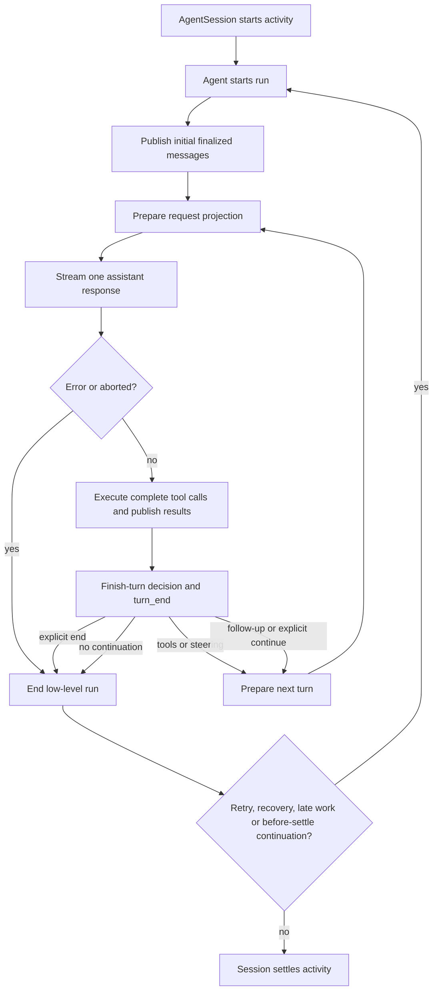

# Pi turn execution source study

## Scope and evidence

Inspected on 2026-10-07 against `earendil-works/pi` revision
`a276dabe57911253350bffb93cb7d7aff6a73261`. The former local checkout could not
be located. The revision was fetched into an isolated bare repository under
`/tmp/pi-turn-source/repo.git`; files were read with `git show`, without changing
any project or agent checkout. The pinned upstream GitHub source was also opened
to verify identity. This is static research. Tests were inspected, not executed,
and no provider or tool was invoked.

The stable coding agent uses `AgentSession` over `Agent`. The experimental
`pi-durable` Harness has a separate execution root and persistence contract.
These are two designs in the same repository, not interchangeable descriptions
of its normal CLI. See the [existing Pi study](../system-explorers/pi.md).

## Vocabulary and ownership

Pi's low-level **turn** is one assistant response plus the tools and results
associated with that response. A multi-step input-to-answer interaction is a
**run**. A tool-result continuation starts another turn even when no new user
message arrived. Calling Lina's entire input-to-final-answer lifecycle a turn
would therefore require an explicit terminology mapping.
Sources: [event contract](https://github.com/earendil-works/pi/blob/a276dabe57911253350bffb93cb7d7aff6a73261/packages/agent/src/types.ts#L518-L520),
[durable concepts](https://github.com/earendil-works/pi/blob/a276dabe57911253350bffb93cb7d7aff6a73261/packages/durable/README.md#L78-L99).

| Owner | Responsibility in the stable path |
| --- | --- |
| `Agent` | One active run, abort signal, volatile steering/follow-up queues, mutable event-reduced state, awaited subscribers |
| `runLoop` | Assistant/tool rounds, queue precedence, continuation/termination decisions |
| `AgentSession` | Canonical request projection, prompt/tool refresh, extension boundaries, finalized message persistence, retry/compaction, activity settlement |
| `SessionManager` | Branching transcript entries, context projection, JSONL writes |
| Model runtime/provider and tools | Actual streaming generation and external effects |

Sources: [active run and events](https://github.com/earendil-works/pi/blob/a276dabe57911253350bffb93cb7d7aff6a73261/packages/agent/src/agent.ts#L507-L611),
[loop](https://github.com/earendil-works/pi/blob/a276dabe57911253350bffb93cb7d7aff6a73261/packages/agent/src/agent-loop.ts#L163-L320),
[session continuation and settlement](https://github.com/earendil-works/pi/blob/a276dabe57911253350bffb93cb7d7aff6a73261/packages/coding-agent/src/core/agent-session.ts#L1775-L1865),
[JSONL persistence](https://github.com/earendil-works/pi/blob/a276dabe57911253350bffb93cb7d7aff6a73261/packages/coding-agent/src/core/session-manager.ts#L1160-L1195).

## Stable execution workflow

Each box summarizes a real owner. Initial `message_end` events precede request
preparation. The loop then prepares request state, transforms context, converts
messages at the provider boundary, and streams the response. An errored or
aborted assistant skips tool execution and exits the low-level run. Length-
truncated responses reject all proposed tool calls as error results, even if
salvaged arguments appear valid.
Sources: [initial events](https://github.com/earendil-works/pi/blob/a276dabe57911253350bffb93cb7d7aff6a73261/packages/agent/src/agent-loop.ts#L102-L124),
[request and stop handling](https://github.com/earendil-works/pi/blob/a276dabe57911253350bffb93cb7d7aff6a73261/packages/agent/src/agent-loop.ts#L219-L278),
[streaming and conversion](https://github.com/earendil-works/pi/blob/a276dabe57911253350bffb93cb7d7aff6a73261/packages/agent/src/agent-loop.ts#L381-L468).

`finishTurn` runs after finalized assistant/tool messages and before `turn_end`.
An explicit `end` outranks tool continuation and queue polling. Otherwise tools
or steering create another round; follow-ups enter only when that inner loop
would stop. Explicit `continue` supplies one context-only round if no natural
continuation consumed it. This is policy, not a fixed number of model steps.
Source: [continuation precedence](https://github.com/earendil-works/pi/blob/a276dabe57911253350bffb93cb7d7aff6a73261/packages/agent/src/agent-loop.ts#L280-L320).

The next-round callback can compact context and refresh prompt sections, tool
loadout, model and thinking settings. Steering is polled again after that
potentially slow preparation if the earlier poll returned nothing. It is not
polled again after `prepareRequest`; arrivals then wait for the next boundary.
Sources: [boundary queue admission](https://github.com/earendil-works/pi/blob/a276dabe57911253350bffb93cb7d7aff6a73261/packages/agent/src/agent-loop.ts#L176-L219),
[next-turn refresh](https://github.com/earendil-works/pi/blob/a276dabe57911253350bffb93cb7d7aff6a73261/packages/coding-agent/src/core/agent-session.ts#L871-L913),
[queue admission tests](https://github.com/earendil-works/pi/blob/a276dabe57911253350bffb93cb7d7aff6a73261/packages/agent/test/agent-loop.test.ts#L1417-L1590).

## Tool scheduling and publication

A batch is sequential when requested by configuration or when any selected
tool declares sequential execution. Otherwise preparation and pre-call hooks
still run serially, then prepared calls execute concurrently. Tool completion
events may appear in completion order. Result messages are published only after
joining the batch, in assistant call order. Steering enters after the batch,
not between individual calls. This distinction matters in a simulator: parallel
execution and transcript ordering are different properties.
Sources: [scheduling](https://github.com/earendil-works/pi/blob/a276dabe57911253350bffb93cb7d7aff6a73261/packages/agent/src/agent-loop.ts#L508-L659),
[ordering tests](https://github.com/earendil-works/pi/blob/a276dabe57911253350bffb93cb7d7aff6a73261/packages/agent/test/agent-loop.test.ts#L627-L825).

Validation, missing tools, blocked calls and execution exceptions become error
outcomes that the model can consume. A batch terminates only when every finalized
result requests termination. A single terminating result in a mixed batch does
not stop the run. The successful loop's explicit finish decision can still end
it. Sources: [termination rule](https://github.com/earendil-works/pi/blob/a276dabe57911253350bffb93cb7d7aff6a73261/packages/agent/src/agent-loop.ts#L689-L690),
[preparation and execution](https://github.com/earendil-works/pi/blob/a276dabe57911253350bffb93cb7d7aff6a73261/packages/agent/src/agent-loop.ts#L707-L864),
[termination tests](https://github.com/earendil-works/pi/blob/a276dabe57911253350bffb93cb7d7aff6a73261/packages/agent/test/agent-loop.test.ts#L1691-L1970).

## Completion, abort and idle

`agent_end` means that the low-level loop has no further events. It does not
mean the coding-session activity has finished. `Agent.waitForIdle()` waits for
awaited subscribers and runtime cleanup. `AgentSession` may then retry, compact,
admit work queued by end handlers, or run an `agent_before_settle` boundary that
requests continuation. The session exposes `agent_settled` after those paths.
Sources: [idle contract](https://github.com/earendil-works/pi/blob/a276dabe57911253350bffb93cb7d7aff6a73261/packages/agent/src/agent.ts#L340-L351),
[listener completion](https://github.com/earendil-works/pi/blob/a276dabe57911253350bffb93cb7d7aff6a73261/packages/agent/src/agent.ts#L550-L611),
[post-run policy](https://github.com/earendil-works/pi/blob/a276dabe57911253350bffb93cb7d7aff6a73261/packages/coding-agent/src/core/agent-session.ts#L1775-L1865).

Session abort cancels the active run, retry sleep, compaction and branch summary,
marks cancellation during before-settle processing, then waits for idle. The
low-level abort method only signals cancellation. It does not synchronously
undo tools or guarantee an external effect was prevented. Steering/follow-up
queues are memory-resident until messages are admitted to the transcript; an
explicit `end` can leave them queued.
Sources: [abort and waiting](https://github.com/earendil-works/pi/blob/a276dabe57911253350bffb93cb7d7aff6a73261/packages/coding-agent/src/core/agent-session.ts#L2384-L2404),
[queues and abort](https://github.com/earendil-works/pi/blob/a276dabe57911253350bffb93cb7d7aff6a73261/packages/agent/src/agent.ts#L298-L351),
[queue retention test](https://github.com/earendil-works/pi/blob/a276dabe57911253350bffb93cb7d7aff6a73261/packages/agent/test/agent.test.ts#L1123-L1148).

## Retry, compaction, budgets and persistence

Session retry classifies transient assistant errors, excludes context overflow,
uses a configured attempt budget and abortable backoff, and durably omits failed
attempts from model projection while retaining raw history. Successful assistant
responses reset the retry count. Provider HTTP request retry is separate and
its helper defaults to zero retries unless supplied a budget.
Sources: [session retry](https://github.com/earendil-works/pi/blob/a276dabe57911253350bffb93cb7d7aff6a73261/packages/coding-agent/src/core/agent-session.ts#L3660-L3663),
[retry preparation](https://github.com/earendil-works/pi/blob/a276dabe57911253350bffb93cb7d7aff6a73261/packages/coding-agent/src/core/agent-session.ts#L3713-L3760),
[success reset](https://github.com/earendil-works/pi/blob/a276dabe57911253350bffb93cb7d7aff6a73261/packages/coding-agent/src/core/agent-session.ts#L1145-L1154),
[provider request retry](https://github.com/earendil-works/pi/blob/a276dabe57911253350bffb93cb7d7aff6a73261/packages/ai/src/utils/provider-retry.ts#L105-L124).

Compaction has a pre-next-response path and post-run overflow/threshold paths.
The overflow path limits compact-and-retry recovery rather than repeatedly
retrying the same oversized request. Summarization is a separate model request.
The studied low-level loop has no universal total-run step or monetary budget.
Reasoning/token request settings, retry attempts, and context limits are separate
controls. Lina should decide any total-run limits explicitly.
Sources: [next-response preparation](https://github.com/earendil-works/pi/blob/a276dabe57911253350bffb93cb7d7aff6a73261/packages/coding-agent/src/core/agent-session.ts#L876-L904),
[overflow paths](https://github.com/earendil-works/pi/blob/a276dabe57911253350bffb93cb7d7aff6a73261/packages/coding-agent/src/core/agent-session.ts#L2881-L3033),
[loop configuration](https://github.com/earendil-works/pi/blob/a276dabe57911253350bffb93cb7d7aff6a73261/packages/agent/src/types.ts#L194-L339).

Stable streaming state receives partial events, but history persistence happens
at finalized `message_end`. Extension hooks and public notification precede
that append in `AgentSession`. Stable JSONL writes create a file once a user or
assistant message exists. This records history, without a durable task checkpoint
or replay guarantee for an interrupted external tool.
Sources: [event dispatch and persistence](https://github.com/earendil-works/pi/blob/a276dabe57911253350bffb93cb7d7aff6a73261/packages/coding-agent/src/core/agent-session.ts#L1074-L1167),
[JSONL append](https://github.com/earendil-works/pi/blob/a276dabe57911253350bffb93cb7d7aff6a73261/packages/coding-agent/src/core/session-manager.ts#L1160-L1195).

## Separate experimental durable design

The durable package explicitly labels its API experimental. It defines turns
and runs as above, but stores submission admission, generation/tool tasks, live
state and immutable entries through atomic commits. Generation checkpoints have
`prepare`, `request`, `retry`, `poll` and `tools` phases. The generation owns tool
tasks and waits for the selected round. This is a concrete alternative to a
volatile loop with finalized-history persistence.
Sources: [durable status and contract](https://github.com/earendil-works/pi/blob/a276dabe57911253350bffb93cb7d7aff6a73261/packages/durable/README.md#L1-L6),
[generation checkpoints](https://github.com/earendil-works/pi/blob/a276dabe57911253350bffb93cb7d7aff6a73261/packages/durable/src/harness/generation.ts#L50-L89),
[tool waiting](https://github.com/earendil-works/pi/blob/a276dabe57911253350bffb93cb7d7aff6a73261/packages/durable/src/harness/generation.ts#L233-L250).

Tool intent records final arguments and replay policy before execution. Recovery
reruns only when recorded and current tool declarations both say replay-safe;
otherwise it publishes an interrupted error, including committed partial output.
Cancelling a submission wait cancels the wait, not the work. Conversation abort
has a separate operation and task-ownership propagation.
Sources: [tool replay](https://github.com/earendil-works/pi/blob/a276dabe57911253350bffb93cb7d7aff6a73261/packages/durable/src/harness/tool.ts#L37-L110),
[wait semantics](https://github.com/earendil-works/pi/blob/a276dabe57911253350bffb93cb7d7aff6a73261/packages/durable/README.md#L68-L76),
[conversation abort](https://github.com/earendil-works/pi/blob/a276dabe57911253350bffb93cb7d7aff6a73261/packages/durable/README.md#L397-L437).

## Implications for Lina, proposed rather than observed

- Separate one model/tool round from the whole input-to-answer activity. The
  simulator should show repeated rounds without pretending each is a new input.
- Give execution policy ownership of continuation, termination and safe queue
  admission boundaries. Context and Tools retain their preparation/execution
  responsibilities.
- Distinguish response finished, tool batch finished, activity settled and
  conversation available. Queue release should target a defined lifecycle point.
- Model tool parallelism with a join and an explicit result ordering policy.
- Represent cancellation requested separately from work settled. Waiting and
  cancelling should be different simulator actions.
- Keep durable checkpoints a separate design choice. A saved transcript alone
  does not mean crash-resumable execution.

## Validation and open questions

Inspected actual test bodies around ordering, queue admission, finish decisions,
subscriber waits and retry. Relevant suites include `agent-loop.test.ts`,
`agent.test.ts` and `agent-session-retry.test.ts`. In particular,
[retry tests](https://github.com/earendil-works/pi/blob/a276dabe57911253350bffb93cb7d7aff6a73261/packages/coding-agent/test/agent-session-retry.test.ts#L138-L270)
assert that prompting waits for recovery and tool continuation. They supply expected behavior;
no test run or performance result is claimed.

Remaining details for a deeper implementation study are provider-specific
stream failure behavior, each tool's cancellation/effect guarantees, all
compaction caller combinations, durable storage crash guarantees and extension
reentrancy. There is no claim that Pi's choices constitute one industry standard.
