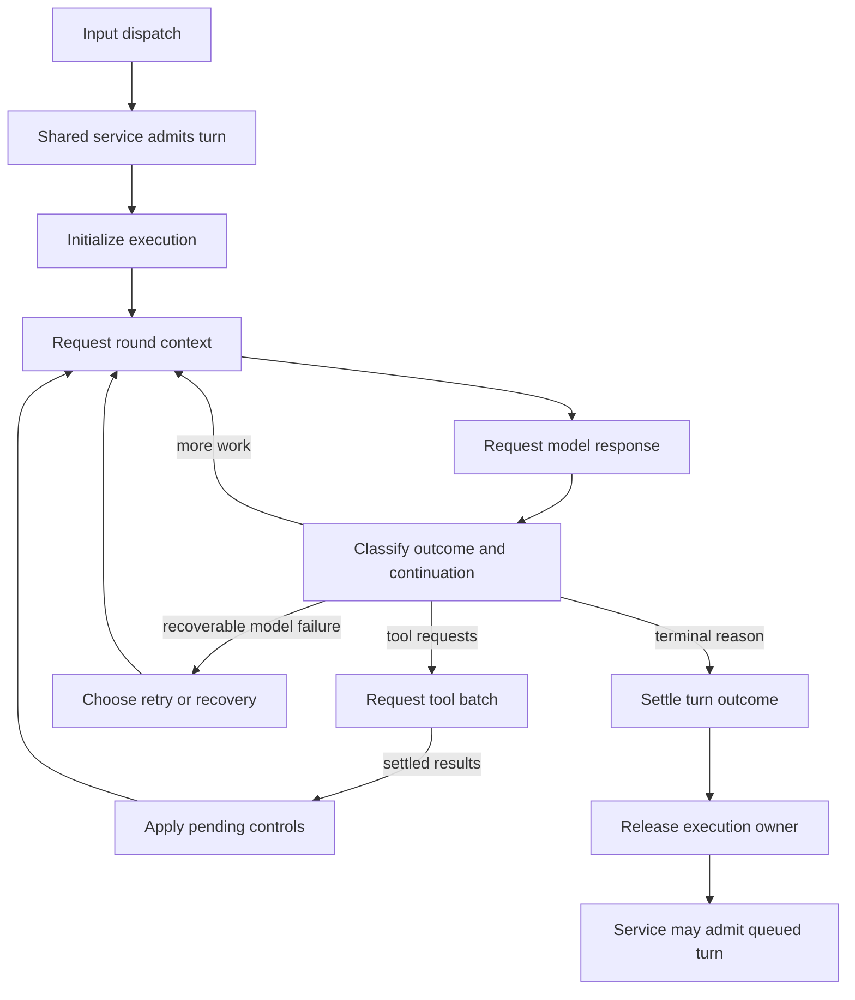

# Lina turn execution: comparative architecture research

Reviewed 2026-10-07. This is a proposal informed by source study, not an agreed
architecture or an implementation plan. Lina's existing Input decisions remain
unchanged. This research pass added no next-block code or simulator behavior.
The baseline clarification below records the later Lina decision; historical
agent comparisons retain their pinned source revisions.

## Question and answer

What should the architecture area after Input own, and which mechanisms within
it deserve experiments?

The evidence supports an **execution controller for one admitted request**. It
owns progression, repeated model/tool rounds, continuation decisions, control
boundaries and terminal settlement. Calling it **Turn Execution** fits Lina's
existing request-level turn identity, provided a model/tool round has a separate
name. The full lifecycle includes preparing and settling around the inner loop.

The four agents do not establish one normative industry standard. They show
recurring responsibilities implemented with different policies and layers. Lina
can define a clear contract using those responsibilities without copying one
agent's product-specific organization or treating its choices as universal.

## Evidence and provenance

We studied the exact source revisions used by Studio's maintained explorers,
with current official material checked for context. Newer source was not silently
substituted for those revisions. Each supporting note contains immutable source
links, a lifecycle diagram, inspected test contracts and limitations.

| Agent | Explorer revision | Detailed study |
| --- | --- | --- |
| Hermes | `ddc0e65958b326a89f6c440c76c812d31ac27e2a` | [Hermes](turn-execution-hermes.md) |
| OpenClaw | `e40ed06f23cb8bd939c9a6ff537eba7136074686` | [OpenClaw](turn-execution-openclaw.md) |
| Pi | `a276dabe57911253350bffb93cb7d7aff6a73261` | [Pi](turn-execution-pi.md) |
| Waku | `24b4cbb6d065e2cf31ca1ec0832918a1d1c08b01` | [Waku](turn-execution-waku.md) |

This is static architecture research. Tests were read, not executed. It does not
measure speed, accuracy or recovery under injected failures. The explorer pins
are the reproducible baseline, not a claim that every latest upstream path has
been exhaustively audited. Native executors, all provider adapters, delivery
channels and per-tool effect guarantees remain outside this pass.

## What the agents actually do

| Concern | Hermes | OpenClaw | Pi stable coding agent | Waku |
| --- | --- | --- | --- | --- |
| Whole-request owner | Turn facade, optional conversation lease, loop and finalizer | Logical entry, candidates, session/global admission, physical attempts and terminal settlement | AgentSession activity around Agent runs | `respond()` around loop and completed exchange; gateway owns serialization |
| Repeated execution | Prepare iteration, model attempt, response branch, tool round or text policy | Prepared core cycles inside attempt/recovery and candidate selection | Model/tool turns inside run; session may continue after low-level end | Plain synchronous model/tool iterations |
| Tools | Sequential/parallel segments with safety and path-conflict barriers | Sequential/parallel batches; async streamed tools under committed fragment ownership | Serial preparation; configured parallel or sequential execution; ordered result publication | Sequential inside loop; optional graph parallelism is a separate composition layer |
| New guidance | Batch-boundary steer; model-only redirect keeps logical turn | Checkpoint steering and later follow-up admission | Steering after batch; follow-up when inner work would stop | No generic steer/cancel lifecycle found in reviewed loop owners |
| Finish | Text can still trigger continuation; finalization then facade release | Candidate result can trigger recovery/fallback; accepted logical terminal settles | `agent_end` can precede retry/compaction/late work; `agent_settled` is later | Completed exchange, consolidation, trace end; gateway delivery follows |
| Persistence | Conditional history flush and lease; staged tools before configured flush | Transcript/tool admission and targeted recovery/custody rules | Stable finalized JSONL history; separate experimental durable Harness | Completed exchanges; no intermediate execution checkpoint in reviewed path |

Sources for each row are in the supporting studies. The experimental Pi Harness
adds task checkpoints, atomic commits and replay policy; it is not the ordinary
stable coding-agent loop. Waku's graph coordinates nodes that may contain full
loops; graph execution and model/tool execution therefore compose rather than
replace each other.

## Terminology that the model needs

These are proposed mappings, not additions to the agreed glossary yet.

| Term | Proposed Lina meaning | Why distinguish it |
| --- | --- | --- |
| Input event | One received source event | Existing Input identity, before execution admission |
| Turn | One admitted logical request under an execution owner | Keeps current Lina usage; may contain many rounds and attempts |
| Round | One assistant response and associated tool work/results | Pi/OpenClaw low-level events may call this a turn |
| Model attempt | One provider request attempt | Retries need not create a new logical turn or round |
| Tool call | One operation with its own call ID and outcome | Parallel completion, skip and cancellation differ per call |
| Settlement | Reconcile required work, record outcome and release authority | A text answer or loop-end event does not by itself free the owner |

The lab already defines a **Run** as a concrete harness × scenario × experiment
execution. Avoid using an unqualified Run to rename Lina's internal turn. The UI
Run button can start a simulation without making that simulation measured lab
run evidence. See [project terminology](../../../CONTEXT.md) and
[existing Input identity/control decisions](input-design.md).

## Proposed responsibility boundary

Input decides how an event is normalized, interpreted and dispatched. The shared
service owns conversation admission and queues. Turn Execution starts with an
admitted turn and an ownership token; it coordinates the work until its release
contract is satisfied. The placement of admission is a handoff to resolve with
the existing Input model, not a second queue introduced inside execution.

| Responsibility proposed inside Turn Execution | Collaborator retaining its own responsibility |
| --- | --- |
| Initialize turn identity, working execution state and budgets | Service supplies admission/authority; Storage owns writes |
| Request preparation for the next round | Context builds/selects/compresses context; Memory retrieves and updates memory |
| Invoke model and classify response | Model component owns provider transport and protocol conversion |
| Admit a tool batch and await its outcomes | Tools owns validation, approval adapters, scheduling and external operations |
| Choose continue, recover, wait or finish | Policies expose specific variation points; durable execution owns restart guarantees if adopted |
| Apply steer/stop signals at defined boundaries | Input/service owns routing and queue policy; execution owns their effect on active work |
| Settle outcome and release the turn | Storage records evidence; Output owns delivery and acknowledgements |

Scheduling policy influences execution, but this does not justify moving tool
implementations into the controller. Likewise, a controller can request
compaction without owning Context's algorithm. These boundaries give later
component labs small mechanisms to replace under shared contracts.

This is a boundary sketch, not the final node layout. Output can stream or send
interim messages during execution. Its final delivery may precede or follow
release according to an explicit future contract. No success arrow should
implicitly assert receipt by a user.

## Lifecycle distinctions to preserve

A phase and an outcome answer different questions. Preparing, requesting a
model, executing tools, waiting and settling describe ongoing work. Completed,
failed, cancelled and exhausted describe why work ended. Avoid overloading one
status field with both.

Waiting also needs a reason. Capacity wait precedes active execution. Approval
wait, external reply and child work can occur inside it. Waiting for an API is
ordinary pending work, not necessarily a durable suspension. A client waiting
for status can time out without cancelling the agent. Whether a suspended turn
retains authority is a separate architectural choice.

Stopping requires at least a requested and a settled boundary. It prevents new
launches according to policy and requests cancellation of supported active work.
Already-started effects may succeed, fail or remain uncertain. An uncertain
tool effect can be recorded honestly while a service applies its explicit
reconciliation/release rule; it must not be silently labelled undone.

The existing proposed Interrupt behavior waits for owner release and
reconciliation before a replacement turn. Hermes model redirect instead
continues the same turn. These mechanisms should have separate simulation rules.
The four studies do not justify changing Lina's current proposed queue/steer/
interrupt/stop contracts without a decision.

## Tool execution baseline clarification

Lina requires parallel execution of independent tool calls as a design baseline.
Tools owns scheduling with bounded concurrency and serialization for conflicting
operations. Turn Execution admits a batch, waits for its settled outcomes and
continues with results matched to their original call IDs. Calls whose arguments
need an earlier result normally arrive in a later model round. The scheduler must
not invent those future calls or infer arbitrary dependencies from model output.

The pinned Hermes, OpenClaw and Pi studies above support concurrent execution
with explicit boundaries. Waku's reviewed loop remains sequential, so this is a
Lina design decision rather than a claim that all studied agents use parallelism.
Parallel support does not establish a measured advantage for every workload.
The current Lina simulation visits a tool-batch node; it does not yet model
concurrent calls, completion ordering or a visible join.

Schema validation, permission enforcement, call/result identity, safe launch
ordering, cancellation outcomes and honest handling of uncertain effects are
correctness requirements. Recovery must respect effect certainty and retry
eligibility. These requirements need verification, not experiments that treat
unsafe behavior as an equally valid alternative. Sequential execution remains
required for dependencies or conflicts and may serve as a comparison control.

Incremental result consumption would change the baseline full-join round
contract. It requires a separate design before implementation or comparison.

## Meaningful experiments within the area

These are mechanisms to study later, not measured improvements or a menu to add
all at once. They can be composed and should not become mutually exclusive
whole-block implementations.

| Mechanism | Concrete alternatives | What a controlled comparison could observe |
| --- | --- | --- |
| Tool scheduling policy | Concurrency limits; conservative conflict grouping; batch join versus eligible incremental result consumption | Completion latency, peak concurrency and time until usable results, while preserving call identity and safe ordering |
| Guidance admission | After full batch; safe per-call boundary; cancel model request and redirect same turn | Time until guidance applies, discarded model work, already-launched tool work |
| Continuation | Basic tool-or-answer loop; explicit finish/continue policy; targeted truncation/stall recovery | Completion rate, extra rounds, budget use and premature stopping |
| Model recovery | Same request retry; reproject/compact context then retry; eligible model fallback | Successful recovery, extra latency/tokens, repeat effects and consistency |
| Waiting/resumption | Active in-memory wait; explicitly checkpointed suspension | Resource occupancy and restart behavior, under stated persistence guarantees |
| Orchestration composition | Single loop; routed graph of loops; delegated child work | Routing behavior, join ordering, branch budgets and coordination overhead |
| Tool launch timing | After complete response; committed streamed tool fragments | Latency overlap, admission ordering, partial-stream failures and effects |

Do not choose a mechanism because another agent has it. First define the
hypothesis, capabilities required, controls and observable outcome. Establish
correctness and workload requirements first. For example, caching requires an
explicit freshness policy, and tool retries require safe effect semantics; their
necessary constraints are not optional experiment variables. A design
simulation can verify transition logic and expose trade-offs; real harness
experiments are needed for performance claims. Storage durability and tool
idempotency are dependencies for recovery comparisons, not optional details to
assume away.

## Cases the architecture should eventually explain

1. Direct answer with no tools, including text that still requests continuation.
2. One tool result followed by another model round and a final answer.
3. Independent tools with overlapping execution and an explicit join; conflicting
   calls serialized with their original call/result identities preserved.
4. Recoverable provider failure versus non-retryable failure or exhausted budget.
5. Approval denial, approval wait and external reply with distinct waiting reasons.
6. Guidance arriving during a model request, during a tool batch and during settlement.
7. Stop requested while a tool runs; skipped unstarted calls and a possibly uncertain effect.
8. Another input queued while active, then admitted at the defined release boundary.
9. Context overflow leading to compaction/reprojection without blindly replaying tools.
10. Optional child work or graph branches with their own identities and budgets.
11. Client status-wait timeout while execution continues.
12. Delivery failure after answer production, kept distinct from model failure.

These are coverage goals for the design model, not a promise to simulate every
upstream path. The first implementation can still be small: direct answer,
a scripted tool round, continuation and settlement. Advanced scenarios should
follow agreed decisions and extend the same transition rules.

## Decisions still needed before an implementation plan

- Confirm the name Turn Execution and the request-level meaning of turn.
- Place the admission/ownership handoff precisely against the existing Input graph.
- Decide the release contract and how final output delivery relates to it.
- Choose the first continuation policy. Tool execution now has an agreed design
  baseline of bounded parallel independent calls with serial conflict/dependency
  boundaries; concrete scheduling policies remain variation points.
- Decide which waits exist initially and whether any are durable suspensions.
- Select the first simulated paths and use one transition definition for both graph and playback.

My recommendation is to settle these boundaries first, then build the ordinary
model/tool loop and terminal settlement as the next small slice. The research
supports that scope; it does not require implementing OpenClaw's full recovery
machinery, Pi's durable package or Waku's graph engine now.
