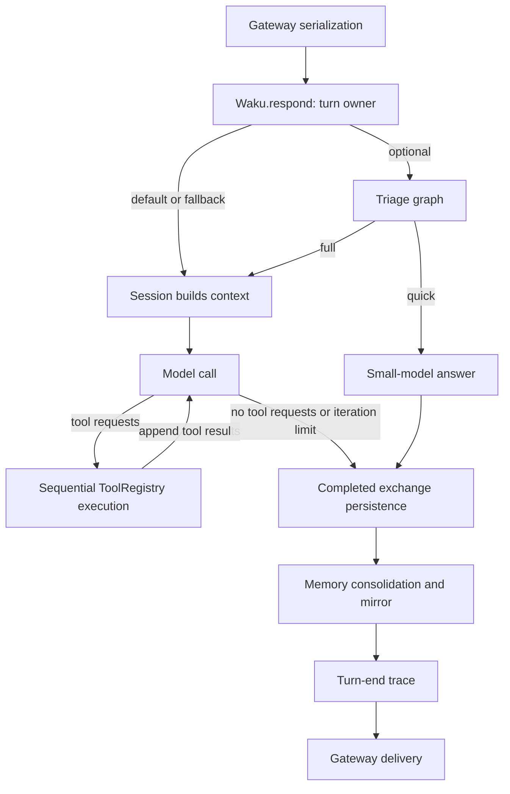

# Waku turn execution: a small loop inside a larger lifecycle

## Scope and source snapshot

This study informs Lina's next architecture area; it does not establish agreed
Lina decisions. Reviewed 2026-10-07 against Waku commit
`24b4cbb6d065e2cf31ca1ec0832918a1d1c08b01`, the revision used by the existing
Studio Waku explorer. Sources were read with `git show` after fetching that
exact object into the local source checkout. The checkout remained at
`42b07a7d18b4fc51911217b81ba11c805ca6570b`. Official raw source for the pinned
loop and application was also retrieved to verify provenance.

The later checkout was compared only for scope: its loop, graph engine, and
gateway runner are unchanged relative to the pin; application and session files
have small memory-related differences. The findings below use the pin throughout.

## Main finding

Waku separates three execution mechanisms:

| Mechanism | Responsibility | What it does not establish |
| --- | --- | --- |
| Synchronous model/tool loop | Repeated model calls and sequential tool calls within one turn | Durable waiting, per-step recovery, or cancellation |
| Optional graph workflow | Coordinates functions, model calls, or entire agent loops in bounded parallel waves | A replacement for the model/tool loop or a durable workflow engine |
| Gateway ownership | Serializes turns and owns agent/SQLite resources | A shared durable conversation queue across all channels |

The corresponding owners are [`run_loop`](https://github.com/ShenSeanChen/waku-agent/blob/24b4cbb6d065e2cf31ca1ec0832918a1d1c08b01/waku/loop/agent.py#L59),
[`run_graph`](https://github.com/ShenSeanChen/waku-agent/blob/24b4cbb6d065e2cf31ca1ec0832918a1d1c08b01/waku/graph/engine.py#L106),
and [`GatewayAgentRunner`](https://github.com/ShenSeanChen/waku-agent/blob/24b4cbb6d065e2cf31ca1ec0832918a1d1c08b01/waku/gateway/runner.py#L34).
These are composable layers rather than alternative whole-agent architectures.

The diagram shows control ownership; it does not imply atomic persistence or
successful delivery. [Application lifecycle](https://github.com/ShenSeanChen/waku-agent/blob/24b4cbb6d065e2cf31ca1ec0832918a1d1c08b01/waku/app.py#L46),
[gateway delivery](https://github.com/ShenSeanChen/waku-agent/blob/24b4cbb6d065e2cf31ca1ec0832918a1d1c08b01/waku/gateway/runner.py#L110).

## The inner execution loop

A working message list is mutated in place. Each iteration makes one model call,
appends its assistant content, then either returns a reply when there are no
tool-use blocks or executes every requested tool sequentially and appends a
user-role batch of tool results. Provider call IDs connect results to requests.
The loop uses an iteration counter, not a persistent step object.

Termination depends on the presence of tool-use blocks, not an exhaustive
interpretation of provider stop reasons. A response truncated without tool calls
therefore follows the same return branch as a normal reply. At the iteration
limit the last tool batch has already executed, and a fixed limit message is
returned. `LoopResult` has reply, tool calls, and iteration count, without a
separate completion/failure/cancellation status.

Streaming emits text deltas before the final response is assembled. A streaming
failure outside HTTP 4xx falls back to a fresh non-streaming call; HTTP 4xx
propagates. Partial text already emitted is not withdrawn by this loop.
[Loop source](https://github.com/ShenSeanChen/waku-agent/blob/24b4cbb6d065e2cf31ca1ec0832918a1d1c08b01/waku/loop/agent.py#L81).

Tools convert unknown names and raised exceptions into model-visible strings.
There is no registry-level schema validator or shared idempotency mechanism;
individual tools must supply their own behavior. The model may request another
attempt in a later iteration.
[Registry](https://github.com/ShenSeanChen/waku-agent/blob/24b4cbb6d065e2cf31ca1ec0832918a1d1c08b01/waku/tools/registry.py#L47).

Provider construction passes a configurable request timeout (default 120 seconds)
to the SDK. The compatibility adapter retries narrowly when an endpoint rejects
the token-limit parameter name. This is separate from the loop's streaming
fallback; SDK-default retries may also apply, so the absence of a loop retry
policy does not mean requests can never retry.
[Provider construction and adapter](https://github.com/ShenSeanChen/waku-agent/blob/24b4cbb6d065e2cf31ca1ec0832918a1d1c08b01/waku/loop/models.py#L324).

## Context, history, and finalization

`respond()` owns orchestration, trace scope, the completed exchange, and
post-turn memory work. `_run_full_turn()` builds system context once, takes the
recent conversation window, adds the request, and invokes the loop. Optional
triage reuses that same full-turn method, avoiding a second implementation.
[Turn owner](https://github.com/ShenSeanChen/waku-agent/blob/24b4cbb6d065e2cf31ca1ec0832918a1d1c08b01/waku/app.py#L118).

System construction loads identity instructions, time/model facts, gated memory,
and matching skills. The working list's intermediate assistant/tool blocks are
not themselves the next turn's session history: `add_exchange()` stores the user
message and final reply with a textual tool summary. Session switching reloads a
bounded tail of completed exchanges. The tool-history summary helps the model
remember past actions, but is not an exactly-once guarantee.
[Session](https://github.com/ShenSeanChen/waku-agent/blob/24b4cbb6d065e2cf31ca1ec0832918a1d1c08b01/waku/runtime/session.py#L64).

SQLite chat logging inserts both exchange rows and commits. Memory consolidation
and markdown export happen afterward; a failure there can prevent returning a
successful result even though the exchange is already stored. Failure earlier
in the loop can leave tool side effects without a completed exchange. There is
no transaction spanning tools, chat rows, memory extraction, and delivery.
[Chat commit](https://github.com/ShenSeanChen/waku-agent/blob/24b4cbb6d065e2cf31ca1ec0832918a1d1c08b01/waku/memory/__init__.py#L130),
[finalization order](https://github.com/ShenSeanChen/waku-agent/blob/24b4cbb6d065e2cf31ca1ec0832918a1d1c08b01/waku/app.py#L109).

Tracing uses daily JSONL files with timestamps, turn markers, iteration events,
and optional OpenTelemetry spans. JSONL events have no explicit stable turn ID
or persistent step ID in this implementation. Text deltas are omitted. The
context manager clears OTel scope on exit, but `turn_end` is an explicit later
call: exceptions can leave a start without an end. These are diagnostics, not
execution checkpoints.
[Tracer](https://github.com/ShenSeanChen/waku-agent/blob/24b4cbb6d065e2cf31ca1ec0832918a1d1c08b01/waku/ops/tracing.py#L116).

## Scheduling, waits, cancellation, and restart

Async Telegram/Discord surfaces submit work to one executor worker per gateway.
The worker creates and uses the agent and SQLite connection on its own thread.
Concurrent submissions are serialized in memory. Closing retires resources and
cancels pending executor futures; it does not inject an interruption signal into
an already running model/tool loop.
[Runner and shutdown](https://github.com/ShenSeanChen/waku-agent/blob/24b4cbb6d065e2cf31ca1ec0832918a1d1c08b01/waku/gateway/runner.py#L66).

The dashboard instead uses one shared agent protected by `agent_lock`, so tabs
serialize on the same browser-gateway owner. Its restart behavior chooses a
recent stored conversation; this is conversation restoration, not resumption of
an unfinished tool/model step. Direct `Waku.respond()` does not independently
acquire either gateway's lock.
[Dashboard call](https://github.com/ShenSeanChen/waku-agent/blob/24b4cbb6d065e2cf31ca1ec0832918a1d1c08b01/waku/ops/dashboard.py#L106),
[browser owner](https://github.com/ShenSeanChen/waku-agent/blob/24b4cbb6d065e2cf31ca1ec0832918a1d1c08b01/waku/ops/browser_agent.py#L35).

No general waiting-for-user, approval, cooperative cancellation, interrupted-turn
continuation, or durable accepted-message queue was found in these reviewed
owners. Blocking on a tool or worker is not a persisted waiting state. Gateway
reply delivery is after `respond()` and has a separate error path without an
outbound retry queue in this helper.
[Gateway completion versus delivery](https://github.com/ShenSeanChen/waku-agent/blob/24b4cbb6d065e2cf31ca1ec0832918a1d1c08b01/waku/gateway/runner.py#L117).

## Optional graph and delegation mechanisms

The graph engine schedules ready nodes in waves. Each receives a shallow copy
of the state dictionary and returns keys to merge. Static edges enforce fan-in;
routers and error routes jump to targets. Parallel nodes must return disjoint
keys; collisions raise. Because snapshots are shallow, returned-key checks do
not constitute isolation from mutation of shared nested objects.

Result merging and path order follow wave order, while actual concurrent
completion and inner observer-event ordering can vary. `max_visits` bounds
individual node revisits, and `max_steps` bounds total visited nodes. These differ
from the model iteration budget. Node exceptions are recorded and optionally
routed; router exceptions and merge collisions can propagate out of the engine.
The documentation's general claim that graph errors never raise is therefore
broader than the implementation.
[Graph engine](https://github.com/ShenSeanChen/waku-agent/blob/24b4cbb6d065e2cf31ca1ec0832918a1d1c08b01/waku/graph/engine.py#L128).

An `agent_node` is a complete ordinary loop with fresh working messages and a
scoped tool registry. Triage runs classification/calendar lookup in parallel,
gathers them, then chooses a quick model answer or full loop. Topology is
exported by `describe()` from the executable graph, a useful way to keep a
visualization aligned with its rules.
[Node factories](https://github.com/ShenSeanChen/waku-agent/blob/24b4cbb6d065e2cf31ca1ec0832918a1d1c08b01/waku/graph/nodes.py#L47),
[triage](https://github.com/ShenSeanChen/waku-agent/blob/24b4cbb6d065e2cf31ca1ec0832918a1d1c08b01/waku/graph/workflows/triage.py#L89),
[topology export](https://github.com/ShenSeanChen/waku-agent/blob/24b4cbb6d065e2cf31ca1ec0832918a1d1c08b01/waku/graph/engine.py#L94).

Graph fallback is not rollback. If a graph-wrapped full turn performs a tool side
effect before failing without a result, default fallback can invoke the full
turn again. No general deduplication protocol is attached to this boundary.
This is an inferred failure possibility from the recorded-error and fallback
branches, not an observed fault-injection result.

Experimental `delegate_task` invokes Pi as a blocking subprocess tool. It relays
selected Pi events, collects usage, applies a deadline, and preserves successful
or failed-run transcripts; timeout return exits before the normal transcript
write. This is nested work inside the parent tool phase, not an independently
resumable child-run scheduler. Other experimental terminal/browser/cron tools
are explicitly stubs at this pin.
[Delegation](https://github.com/ShenSeanChen/waku-agent/blob/24b4cbb6d065e2cf31ca1ec0832918a1d1c08b01/waku/tools/experimental.py#L101).

Hosted model proxy admission, quota reservations, stream forwarding, and billing
settlement add a different lifecycle around model calls. Its wallet `turn_id`
is generated for a charge; it is not the local agent's durable turn identity.
An interrupted response may still be billed, and settlement runs in `finally`.
Those hosted controls should not be credited to the local loop as turn recovery.
[Hosted proxy](https://github.com/ShenSeanChen/waku-agent/blob/24b4cbb6d065e2cf31ca1ec0832918a1d1c08b01/hosted/proxy/app.py#L241).

## Verification and remaining limits

Inspected deterministic tests, without executing them or making model calls:

- [Tool-trigger tests](https://github.com/ShenSeanChen/waku-agent/blob/24b4cbb6d065e2cf31ca1ec0832918a1d1c08b01/evals/deterministic/test_tool_trigger.py#L35): scripted tool execution, tool-history recording, natural completion, iteration limit, and calendar-specific deduplication.
- [Gateway runner tests](https://github.com/ShenSeanChen/waku-agent/blob/24b4cbb6d065e2cf31ca1ec0832918a1d1c08b01/evals/deterministic/test_gateway_runner.py#L35): worker ownership, serialized concurrent turns, persisted exchanges, delivery errors, and closure.
- [Graph engine tests](https://github.com/ShenSeanChen/waku-agent/blob/24b4cbb6d065e2cf31ca1ec0832918a1d1c08b01/evals/deterministic/test_graph_engine.py#L36): fan-out/fan-in, routing, collisions, bounds, and error routes.
- [Triage tests](https://github.com/ShenSeanChen/waku-agent/blob/24b4cbb6d065e2cf31ca1ec0832918a1d1c08b01/evals/deterministic/test_triage_workflow.py#L62): default-path preservation, quick/full routing, and fallback.

The absence findings are bounded to the reviewed turn owners and their callers;
this is not an exhaustive security or whole-repository audit. Runtime provider
behavior and actual timing/performance remain unmeasured.

## Implications to consider for Lina

These are proposals for discussion, not decisions:

1. Separate turn lifecycle from the inner model/tool cycle. Preparing context,
   finalizing the exchange, releasing ownership, and delivering a response are
   observable stages outside repeated model calls.
2. Represent terminal reasons explicitly: completed, exhausted, failed, and
   cancelled. A user-facing sentence alone loses useful simulation semantics.
3. Distinguish model-call, tool-call, graph-visit, and child-run identity and
   budgets. One generic step counter would hide important behavior.
4. Keep queue ownership and execution waiting visible as different concepts.
   Later Lina queue experiments need state transitions; Waku's executor queue
   is a useful simple baseline, not the full target model.
5. Derive the diagram and simulator from the same transition/topology data,
   following the useful principle in Waku's `Graph.describe()`.
6. Explore sequential versus independent parallel tool batches and plain-loop
   versus routed-loop composition as small mechanism experiments. Treat their
   dependencies and effects as controls before measuring differences.
