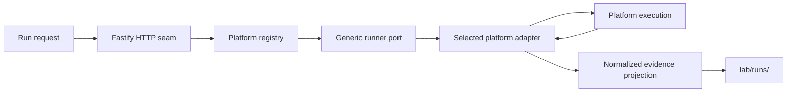

# Lab server source

This source tree owns the server implementation. Fastify stays at the HTTP seam;
application and domain modules must remain usable without route handlers.

The server selects a registered platform and variant through the runner interface in
`ports/runner.ts`. Common modules own request validation, immutable manifests,
dispatch, cancellation, reconciliation, and normalized evidence. They must not inspect
platform-native execution fields. Native references are retained for inspection, then
passed back to the same runner adapter.

The first real adapter is Temporal. Its namespace, task queue, workflow identity,
signals, queries, retries, and worker lifecycle belong under
`src/platforms/temporal/`, not in this directory.

The registry is the composition boundary: planned catalog entries are visible,
but only registered adapters are runnable. A platform agent owns its adapter,
worker or service entrypoint, native state, and native evidence. The common server
owns only the request, manifest, lifecycle projection, and normalized evidence
needed for inspection and comparison.
