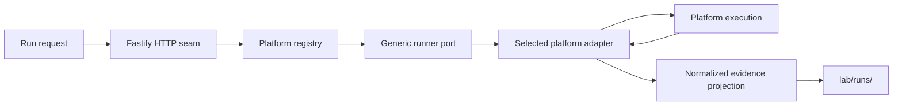

# Lab server source

This source tree owns the server implementation. Fastify stays at the HTTP seam;
application and domain modules must remain usable without route handlers.

The server selects a registered platform and variant through the runner interface in
`ports/runner.ts`. Common modules own request validation, immutable manifests,
dispatch, cancellation, reconciliation, and normalized evidence. They must not inspect
platform-native execution fields. Native references are retained for inspection, then
passed back to the same runner adapter.

The first real adapter is Temporal. Its namespace, task queue, workflow identity,
signals, queries, retries, and worker lifecycle belong under
`src/platforms/temporal/`, not in this directory.

The registry is the composition boundary: planned catalog entries are visible,
but only registered adapters are runnable. A platform agent owns its adapter,
worker or service entrypoint, native state, and native evidence. The common server
owns only the request, manifest, lifecycle projection, and normalized evidence
needed for inspection and comparison.

`RunEvidenceStore` is also the final write boundary for retained records. It
conservatively redacts credential-shaped object fields (for example API keys,
authorization values, cookies, and refresh tokens) and rejects records that
exceed the per-file safety limits. Platform adapters must still avoid placing
secrets in their payloads; redaction is a last boundary, not a substitute for
correct ownership.

If a platform inspection or evidence write is temporarily unavailable after a
run has been admitted, `RunService` returns the last readable projection with
`projection.state: "stale"`. It does not turn the outage into a fabricated
terminal result. Once the dependency recovers, the next read reconciles the
retained platform execution and returns a current projection.

The same rule applies immediately after dispatch. If the platform accepts the
run but the server cannot retain its native execution reference, the response is
a stale queued projection rather than `DISPATCH_FAILED`. If the reference cannot
be recovered later, the run becomes `reconciliation_required` so the accepted
platform-side work is not mistaken for a failed submission.
