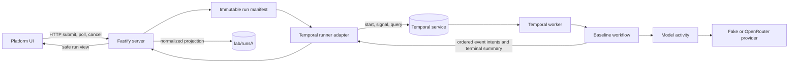

# Temporal baseline architecture

The first runnable path separates the Lab's server from Temporal's
execution system. The browser never imports the Temporal SDK and the workflow
never writes Lab files.

## Responsibilities

| Component | Owns | Must not own |
| --- | --- | --- |
| Platform UI | Prompt/model input, submit, polling, cancellation, rendering | Temporal clients, local file reads, inferred completion |
| Fastify server | Request validation, manifest creation, dispatch, evidence projection, API responses | Workflow logic, model network calls, Temporal history |
| Temporal runner adapter | Temporal connection, workflow IDs, start, signal, query, inspection | Browser state or normalized file serialization |
| Temporal worker | Registered workflows and activities, graceful process shutdown | HTTP routes or Lab evidence files |
| Baseline workflow | Durable phase, event intents, retry decision, terminal outcome | Network I/O, secrets, direct filesystem writes |
| Model activity | Provider call and cancellation signal | Workflow state or Lab result files |
| Run evidence store | Atomic local projection and idempotent event materialization | Temporal workflow state |
| Temporal service | Workflow history, scheduling, retries, recovery | Lab's normalized evidence model |

## One run

1. The API validates `temporal/baseline`, the prompt, and the model provider.
2. The evidence store atomically creates `config.json` and an empty `events.jsonl`.
3. The API records `RunCreated` and starts one workflow whose ID is `agentlab:<run-id>`.
4. The API stores the safe Temporal execution reference and records `RunDispatched`.
5. The workflow records ordered event intents in durable workflow state.
6. The model activity performs one provider request. The workflow records its outcome.
7. The API polls or reconciles the workflow, projects event intents, and writes terminal evidence.

The order between server and workflow events is recorded order, not a
claim about wall-clock order across processes. Source sequence is the identity
used to make reconciliation idempotent.

## Data ownership

Temporal history is required to resume an in-flight workflow. The Lab manifest
and evidence files are required to inspect and compare a run. If the control
plane is down, the workflow may finish and its intents remain in Temporal state.
When the server returns, it reads the retained reference, fetches the
intents, and projects each stable event identity once.

An execution without a matching Lab manifest is an orphan and is not adopted.
A manifest whose stored execution cannot be found is marked
`reconciliation_required`. Neither case is converted into a made-up terminal
result.
