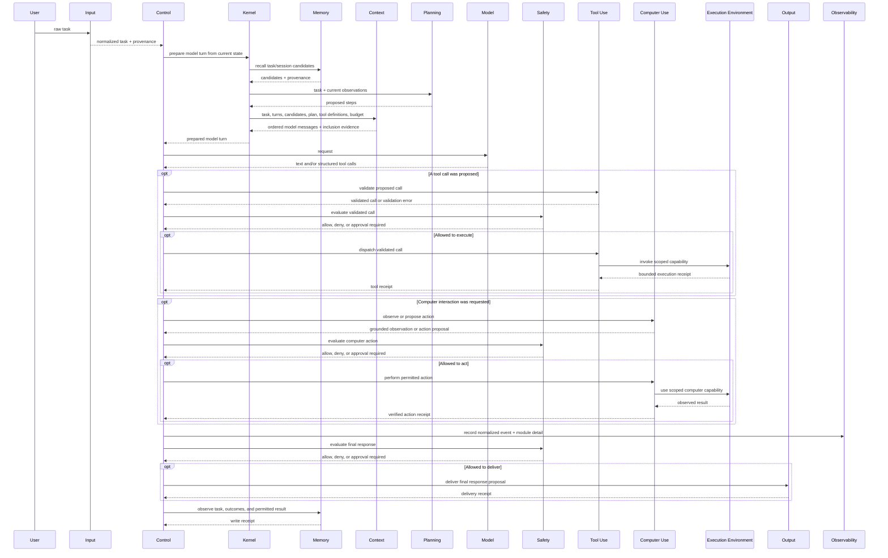

# Studio packages

Studio is an experimental workspace for developing agent harness modules as
independent packages, then assembling them into runnable agents. Its module code
lives here; `apps/studio-api` exposes Studio over HTTP, and `apps/web` is the
browser client. The existing `server/` remains the Platform Lab service.
The earlier server-hosted `server/src/studio/` implementation remains during this
transition; these packages and the new API do not depend on it. Its data and routes
will be migrated or retired under a later focused plan.

```text
studio/
  agent-protocol/       # shared run identity, events, and capability descriptions
  agent-kernel/         # declarative assembly shape; execution is a later stage
  http-contract/        # JSON-safe schemas shared by API and browser
  modules/<role>/       # role-owned contract, config, implementation, checks
apps/
  studio-api/           # independent Studio HTTP host
  web/                  # browser UI; communicates with Studio over HTTP
```

## Module boundaries

| Module | Owns | Main exchange |
| --- | --- | --- |
| Input / perception | Input normalization and source provenance | Raw input → normalized task input |
| Context | Selection and shaping of model input | Task, turns, memory candidates, tools → model context plus inclusion evidence |
| Planning | Proposed steps or next action | Task and observations → proposed plan; no actions are executed here |
| Memory | Stored records and recall/write policy | Recall request → candidates; observations → write receipt |
| Tool use | Tool schemas, call validation, dispatch | Proposed call → bounded execution result |
| Computer use | Interface-specific observation and action behavior | Observe/action request → grounded observation and result |
| Control | Turn ordering, repetition, and termination choices | State and component ports → control outcome |
| Execution environment | Scoped filesystem, process, network, or computer capabilities | Requirements → declared capabilities and a scoped session |
| Output / actions | Final response preparation or delivery | Proposed output/action → delivery receipt |
| Safety | Checkpoint decisions and policy evidence | Proposed input/action/output → allow, deny, or approval required |
| Model interface | Provider request/response adaptation | Model request → text or structured tool-call response and usage |
| Observability | Ordered events and module-specific detail | Event → recorded/flush result |

These exchanges are related, but no single `run(input) -> output` operation fits
all roles. In a future assembly, Control chooses the sequence, the kernel provides
ports and owns global lifecycle limits, and each module keeps its role behavior
and state. Memory supplies recall candidates; Context decides which of them reach
the model. Safety decides whether a proposed action may proceed; Tool Use or
Computer Use performs it through an explicitly supplied capability.

## Proposed first-turn composition

This sequence reviews the contract seams on paper; it is not implemented by the
current kernel package. It makes the intended exchange concrete without choosing
the final scheduling or recovery policy.



The ordering of Planning relative to Context, how computer-use grants map to
environment capabilities, when Memory writes commit, how an approval pauses and
resumes Control, and what state must survive restart remain open. These decisions
belong in the first executable assembly plan, informed by the concrete module
contracts; this foundation does not silently settle them.

The first implementation stage establishes these package boundaries and contracts.
It includes one narrow, in-memory Memory implementation to exercise state ownership
and a health request between the browser and API. It does not yet execute an agent
turn or provide durable memory, tools, computer access, or run evidence.

## Developing one module

From the repository root, use the package's own scripts:

```sh
pnpm --filter @agent-harness-lab/module-memory typecheck
pnpm --filter @agent-harness-lab/module-memory test
```

Each module README defines its public operations, config, state lifetime,
cancellation, errors, retry safety, and evidence. Module packages do not import
other module packages' private source. They use `@agent-harness-lab/agent-protocol`
only for genuinely shared run metadata.

Package versions use Semantic Versioning for public contract and configuration
compatibility. Each concrete implementation also reports its own ID and version.
An assembly records the selected package name/version, implementation ID/version,
and configuration so a run can identify both the contract surface and behavior it
used. While a package is below `1.0.0`, breaking changes are called out in the
minor version and migration notes; once stable, breaking changes require a major
version, additive compatible options a minor version, and compatible fixes a patch.

## Seams to settle before the first assembly

- The kernel must adapt Memory candidates and other source material into
  `ContextMaterial` while preserving provenance and trust.
- Control uses ports so it can choose the loop without importing Context, Memory,
  Model, Tool Use, or Output implementations. The kernel must enforce global
  cancellation and limits around those ports.
- The kernel must order Tool Use validation, Safety evaluation, environment grants,
  and dispatch. Tool dispatch must not imply approval or access.
- Output actions can have side effects independent of tool calls. An uncertain
  receipt needs reconciliation before a retry.
- The initial contracts carry text prompts through Control. Attachments are
  references in Input and need an explicit environment/Context path before a
  filesystem-capable reference assembly is defined.
- Model and Control currently use related but separately owned request/response
  types. The kernel adapter should map these without dropping structured tool calls,
  provider details, or usage evidence.
- The assembly type selects a package version, implementation ID/version, and
  config for each area, but compatibility checking and package loading remain later
  kernel work.

## Browser and API

Start the API and browser in separate terminals:

```sh
pnpm --filter @agent-harness-lab/studio-api dev
pnpm --filter @agent-harness-lab/web dev
```

The Studio page displays whether it can reach `http://127.0.0.1:4320/health`.
That endpoint is a connectivity check only. Browser transport schemas live in
`http-contract/`; neither module packages nor the kernel are imported into the web
bundle.
